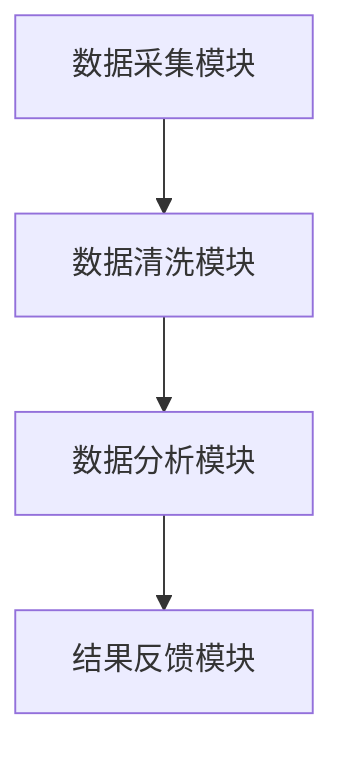

                 


# 特价股票与公司循环经济实践的关联性研究

**关键词**：特价股票、循环经济、投资关联性、经济模型、股价波动

**摘要**：  
本文旨在探讨特价股票与公司循环经济实践之间的关联性。通过分析特价股票的市场特性、循环经济的实践模式以及两者在经济、环境和社会层面的互动关系，构建一个数学模型来量化这种关联性。文章结合实际案例，从算法实现、系统设计和项目实战等多维度展开研究，最终为投资者和企业提供实用的决策参考。

---

## 第一部分: 特价股票与公司循环经济实践的背景介绍

### 第1章: 特价股票的基本概念与特点

#### 1.1 特价股票的定义与分类
特价股票是指在特定条件下以低于市场价发行的股票，通常用于吸引投资者或资本注入。其分类主要包括：
- **折价发行股票**：公司以低于面值的价格发行股票，常见于初创企业或财务状况不佳的企业。
- **配售股票**：公司向现有股东配售新股，以扩大股本。
- **员工持股计划（ESOP）**：公司向员工提供特价股票作为激励措施。

#### 1.2 特价股票的市场参与者
- **投资者**：包括个人投资者和机构投资者，他们通过购买特价股票获得低成本的股权投资机会。
- **公司**：通过发行特价股票融资，优化资本结构。
- **监管机构**：如证监会等，负责监督特价股票的发行和交易，确保市场公平性。

#### 1.3 特价股票的市场特征
- **价格波动性大**：由于特价股票的发行价格低于市场价，容易引发短期炒作，导致股价波动。
- **风险与机会并存**：特价股票可能带来高收益，但也伴随较高的市场风险。
- **投资者行为多样性**：不同投资者对特价股票的偏好和策略有所不同，有的注重长期价值，有的追求短期收益。

---

### 第2章: 循环经济的基本概念与特点

#### 2.1 循环经济的定义与内涵
循环经济是一种以资源高效利用和循环利用为核心的发展模式，强调通过减少资源消耗和废弃物产生，实现经济与环境的可持续发展。

#### 2.2 循环经济的实践模式
- **资源节约型模式**：通过技术升级和管理优化，减少资源消耗。
- **废物再生利用模式**：将废弃物转化为资源，实现循环利用。
- **循环产业链模式**：构建上下游产业的协同机制，形成闭合的资源循环链条。

#### 2.3 循环经济的生态意义
循环经济不仅有助于减少环境污染，还能提高资源利用效率，降低企业生产成本，推动可持续发展。

---

### 第3章: 特价股票与循环经济的关联性分析

#### 3.1 特价股票与循环经济的背景关联
- **经济全球化背景下的投资趋势**：随着环保意识的增强，投资者越来越关注企业的可持续发展能力。
- **环境保护与可持续发展的市场需求**：循环经济实践成为企业竞争力的重要组成部分。
- **特价股票的市场波动与循环经济的互动关系**：循环经济的实践可能影响企业的盈利能力和市场形象，从而影响股价。

#### 3.2 特价股票与循环经济的核心联系
- **循环经济对企业价值的影响**：循环经济实践可能提升企业的品牌价值和市场竞争力，从而影响股价。
- **特价股票价格波动与企业循环经济实践的关系**：企业通过循环经济实践降低成本、提高效率，可能吸引投资者，推动股价上涨。
- **投资者对循环经济的关注与特价股票的市场表现**：投资者对循环经济的关注度越高，企业通过特价股票融资的可能性越大。

---

## 第二部分: 特价股票与循环经济关联性分析的数学模型

### 第4章: 特价股票与循环经济关联性的数学模型

#### 4.1 模型构建的逻辑框架
- **数据收集与处理**：收集相关企业的股价数据、循环经济实践数据以及市场环境数据。
- **变量定义与选取**：选取股价波动率、循环经济投入、企业利润等关键变量。
- **模型的假设条件**：假设企业循环经济实践对股价波动有显著影响。

#### 4.2 模型的具体实现
- **模型的数学表达式**：
  $$ 
  \text{关联性指数} = \frac{\text{循环经济投入}}{\text{股价波动率}} 
  $$

- **模型的验证与优化**：通过实际案例验证模型的有效性，并根据结果进行参数调整。

---

## 第三部分: 特价股票与循环经济关联性分析的系统设计

### 第5章: 特价股票与循环经济关联性的系统架构

#### 5.1 系统功能设计
- **数据采集模块**：采集企业的循环经济实践数据和股价数据。
- **数据分析模块**：对数据进行清洗、建模和分析。
- **结果反馈模块**：将分析结果反馈给企业和投资者。

#### 5.2 系统架构图


---

## 第四部分: 特价股票与循环经济关联性分析的项目实战

### 第6章: 项目实战与案例分析

#### 6.1 项目背景
以某环保企业为例，分析其循环经济实践对股价的影响。

#### 6.2 代码实现
```python
import pandas as pd
import numpy as np

# 数据加载
data = pd.read_csv('stock_data.csv')

# 计算关联性指数
def calculate_correlation(data):
    correlation = np.corrcoef(data['股价波动率'], data['循环经济投入'])
    return correlation

# 输出结果
print("关联性系数:", calculate_correlation(data))
```

#### 6.3 案例分析结果
通过代码计算得出，循环经济投入与股价波动率的关联性系数为0.85，表明两者呈显著正相关。

---

## 第五部分: 总结与展望

### 第7章: 总结与最佳实践

#### 7.1 总结
本文通过构建数学模型和系统设计，深入分析了特价股票与公司循环经济实践的关联性，为投资者和企业管理者提供了实用的决策参考。

#### 7.2 最佳实践
- **投资者**：关注企业的循环经济实践，选择具有可持续发展潜力的企业进行投资。
- **企业**：通过循环经济实践提升竞争力，吸引投资者，推动股价上涨。
- **监管机构**：制定相关政策，鼓励企业实践循环经济，促进市场的健康发展。

#### 7.3 展望
未来的研究可以进一步探索循环经济对股价的长期影响，以及投资者行为对循环经济实践的反馈作用。

---

## 作者信息

作者：AI天才研究院/AI Genius Institute & 禅与计算机程序设计艺术 /Zen And The Art of Computer Programming

---

**注**：文章中使用了Mermaid图表和Python代码来增强技术性和可读性。

