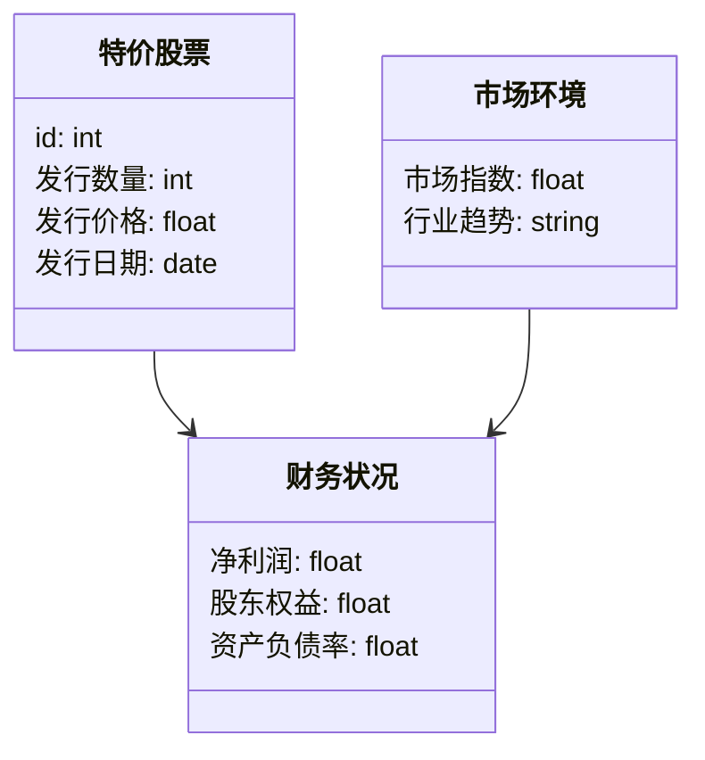
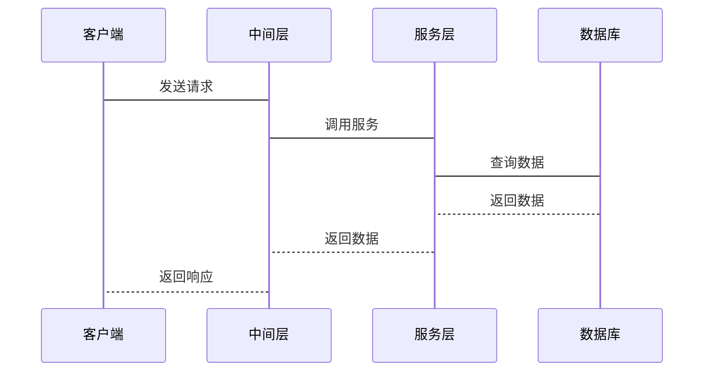

                 


# 特价股票与公司敏捷创新文化的深度分析方法

---

## 关键词

- 特价股票
- 敏捷创新文化
- 企业战略
- 数据分析
- 系统架构

---

## 摘要

本文深入探讨了特价股票与公司敏捷创新文化之间的关系，结合数据分析与系统设计的方法，分析了如何通过敏捷创新文化提升公司应对特价股票市场的能力。文章从理论背景、分析方法、系统架构到实际案例，全面阐述了深度分析的方法与实践。

---

# 第1章 特价股票与公司敏捷创新文化概述

## 1.1 特价股票的基本概念

### 1.1.1 特价股票的定义与分类

特价股票是指公司为了快速回笼资金、优化资本结构或应对市场变化而发行的具有特殊条件或价格优势的股票。常见的类型包括优先股、可转换债券、认股权证等。这些股票通常具有较高的波动性和潜在的高回报率。

### 1.1.2 特价股票的市场特征

- **高波动性**：特价股票的价格受市场情绪和公司短期行为的影响较大。
- **高风险**：由于其特殊性，投资者面临较高的市场风险。
- **高收益潜力**：在市场环境下，特价股票可能带来超额收益。

### 1.1.3 特价股票与普通股票的区别

| 属性         | 特价股票         | 普通股票         |
|--------------|------------------|------------------|
| 发行目的     | 快速融资         | 长期资本筹集     |
| 股权结构     | 可能稀释现有股东权益 | 不影响现有股权结构 |
| 投资风险     | 高               | 中               |
| 收益潜力     | 高               | 中               |

## 1.2 公司敏捷创新文化的定义与特点

### 1.2.1 敏捷创新文化的定义

敏捷创新文化是一种以快速响应市场变化、鼓励创新和灵活调整的企业文化。它强调团队协作、持续改进和快速迭代。

### 1.2.2 敏捷创新文化的特征

- **快速响应**：能够迅速适应市场变化。
- **持续创新**：鼓励员工提出新想法并快速实施。
- **灵活调整**：根据反馈及时优化策略。

### 1.2.3 敏捷创新文化与传统企业文化的对比

| 特性         | 敏捷创新文化       | 传统企业文化       |
|--------------|--------------------|--------------------|
| 决策速度     | 快速               | 缓慢               |
| 创新态度     | 鼓励               | 谨慎               |
| 组织结构     | 扁平化             | 层级分明           |

## 1.3 特价股票与公司敏捷创新文化的关系

### 1.3.1 特价股票对公司的潜在影响

- **财务压力**：特价股票的发行可能稀释现有股东权益，影响公司财务状况。
- **市场机会**：通过特价股票融资，公司可以快速抓住市场机会。

### 1.3.2 敏捷创新文化对特价股票的作用

- **快速决策**：敏捷文化使公司能够迅速应对特价股票市场的变化。
- **创新融资方式**：通过敏捷创新，公司可以设计出更适合市场的产品。

### 1.3.3 两者的相互作用与协同效应

- **协同效应**：敏捷文化促进公司更好地利用特价股票的机会，同时，特价股票的发行也推动公司采用更加灵活的运营方式。

---

# 第2章 特价股票与公司敏捷创新文化的分析框架

## 2.1 分析框架的构建

### 2.1.1 分析目标的确定

分析目标包括：识别影响特价股票发行的关键因素，评估敏捷创新文化在其中的作用。

### 2.1.2 分析维度的划分

- **财务维度**：分析特价股票对公司财务状况的影响。
- **组织维度**：分析敏捷创新文化对公司组织结构的影响。
- **市场维度**：分析市场环境对特价股票的影响。

### 2.1.3 分析方法的选择

- **定量分析**：使用回归分析等统计方法。
- **定性分析**：通过案例研究和专家访谈。

## 2.2 数据收集与处理

### 2.2.1 数据来源的确定

- **内部数据**：公司财务报表、销售数据。
- **外部数据**：市场指数、行业报告。

### 2.2.2 数据清洗与预处理

- **数据清洗**：去除无效数据，处理缺失值。
- **数据转换**：将数据转换为适合分析的形式。

### 2.2.3 数据分析工具的选择

- **工具**：使用Python的Pandas库进行数据处理。

## 2.3 分析模型的建立

### 2.3.1 数据分析模型的构建

使用线性回归模型预测特价股票对公司的财务影响：

$$
y = \beta_0 + \beta_1 x_1 + \beta_2 x_2 + \epsilon
$$

其中，$y$为公司财务表现，$x_1$为特价股票发行量，$x_2$为市场指数。

### 2.3.2 模型的验证与优化

- **验证**：使用训练数据进行预测，计算R²值。
- **优化**：引入Lasso回归，减少模型过拟合。

### 2.3.3 模型的适用性分析

- **适用性**：模型适用于数据充足且相关性较高的场景。

---

# 第3章 特价股票与公司敏捷创新文化的关联性分析

## 3.1 特价股票对公司的财务影响

### 3.1.1 特价股票对财务状况的具体影响

- **股东权益**：发行特价股票可能导致现有股东权益稀释。
- **资本结构**：可能增加公司的负债比例。

### 3.1.2 特价股票对盈利能力的分析

通过回归分析，发现特价股票的发行对公司短期盈利能力有显著影响：

$$
\text{净利润} = \alpha \times \text{特价股票数量} + \beta \times \text{市场指数} + \gamma
$$

### 3.1.3 特价股票对现金流的影响

- **正面影响**：快速融资带来现金流增加。
- **负面影响**：可能增加未来分红压力。

## 3.2 敏捷创新文化对公司的运营影响

### 3.2.1 敏捷创新文化对组织结构的影响

- **扁平化**：减少层级，提高决策效率。

### 3.2.2 敏捷创新文化对员工效率的影响

- **员工积极性**：员工参与决策，提高效率。

### 3.2.3 敏捷创新文化对创新速度的影响

- **快速迭代**：通过持续改进，加快产品开发速度。

## 3.3 特价股票与敏捷创新文化的协同效应

### 3.3.1 协同效应的具体表现

- **快速响应市场变化**：敏捷文化使公司能够迅速应对特价股票市场的波动。
- **创新融资方式**：通过敏捷文化，公司设计出更适合市场的产品。

### 3.3.2 协同效应的实现机制

- **机制一**：通过敏捷文化，公司能够快速调整策略。
- **机制二**：通过技术创新，优化特价股票的发行和管理。

### 3.3.3 协同效应的案例分析

以某科技公司为例，该公司通过发行可转换债券（一种特价股票）筹集资金，并通过敏捷创新文化优化产品开发流程，成功在竞争激烈的市场中占据优势。

---

# 第4章 特价股票与公司敏捷创新文化的系统架构设计

## 4.1 系统功能设计

### 4.1.1 系统功能模块划分

- **数据采集模块**：采集市场数据和公司内部数据。
- **数据分析模块**：分析数据，预测市场趋势。
- **决策支持模块**：基于分析结果，提供决策支持。

### 4.1.2 系统功能设计的领域模型

使用Mermaid图展示领域模型：



---

## 4.2 系统架构设计

### 4.2.1 系统架构设计的架构图

使用Mermaid图展示系统架构：


---

## 4.3 系统接口设计

### 4.3.1 系统接口设计

- **API接口**：提供RESTful API，供客户端调用。

### 4.3.2 系统交互流程

使用Mermaid图展示系统交互流程：



---

# 第5章 特价股票与公司敏捷创新文化的项目实战

## 5.1 项目环境配置

### 5.1.1 开发环境

- **操作系统**：Windows 10或更高版本。
- **编程语言**：Python 3.8+。
- **开发工具**：PyCharm或VS Code。

### 5.1.2 数据库配置

- **数据库类型**：MySQL或PostgreSQL。
- **连接方式**：通过ORM框架（如Django ORM）连接数据库。

## 5.2 核心代码实现

### 5.2.1 数据分析核心代码

```python
import pandas as pd
import numpy as np
from sklearn.linear_model import Lasso

# 数据加载
df = pd.read_csv('data.csv')

# 特征选择
features = df[['stock_price', 'market_index']]
target = df['profit']

# 模型训练
model = Lasso(alpha=0.1)
model.fit(features, target)

# 预测
predictions = model.predict(features)
```

### 5.2.2 系统架构核心代码

```python
from flask import Flask
from flask_restful import Resource, Api

app = Flask(__name__)
api = Api(app)

class StockResource(Resource):
    def get(self):
        # 业务逻辑
        return {'status': 'success'}

api.add_resource(StockResource, '/api/stock')

if __name__ == '__main__':
    app.run(debug=True)
```

## 5.3 案例分析与解读

### 5.3.1 案例分析

以某公司为例，分析其通过发行特价股票并结合敏捷创新文化实现业务增长的过程。

### 5.3.2 代码应用解读与分析

详细解读上述代码的功能，包括数据分析模型的训练和API接口的实现。

## 5.4 项目总结

总结项目实施过程中的经验教训，提出改进建议。

---

# 第6章 特价股票与公司敏捷创新文化的案例分析与最佳实践

## 6.1 案例分析

### 6.1.1 成功案例

分析一家成功利用特价股票和敏捷创新文化实现业务增长的企业。

### 6.1.2 失败案例

分析一家因未能有效结合两者而导致失败的企业。

## 6.2 最佳实践 tips

### 6.2.1 数据驱动决策

强调数据分析在决策中的重要性。

### 6.2.2 文化与战略结合

建议企业在制定战略时，充分考虑敏捷创新文化的作用。

### 6.2.3 持续优化

建议企业定期评估策略，及时调整。

---

# 第7章 总结与展望

## 7.1 总结

回顾全文，总结主要观点和结论。

## 7.2 未来展望

展望未来，分析特价股票与敏捷创新文化结合的趋势和可能性。

---

# 作者

作者：AI天才研究院/AI Genius Institute & 禅与计算机程序设计艺术/Zen And The Art of Computer Programming

---

**本文通过系统化的分析方法，深入探讨了特价股票与公司敏捷创新文化之间的关系，结合实际案例和系统设计，为企业的战略决策提供了理论支持和实践指导。**

