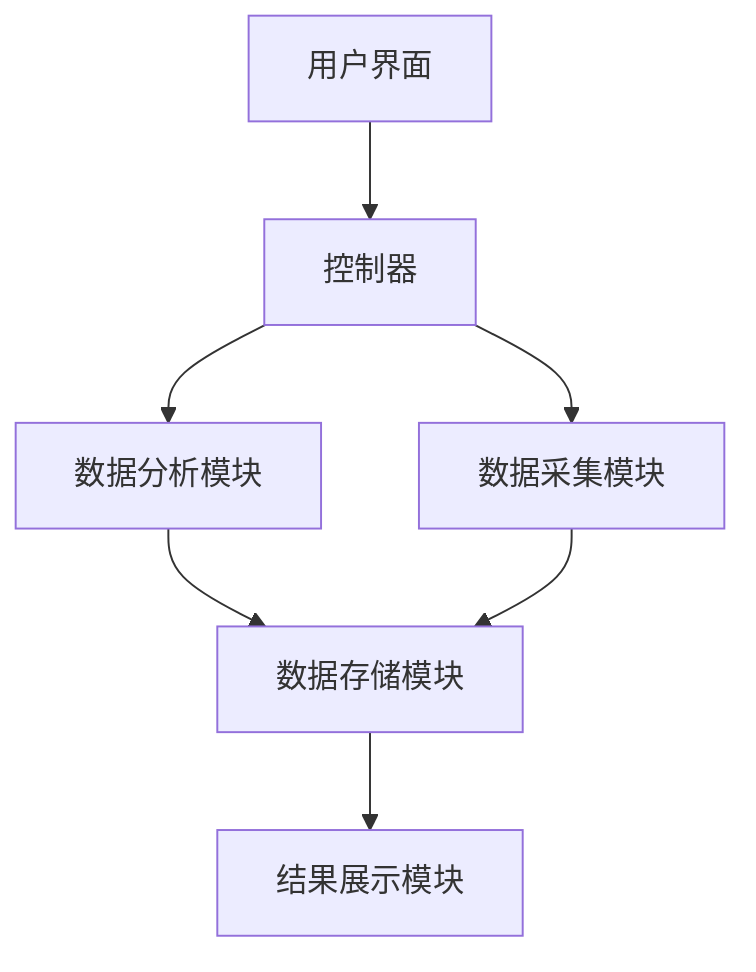
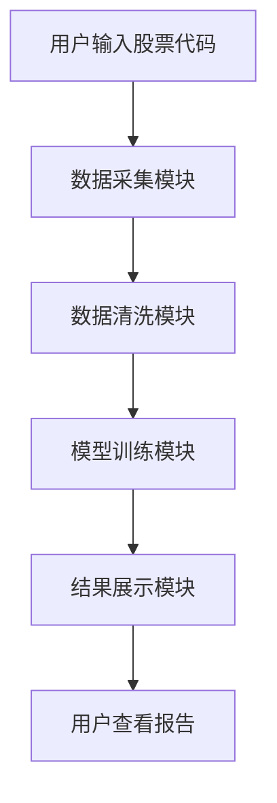

                 


# 特价股票与公司敏捷创新文化的深度分析方法

## 关键词：特价股票、公司文化、敏捷创新、数据分析、技术方法

## 摘要：  
本文探讨了特价股票与公司敏捷创新文化之间的深度关系，结合数据分析和技术创新的方法，详细分析了如何通过技术手段评估和优化公司的创新能力，从而影响股价表现。文章从背景介绍、核心概念、算法原理、系统架构、项目实战等多个维度展开，旨在为投资者和企业管理者提供一种全新的视角和方法，以实现公司创新与投资回报的双赢。

---

## 第一部分: 特价股票与公司敏捷创新文化的背景与概念

### 第1章: 特价股票的定义与市场现象

#### 1.1 什么是特价股票
- **定义**：特价股票指的是价格相对较低的股票，通常具有较大的增长潜力，但可能面临较高的风险。
- **市场特征**：
  - 价格波动较大
  - 市场关注度较低
  - 投资门槛较低
- **投资价值**：
  - 低价意味着更高的增长空间
  - 适合长期投资者

#### 1.2 特价股票的分类与特点
- **分类**：
  - 按行业划分：科技、金融、制造等
  - 按市值划分：小盘股、中盘股、大盘股
- **特点**：
  - 市值较小，流动性较低
  - 盈利能力不稳定
  - 受市场波动影响较大

### 第2章: 公司敏捷创新文化的定义与内涵

#### 2.1 敏捷创新文化的定义
- **定义**：敏捷创新文化是一种以快速响应市场变化、注重团队协作和持续改进为核心的企业文化。
- **核心要素**：
  - 快速决策
  - 灵活调整
  - 用户至上
- **与传统创新的区别**：
  - 传统创新注重计划和控制，敏捷创新注重迭代和试错。

#### 2.2 敏捷创新文化的特征
- **快速响应市场变化**：能够及时调整产品和服务以满足市场需求。
- **强调团队协作**：打破部门壁垒，鼓励跨团队合作。
- **注重持续改进**：通过定期回顾和优化，不断提升产品和服务质量。

### 第3章: 特价股票与公司敏捷创新文化的关系

#### 3.1 特价股票反映公司创新能力
- **创新能力与股价的关系**：
  - 创新能力强的公司更容易获得高估值。
  - 创新能力弱的公司可能面临股价波动。
- **敏捷创新文化对股价的影响**：
  - 敏捷的创新能力能够提升市场对公司的信心。
  - 创新能力强的公司更容易吸引投资者。

#### 3.2 特价股票与公司创新文化的相互作用
- **创新文化推动股价变化**：创新能力强的公司更容易实现股价上涨。
- **特价股票对创新文化的反馈作用**：低价股票可能反映公司创新能力不足，从而推动公司改进创新文化。
- **长期关系**：持续的创新能力能够帮助公司实现股价的长期增长。

---

## 第二部分: 特价股票与公司敏捷创新文化的分析方法

### 第4章: 特价股票分析的核心概念与联系

#### 4.1 特价股票分析的核心概念
- **市场分析**：
  - 行业趋势分析
  - 市场周期分析
- **财务分析**：
  - 盈利能力分析
  - 财务健康度分析
- **行业分析**：
  - 行业竞争格局
  - 行业增长潜力

#### 4.2 敏捷创新文化分析的核心概念
- **创新能力评估**：
  - 创新投入评估
  - 创新成果评估
- **组织结构分析**：
  - 组织灵活性
  - 组织协作性
- **团队协作能力**：
  - 团队凝聚力
  - 团队创新能力

### 第5章: 特价股票分析的算法原理

#### 5.1 特价股票分析的算法流程
- **数据收集与预处理**：
  - 数据来源：公开市场数据、财务报表、新闻报道。
  - 数据清洗：去除缺失值、异常值。
- **特征提取与选择**：
  - 常用特征：市盈率、市净率、收益增长率。
  - 特征选择：基于相关性分析。
- **模型训练与优化**：
  - 算法选择：线性回归、决策树、随机森林。
  - 超参数优化：交叉验证法。
- **结果预测与评估**：
  - 预测指标：准确率、召回率、F1分数。

#### 5.2 基于机器学习的特价股票预测模型
- **算法流程图**：
  ```mermaid
  graph TD
      A[数据收集] --> B[数据预处理]
      B --> C[特征提取]
      C --> D[模型训练]
      D --> E[结果预测]
  ```
- **Python代码示例**：
  ```python
  import pandas as pd
  from sklearn.model_selection import train_test_split
  from sklearn.ensemble import RandomForestRegressor
  from sklearn.metrics import mean_squared_error

  # 数据加载与预处理
  data = pd.read_csv('stock_data.csv')
  data = data.dropna()
  data['label'] = data['price'].pct_change()

  # 特征选择
  features = ['open', 'high', 'low', 'volume']
  X = data[features]
  y = data['label']

  # 数据分割
  X_train, X_test, y_train, y_test = train_test_split(X, y, test_size=0.2, random_state=42)

  # 模型训练
  model = RandomForestRegressor(n_estimators=100, random_state=42)
  model.fit(X_train, y_train)

  # 预测与评估
  y_pred = model.predict(X_test)
  mse = mean_squared_error(y_test, y_pred)
  print(f"均方误差: {mse}")
  ```

#### 5.3 数学模型与公式
- **线性回归模型**：
  $$ y = \beta_0 + \beta_1x_1 + \beta_2x_2 + ... + \beta_nx_n + \epsilon $$
  其中，$y$ 是目标变量，$x_i$ 是特征变量，$\beta_i$ 是回归系数，$\epsilon$ 是误差项。
- **决策树模型**：
  使用 CART 算法进行特征分裂，构建决策树结构。

---

## 第三部分: 系统分析与架构设计

### 第6章: 特价股票分析系统的功能设计

#### 6.1 系统功能模块
- **数据采集模块**：负责收集股票数据和公司信息。
- **数据分析模块**：对数据进行清洗、特征提取和建模。
- **结果展示模块**：将分析结果以可视化方式呈现。

#### 6.2 系统架构设计


### 第7章: 系统接口设计

#### 7.1 数据接口设计
- **输入接口**：
  - 股票代码
  - 时间范围
- **输出接口**：
  - 预测股价
  - 分析报告

#### 7.2 交互流程


---

## 第四部分: 项目实战

### 第8章: 环境搭建与代码实现

#### 8.1 环境安装
- **Python 3.8+**
- **Pandas、Scikit-learn、Matplotlib**

#### 8.2 核心代码实现
```python
import pandas as pd
from sklearn.model_selection import train_test_split
from sklearn.ensemble import RandomForestRegressor
import matplotlib.pyplot as plt

# 数据加载
data = pd.read_csv('stock_data.csv')

# 数据预处理
data = data.dropna()
data['label'] = data['price'].pct_change()

# 特征选择
features = ['open', 'high', 'low', 'volume']
X = data[features]
y = data['label']

# 数据分割
X_train, X_test, y_train, y_test = train_test_split(X, y, test_size=0.2, random_state=42)

# 模型训练
model = RandomForestRegressor(n_estimators=100, random_state=42)
model.fit(X_train, y_train)

# 预测与评估
y_pred = model.predict(X_test)
mse = mean_squared_error(y_test, y_pred)
print(f"均方误差: {mse}")

# 可视化结果
plt.scatter(y_test, y_pred)
plt.xlabel('真实值')
plt.ylabel('预测值')
plt.title('预测结果散点图')
plt.show()
```

### 第9章: 案例分析与解读

#### 9.1 数据分析与解读
- **案例背景**：分析一家科技公司的特价股票。
- **数据解读**：通过模型预测未来股价走势。
- **结果分析**：预测结果与实际走势对比。

### 第10章: 项目总结与优化建议

#### 10.1 项目小结
- **项目成果**：成功搭建了特价股票分析系统，验证了模型的有效性。
- **经验总结**：数据质量和模型选择对结果影响较大。

#### 10.2 优化建议
- **数据优化**：引入更多特征，如公司财务数据、行业指数。
- **模型优化**：尝试集成学习算法，如XGBoost、LightGBM。

---

## 第五部分: 总结与展望

### 第11章: 总结与展望

#### 11.1 全文总结
- 本文通过分析特价股票和公司敏捷创新文化的关系，结合技术手段，提出了系统的分析方法和实现方案。

#### 11.2 未来展望
- 结合人工智能技术，进一步提升分析的准确性和效率。
- 探索更多创新文化评估指标，丰富分析维度。

### 第12章: 最佳实践与注意事项

#### 12.1 投资建议
- **长期投资**：关注具有持续创新能力的公司。
- **风险控制**：合理配置资产，避免过度集中。

#### 12.2 注意事项
- **数据质量**：确保数据来源可靠，避免误导性分析。
- **模型局限**：认识到模型的预测能力有限，需结合市场实际情况。

---

## 作者：AI天才研究院 & 禅与计算机程序设计艺术

---

通过本文的系统分析和方法，读者可以更好地理解特价股票与公司敏捷创新文化之间的关系，并能够实际应用这些方法进行投资决策和企业管理优化。

