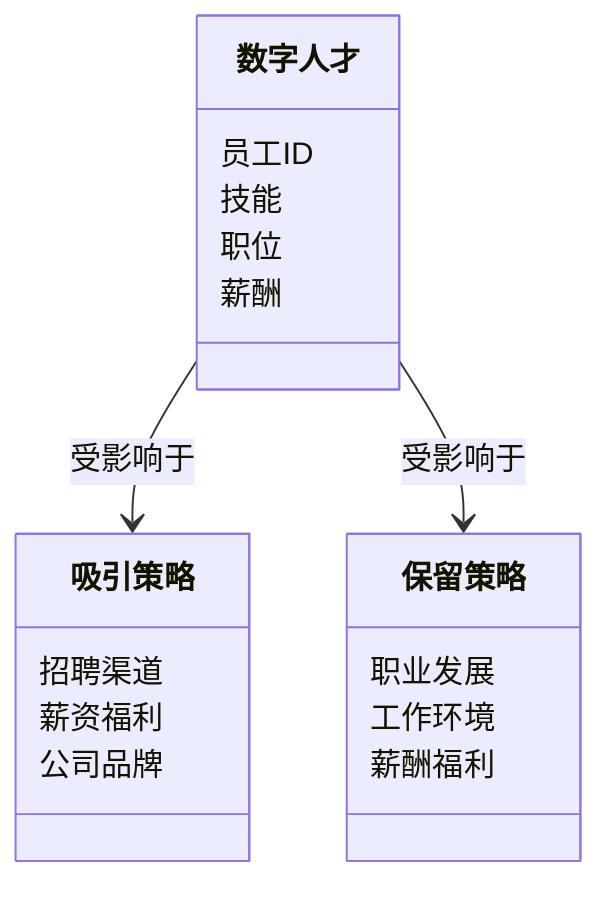
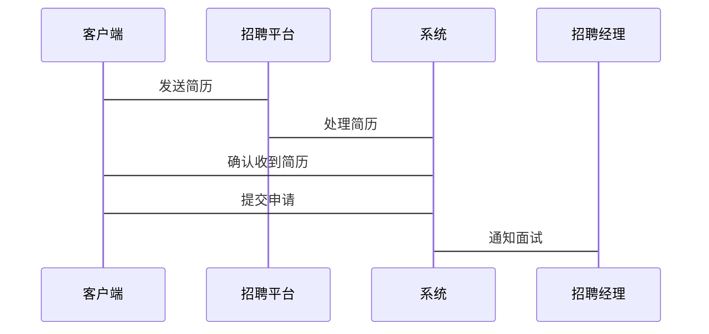

                 


# 特价股票与公司数字人才吸引与保留能力的关系探讨

> 关键词：特价股票，数字人才，吸引能力，保留能力，公司治理，人才策略

> 摘要：本文探讨了特价股票与公司数字人才吸引与保留能力之间的关系，分析了数字人才的核心能力、特价股票公司的吸引力因素，以及两者如何相互影响。通过构建关系模型和系统架构设计，本文提出了优化数字人才吸引与保留能力的方法，并结合实际案例进行了详细分析。

---

## 第一部分: 特价股票与公司数字人才吸引与保留能力的关系背景介绍

### 第1章: 特价股票与数字人才吸引与保留能力的关系概述

#### 1.1 特价股票的定义与特点
- **1.1.1 特价股票的定义**
  特价股票是指价格相对较低的股票，通常具有较高的增长潜力。这类股票可能来自中小型企业或新兴行业，吸引了寻求高回报的投资者。

- **1.1.2 特价股票的核心特点**
  - 价格波动较大，风险较高。
  - 成长潜力大，适合长期投资者。
  - 市场流动性可能较低，影响交易活跃度。

- **1.1.3 特价股票的市场定位与作用**
  特价股票在市场中扮演着重要角色，尤其在新兴技术和创新领域，吸引着风险资本和投资者的关注。

#### 1.2 数字人才的定义与特点
- **1.2.1 数字人才的定义**
  数字人才是指在数字技术领域具备专业技能的人员，包括软件开发、数据分析、人工智能等领域。

- **1.2.2 数字人才的核心能力**
  - 技术能力：掌握编程语言、数据分析工具等。
  - 创新能力：能够解决复杂问题并提出创新解决方案。
  - 团队协作能力：具备良好的沟通和协作能力。

- **1.2.3 数字人才的市场需求与供给分析**
  随着数字化转型的加速，市场对数字人才的需求持续增长，但供给相对不足，导致竞争激烈。

#### 1.3 特价股票与数字人才吸引与保留能力的关系背景
- **1.3.1 问题背景与问题描述**
  特价股票公司如何吸引和保留数字人才，以保持竞争力，是当前面临的重要问题。

- **1.3.2 问题解决的必要性与重要性**
  吸引和保留数字人才是公司持续发展的关键，直接影响公司的技术创新和市场竞争力。

- **1.3.3 问题的边界与外延**
  本文聚焦于特价股票公司的数字人才策略，分析其在吸引和保留方面的具体措施。

- **1.3.4 核心概念与核心要素组成**
  核心概念包括数字人才的吸引策略、保留策略，以及特价股票公司的市场定位。

---

## 第二部分: 数字人才吸引与保留能力的核心概念与联系

### 第2章: 数字人才吸引与保留能力的核心概念

#### 2.1 数字人才吸引能力的核心概念
- **2.1.1 吸引能力的定义与特征**
  吸引能力是指公司通过招聘策略、薪资福利等吸引人才的能力。

- **2.1.2 吸引能力的关键要素**
  - 招聘渠道：线上招聘、校园招聘等。
  - 薪资福利：竞争力的薪资、股权激励等。
  - 公司品牌：良好的企业形象和声誉。

- **2.1.3 吸引能力的评估标准**
  - 招聘效率：单位时间内招聘到的人才数量。
  - 人才质量：招聘到的人才是否符合公司需求。

#### 2.2 数字人才保留能力的核心概念
- **2.2.1 保留能力的定义与特征**
  保留能力是指公司通过内部措施留住人才的能力。

- **2.2.2 保留能力的关键要素**
  - 职业发展：晋升机会、培训资源。
  - 工作环境：良好的团队氛围、工作灵活性。
  - 薪酬福利：奖金、股票期权等。

- **2.2.3 保留能力的评估标准**
  - 员工流失率：员工离开公司的比例。
  - 员工满意度：员工对公司的满意度调查结果。

#### 2.3 吸引与保留能力的关系分析
- **2.3.1 吸引与保留能力的协同效应**
  吸引能力强的公司通常更容易通过良好的保留策略留住人才。

- **2.3.2 吸引与保留能力的相互影响**
  吸引能力强的公司可能因较高的员工满意度而降低流失率，反之亦然。

- **2.3.3 吸引与保留能力的平衡点**
  公司需要在吸引和保留之间找到平衡，以最大化整体人才管理效果。

### 第3章: 特价股票与数字人才吸引与保留能力的联系

#### 3.1 特价股票对数字人才吸引的影响
- **3.1.1 特价股票的市场表现与吸引力**
  特价股票的高增长潜力吸引了投资者，但也可能导致公司治理不稳定。

- **3.1.2 特价股票的公司治理与人才策略**
  良好的公司治理和透明的管理有助于提升公司吸引力。

- **3.1.3 特价股票的财务状况与人才吸引力**
  公司的财务健康状况直接影响人才的招聘和保留。

#### 3.2 特价股票对数字人才保留的影响
- **3.2.1 特价股票的公司稳定性与人才保留**
  公司的稳定性影响员工的归属感和安全感。

- **3.2.2 特价股票的薪酬福利与人才留任**
  具有竞争力的薪酬福利是留住人才的关键因素。

- **3.2.3 特价股票的未来发展潜力与人才保留**
  员工对公司未来发展的信心直接影响其留任意愿。

#### 3.3 吸引与保留能力的综合影响
- **3.3.1 吸引与保留能力的综合评估**
  综合考虑吸引和保留能力，优化整体人才管理策略。

- **3.3.2 吸引与保留能力的协同优化**
  通过协同优化吸引和保留策略，提升公司整体竞争力。

- **3.3.3 吸引与保留能力的平衡点**
  在吸引和保留之间找到平衡，以实现可持续的人才管理。

---

## 第三部分: 系统分析与架构设计

### 第4章: 系统分析与架构设计方案

#### 4.1 问题场景介绍
- 特价股票公司的数字人才管理面临吸引和保留的双重挑战。

#### 4.2 系统功能设计
- **4.2.1 领域模型**
  使用mermaid类图展示数字人才管理的领域模型。



- **4.2.2 系统架构设计**
  使用mermaid架构图展示系统架构。


- **4.2.3 系统接口设计**
  - API接口：用于招聘平台的数据交互。

- **4.2.4 系统交互设计**
  使用mermaid序列图展示招聘流程。



---

## 第四部分: 项目实战

### 第5章: 项目实战与案例分析

#### 5.1 项目介绍
- 选择一家特价股票公司，分析其数字人才管理策略。

#### 5.2 核心实现源代码
- 使用Python编写人才管理系统，展示招聘和留任策略的实现。

```python
def calculate吸引力(薪资, 福利):
    return 薪资 * 0.8 + 福利 * 0.2

def calculate保留能力(职业发展, 工作环境):
    return 职业发展 * 0.6 + 工作环境 * 0.4

# 示例
薪资 = 10000
福利 = 5000
职业发展 = 80
工作环境 = 70

吸引能力 = calculate吸引力(薪资, 福利)
保留能力 = calculate保留能力(职业发展, 工作环境)

print(f"吸引能力: {吸引能力}")
print(f"保留能力: {保留能力}")
```

#### 5.3 代码应用解读与分析
- 解释代码的逻辑，展示如何通过计算模型优化吸引和保留能力。

#### 5.4 实际案例分析
- 分析某特价股票公司的案例，总结经验教训。

---

## 总结与展望

### 6.1 总结
本文探讨了特价股票与数字人才吸引与保留能力的关系，提出了优化策略，并通过系统架构和案例分析进行了详细阐述。

### 6.2 展望
未来研究可以进一步探讨数字技术在人才管理中的应用，以及如何通过技术创新提升吸引和保留能力。

---

**作者：AI天才研究院 & 禅与计算机程序设计艺术**

