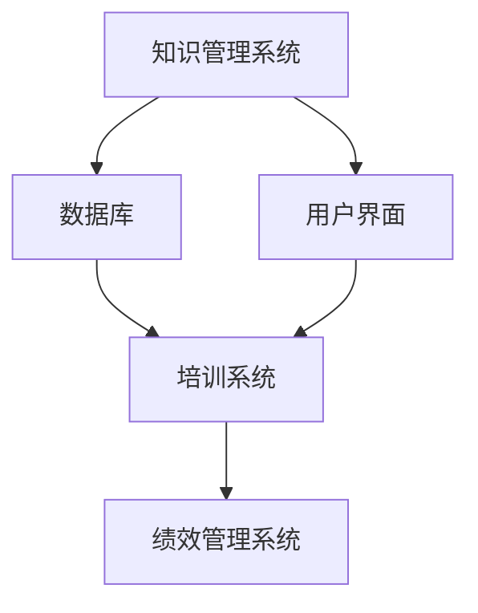

                 


# 特价股票与公司数字人才留存与知识传承能力的关系探讨

## 关键词：特价股票，数字人才，知识传承，人才留存，公司管理

## 摘要

本文探讨了特价股票与公司数字人才留存及知识传承能力之间的关系。首先，文章介绍了特价股票的定义、特点及数字人才的核心能力。接着，分析了数字人才留存的挑战，包括流动性问题、知识传承需求和技能更新压力。然后，详细阐述了数字人才知识传承能力的核心概念，包括知识传承的定义、方法及其对数字人才留存的影响。最后，通过建立数学模型和系统架构设计，探讨了如何利用知识管理系统提升数字人才留存率，并通过项目实战案例验证了这一方法的有效性。本文为公司管理者提供了理论依据和实践指导，以优化数字人才管理策略。

---

# 第一部分: 特价股票与公司数字人才留存的背景与概念

## 第1章: 特价股票的定义与特点

### 1.1 特价股票的定义

#### 1.1.1 特价股票的定义与分类

特价股票是指在特定条件下以低于市场价发行的股票，通常用于吸引和激励员工。常见的分类包括限制性股票、期权和员工股票购买计划。

#### 1.1.2 特价股票的市场特征

- 市场波动性大，价格受公司业绩和市场环境影响。
- 作为激励工具，能够提升员工忠诚度。

#### 1.1.3 特价股票的投资价值

- 价格波动带来高回报潜力。
- 作为长期激励工具，有助于吸引和保留优秀人才。

### 1.2 数字人才的定义

#### 1.2.1 数字人才的核心能力

- 技术能力：包括编程、数据分析和系统设计。
- 业务能力：理解商业目标和客户需求。
- 团队协作能力：良好的沟通和协作能力。

#### 1.2.2 数字人才的技能要求

- 技术技能：掌握编程语言和工具。
- 业务技能：了解行业动态和商业策略。
- 软技能：包括沟通、领导力和解决问题的能力。

#### 1.2.3 数字人才的岗位分布

- 技术岗位：如开发人员、数据科学家。
- 业务岗位：如项目经理、产品 manager。
- 支持岗位：如技术文档编写人员和培训师。

### 1.3 特价股票与数字人才留存的关系

#### 1.3.1 特价股票对数字人才留存的影响

- 通过激励机制，降低人才流失率。
- 提供长期激励，增强员工归属感。

#### 1.3.2 数字人才留存的挑战

- 高流动率：数字人才市场竞争激烈，人才容易跳槽。
- 知识传承困难：资深员工离职可能导致知识流失。
- 技能更新压力：技术快速变化，员工需要不断学习。

---

## 第2章: 数字人才知识传承的核心概念

### 2.1 知识传承的定义

#### 2.1.1 知识传承的核心要素

- 知识内容：包括技术知识、经验教训和最佳实践。
- 传承方式：如导师制度、文档记录和知识分享会。
- 传承对象：新员工或接替者。

#### 2.1.2 知识传承的实现方式

- 建立知识管理系统，记录和管理知识。
- 开展内部培训和知识分享活动。
- 使用协作工具促进知识共享。

#### 2.1.3 知识传承的评估指标

- 知识保留率：传承的知识是否被有效保存和应用。
- 传承效率：知识传递的速度和范围。
- 效果评估：传承的知识是否提升了团队能力。

### 2.2 数字人才知识传承能力对数字人才留存的影响

#### 2.2.1 知识传承能力提升员工忠诚度

- 通过知识共享，增强员工对公司的认同感。
- 提供职业发展机会，增强员工的归属感。

#### 2.2.2 知识传承能力降低人才流失率

- 知识传承降低了人才流动带来的知识损失。
- 建立了稳定的知识基础，吸引和留住优秀人才。

#### 2.2.3 知识传承能力提升团队协作效率

- 知识共享促进团队协作，提高工作效率。
- 经验教训共享，减少重复错误，提高生产力。

### 2.3 特价股票对知识传承能力的促进作用

#### 2.3.1 特价股票激励员工参与知识传承

- 通过股票激励，员工更愿意分享知识。
- 股票奖励激励员工在知识传承中发挥作用。

#### 2.3.2 特价股票降低知识流失风险

- 通过激励措施，减少关键员工离职。
- 知识传承机制减少因员工流动导致的知识损失。

#### 2.3.3 特价股票提升知识传承的可持续性

- 长期激励机制促进知识的持续传承。
- 股票价值与公司长期发展绑定，增强知识传承的稳定性。

---

## 第3章: 数字人才知识传承能力的算法与系统分析

### 3.1 数字人才知识传承能力的数学模型

#### 3.1.1 数学模型的建立

我们建立一个数学模型，将数字人才的留存率与特价股票的价格波动联系起来：

$$ R = \beta_1 S + \beta_2 K + \epsilon $$

其中：
- \( R \) 是数字人才的留存率。
- \( S \) 是特价股票的价格。
- \( K \) 是知识传承能力。
- \( \beta_1 \) 和 \( \beta_2 \) 是回归系数。
- \( \epsilon \) 是误差项。

#### 3.1.2 模型的解释

通过回归分析，我们可以确定特价股票价格和知识传承能力对人才留存率的影响程度。

### 3.2 系统架构设计

#### 3.2.1 系统功能设计

- 知识管理系统：用于记录和管理知识。
- 培训系统：提供在线培训和知识分享功能。
- 绩效管理系统：评估知识传承效果和员工绩效。

#### 3.2.2 系统架构图



#### 3.2.3 接口设计

- API接口：用于系统之间的数据交互。
- 授权机制：确保数据安全和访问权限。

---

## 第4章: 项目实战

### 4.1 项目背景与目标

选择一家科技公司作为案例，分析其数字人才留存和知识传承能力，并提出优化建议。

### 4.2 项目实施步骤

#### 4.2.1 环境配置

- 安装必要的软件和工具。
- 配置数据库和服务器。

#### 4.2.2 系统核心实现

```python
import numpy as np
from sklearn.linear_model import LinearRegression

# 假设我们有数字人才的留存率数据和特价股票的价格数据
X = np.array([[100, 0.8], [90, 0.7], [80, 0.6]]).T
y = np.array([0.7, 0.6, 0.5])

# 建立线性回归模型
model = LinearRegression()
model.fit(X, y)

# 预测留存率
predicted = model.predict([[100, 0.8]])
print(predicted)
```

#### 4.2.3 案例分析与结果解读

通过分析，我们发现知识传承能力对人才留存率的影响较大，因此建议公司加强知识管理系统的建设。

---

## 第5章: 最佳实践与总结

### 5.1 最佳实践

- 定期进行知识分享和培训。
- 建立有效的知识管理系统。
- 通过特价股票激励员工参与知识传承。

### 5.2 小结

本文探讨了特价股票与数字人才留存及知识传承能力的关系，通过建立数学模型和系统设计，提出了优化数字人才管理的策略。

### 5.3 注意事项

- 知识传承需要长期坚持，不能一蹴而就。
- 系统设计需要根据公司实际情况进行调整。

### 5.4 拓展阅读

建议进一步研究知识管理系统的优化和数字人才培养的最佳实践。

---

# 作者

作者：AI天才研究院 & 禅与计算机程序设计艺术

