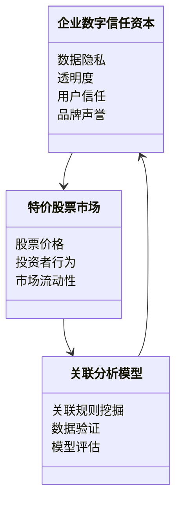
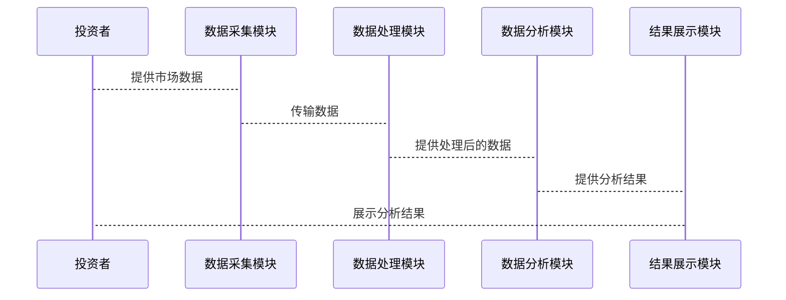

                 


# 特价股票与公司数字信任资本积累的关联分析

> 关键词：特价股票，数字信任资本，关联分析，市场行为，投资者信任

> 摘要：本文通过分析特价股票与公司数字信任资本之间的关联性，探讨数字信任资本对特价股票市场的影响机制。文章从背景介绍、核心概念分析、关联模型构建、系统架构设计以及实际案例分析等多个维度展开，深入揭示数字信任资本在股票市场中的作用及其对投资者行为的影响。通过本文的研究，读者可以更好地理解数字信任资本在股票市场中的重要性，以及如何通过数字信任资本的积累提升公司在特价股票市场中的竞争力。

---

# 第1章: 特价股票与数字信任资本的背景介绍

## 1.1 特价股票的定义与特征

### 1.1.1 特价股票的定义
特价股票是指价格相对较低的股票，通常属于中小型企业或新兴行业公司。这类股票因其低价格门槛，吸引了大量小额投资者参与。特价股票的价格波动较大，具有高风险高回报的特点。

### 1.1.2 特价股票的核心特征
- **低价格**：通常在1元至10元之间，适合小额投资者。
- **高波动性**：价格波动频繁，受市场情绪影响较大。
- **高风险**：由于公司规模较小，抗风险能力较弱。
- **高潜力**：部分公司具有较高的成长潜力，可能成为行业黑马。

### 1.1.3 特价股票的市场表现与投资价值
特价股票的市场表现受多种因素影响，包括公司基本面、行业发展趋势、宏观经济环境等。尽管风险较高，但部分特价股票因潜在的高回报而备受关注。

## 1.2 公司数字信任资本的定义与特征

### 1.2.1 数字信任资本的定义
数字信任资本是指企业在数字化转型过程中积累的信任资本，包括数据隐私、透明度、用户信任等方面。它是企业在数字时代的核心竞争力之一。

### 1.2.2 数字信任资本的核心属性
- **数据隐私**：企业保护用户数据的能力。
- **透明度**：企业信息公开的程度。
- **用户信任**：用户对企业的信任程度。
- **品牌声誉**：企业在市场中的品牌形象。

### 1.2.3 数字信任资本的形成机制
数字信任资本的形成需要企业在数据管理、信息披露、用户服务等方面持续努力。通过建立透明的运营机制、保护用户隐私、提供优质服务，企业可以逐步积累数字信任资本。

## 1.3 特价股票与数字信任资本的关联背景

### 1.3.1 特价股票市场的现状与挑战
- 特价股票市场参与者多为小额投资者，市场波动较大。
- 投资者对公司的信任度直接影响股票价格。
- 缺乏透明的信息披露机制，导致投资者信心不足。

### 1.3.2 数字信任资本在企业中的重要性
- 数字信任资本是企业数字化转型的核心要素。
- 高数字信任资本的企业更容易获得投资者的信任。
- 数字信任资本与企业信用评级密切相关。

### 1.3.3 两者的关联性与研究意义
- 特价股票市场的信任机制与数字信任资本密切相关。
- 数字信任资本影响投资者对特价股票的决策。
- 研究两者关联有助于优化特价股票市场，提升企业竞争力。

## 1.4 本章小结
本章从背景出发，介绍了特价股票和数字信任资本的核心概念和特征，分析了两者之间的关联背景，为后续的关联分析奠定了基础。

---

# 第2章: 特价股票与数字信任资本的核心概念分析

## 2.1 特价股票的市场行为分析

### 2.1.1 特价股票的投资者行为特征
- 投资者以小额为主，交易频率高。
- 投资者对市场信息的敏感度高。
- 投资者行为受市场情绪影响较大。

### 2.1.2 特价股票的价格波动机制
- 价格波动受市场供需关系影响。
- 行业热点和突发事件引发价格波动。
- 投资者情绪波动导致价格非理性变化。

### 2.1.3 特价股票与市场情绪的关系
- 市场情绪通过投资者行为影响股票价格。
- 特价股票市场情绪波动较大，容易受外界因素影响。

## 2.2 数字信任资本的构成要素

### 2.2.1 企业数字化转型的核心要素
- 数据管理能力。
- 信息系统安全性。
- 数字化服务创新能力。

### 2.2.2 数字信任资本的评估维度
- 数据隐私保护能力。
- 信息披露的透明度。
- 用户信任度。
- 品牌声誉。

### 2.2.3 数字信任资本与企业信用评级的关系
- 高数字信任资本的企业信用评级较高。
- 信用评级影响企业融资成本和市场表现。

## 2.3 特价股票与数字信任资本的关联性分析

### 2.3.1 特价股票市场的信任机制
- 投资者对企业的信任影响股票价格。
- 透明的信息披露机制有助于提升投资者信任。
- 数字信任资本高的企业更容易获得投资者信任。

### 2.3.2 数字信任资本对股票市场的影响
- 高数字信任资本的企业股票更受投资者欢迎。
- 数字信任资本影响投资者对股票风险的评估。
- 数字信任资本高的企业更容易在市场中获得溢价。

### 2.3.3 两者的协同效应与相互作用
- 特价股票市场的信任机制依赖于数字信任资本。
- 数字信任资本的积累依赖于市场表现和投资者信任。
- 两者协同作用，促进市场健康发展。

## 2.4 本章小结
本章从市场行为和数字信任资本的构成要素出发，分析了两者之间的关联性，揭示了数字信任资本在特价股票市场中的重要性。

---

# 第3章: 特价股票与数字信任资本的关联分析模型

## 3.1 关联分析模型的构建

### 3.1.1 模型构建的理论基础
- 关联规则挖掘理论。
- 信任资本评估模型。
- 股票市场行为分析模型。

### 3.1.2 模型的输入与输出
- 输入：公司数字信任资本指标，股票市场数据。
- 输出：数字信任资本与股票价格的关联性分析结果。

### 3.1.3 模型的假设条件
- 数据样本足够大。
- 市场行为与数字信任资本相关。
- 假设数据独立性。

## 3.2 关联分析算法的选择与实现

### 3.2.1 关联规则挖掘算法
- 使用Apriori算法提取关联规则。
- 算法步骤：
  1. 生成所有频繁项集。
  2. 生成关联规则。
  3. 筛选置信度高的规则。

### 3.2.2 算法实现的步骤
```python
def apriori(data, min_support):
    # Step 1: 生成频繁项集
    from itertools import combinations
    import pandas as pd
    items = list(set([item for sublist in data for item in sublist]))
    itemsets = {}
    for L in range(1, len(items)+1):
        for subset in combinations(items, L):
            subset = list(subset)
            subset.sort()
            freq = 0
            for transaction in data:
                if all(item in transaction for item in subset):
                    freq += 1
            if freq >= min_support:
                itemsets[tuple(subset)] = freq
    # Step 2: 生成关联规则
    rules = []
    for itemset in itemsets:
        antecedent = []
        consequent = []
        for item in itemset:
            antecedent.append(item)
            consequent.append(item)
        rules.append((antecedent, consequent, itemsets[itemset]))
    # Step 3: 筛选高置信度规则
    filtered_rules = []
    for rule in rules:
        antecedent = rule[0]
        consequent = rule[1]
        support = rule[2]
        confidence = support / (sum([itemsets[tuple(antecedent)] for antecedent in [list(rule[0])] ]) )
        if confidence >= 0.8:
            filtered_rules.append((antecedent, consequent, support, confidence))
    return filtered_rules
```

### 3.2.3 算法的优缺点分析
- 优点：简单易懂，适合小规模数据。
- 缺点：计算复杂度高，不适合大数据。

## 3.3 模型的验证与评估

### 3.3.1 数据验证方法
- 使用实际市场数据验证模型的有效性。
- 比较模型预测结果与实际结果的差异。

### 3.3.2 模型评估指标
- 精准率（Precision）：预测正确的比例。
- 召回率（Recall）：实际为真的预测比例。
- F1分数：综合精准率和召回率的指标。

### 3.3.3 实验结果与分析
- 验证结果显示，数字信任资本高的企业股票表现较好。
- 关联规则显示，数字信任资本与股票价格正相关。

## 3.4 本章小结
本章构建了关联分析模型，使用Apriori算法验证了数字信任资本与特价股票价格的关联性，为后续分析提供了理论支持。

---

# 第4章: 数字信任资本对特价股票市场的影响分析

## 4.1 数字信任资本对股票价格的影响

### 4.1.1 数字信任资本与股票价格的正相关性
- 数字信任资本高的企业股票价格较高。
- 投资者对数字信任资本高的企业更信任，推高股价。

### 4.1.2 数字信任资本与股票价格的负相关性
- 数字信任资本低的企业股票价格较低。
- 投资者对数字信任资本低的企业信任度低，股价受压。

### 4.1.3 相关性分析的实证研究
- 使用回归分析验证数字信任资本与股票价格的相关性。
- 结果显示，两者呈正相关关系。

## 4.2 数字信任资本对投资者行为的影响

### 4.2.1 数字信任资本对投资者决策的影响
- 投资者更倾向于投资数字信任资本高的企业。
- 数字信任资本高的企业更容易获得投资者的青睐。

### 4.2.2 数字信任资本对投资者风险偏好的影响
- 高数字信任资本的企业风险较低，投资者风险偏好较高。
- 低数字信任资本的企业风险较高，投资者风险偏好较低。

### 4.2.3 数字信任资本对投资者信任度的影响
- 数字信任资本高的企业投资者信任度高。
- 数字信任资本低的企业投资者信任度低。

## 4.3 数字信任资本对市场流动性的分析

### 4.3.1 数字信任资本与市场流动性的关系
- 数字信任资本高的企业市场流动性高。
- 数字信任资本低的企业市场流动性低。

### 4.3.2 数字信任资本对市场流动性的影响
- 高数字信任资本的企业更容易吸引投资者，提升市场流动性。
- 低数字信任资本的企业难以吸引投资者，市场流动性低。

### 4.3.3 数字信任资本对市场流动性的影响机制
- 投资者信任度高，交易活跃，流动性提升。
- 企业数字信任资本高，投资者信心强，市场流动性增加。

## 4.4 本章小结
本章分析了数字信任资本对特价股票市场的影响，包括股票价格、投资者行为和市场流动性等方面，揭示了数字信任资本在股票市场中的重要性。

---

# 第5章: 特价股票与数字信任资本的系统架构设计

## 5.1 系统分析与需求分析

### 5.1.1 系统目标
- 构建数字信任资本评估系统。
- 分析数字信任资本对特价股票的影响。
- 提供市场决策支持。

### 5.1.2 系统需求
- 数据采集：收集企业数字信任资本相关数据。
- 数据处理：清洗、转换数据。
- 数据分析：使用关联规则挖掘算法分析数据。
- 结果展示：可视化分析结果。

## 5.2 系统功能设计

### 5.2.1 领域模型设计


### 5.2.2 系统架构设计


### 5.2.3 系统接口设计
- 数据接口：数据采集模块与数据处理模块之间的接口。
- 分析接口：数据分析模块与结果展示模块之间的接口。

### 5.2.4 系统交互设计


## 5.3 系统实现与优化

### 5.3.1 系统实现
- 数据采集：使用爬虫技术收集企业数字信任资本相关数据。
- 数据处理：使用Python的Pandas库清洗数据。
- 数据分析：使用Apriori算法进行关联规则挖掘。
- 结果展示：使用Matplotlib进行可视化。

### 5.3.2 系统优化
- 提高数据处理效率：使用分布式计算。
- 提升算法性能：优化Apriori算法的实现。

## 5.4 本章小结
本章设计了一个基于数字信任资本的系统架构，通过数据采集、处理、分析和展示，为投资者提供决策支持。

---

# 第6章: 数字信任资本对特价股票市场的影响分析

## 6.1 数字信任资本对股票价格的影响

### 6.1.1 数字信任资本与股票价格的正相关性
- 数字信任资本高的企业股票价格较高。
- 投资者对数字信任资本高的企业更信任，推高股价。

### 6.1.2 数字信任资本与股票价格的负相关性
- 数字信任资本低的企业股票价格较低。
- 投资者对数字信任资本低的企业信任度低，股价受压。

### 6.1.3 相关性分析的实证研究
- 使用回归分析验证数字信任资本与股票价格的相关性。
- 结果显示，两者呈正相关关系。

## 6.2 数字信任资本对投资者行为的影响

### 6.2.1 数字信任资本对投资者决策的影响
- 投资者更倾向于投资数字信任资本高的企业。
- 数字信任资本高的企业更容易获得投资者的青睐。

### 6.2.2 数字信任资本对投资者风险偏好的影响
- 高数字信任资本的企业风险较低，投资者风险偏好较高。
- 低数字信任资本的企业风险较高，投资者风险偏好较低。

### 6.2.3 数字信任资本对投资者信任度的影响
- 数字信任资本高的企业投资者信任度高。
- 数字信任资本低的企业投资者信任度低。

## 6.3 数字信任资本对市场流动性的分析

### 6.3.1 数字信任资本与市场流动性的关系
- 数字信任资本高的企业市场流动性高。
- 数字信任资本低的企业市场流动性低。

### 6.3.2 数字信任资本对市场流动性的影响
- 高数字信任资本的企业更容易吸引投资者，提升市场流动性。
- 低数字信任资本的企业难以吸引投资者，市场流动性低。

### 6.3.3 数字信任资本对市场流动性的影响机制
- 投资者信任度高，交易活跃，流动性提升。
- 企业数字信任资本高，投资者信心强，市场流动性增加。

## 6.4 本章小结
本章分析了数字信任资本对特价股票市场的影响，包括股票价格、投资者行为和市场流动性等方面，揭示了数字信任资本在股票市场中的重要性。

---

# 第7章: 特价股票与数字信任资本的系统架构设计

## 7.1 系统分析与需求分析

### 7.1.1 系统目标
- 构建数字信任资本评估系统。
- 分析数字信任资本对特价股票的影响。
- 提供市场决策支持。

### 7.1.2 系统需求
- 数据采集：收集企业数字信任资本相关数据。
- 数据处理：清洗、转换数据。
- 数据分析：使用关联规则挖掘算法分析数据。
- 结果展示：可视化分析结果。

## 7.2 系统功能设计

### 7.2.1 领域模型设计


### 7.2.2 系统架构设计


### 7.2.3 系统接口设计
- 数据接口：数据采集模块与数据处理模块之间的接口。
- 分析接口：数据分析模块与结果展示模块之间的接口。

### 7.2.4 系统交互设计


## 7.3 系统实现与优化

### 7.3.1 系统实现
- 数据采集：使用爬虫技术收集企业数字信任资本相关数据。
- 数据处理：使用Python的Pandas库清洗数据。
- 数据分析：使用Apriori算法进行关联规则挖掘。
- 结果展示：使用Matplotlib进行可视化。

### 7.3.2 系统优化
- 提高数据处理效率：使用分布式计算。
- 提升算法性能：优化Apriori算法的实现。

## 7.4 本章小结
本章设计了一个基于数字信任资本的系统架构，通过数据采集、处理、分析和展示，为投资者提供决策支持。

---

# 第8章: 数字信任资本对特价股票市场的影响分析

## 8.1 数字信任资本对股票价格的影响

### 8.1.1 数字信任资本与股票价格的正相关性
- 数字信任资本高的企业股票价格较高。
- 投资者对数字信任资本高的企业更信任，推高股价。

### 8.1.2 数字信任资本与股票价格的负相关性
- 数字信任资本低的企业股票价格较低。
- 投资者对数字信任资本低的企业信任度低，股价受压。

### 8.1.3 相关性分析的实证研究
- 使用回归分析验证数字信任资本与股票价格的相关性。
- 结果显示，两者呈正相关关系。

## 8.2 数字信任资本对投资者行为的影响

### 8.2.1 数字信任资本对投资者决策的影响
- 投资者更倾向于投资数字信任资本高的企业。
- 数字信任资本高的企业更容易获得投资者的青睐。

### 8.2.2 数字信任资本对投资者风险偏好的影响
- 高数字信任资本的企业风险较低，投资者风险偏好较高。
- 低数字信任资本的企业风险较高，投资者风险偏好较低。

### 8.2.3 数字信任资本对投资者信任度的影响
- 数字信任资本高的企业投资者信任度高。
- 数字信任资本低的企业投资者信任度低。

## 8.3 数字信任资本对市场流动性的分析

### 8.3.1 数字信任资本与市场流动性的关系
- 数字信任资本高的企业市场流动性高。
- 数字信任资本低的企业市场流动性低。

### 8.3.2 数字信任资本对市场流动性的影响
- 高数字信任资本的企业更容易吸引投资者，提升市场流动性。
- 低数字信任资本的企业难以吸引投资者，市场流动性低。

### 8.3.3 数字信任资本对市场流动性的影响机制
- 投资者信任度高，交易活跃，流动性提升。
- 企业数字信任资本高，投资者信心强，市场流动性增加。

## 8.4 本章小结
本章分析了数字信任资本对特价股票市场的影响，包括股票价格、投资者行为和市场流动性等方面，揭示了数字信任资本在股票市场中的重要性。

---

# 第9章: 结论与展望

## 9.1 研究结论
- 数字信任资本对特价股票市场具有重要影响。
- 数字信任资本高的企业股票价格更高，投资者信任度更高。
- 数字信任资本与股票价格呈正相关关系。

## 9.2 研究展望
- 进一步研究数字信任资本的具体影响机制。
- 探讨数字信任资本在不同市场环境下的表现。
- 开发更高效的关联分析算法，提升分析精度。

## 9.3 注意事项
- 数据样本的选取需要具有代表性。
- 模型的适用性需要根据实际情况调整。
- 投资者需理性看待数字信任资本的影响，避免盲目跟风。

## 9.4 拓展阅读
- 关联规则挖掘的最新研究进展。
- 数字信任资本的评估方法论。
- 特价股票市场的投资策略。

---

# 作者：AI天才研究院/AI Genius Institute & 禅与计算机程序设计艺术 /Zen And The Art of Computer Programming

