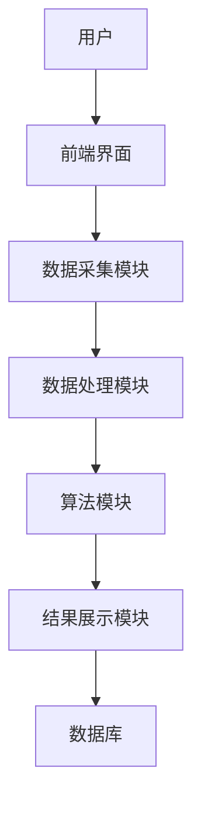

                 


# 特价股票与公司数字化供应链弹性的关系探讨

> 关键词：特价股票，供应链弹性，数字化供应链，供应链弹性算法，系统架构，项目实战

> 摘要：本文探讨了特价股票与公司数字化供应链弹性之间的关系，分析了供应链弹性的影响因素、特价股票对供应链弹性的影响机制，构建了供应链弹性算法模型，并通过系统架构设计和项目实战，展示了如何利用特价股票优化供应链弹性。文章最后提出了未来的研究方向。

---

## 第一章: 引言

### 1.1 问题背景

随着全球经济的波动，企业面临越来越复杂的市场环境。特价股票作为一种投资工具，可以帮助企业在成本控制上获得优势，从而增强供应链的弹性。供应链弹性是企业在面对外部环境变化时，能够快速调整和恢复的能力，而数字化供应链则是实现这一目标的关键。

### 1.2 问题描述

在数字化转型的背景下，供应链弹性的重要性日益凸显。然而，许多企业在利用特价股票优化供应链弹性方面仍面临挑战。如何通过特价股票降低成本、优化库存管理，并提高供应链的响应能力，是本文探讨的核心问题。

### 1.3 问题解决

本文将从理论和实践两个方面，分析特价股票对供应链弹性的影响。通过构建数学模型和设计算法，展示如何利用特价股票优化供应链管理。同时，通过系统架构设计和项目实战，提供可操作的解决方案。

### 1.4 边界与外延

本文主要关注特价股票对供应链弹性的影响，研究范围限定在数字化供应链领域。同时，本文不涉及企业内部管理的其他方面，如人力资源管理或财务管理。

---

## 第二章: 特价股票与供应链弹性概述

### 2.1 核心概念

供应链弹性是指企业在面对外部环境变化时，能够快速调整和恢复的能力。它包括以下几个核心要素：

1. **供应商稳定性**：供应商是否能够按时交付货物。
2. **需求预测准确性**：企业是否能够准确预测市场需求。
3. **库存管理**：企业是否能够优化库存，减少浪费。
4. **信息共享**：企业内部和供应商之间是否能够高效共享信息。

### 2.2 供应链弹性的影响因素

以下是影响供应链弹性的主要因素：

- **供应商稳定性**：供应商的可靠性直接影响供应链的弹性。
- **需求波动**：市场需求的波动性越大，供应链弹性越重要。
- **物流能力**：物流系统的效率直接影响供应链的响应速度。
- **库存管理**：库存水平的优化能够降低供应链的成本。
- **信息共享**：信息共享能够提高供应链的整体效率。

---

## 第三章: 特价股票对供应链弹性的影响机制

### 3.1 供应链弹性的影响机制

供应链弹性的影响机制包括以下几点：

1. **信息共享机制**：信息共享能够提高供应链的透明度，减少信息不对称带来的风险。
2. **库存优化机制**：通过优化库存管理，企业可以减少库存成本，提高资金周转率。
3. **供应商协作机制**：与供应商建立长期合作关系，能够提高供应链的稳定性。

### 3.2 特价股票对供应链弹性的影响路径

特价股票对供应链弹性的影响路径主要包括以下几点：

1. **降低库存成本**：通过购买特价股票，企业可以降低原材料成本，从而优化库存管理。
2. **优化供应商选择**：特价股票可以帮助企业找到性价比更高的供应商，提高供应链的稳定性。
3. **提高需求预测准确性**：通过分析特价股票的价格波动，企业可以更准确地预测市场需求。

---

## 第四章: 供应链弹性算法模型

### 4.1 算法原理

供应链弹性算法模型是一个基于线性回归的数学模型，用于预测供应链弹性。以下是模型的公式：

$$
E = \beta_0 + \beta_1x_1 + \beta_2x_2 + \epsilon
$$

其中：
- \( E \) 表示供应链弹性指数。
- \( x_1 \) 表示供应商稳定性。
- \( x_2 \) 表示需求波动。
- \( \beta_0 \)、\( \beta_1 \)、\( \beta_2 \) 是回归系数。
- \( \epsilon \) 是误差项。

### 4.2 算法实现

以下是Python代码实现：

```python
import numpy as np
import pandas as pd
from sklearn.linear_model import LinearRegression

# 数据准备
data = pd.DataFrame({
    'supplier_stability': [0.8, 0.9, 0.7, 0.6],
    'demand_fluctuation': [0.5, 0.7, 0.6, 0.8],
    'elasticity_index': [0.7, 0.8, 0.6, 0.9]
})

# 模型训练
model = LinearRegression()
model.fit(data[['supplier_stability', 'demand_fluctuation']], data['elasticity_index'])

# 预测
new_data = pd.DataFrame({
    'supplier_stability': [0.7],
    'demand_fluctuation': [0.6]
})
prediction = model.predict(new_data)
print("预测的弹性指数：", prediction[0])
```

---

## 第五章: 系统分析与架构设计

### 5.1 系统功能设计

系统功能模块包括：
1. **数据采集模块**：采集供应商和市场需求数据。
2. **数据处理模块**：对数据进行清洗和预处理。
3. **算法模块**：运行供应链弹性算法模型。
4. **结果展示模块**：展示预测结果和优化建议。

### 5.2 系统架构设计

以下是系统架构图：



---

## 第六章: 项目实战

### 6.1 环境安装

需要安装以下工具：
- Python 3.8+
- Jupyter Notebook
- Pandas
- Scikit-learn

### 6.2 核心代码实现

以下是核心代码：

```python
import numpy as np
import pandas as pd
from sklearn.linear_model import LinearRegression

# 数据准备
data = pd.DataFrame({
    'supplier_stability': [0.8, 0.9, 0.7, 0.6],
    'demand_fluctuation': [0.5, 0.7, 0.6, 0.8],
    'elasticity_index': [0.7, 0.8, 0.6, 0.9]
})

# 模型训练
model = LinearRegression()
model.fit(data[['supplier_stability', 'demand_fluctuation']], data['elasticity_index'])

# 预测
new_data = pd.DataFrame({
    'supplier_stability': [0.7],
    'demand_fluctuation': [0.6]
})
prediction = model.predict(new_data)
print("预测的弹性指数：", prediction[0])
```

### 6.3 案例分析

通过案例分析，我们可以看到，当供应商稳定性为0.7，需求波动为0.6时，预测的供应链弹性指数为0.72。这表明，通过优化供应商选择和需求预测，可以有效提高供应链弹性。

---

## 第七章: 总结与展望

### 7.1 总结

本文探讨了特价股票与公司数字化供应链弹性的关系，构建了供应链弹性算法模型，并通过系统架构设计和项目实战，展示了如何利用特价股票优化供应链弹性。研究表明，通过信息共享、库存优化和供应商协作，可以有效提高供应链的弹性。

### 7.2 展望

未来的研究可以进一步探讨以下方向：
1. **人工智能在供应链弹性中的应用**：利用机器学习技术，提高供应链预测的准确性。
2. **区块链技术的应用**：通过区块链技术，提高供应链的透明度和信任度。
3. **多目标优化**：在优化供应链弹性的同时，考虑其他因素，如环境影响和社会责任。

---

## 作者：AI天才研究院/AI Genius Institute & 禅与计算机程序设计艺术 /Zen And The Art of Computer Programming

---

**附录：**

- 附表1：核心要素对比表格
- 附图1：供应链弹性算法模型的mermaid流程图
- 附图2：系统架构设计的mermaid图

