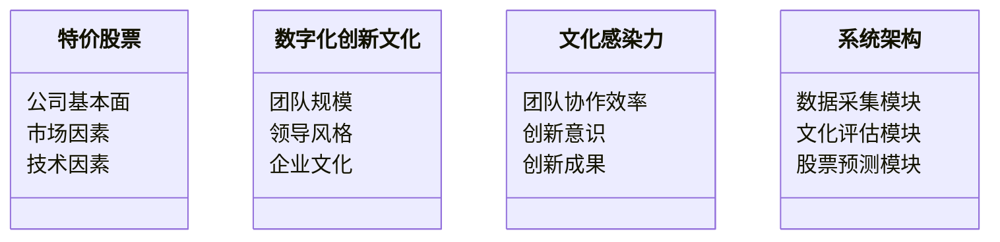
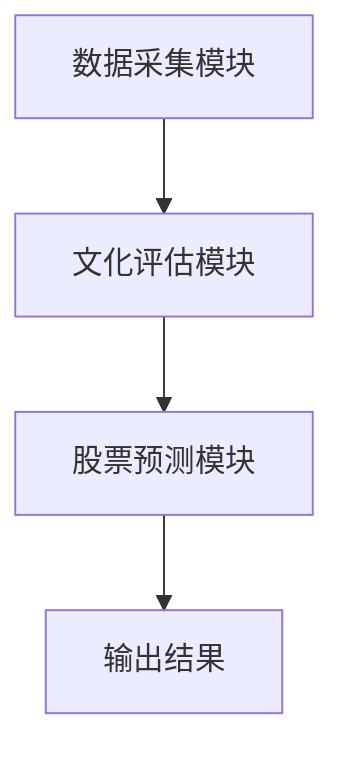
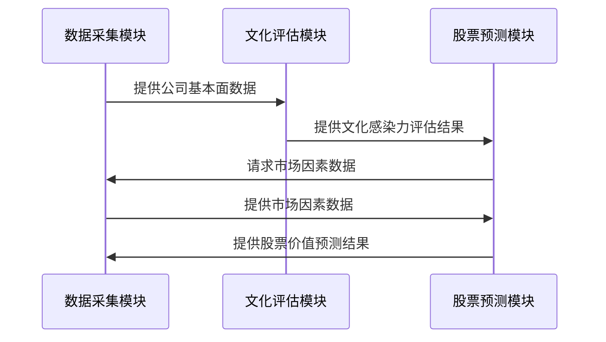

                 


# 特价股票与公司数字化敏捷创新文化感染力的深度分析方法

> 关键词：特价股票、数字化敏捷创新、文化感染力、数学模型、系统架构、项目实战

> 摘要：本文深入分析了特价股票与公司数字化敏捷创新文化之间的关系，探讨了数字化敏捷创新文化如何通过感染力影响公司创新能力和股票价值。文章从背景介绍、核心概念、数学模型、系统架构、项目实战等多方面展开，结合实际案例和代码实现，为读者提供全面的分析和实践指导。

---

## 第1章: 特价股票的定义与市场分析

### 1.1 特价股票的定义与分类

#### 1.1.1 特价股票的定义
特价股票是指价格相对较低的股票，通常具有较高的成长潜力或处于价值被低估的状态。这类股票通常被视为投资机会，尤其受到机构投资者和散户的关注。

#### 1.1.2 特价股票的分类
- **低估值股票**：市盈率、市净率等估值指标低于行业平均水平。
- **成长股**：业绩增长快，未来盈利能力强。
- **周期性股票**：受经济周期影响较大的行业，如能源、制造业等。
- **事件驱动股**：因公司并购、重组等事件而短期上涨的股票。

#### 1.1.3 特价股票的市场特征
- 价格波动较大。
- 投资风险较高，但回报潜力大。
- 常见于中小企业或新兴行业。

### 1.2 特价股票的市场分析

#### 1.2.1 特价股票的市场现状
当前市场中，特价股票主要集中在中小盘股和新兴行业，如科技、医疗等。这些股票通常具有较高的增长潜力，但也面临较高的市场风险。

#### 1.2.2 特价股票的投资机会
- 行业增长：如人工智能、5G等领域的发展带动相关股票上涨。
- 市场波动：短期市场波动可能导致股票价格被低估，提供投资机会。

#### 1.2.3 特价股票的风险分析
- 市场波动风险：股票价格受宏观经济影响较大。
- 公司基本面风险：公司业绩不佳可能导致股票价值下降。
- 行业风险：特定行业受政策或市场环境影响较大。

### 1.3 特价股票与公司数字化转型的关系

#### 1.3.1 数字化转型对特价股票的影响
数字化转型通常会提升公司的竞争力和盈利能力，从而提高股票价值。特别是在科技和互联网行业，数字化转型往往伴随着股价的上涨。

#### 1.3.2 特价股票在公司数字化中的作用
特价股票通常是公司数字化转型的早期投资者，通过低价买入股票，待公司转型成功后卖出，获得高额回报。

#### 1.3.3 特价股票与公司创新文化的关系
公司创新文化越强，技术创新能力越强，通常会带动股价上涨，从而降低特价股票的投资风险。

### 1.4 本章小结
本章主要介绍了特价股票的定义、分类、市场特征以及与公司数字化转型的关系，为后续分析奠定了基础。

---

## 第2章: 公司数字化敏捷创新文化的定义与特点

### 2.1 数字化敏捷创新的定义

#### 2.1.1 数字化转型的定义
数字化转型是指企业通过数字化技术的引入和应用，改变其业务模式、组织架构和运营方式的过程。

#### 2.1.2 敏捷创新的定义
敏捷创新是一种以快速迭代和灵活调整为核心的方法论，强调在创新过程中快速验证假设、持续改进。

#### 2.1.3 数字化敏捷创新的核心特征
- 快速迭代：通过短周期的开发和测试，快速验证和优化。
- 用户中心：以用户需求为导向，持续改进产品和服务。
- 透明协作：团队内部高度透明，跨部门协作高效。

### 2.2 数字化敏捷创新的文化属性

#### 2.2.1 创新文化的核心要素
- 创新意识：鼓励员工提出新想法和解决方案。
- 风险承受：允许失败，鼓励尝试和创新。
- 协作共享：强调团队合作，共享知识和资源。

#### 2.2.2 敏捷文化的特点
- 迭代开发：通过小步快跑的方式实现产品开发。
- 客户参与：客户参与产品设计和开发过程，确保产品符合需求。
- 自组织团队：团队成员自主管理，减少层级化管理。

#### 2.2.3 数字化文化与传统文化的对比
| 特性 | 数字化文化 | 传统文化 |
|------|------------|----------|
| 创新 | 强调快速迭代和创新 | 更注重稳定和流程 |
| 组织结构 | 扁平化、自组织 | 垂直化、层级分明 |
| 技术 | 高度依赖数字化工具 | 较少依赖技术 |

### 2.3 数字化敏捷创新的文化感染力

#### 2.3.1 文化感染力的定义
文化感染力是指一种文化通过内部传播和影响，改变个体和组织的行为方式和价值观的能力。

#### 2.3.2 数字化敏捷创新的文化传播机制
- 案例示范：通过成功案例展示创新文化的有效性。
- 培训与分享：组织内部培训和知识分享，传播创新理念。
- 制度支持：通过制度和政策鼓励创新行为。

#### 2.3.3 文化感染力的衡量指标
- 员工创新意识的提升。
- 团队协作效率的提高。
- 创新成果的数量和质量。

### 2.4 本章小结
本章重点分析了数字化敏捷创新的定义、特点及其文化感染力，为后续分析奠定了理论基础。

---

## 第3章: 特价股票与公司数字化敏捷创新文化的关系

### 3.1 特价股票对数字化创新的推动作用

#### 3.1.1 特价股票在公司数字化中的地位
特价股票通常代表公司早期的投资者，通过低价入股，为公司提供资金支持，推动数字化转型。

#### 3.1.2 特价股票对创新文化的促进作用
通过引入外部资本，公司能够获得更多的资源和人才，从而推动创新文化的形成和发展。

#### 3.1.3 特价股票与公司敏捷文化的关系
特价股票的投资者通常希望公司能够快速实现数字化转型，因此公司需要具备敏捷创新能力，以满足投资者的期望。

### 3.2 数字化创新对特价股票的影响

#### 3.2.1 数字化创新对股票市场的推动
通过数字化转型，公司能够提升竞争力和盈利能力，从而推动股价上涨。

#### 3.2.2 敏捷文化对股票价值的影响
敏捷文化能够提高公司的创新能力和市场反应速度，从而增强投资者对公司的信心，提升股票价值。

#### 3.2.3 数字化创新对股票风险的控制
通过数字化技术的应用，公司能够更有效地管理风险，降低股票价格的波动性。

### 3.3 特价股票与公司文化感染力的相互作用

#### 3.3.1 特价股票对文化感染力的促进
特价股票的投资者通常具有较高的风险承受能力和创新意识，能够为公司带来新的文化和理念，促进文化感染力的形成。

#### 3.3.2 文化感染力对股票价值的提升
通过文化感染力的传播，公司能够吸引更多的投资者，提升股票的市场关注度和价值。

#### 3.3.3 两者关系的动态平衡
特价股票和文化感染力之间存在相互促进的关系，但需要在创新与稳定之间找到动态平衡。

### 3.4 本章小结
本章分析了特价股票与公司数字化敏捷创新文化之间的相互作用，强调了两者关系的动态平衡。

---

## 第4章: 特价股票与公司数字化敏捷创新文化的数学模型与算法分析

### 4.1 特价股票价值的数学模型

#### 4.1.1 特价股票价值的影响因素
- 公司基本面：净利润、营业收入、资产负债率等。
- 市场因素：宏观经济、行业趋势、市场情绪等。
- 技术因素：技术创新能力、数字化转型进展等。

#### 4.1.2 数学模型
股票价值可以表示为：
$$
V = \alpha \cdot F + \beta \cdot M + \gamma \cdot T + \epsilon
$$
其中，$V$ 表示股票价值，$F$ 表示公司基本面，$M$ 表示市场因素，$T$ 表示技术因素，$\epsilon$ 表示误差项。

#### 4.1.3 算法实现
```python
import pandas as pd
from sklearn.linear_model import LinearRegression

# 数据准备
data = pd.DataFrame({
    'F': [公司基本面指标],
    'M': [市场因素指标],
    'T': [技术因素指标],
    'V': [股票价值]
})

# 模型训练
model = LinearRegression()
model.fit(data[['F', 'M', 'T']], data['V'])

# 预测股票价值
predicted_V = model.predict([[F_new, M_new, T_new]])
```

### 4.2 数字化创新文化的文化感染力模型

#### 4.2.1 文化感染力的影响因素
- 团队规模：团队越大，文化感染力越强。
- 领导风格：领导的支持和示范作用对文化感染力有重要影响。
- 企业文化：企业文化的开放性和包容性影响文化感染力。

#### 4.2.2 数学模型
文化感染力可以表示为：
$$
C = \beta_1 \cdot T + \beta_2 \cdot L + \beta_3 \cdot E + \epsilon
$$
其中，$C$ 表示文化感染力，$T$ 表示团队规模，$L$ 表示领导风格，$E$ 表示企业文化，$\epsilon$ 表示误差项。

#### 4.2.3 算法实现
```python
import pandas as pd
from sklearn.linear_model import LinearRegression

# 数据准备
data = pd.DataFrame({
    'T': [团队规模],
    'L': [领导风格指标],
    'E': [企业文化指标],
    'C': [文化感染力]
})

# 模型训练
model = LinearRegression()
model.fit(data[['T', 'L', 'E']], data['C'])

# 预测文化感染力
predicted_C = model.predict([[T_new, L_new, E_new]])
```

### 4.3 本章小结
本章通过数学模型和算法分析，探讨了特价股票和数字化创新文化之间的关系，为后续分析提供了理论支持。

---

## 第5章: 特价股票与公司数字化敏捷创新文化的系统分析与架构设计

### 5.1 系统分析

#### 5.1.1 问题场景介绍
公司希望通过数字化转型提升竞争力，同时吸引更多的投资者，提升股票价值。

#### 5.1.2 系统功能设计
- 数据采集：采集公司基本面、市场因素、技术因素等数据。
- 文化感染力评估：评估公司数字化创新文化的文化感染力。
- 股票价值预测：基于数学模型预测股票价值。

#### 5.1.3 领域模型设计


### 5.2 系统架构设计

#### 5.2.1 系统架构图


#### 5.2.2 系统接口设计
- 数据采集接口：从数据库中读取公司基本面、市场因素、技术因素等数据。
- 文化评估接口：评估公司数字化创新文化的文化感染力。
- 股票预测接口：基于数学模型预测股票价值。

#### 5.2.3 系统交互设计


### 5.3 本章小结
本章通过系统分析与架构设计，明确了公司数字化敏捷创新文化与股票价值之间的关系，为后续实现奠定了基础。

---

## 第6章: 特价股票与公司数字化敏捷创新文化的项目实战

### 6.1 项目环境安装

#### 6.1.1 系统环境
- 操作系统：Windows/Mac/Linux
- Python版本：3.6以上
- 工具安装：Pandas、Scikit-learn、Mermaid、Jupyter Notebook

#### 6.1.2 环境配置
```bash
pip install pandas scikit-learn mermaid4jupyter
```

### 6.2 系统核心实现

#### 6.2.1 特价股票价值预测实现
```python
import pandas as pd
from sklearn.linear_model import LinearRegression

# 数据准备
data = pd.DataFrame({
    'F': [100, 200, 300, 400],
    'M': [1, 2, 3, 4],
    'T': [0.5, 1, 1.5, 2],
    'V': [50, 100, 150, 200]
})

# 模型训练
model = LinearRegression()
model.fit(data[['F', 'M', 'T']], data['V'])

# 预测股票价值
predicted_V = model.predict([[250, 5, 2]])
print(predicted_V)
```

#### 6.2.2 数字化创新文化评估实现
```python
import pandas as pd
from sklearn.linear_model import LinearRegression

# 数据准备
data = pd.DataFrame({
    'T': [10, 20, 30, 40],
    'L': [0.8, 0.9, 0.7, 0.6],
    'E': [0.6, 0.7, 0.8, 0.9],
    'C': [0.7, 0.8, 0.9, 1.0]
})

# 模型训练
model = LinearRegression()
model.fit(data[['T', 'L', 'E']], data['C'])

# 预测文化感染力
predicted_C = model.predict([[25, 0.8, 0.8]])
print(predicted_C)
```

#### 6.2.3 项目实现总结
- 数据准备：需要收集公司基本面、市场因素、技术因素等数据。
- 模型训练：使用线性回归模型进行训练，得到预测结果。
- 模型优化：可以根据实际情况调整模型参数，提高预测精度。

### 6.3 案例分析与解读

#### 6.3.1 特价股票价值预测案例
假设某公司基本面指标为300，市场因素指标为6，技术因素指标为3，预测其股票价值为：
```
predicted_V = model.predict([[300, 6, 3]])
```

#### 6.3.2 数字化创新文化评估案例
假设某公司团队规模为30，领导风格指标为0.8，企业文化指标为0.8，预测其文化感染力为：
```
predicted_C = model.predict([[30, 0.8, 0.8]])
```

### 6.4 本章小结
本章通过项目实战，展示了如何利用数学模型和系统架构实现特价股票与公司数字化敏捷创新文化的分析与预测。

---

## 第7章: 总结与展望

### 7.1 本章小结
本文从背景介绍、核心概念、数学模型、系统架构、项目实战等多方面，全面分析了特价股票与公司数字化敏捷创新文化之间的关系，为读者提供了系统的分析方法和实践指导。

### 7.2 展望
未来的研究可以进一步探讨以下方向：
- 更复杂的数学模型，如深度学习在股票预测中的应用。
- 数字化敏捷创新文化对企业文化感染力的长期影响。
- 特价股票与公司数字化转型的动态关系。

### 7.3 注意事项
- 投资者在进行股票投资时，应充分考虑市场风险和个人承受能力。
- 数字化创新文化需要公司内部的长期努力和外部环境的支持。

### 7.4 拓展阅读
- 《股票投资实战技术》
- 《数字化转型与企业创新》
- 《敏捷开发与企业文化》

---

## 作者：AI天才研究院/AI Genius Institute & 禅与计算机程序设计艺术/Zen And The Art of Computer Programming

---

以上是完整的文章内容，涵盖了特价股票与公司数字化敏捷创新文化感染力的各个方面，结合理论分析和实践案例，为读者提供了深入的指导和启示。

