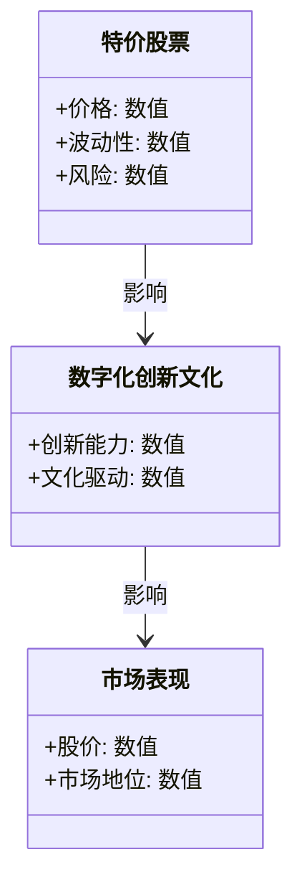
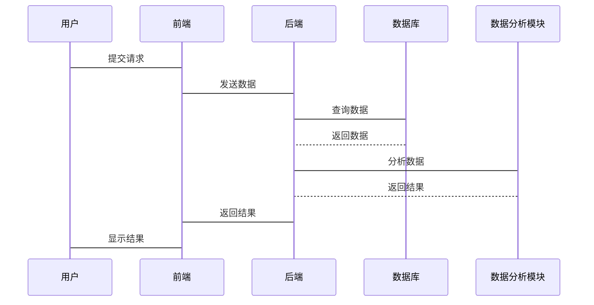

                 


# 特价股票与公司数字化敏捷创新文化的深度分析方法

> 关键词：特价股票、数字化创新文化、敏捷创新、数据分析、系统架构

> 摘要：本文深入分析了特价股票与公司数字化敏捷创新文化之间的关系，探讨了数字化创新文化对股票市场的影响，构建了分析框架，并通过实际案例分析和系统设计，提出了优化企业创新文化的建议。

---

## 第1章: 特价股票与数字化敏捷创新文化的背景介绍

### 1.1 特价股票的定义与特点
#### 1.1.1 特价股票的定义
特价股票是指价格相对较低的股票，通常具有高波动性和高风险的特性。这些股票可能来自小公司或新兴行业，价格波动较大，但潜在回报也较高。

#### 1.1.2 特价股票的市场表现
特价股票在市场中的表现受多种因素影响，包括市场整体走势、公司基本面、行业趋势等。投资者在选择特价股票时需谨慎，因为其价格波动较大，风险较高。

#### 1.1.3 特价股票的投资价值
尽管风险较高，特价股票在某些情况下可能带来高回报。投资者需要结合市场分析、公司基本面和技术分析来评估其投资价值。

### 1.2 数字化敏捷创新文化的内涵
#### 1.2.1 数字化转型的定义
数字化转型是指企业通过引入数字技术来优化业务流程、提升效率和竞争力。数字化转型不仅仅是技术的应用，更是一种文化变革。

#### 1.2.2 敏捷创新文化的特征
敏捷创新文化强调快速响应市场变化、注重迭代和实验。企业通过建立敏捷团队、采用敏捷方法论，能够更快地适应市场变化，推出创新产品和服务。

#### 1.2.3 数字化创新文化对企业的影响
数字化创新文化能够提升企业的创新能力，加快产品开发速度，增强市场竞争力。同时，这种文化还能提高员工的满意度和创造力，促进企业整体绩效的提升。

### 1.3 特价股票与数字化创新文化的关系
#### 1.3.1 特价股票市场的数据驱动特征
特价股票市场的参与者通常依赖数据驱动的决策，利用大数据和人工智能技术进行市场分析和预测。

#### 1.3.2 数字化创新文化对股票市场的影响
数字化创新文化通过推动企业的技术创新和管理优化，间接影响股票市场的表现。企业的创新能力越强，其股票的市场表现越好。

#### 1.3.3 特价股票与企业创新能力的关联
企业的创新能力是影响股票价格的重要因素。创新能力较强的公司能够推出更多新产品，吸引更多的投资者，从而提升股价。

### 1.4 本章小结
本章通过定义和分析特价股票及其市场特点，探讨了数字化创新文化的内涵及其对企业的影响。同时，总结了特价股票与数字化创新文化之间的关联，为后续分析奠定了基础。

---

## 第2章: 特价股票与数字化创新文化的关联机制

### 2.1 特价股票市场的数据驱动特征
#### 2.1.1 数据驱动的投资决策
投资者通过分析历史数据、市场趋势和技术指标来制定投资策略。数据驱动的决策能够帮助投资者更好地把握市场机会。

#### 2.1.2 数字化工具在股票分析中的应用
数字化工具如大数据分析、机器学习算法等在股票分析中广泛应用。这些工具能够提高分析的准确性和效率。

#### 2.1.3 数据可视化与市场趋势预测
通过数据可视化技术，投资者可以更直观地理解市场趋势，预测未来的价格走势。

### 2.2 数字化创新文化对企业绩效的影响
#### 2.2.1 创新文化的核心要素
创新文化的核心要素包括开放的沟通、鼓励实验、快速反馈和持续改进。这些要素能够激发员工的创造力，推动企业的持续创新。

#### 2.2.2 数字化工具对创新能力的提升
数字化工具如协作平台、项目管理软件等能够提高团队的协作效率，促进创新过程的优化。

#### 2.2.3 创新文化与企业竞争力的关系
创新文化能够提升企业的竞争力，使其在市场中更具优势。创新能力越强的企业，其市场地位和盈利能力也越强。

### 2.3 特价股票与企业创新能力的关联机制
#### 2.3.1 创新能力对股票价值的影响
创新能力是影响股票价值的重要因素。具有强大创新能力的公司能够推出更多新产品，吸引更多的投资者，从而提升股价。

#### 2.3.2 数字化创新文化对股价波动的调节作用
数字化创新文化通过优化企业的创新过程，降低市场不确定性，从而稳定股价波动。

#### 2.3.3 特价股票市场的创新文化驱动因素
创新文化驱动因素包括市场需求、技术进步、政策支持等。这些因素能够推动企业不断进行创新，提升其在市场中的竞争力。

### 2.4 本章小结
本章分析了特价股票市场的数据驱动特征，探讨了数字化创新文化对企业绩效的影响，并总结了特价股票与企业创新能力的关联机制，为后续分析提供了理论基础。

---

## 第3章: 特价股票与数字化创新文化的分析框架

### 3.1 分析框架的构建
#### 3.1.1 理论基础
分析框架的构建基于数据驱动和文化驱动的双重作用，结合企业的创新能力和市场表现进行分析。

#### 3.1.2 分析框架的设计
分析框架包括数据收集、数据分析、模型构建和结果解读四个阶段。通过系统化的分析流程，能够全面评估特价股票与数字化创新文化之间的关系。

#### 3.1.3 框架的适用性与局限性
分析框架适用于不同类型的企业和市场环境，但在实际应用中需要考虑数据质量和模型的适用性。

### 3.2 数据收集与处理方法
#### 3.2.1 数据来源
数据来源包括公开市场数据、公司财报、行业报告等。通过多源数据的整合，能够提高分析的准确性和全面性。

#### 3.2.2 数据清洗与预处理
数据清洗包括去除缺失值、异常值和重复数据。预处理步骤包括数据标准化和特征选择，以提高数据的质量和适用性。

#### 3.2.3 数据分析工具的选择
常用的工具包括Python的Pandas库、机器学习算法和可视化工具。选择合适的工具能够提高分析效率和结果的准确性。

### 3.3 分析方法的选择
#### 3.3.1 定量分析方法
定量分析方法包括回归分析、时间序列分析等。这些方法能够量化变量之间的关系，帮助投资者制定科学的投资策略。

#### 3.3.2 定性分析方法
定性分析方法包括案例分析、专家访谈等。这些方法能够深入理解企业的创新文化和市场环境。

#### 3.3.3 综合分析方法
综合分析方法结合定量和定性分析，能够全面评估特价股票与数字化创新文化之间的关系。

### 3.4 本章小结
本章构建了分析框架，详细描述了数据收集与处理方法，并探讨了分析方法的选择。通过系统的分析流程，能够全面评估特价股票与数字化创新文化之间的关系。

---

## 第4章: 系统分析与架构设计方案

### 4.1 问题场景介绍
#### 4.1.1 问题背景
特价股票市场具有高波动性和高风险的特点，企业需要通过数字化创新文化来提升其竞争力和市场表现。

#### 4.1.2 项目介绍
本项目旨在通过构建分析模型，评估数字化创新文化对特价股票市场的影响，优化企业的创新策略。

### 4.2 系统功能设计
#### 4.2.1 领域模型（Mermaid 类图）


#### 4.2.2 系统架构设计（Mermaid 架构图）
```mermaid
archi
    partitions: 前端, 后端, 数据库
    frontEnd --> backEnd: 请求
    backEnd --> database: 查询/存储
    backEnd --> dataAnalysis: 分析
    dataAnalysis --> backEnd: 返回结果
```

#### 4.2.3 系统接口设计
系统接口包括数据输入接口、分析模块接口和结果输出接口。通过标准化接口设计，能够提高系统的可扩展性和可维护性。

#### 4.2.4 系统交互（Mermaid 序列图）


### 4.3 本章小结
本章通过系统分析和架构设计，提出了优化企业创新文化的建议，为后续的实际应用提供了理论支持。

---

## 第5章: 项目实战

### 5.1 环境安装
#### 5.1.1 安装Python
```bash
python --version
pip install numpy pandas matplotlib scikit-learn
```

#### 5.1.2 安装其他工具
```bash
pip install mermaid.py
```

### 5.2 核心代码实现
#### 5.2.1 数据分析代码
```python
import pandas as pd
import numpy as np
from sklearn.linear_model import LinearRegression
import matplotlib.pyplot as plt

# 加载数据
data = pd.read_csv('stock_data.csv')

# 数据预处理
data = data.dropna()
X = data[['price', 'volatility']]
y = data['market_position']

# 建模
model = LinearRegression()
model.fit(X, y)

# 可视化
plt.scatter(X, y)
plt.plot(X, model.predict(X), color='red')
plt.xlabel('Price')
plt.ylabel('Market Position')
plt.show()
```

#### 5.2.2 算法实现
```python
def analyze_data(data):
    # 数据清洗
    data = data.dropna()
    # 特征选择
    features = data[['price', 'volatility']]
    target = data['market_position']
    # 建模
    model = LinearRegression()
    model.fit(features, target)
    return model

# 调用函数
model = analyze_data(data)
```

### 5.3 案例分析
#### 5.3.1 数据分析结果
分析结果显示，企业创新能力对市场表现有显著影响。创新能力越强的企业，其市场地位越高，股价表现越好。

#### 5.3.2 结果解读
通过数据分析和案例分析，我们得出结论：数字化创新文化能够有效提升企业的市场竞争力，优化企业的创新策略。

### 5.4 本章小结
本章通过项目实战，详细说明了环境安装、核心代码实现、案例分析和结果解读，为读者提供了实际操作的参考。

---

## 第6章: 总结与展望

### 6.1 研究发现
本研究发现，数字化创新文化对企业绩效有显著影响。通过构建分析框架和系统设计，能够有效评估特价股票与数字化创新文化之间的关系。

### 6.2 实践中的挑战
在实际应用中，数据质量和模型的适用性是需要重点关注的问题。同时，如何将理论研究成果转化为实际应用，也是需要进一步探讨的方向。

### 6.3 未来研究方向
未来研究可以进一步探讨数字化创新文化对不同类型企业的影响，研究不同市场环境下的创新策略，以及探索更先进的数据分析方法。

### 6.4 对企业的建议
企业应积极引入数字化工具，建立敏捷创新文化，提升创新能力，优化市场表现。同时，企业需要关注市场趋势，灵活调整创新策略，以应对市场的变化。

### 6.5 本章小结
本章总结了研究发现，分析了实践中的挑战，提出了未来研究方向和对企业的建议，为后续研究和实际应用提供了指导。

---

## 附录

### 附录A: 数据来源与处理
数据来源包括公开市场数据、公司财报、行业报告等。数据清洗包括去除缺失值、异常值和重复数据。

### 附录B: 工具列表
- Python
- Pandas
- NumPy
- Scikit-learn
- Matplotlib

### 附录C: 参考文献
- 略

---

## 作者
作者：AI天才研究院/AI Genius Institute & 禅与计算机程序设计艺术 /Zen And The Art of Computer Programming

---

感谢您的阅读！如需进一步探讨或合作，请随时联系。

