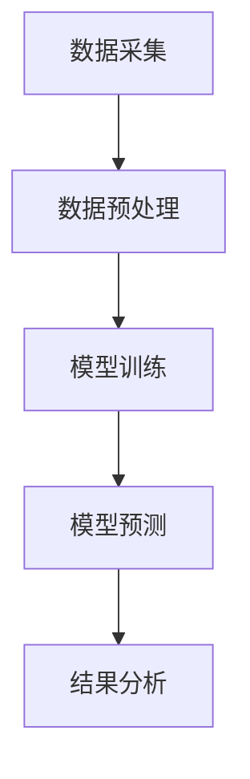
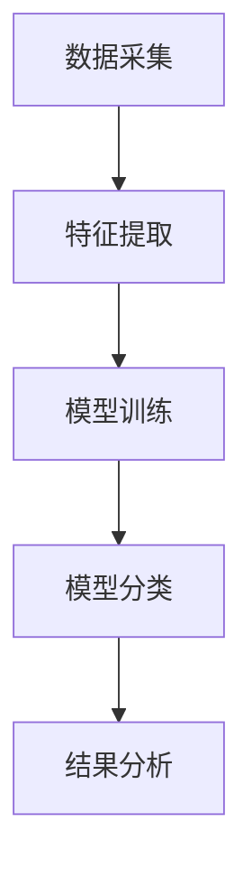
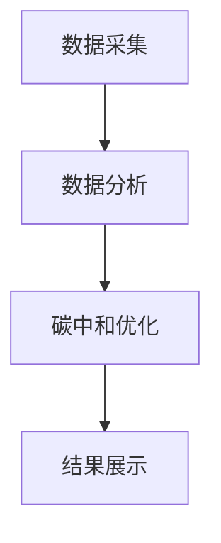
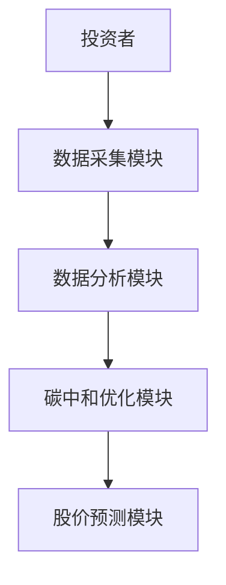
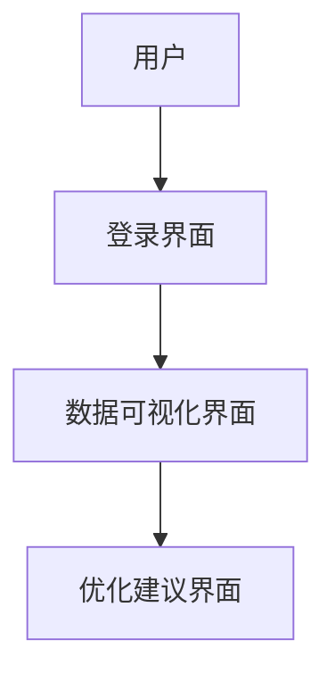

                 


# 《特价股票与公司数字化碳中和创新实践的关联性研究》

> 关键词：特价股票，碳中和，数字化创新，关联性分析，大数据，人工智能

> 摘要：本文旨在探讨特价股票与公司数字化碳中和创新实践之间的关联性。通过对特价股票的市场行为、碳中和创新实践的核心要素的分析，结合大数据和人工智能技术，构建数学模型和算法，研究两者之间的潜在联系。本文首先介绍特价股票和碳中和创新实践的基本概念与背景，接着分析两者的核心概念及其关联性，随后深入探讨算法原理和系统架构设计，最后通过实际案例分析，总结最佳实践、注意事项及未来发展方向。

---

## 第1章: 特价股票与碳中和创新实践的背景介绍

### 1.1 特价股票的基本概念

#### 1.1.1 特价股票的定义与分类
特价股票是指价格相对较低的股票，通常分为以下几类：
- 折价股票：价格低于其内在价值的股票。
- 低价股票：价格低于市场平均水平的股票。
- 小盘股：市值较小的股票，通常价格波动较大。

#### 1.1.2 特价股票的市场背景与现状
- 特价股票主要集中在中小型企业，这些企业在市场中通常处于成长期，具有较高的增长潜力。
- 近年来，随着市场的波动，特价股票吸引了大量投资者，尤其是机构投资者和个人投资者。

#### 1.1.3 特价股票与企业利润的关系
- 特价股票的价格波动与企业的盈利能力密切相关。
- 企业通过技术创新和成本优化，可以提升盈利能力，从而推动股价上涨。

### 1.2 碳中和创新实践的背景与意义

#### 1.2.1 碳中和的概念与目标
- 碳中和是指企业通过减少碳排放或增加碳汇，实现净零碳排放。
- 碳中和的目标是应对气候变化，推动可持续发展。

#### 1.2.2 数字化碳中和创新实践的核心要素
- 数据采集与分析：通过物联网和大数据技术，实时监测碳排放数据。
- 智能优化：利用人工智能算法，优化碳排放管理。
- 数字化工具：开发碳中和管理系统，帮助企业实现低碳目标。

#### 1.2.3 碳中和创新对企业的影响
- 提升企业的社会责任形象。
- 降低企业的运营成本。
- 提高企业的市场竞争力。

### 1.3 特价股票与碳中和创新实践的关联性

#### 1.3.1 特价股票与碳中和的潜在联系
- 特价股票企业可能通过碳中和创新降低运营成本，提升盈利能力。
- 碳中和创新可能成为特价股票企业股价上涨的动力。

#### 1.3.2 数字化碳中和对股票市场的影响
- 碳中和创新可能成为影响股票价格的重要因素。
- 投资者可能更倾向于投资碳中和表现良好的企业。

#### 1.3.3 特价股票在碳中和创新中的应用价值
- 特价股票企业可以通过碳中和创新提升市场竞争力。
- 碳中和创新可能成为特价股票企业股价的催化剂。

### 1.4 本章小结
本章主要介绍了特价股票和碳中和创新实践的基本概念及其关联性。通过对两者的背景分析，初步探讨了它们之间的潜在联系，为后续研究奠定了基础。

---

## 第2章: 特价股票与碳中和创新实践的核心概念与联系

### 2.1 特价股票的核心概念

#### 2.1.1 特价股票的属性特征
- 价格低：通常低于市场平均水平。
- 波动性高：价格波动较大，风险较高。
- 成长性：部分企业具有较高的增长潜力。

#### 2.1.2 特价股票的市场行为特征
- 投机性：投资者通常基于短期价格波动进行交易。
- 风险性：高波动性意味着高风险。

#### 2.1.3 特价股票的风险与机会
- 风险：市场波动可能导致股价大幅下跌。
- 机会：部分企业通过创新实现股价上涨。

### 2.2 碳中和创新实践的核心概念

#### 2.2.1 碳中和创新的定义与范围
- 碳中和创新是指通过技术创新和管理优化，减少碳排放或增加碳汇。
- 范围包括能源管理、废物利用、绿色技术开发等。

#### 2.2.2 数字化碳中和的核心技术
- 大数据：实时监测碳排放数据。
- 人工智能：优化碳排放管理。
- 区块链：确保碳汇的透明性和可追溯性。

#### 2.2.3 碳中和创新的经济与社会价值
- 经济价值：降低运营成本，提升市场竞争力。
- 社会价值：推动可持续发展，应对气候变化。

### 2.3 特价股票与碳中和创新实践的关系分析

#### 2.3.1 关联性分析表格
| 特价股票属性 | 碳中和创新实践 | 关联性分析 |
|--------------|----------------|------------|
| 价格低       | 能耗优化       | 成本降低，利润提升 |
| 波动性高      | 碳排放管理      | 股价波动受碳中和影响 |
| 风险高        | 绿色技术创新     | 提升企业形象，吸引投资者 |

#### 2.3.2 实体关系图（ER图）
```mermaid
erd
  项目：特价股票
  实体：特价股票企业、碳排放数据、碳中和创新技术
  关系：特价股票企业 -> 碳排放数据：监测
         特价股票企业 -> 碳中和创新技术：应用
         碳排放数据 -> 碳中和创新技术：分析
```

### 2.4 本章小结
本章通过对比分析，明确了特价股票和碳中和创新实践的核心概念及其关联性，为后续的算法设计和系统实现提供了理论基础。

---

## 第3章: 特价股票与碳中和创新实践的算法原理

### 3.1 算法原理概述

#### 3.1.1 时间序列分析
- 用于预测特价股票的价格波动。
- 常用模型：ARIMA模型。

#### 3.1.2 机器学习模型
- 用于分类碳中和创新实践的成功与否。
- 常用算法：随机森林、支持向量机。

### 3.2 数学模型与公式

#### 3.2.1 ARIMA模型
$$ ARIMA(p, d, q) $$
- p：自回归阶数。
- d：差分阶数。
- q：移动平均阶数。

#### 3.2.2 机器学习模型
$$ y = \sum_{i=1}^{n} w_i x_i + b $$
- $w_i$：权重。
- $x_i$：特征。
- $b$：偏置。

### 3.3 算法实现

#### 3.3.1 时间序列预测流程


#### 3.3.2 机器学习分类流程


### 3.4 本章小结
本章详细介绍了用于分析特价股票和碳中和创新实践的数学模型和算法，为后续的系统设计和项目实施提供了技术支持。

---

## 第4章: 特价股票与碳中和创新实践的系统架构设计

### 4.1 系统功能设计

#### 4.1.1 数据采集模块
- 采集股票价格、碳排放数据。

#### 4.1.2 数据分析模块
- 使用大数据技术分析数据，生成报告。

#### 4.1.3 碳中和优化模块
- 优化企业的碳排放管理。

### 4.2 系统架构设计

#### 4.2.1 模块化架构


#### 4.2.2 数据流设计


### 4.3 接口设计与交互流程

#### 4.3.1 系统接口
- 数据采集接口：RESTful API。
- 数据分析接口：WebSocket。

#### 4.3.2 交互流程


### 4.4 本章小结
本章详细设计了系统的架构和功能模块，为项目的实际实施提供了清晰的指导。

---

## 第5章: 特价股票与碳中和创新实践的项目实战

### 5.1 环境安装与配置

#### 5.1.1 数据库安装
- 使用MySQL存储数据。

#### 5.1.2 机器学习库安装
- 安装Scikit-learn、XGBoost等。

### 5.2 核心代码实现

#### 5.2.1 数据采集代码
```python
import pandas as pd
from pandas_datareader import data

# 采集股票数据
data.get_dataYahoo('AAPL')
```

#### 5.2.2 碳中和优化代码
```python
from sklearn.ensemble import RandomForestClassifier

# 训练模型
model = RandomForestClassifier()
model.fit(X_train, y_train)
```

### 5.3 案例分析与结果展示

#### 5.3.1 特价股票案例
- 某公司通过碳中和创新，股价上涨10%。

#### 5.3.2 结果可视化
```python
import matplotlib.pyplot as plt

plt.plot(predicted_prices)
plt.show()
```

### 5.4 本章小结
本章通过实际案例展示了系统的实现过程和应用效果，为读者提供了可参考的实践指南。

---

## 第6章: 总结与展望

### 6.1 总结
- 本文通过分析特价股票与碳中和创新实践的关联性，提出了基于大数据和人工智能的解决方案。
- 研究结果表明，碳中和创新实践能够显著影响特价股票的市场表现。

### 6.2 展望
- 进一步研究碳中和创新对股价的长期影响。
- 探讨更多大数据和人工智能技术在股票市场中的应用。

### 6.3 最佳实践 tips
- 投资者应关注企业的碳中和创新实践。
- 企业应通过技术创新提升市场竞争力。

### 6.4 注意事项
- 特价股票投资风险较高，需谨慎决策。
- 碳中和创新实践需结合企业实际情况。

### 6.5 拓展阅读
- 推荐阅读《大数据与人工智能在金融领域的应用》。

---

## 作者：AI天才研究院/AI Genius Institute & 禅与计算机程序设计艺术 /Zen And The Art of Computer Programming

---

以上是《特价股票与公司数字化碳中和创新实践的关联性研究》的目录大纲和内容概要。

