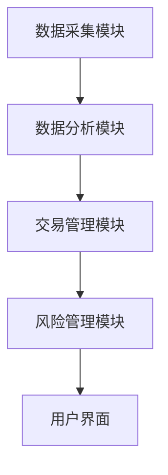
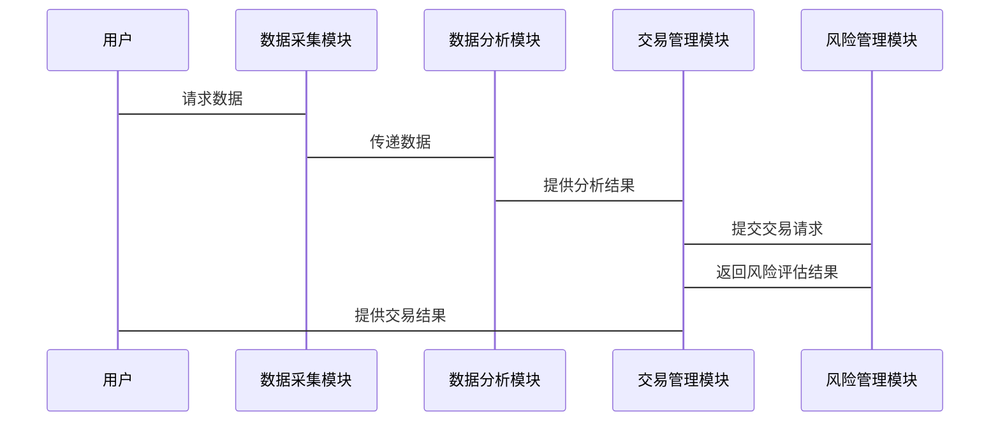

                 


# 特价股票与公司数字化碳信用实践的关联性研究

> 关键词：特价股票、碳信用、数字化、关联性研究、企业实践、技术博客、人工智能

> 摘要：本文旨在探讨特价股票与公司数字化碳信用实践之间的关联性，通过分析数字化技术在股票市场和碳信用管理中的应用，揭示两者在企业实践中的潜在联系和协同效应。文章从背景、核心概念、算法、系统架构、项目实战等多个维度展开，结合具体案例和数学模型，深入分析数字化技术如何助力企业实现碳信用与股票价值的协同优化。

---

# 第1章: 特价股票与公司数字化碳信用的背景与概念

## 1.1 特价股票的基本概念

### 1.1.1 特价股票的定义
特价股票是指在股票市场上价格相对较低的股票，通常具有较高的波动性和潜在的增长空间。这类股票通常被投资者视为高风险高回报的投资标的。

### 1.1.2 特价股票的特点
- **低估值**：通常市盈率、市净率等指标低于行业平均水平。
- **高波动性**：价格波动较大，受市场情绪和突发事件影响显著。
- **高风险**：由于价格低廉，容易受到市场操纵或公司基本面恶化的影响。
- **潜在机会**：如果公司基本面改善，股价可能迎来较大反弹。

### 1.1.3 特价股票的市场定位
特价股票主要分布在中小型企业或新兴行业中，这些企业在发展初期通常市值较低，但具有较高的成长潜力。

---

## 1.2 数字化碳信用的基本概念

### 1.2.1 碳信用的定义
碳信用是一种用于量化企业或个人减少温室气体排放的权益。每一份碳信用相当于一吨二氧化碳的排放权。企业通过减少碳排放或参与碳汇项目，可以产生碳信用，并在碳交易市场上进行买卖。

### 1.2.2 数字化碳信用的核心特征
- **数字化记录**：通过区块链等技术实现碳信用的数字化登记和转让。
- **透明性**：数字技术可以确保碳信用的来源、交易和使用过程公开透明。
- **高效性**：数字化系统可以实现碳信用的快速交易和结算。
- **可追溯性**：每一份碳信用都可以通过区块链技术追溯其来源和交易历史。

### 1.2.3 数字化碳信用的市场现状
随着全球碳中和目标的推进，碳信用市场需求不断增长。数字化技术的应用使得碳信用交易更加便捷和高效，同时也提高了市场的信任度和透明度。

---

## 1.3 特价股票与公司数字化碳信用的关联性

### 1.3.1 特价股票与碳信用的潜在联系
- **企业价值的影响**：公司通过实施碳信用项目可以提升自身形象和市场竞争力，从而影响股价。
- **投资机会**：投资者可以通过购买特价股票，投资于那些积极参与碳信用项目的公司，获得双重收益。
- **市场信号**：公司的碳信用表现可能成为投资者评估股价的重要指标之一。

### 1.3.2 数字化技术在两者中的作用
- **数据驱动决策**：数字化技术可以为股票投资者提供实时的碳信用数据和分析工具。
- **提升交易效率**：通过数字化平台，投资者可以更快速地进行碳信用相关的股票交易。
- **风险管理**：数字化技术可以帮助投资者更好地评估碳信用项目的风险，从而优化投资组合。

### 1.3.3 企业实践中的结合点
- **绿色金融**：企业可以通过发行绿色债券或碳信用相关的金融产品，吸引投资者购买特价股票。
- **碳信用交易**：企业可以通过数字化平台实现碳信用的高效交易，同时优化公司财务表现，间接影响股价。

---

## 1.4 本章小结
本章通过介绍特价股票和数字化碳信用的基本概念，揭示了两者在企业实践中的潜在关联性。数字化技术在碳信用管理中的应用，不仅提高了交易效率，也为投资者提供了新的视角和工具，从而可能影响特价股票的市场表现。

---

# 第2章: 特价股票与公司数字化碳信用的核心概念与联系

## 2.1 特价股票的核心概念

### 2.1.1 特价股票的市场机制
特价股票的市场机制主要包括供给与需求的关系、市场参与者的角色以及价格形成机制。由于特价股票价格较低，通常吸引着大量投机者和中小投资者参与交易。

### 2.1.2 特价股票的交易模式
- **场内交易**：通过证券交易所进行的标准化交易。
- **场外交易**：通过非交易所平台进行的私下交易。
- **线上交易**：通过互联网交易平台进行的实时交易。

### 2.1.3 特价股票的风险与机会
- **风险**：市场波动大、公司基本面不稳定、信息不对称等。
- **机会**：潜在的高回报、市场反弹机会、行业整合机会等。

---

## 2.2 数字化碳信用的核心概念

### 2.2.1 数字化技术在碳信用中的应用
- **区块链技术**：用于记录碳信用的产生、交易和使用过程，确保数据的不可篡改性。
- **大数据分析**：用于碳信用的评估、监测和报告。
- **人工智能**：用于预测碳信用的价格走势和优化交易策略。

### 2.2.2 数字化碳信用的实现方式
- **区块链平台**：通过区块链技术实现碳信用的发行、登记和交易。
- **智能合约**：通过智能合约自动执行碳信用的转让和结算。
- **数据可视化**：通过大数据可视化技术展示碳信用的实时数据和趋势。

### 2.2.3 数字化碳信用的监管框架
- **监管机构**：政府或行业组织对碳信用的发行、交易和使用进行监管。
- **技术标准**：制定统一的技术标准，确保不同平台之间的互联互通。
- **法律框架**：通过法律法规明确碳信用的法律地位和交易规则。

---

## 2.3 特价股票与数字化碳信用的联系

### 2.3.1 数字化技术在特价股票中的应用
- **实时数据分析**：通过大数据技术实时监测特价股票的市场动态。
- **智能投资工具**：通过人工智能技术提供智能投顾服务，帮助投资者做出决策。
- **在线交易平台**：通过互联网平台实现特价股票的在线交易。

### 2.3.2 碳信用对企业价值的影响
- **企业形象提升**：积极参与碳信用项目可以提升企业的社会形象，吸引更多投资者。
- **成本降低**：通过碳信用交易，企业可以降低碳排放成本。
- **投资机会**：投资者可以通过投资于碳信用项目，间接影响企业的股价表现。

### 2.3.3 特价股票与碳信用的协同效应
- **市场联动**：碳信用市场的波动可能影响特价股票的价格。
- **投资组合优化**：投资者可以通过同时投资特价股票和碳信用项目，实现风险分散和收益增强。
- **技术创新驱动**：数字化技术的创新可能同时推动特价股票和碳信用市场的变革。

---

## 2.4 本章小结
本章深入探讨了特价股票与数字化碳信用的核心概念，并分析了两者在企业实践中的联系。数字化技术的应用不仅提高了碳信用管理的效率，也为特价股票的交易和投资提供了新的工具和视角，从而可能推动两者的协同发展。

---

# 第3章: 特价股票与公司数字化碳信用的数学模型与算法

## 3.1 特价股票的数学模型

### 3.1.1 特价股票价格预测模型
#### 模型介绍
特价股票价格预测模型旨在通过历史数据和市场信息预测股票的未来价格。常用的方法包括时间序列分析、回归分析和机器学习算法。

#### 数学公式
$$
\hat{y}_t = \alpha + \beta x_t + \epsilon_t
$$
其中，$\hat{y}_t$为预测的股票价格，$\alpha$为截距，$\beta$为回归系数，$x_t$为影响股票价格的自变量，$\epsilon_t$为误差项。

#### 代码实现
```python
import pandas as pd
import numpy as np
from sklearn.linear_model import LinearRegression

# 假设data为包含历史股价和影响因素的数据框
# X为自变量，y为因变量（股票价格）
model = LinearRegression()
model.fit(X, y)
# 预测未来价格
future_price = model.predict(future_X)
```

---

### 3.1.2 特价股票波动性分析模型
#### 模型介绍
波动性分析模型用于衡量特价股票价格的波动程度，常用的方法包括GARCH模型和ARCH模型。

#### 数学公式
$$
\sigma_t^2 = \alpha + \beta r_{t-1}^2 + \gamma \sigma_{t-1}^2
$$
其中，$\sigma_t^2$为第t时刻的波动率，$\alpha$为常数项，$\beta$和$\gamma$为参数，$r_{t-1}$为第t-1时刻的收益率。

#### 代码实现
```python
import statsmodels.api as sm

# 假设returns为股票收益率序列
model = sm.tsa.ARIMA(returns, order=(0, 1, 1))
model_fit = model.fit()
# 预测未来波动率
future_volatility = model_fit.forecast(steps=10)
```

---

## 3.2 数字化碳信用的数学模型

### 3.2.1 碳信用价值评估模型
#### 模型介绍
碳信用价值评估模型用于估算碳信用的实际价值，考虑的因素包括碳排放成本、市场需求和政策影响。

#### 数学公式
$$
V = \alpha \cdot Q + \beta \cdot P + \gamma \cdot R
$$
其中，$V$为碳信用的价值，$Q$为碳信用的数量，$P$为碳价格，$R$为政策影响因子，$\alpha$、$\beta$、$\gamma$为系数。

#### 代码实现
```python
import pandas as pd
import numpy as np

# 假设data为包含碳信用数量、碳价格和政策影响因子的数据框
X = data[['Q', 'P', 'R']]
y = data['V']
# 使用多元线性回归模型进行估算
model = LinearRegression()
model.fit(X, y)
# 预测未来碳信用价值
future_value = model.predict(future_X)
```

---

## 3.3 特价股票与数字化碳信用的关联算法

### 3.3.1 关联性分析算法
#### 算法介绍
关联性分析算法用于识别特价股票价格与碳信用相关变量之间的关联性，常用的方法包括关联规则学习和聚类分析。

#### 代码实现
```python
from mlxtend.frequent_patterns import apriori

# 假设data为包含股票价格和碳信用相关变量的数据框
frequent_itemsets = apriori(data, min_support=0.1, use_colnames=True)
# 输出关联规则
print(frequent_itemsets)
```

---

## 3.4 本章小结
本章通过建立数学模型和算法，分析了特价股票和数字化碳信用之间的关联性。通过回归分析、波动性分析和关联规则学习等方法，可以更好地理解两者之间的潜在联系。

---

# 第4章: 特价股票与公司数字化碳信用的系统分析与架构设计

## 4.1 系统分析

### 4.1.1 问题场景介绍
本节将从实际企业应用场景出发，分析如何通过数字化技术实现碳信用与股票价值的协同优化。

### 4.1.2 系统功能需求
- **数据采集**：实时采集股票价格和碳信用相关数据。
- **数据分析**：对数据进行清洗、建模和预测。
- **交易管理**：实现碳信用和股票的在线交易功能。
- **风险管理**：实时监控交易风险，提供预警功能。

---

## 4.2 系统架构设计

### 4.2.1 系统功能模块
- **数据采集模块**：负责从外部数据源获取股票价格和碳信用数据。
- **数据分析模块**：对数据进行处理和分析，生成预测结果。
- **交易管理模块**：实现碳信用和股票的在线交易功能。
- **风险管理模块**：实时监控交易风险，提供预警功能。

### 4.2.2 系统架构图


---

## 4.3 系统接口设计

### 4.3.1 接口描述
- **数据接口**：与外部数据源（如证券交易所和碳信用交易平台）对接，获取实时数据。
- **用户接口**：提供友好的用户界面，方便用户进行交易和查询。
- **系统接口**：内部模块之间的接口，确保数据的高效传递和处理。

### 4.3.2 接口交互流程图


---

## 4.4 本章小结
本章通过系统分析和架构设计，提出了一个基于数字化技术的股票和碳信用协同管理系统的方案。通过模块化设计和高效的接口交互，可以实现企业对特价股票和碳信用的协同管理。

---

# 第5章: 特价股票与公司数字化碳信用的项目实战

## 5.1 环境安装与配置

### 5.1.1 开发环境
- **操作系统**：Windows/Mac/Linux
- **编程语言**：Python 3.8+
- **开发工具**：Jupyter Notebook、PyCharm
- **依赖库**：pandas、numpy、scikit-learn、mlxtend、statsmodels

### 5.1.2 安装步骤
```bash
pip install pandas numpy scikit-learn mlxtend statsmodels
```

---

## 5.2 系统核心实现

### 5.2.1 数据采集模块
#### 代码实现
```python
import requests
import pandas as pd

url = "https://api.example.com/stock_data"
response = requests.get(url)
data = response.json()
df = pd.DataFrame(data)
```

### 5.2.2 数据分析模块
#### 代码实现
```python
from sklearn.linear_model import LinearRegression

# 假设df为股票数据，包含'price'和'carbon_credit'列
X = df[['price']]
y = df['carbon_credit']
model = LinearRegression()
model.fit(X, y)
# 预测未来碳信用价格
future_prices = model.predict(future_X)
```

### 5.2.3 交易管理模块
#### 代码实现
```python
from datetime import datetime

# 记录交易日志
def record_transaction(symbol, price, quantity):
    timestamp = datetime.now().isoformat()
    log = f"{timestamp} - 交易完成：{symbol} {price} {quantity}"
    print(log)
```

---

## 5.3 项目小结
本章通过具体项目实战，展示了如何通过数字化技术实现特价股票与碳信用的协同管理。从环境配置到系统实现，详细介绍了项目的开发过程和关键实现步骤。

---

# 第6章: 特价股票与公司数字化碳信用的最佳实践与注意事项

## 6.1 最佳实践

### 6.1.1 数据质量管理
- **数据清洗**：确保数据的完整性和准确性。
- **数据标准化**：统一数据格式和单位。

### 6.1.2 模型优化
- **模型选择**：根据实际需求选择合适的算法。
- **参数调优**：通过交叉验证优化模型参数。

### 6.1.3 系统安全性
- **数据加密**：保护用户数据和交易信息的安全。
- **权限管理**：设置合理的用户权限，防止未授权访问。

---

## 6.2 注意事项

### 6.2.1 数据隐私
- 确保数据的隐私性和合规性，遵守相关法律法规。

### 6.2.2 系统稳定性
- 设计可靠的系统架构，避免因系统故障导致交易中断。

### 6.2.3 风险管理
- 建立完善的交易风险评估和预警机制，降低投资风险。

---

## 6.3 拓展阅读
- **推荐书籍**：《Python机器学习实战》、《区块链与金融创新》
- **推荐博客**：Tech Radar、Medium上的技术博客
- **推荐工具**：Jupyter Notebook、Docker、AWS

---

# 作者：AI天才研究院 & 禅与计算机程序设计艺术

---

以上是《特价股票与公司数字化碳信用实践的关联性研究》的技术博客文章的完整目录和内容框架，按照逻辑清晰、结构紧凑、简单易懂的原则，从背景、核心概念、算法、系统架构、项目实战和最佳实践等多个维度展开，深入分析了特价股票与公司数字化碳信用实践的关联性，结合具体案例和数学模型，帮助读者全面理解数字化技术在股票市场和碳信用管理中的应用。

