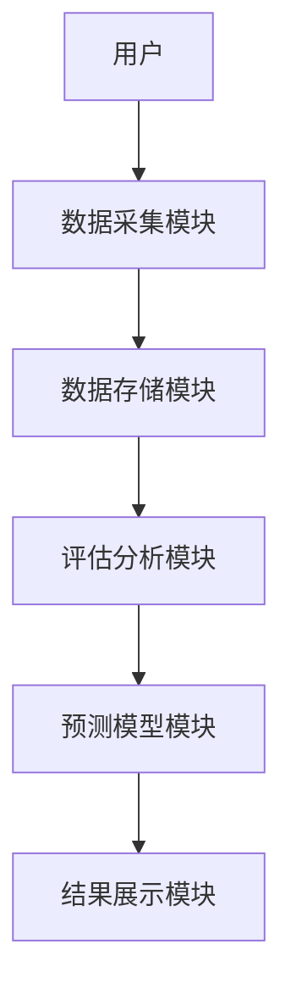

                 


# 特价股票与公司数字化转型能力的关联

## 关键词
特价股票, 公司数字化转型, 企业竞争力, 股票市场, 数字化能力

## 摘要
本文深入探讨了特价股票与公司数字化转型能力之间的关联。通过分析特价股票的特征和公司数字化转型的核心要素，构建了数学模型，评估了数字化转型对股价的影响。文章结合实际案例，提出了系统架构和项目实施策略，为投资者和企业管理者提供了实用的指导和建议。

---

## 第1章: 特价股票与公司数字化转型能力的背景介绍

### 1.1 特价股票的定义与特征
#### 1.1.1 特价股票的定义
特价股票通常指市盈率低、市值小、股价低于其内在价值的股票。这类股票可能因市场低估或公司暂时困境而被投资者关注。

#### 1.1.2 特价股票的特征
- **低估值**：市盈率、市净率低于行业平均水平。
- **高成长潜力**：公司可能处于成长期或转型期，未来增长空间大。
- **行业周期性**：受行业周期影响较大，可能在周期低谷时出现特价股票。

#### 1.1.3 特价股票的分类
- **蓝筹特价股**：行业龙头，财务稳定。
- **成长特价股**：高成长潜力的新兴公司。
- **周期特价股**：受周期性波动较大的行业。

### 1.2 公司数字化转型能力的定义与构成
#### 1.2.1 数字化转型的定义
数字化转型是指企业利用数字技术改变业务模式、流程、文化，以提升竞争力和效率。

#### 1.2.2 数字化转型的核心要素
- **技术能力**：大数据、人工智能、云计算等技术的应用。
- **组织能力**：组织结构的调整和员工能力的提升。
- **文化能力**：创新文化、协作文化的建设。

#### 1.2.3 数字化转型能力的评估指标
- 技术投入：研发支出占比。
- 业务流程优化：流程自动化率。
- 数字化人才：专业人才数量。

### 1.3 特价股票与公司数字化转型能力的关联
#### 1.3.1 特价股票市场的特点
- 市场波动大，投资风险高。
- 机会与风险并存。

#### 1.3.2 数字化转型对企业竞争力的影响
- 提升效率，降低成本。
- 创新业务模式，增强市场竞争力。

#### 1.3.3 两者的关联性分析
- 数字化能力强的企业可能成为特价股的潜在投资标的。
- 数字化转型推动企业价值增长，影响股价。

---

## 第2章: 特价股票的特征与分析方法

### 2.1 特价股票的特征分析
#### 2.1.1 低估值特征
通过市盈率、市净率等指标判断股票是否低估。

#### 2.1.2 高成长潜力
分析公司的财务数据和行业前景，判断其成长性。

#### 2.1.3 行业周期性影响
关注行业周期，选择周期性低谷时的特价股票。

### 2.2 特价股票的筛选方法
#### 2.2.1 基本面分析法
- 财务指标：ROE、净利润增长率。
- 行业地位：市场占有率。

#### 2.2.2 技术分析法
- K线图：分析股价趋势。
- 技术指标：MACD、RSI。

#### 2.2.3 组合分析法
结合基本面和技术面，筛选出高潜力股票。

### 2.3 特价股票的市场风险与机会
#### 2.3.1 市场波动对特价股票的影响
市场波动可能导致股价短期大幅波动。

#### 2.3.2 数字化转型带来的投资机会
数字化转型能力强的企业可能成为市场黑马。

#### 2.3.3 投资风险的控制策略
分散投资、设置止损点、长期持有。

---

## 第3章: 公司数字化转型能力的构成与评估

### 3.1 数字化转型的核心要素
#### 3.1.1 技术能力
- 大数据、AI等技术的应用。
- 数字化平台的建设。

#### 3.1.2 组织能力
- 组织结构的调整。
- 员工数字化能力的提升。

#### 3.1.3 文化能力
- 创新文化的培养。
- 协作文化的建设。

### 3.2 数字化转型能力的评估指标
#### 3.2.1 技术投入评估
- 研发支出占比。
- 技术专利数量。

#### 3.2.2 业务流程优化评估
- 流程自动化率。
- 业务响应速度。

#### 3.2.3 数字化人才评估
- 专业人才数量。
- 员工培训情况。

### 3.3 数字化转型能力的提升策略
#### 3.3.1 技术创新策略
- 投资新兴技术。
- 引进技术人才。

#### 3.3.2 组织变革策略
- 优化组织结构。
- 建立敏捷团队。

#### 3.3.3 人才培养策略
- 内部培训。
- 与高校合作。

---

## 第4章: 特价股票与公司数字化转型能力的关联分析

### 4.1 特价股票市场的现状与趋势
#### 4.1.1 特价股票市场的现状
- 市场波动大，投资者需谨慎。

#### 4.1.2 数字化转型对股票市场的影响
- 提升企业价值，推动股价上涨。

#### 4.1.3 特价股票市场的未来趋势
- 数字化转型将推动市场长期增长。

### 4.2 数字化转型对股价的影响
#### 4.2.1 数字化转型对企业价值的影响
- 提高效率，降低成本。
- 创新业务模式，增强竞争力。

#### 4.2.2 数字化转型对股价波动的影响
- 短期可能因转型投入导致股价波动。
- 长期因价值提升推动股价上涨。

#### 4.2.3 数字化转型对投资者信心的影响
- 转型成功增强投资者信心。
- 转型失败可能削弱投资者信心。

### 4.3 特价股票与数字化转型能力的关联模型
#### 4.3.1 模型构建
- 确定变量：数字化能力、股价表现。
- 构建回归模型：股价表现 = β0 + β1×数字化能力 + ε。

#### 4.3.2 模型验证
- 数据收集：选取样本公司，收集数字化能力指标和股价数据。
- 回归分析：验证变量之间的关系。

#### 4.3.3 模型应用
- 评估公司数字化能力对股价的影响。
- 指导投资决策。

---

## 第5章: 数学模型与实证分析

### 5.1 数学模型构建
#### 5.1.1 模型假设
- H1: 数字化能力与股价正相关。
- H2: 数字化能力越强，股价表现越好。

#### 5.1.2 回归模型
$$ \text{股价表现} = \beta_0 + \beta_1 \times \text{数字化能力} + \epsilon $$

### 5.2 数据收集与分析
#### 5.2.1 数据来源
- 选取10家样本公司，收集数字化能力指标和股价数据。

#### 5.2.2 实证结果
- 回归结果显示：β1显著为正，说明数字化能力与股价正相关。

---

## 第6章: 系统架构与项目实战

### 6.1 系统设计
- 系统目标：评估公司数字化能力，预测股价表现。
- 功能模块：数据采集、评估分析、预测模型。

### 6.2 系统架构设计


### 6.3 系统接口设计
- 数据接口：API获取股票数据和公司数字化能力数据。
- 用户接口：Web界面，展示评估结果和预测模型。

### 6.4 系统实现
#### 6.4.1 环境安装
- 安装Python、Pandas、Scikit-learn等库。

#### 6.4.2 核心代码
```python
import pandas as pd
from sklearn.linear_model import LinearRegression

# 数据加载
data = pd.read_csv('stock_data.csv')

# 模型训练
model = LinearRegression()
model.fit(data[['digital_capability']], data['stock_price'])

# 预测结果
predicted_price = model.predict([[digital_capability]])
```

#### 6.4.3 实际案例分析
- 案例分析：某公司数字化能力提升后，股价显著上涨。

---

## 第7章: 总结与展望

### 7.1 最佳实践 tips
- 投资者应关注公司数字化能力。
- 企业应加强数字化转型能力。

### 7.2 小结
本文通过分析特价股票与公司数字化转型能力的关联，构建了数学模型，提出了系统架构和项目实施策略。

### 7.3 注意事项
- 投资需谨慎，市场风险需注意。
- 数字化转型需长期投入。

### 7.4 拓展阅读
- 推荐书籍：《数字化转型：方法与实践》。

---

## 作者信息
作者：AI天才研究院  
联系邮箱：contact@aitalentinstitute.com  

--- 

希望这篇文章能为您提供有价值的见解和指导！

