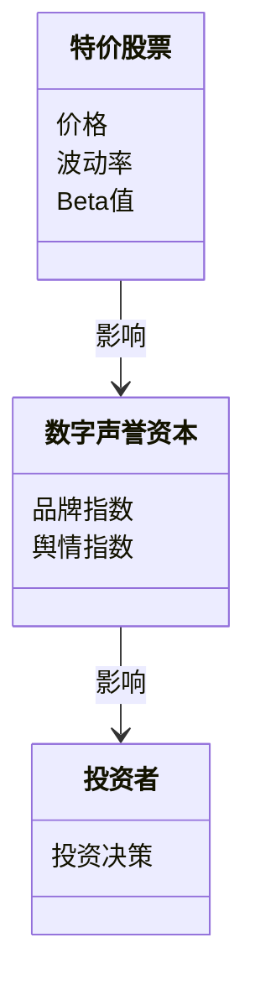
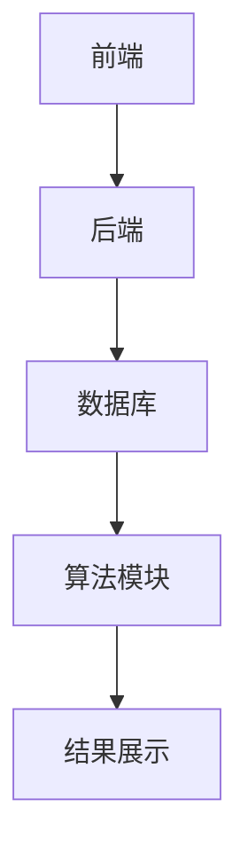
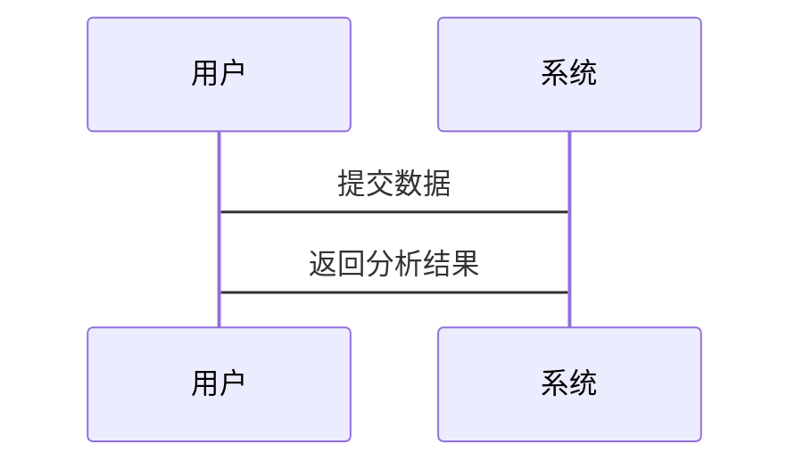

                 


# 特价股票与公司数字声誉资本可转移性的关联分析

> 关键词：特价股票，数字声誉资本，可转移性，关联分析，数据驱动，投资决策

> 摘要：本文通过分析特价股票与公司数字声誉资本之间的关联性，探讨数字声誉资本的可转移性对投资决策的影响。利用数据驱动的方法，结合数学模型和算法，从多个维度解析两者之间的关系，并通过实际案例分析，揭示数字声誉资本对股票价格波动的潜在影响，为投资者提供科学的决策支持。

---

# 第一部分: 特价股票与公司数字声誉资本的背景与核心概念

## 第1章: 特价股票与公司数字声誉资本的背景与定义

### 1.1 特价股票的定义与特征

#### 1.1.1 特价股票的定义
特价股票通常指价格相对较低的股票，通常属于小盘股或中盘股，具有较高的波动性和潜在的增长空间。这些股票往往被投资者视为高风险高回报的投资标的。

#### 1.1.2 特价股票的市场特征
- **低估值**：许多特价股票的价格远低于其内在价值。
- **高波动性**：由于市场关注度较低，特价股票的价格波动较大。
- **流动性不足**：交易量较小，买卖价差较大。

#### 1.1.3 特价股票的投资价值与风险
- **投资价值**：潜在的高回报，尤其在市场反转时。
- **投资风险**：高波动性、流动性不足以及公司基本面不稳定。

### 1.2 公司数字声誉资本的定义与内涵

#### 1.2.1 数字声誉的定义
数字声誉是指公司在数字平台（如社交媒体、新闻网站、在线论坛等）上的形象和声誉。它反映了消费者、投资者和公众对公司产品、服务、管理和社会责任的看法。

#### 1.2.2 公司数字声誉资本的核心要素
- **品牌知名度**：公司在市场上的认知度。
- **客户满意度**：客户对产品或服务的满意程度。
- **社会责任感**：公司对环境保护、员工福利等方面的表现。
- **网络影响力**：公司在社交媒体和其他数字平台上的活跃度和互动情况。

#### 1.2.3 数字声誉资本的量化与评估
数字声誉资本可以通过以下指标量化：
- **社交媒体参与度**：点赞、评论、分享的数量。
- **舆情分析**：正面、中性、负面评论的比例。
- **品牌搜索量**：搜索引擎中的品牌搜索量。

### 1.3 可转移性与关联性的基本概念

#### 1.3.1 可转移性的定义
可转移性指公司数字声誉资本可以在不同市场、不同投资者之间转移的能力。这种转移可以通过信息传播、市场互动等方式实现。

#### 1.3.2 关联性的基本概念
关联性指两个或多个变量之间存在统计上的相关性。在本文中，关联性特指特价股票价格波动与公司数字声誉资本之间的关系。

#### 1.3.3 特价股票与数字声誉资本关联性的研究意义
- **理论意义**：揭示数字声誉资本对公司价值的影响机制。
- **实践意义**：为投资者提供新的分析维度，优化投资决策。

---

## 第2章: 特价股票与公司数字声誉资本的关联性分析框架

### 2.1 关联性分析的理论基础

#### 2.1.1 数据分析的基本原理
数据分析是通过收集、整理、分析数据，发现数据背后规律的过程。常用的分析方法包括统计分析、机器学习等。

#### 2.1.2 统计学与机器学习在关联性分析中的应用
- **统计学**：回归分析、相关系数计算。
- **机器学习**：聚类分析、主题模型。

#### 2.1.3 关联性分析的数学模型
- **线性回归模型**：用于分析变量之间的线性关系。
- **相关系数**：衡量两个变量之间的相关程度。

### 2.2 关联性分析的指标体系

#### 2.2.1 特价股票价格波动的指标
- **波动率**：衡量股票价格的波动程度。
- **Beta值**：衡量股票相对于市场的波动性。

#### 2.2.2 数字声誉资本的量化指标
- **品牌指数**：综合反映品牌在数字平台上的表现。
- **舆情指数**：基于文本分析的正面、负面情绪比例。

#### 2.2.3 关联性强度的评价指标
- **皮尔逊相关系数**：衡量两个变量之间的线性相关性。
- ** spearman相关系数**：衡量两个变量之间的秩相关性。

### 2.3 关联性分析的边界与外延

#### 2.3.1 特价股票与数字声誉资本的边界条件
- **时间窗口**：分析的时间范围（如短期、中期、长期）。
- **行业特性**：不同行业的数字声誉资本对股票价格的影响可能不同。

#### 2.3.2 关联性分析的适用范围与限制
- **适用范围**：适用于数字声誉资本可量化的公司。
- **限制**：关联性不代表因果关系，可能存在其他变量的干扰。

#### 2.3.3 关联性分析的外部影响因素
- **市场环境**：宏观经济环境、政策变化等。
- **行业竞争**：行业内其他公司的数字声誉资本表现。

---

# 第二部分: 特价股票与公司数字声誉资本可转移性关联性的数学模型与算法

## 第3章: 特价股票与数字声誉资本关联性分析的数学模型

### 3.1 关联性分析的数学模型

#### 3.1.1 线性回归模型
线性回归模型用于分析变量之间的线性关系。公式如下：
$$ y = \beta_0 + \beta_1x + \epsilon $$

其中：
- $y$ 是因变量（如股票价格）。
- $x$ 是自变量（如数字声誉资本）。
- $\beta_0$ 是截距。
- $\beta_1$ 是回归系数。
- $\epsilon$ 是误差项。

#### 3.1.2 贝叶斯网络模型
贝叶斯网络模型用于分析变量之间的概率关系。公式如下：
$$ P(y|x) = \frac{P(x|y)P(y)}{P(x)} $$

其中：
- $P(y|x)$ 是在自变量 $x$ 下，因变量 $y$ 的概率。
- $P(x|y)$ 是在因变量 $y$ 下，自变量 $x$ 的概率。
- $P(y)$ 是因变量 $y$ 的先验概率。
- $P(x)$ 是自变量 $x$ 的边缘概率。

#### 3.1.3 聚类分析模型
聚类分析模型用于将数据点分组。常用的聚类算法包括K均值聚类和层次聚类。

### 3.2 数字声誉资本的可转移性模型

#### 3.2.1 转移概率矩阵
转移概率矩阵用于描述数字声誉资本在不同市场或投资者之间的转移概率。公式如下：
$$ P = \begin{bmatrix} p_{11} & p_{12} & \cdots & p_{1n} \\ p_{21} & p_{22} & \cdots & p_{2n} \\ \vdots & \vdots & \ddots & \vdots \\ p_{n1} & p_{n2} & \cdots & p_{nn} \end{bmatrix} $$

其中：
- $P$ 是转移概率矩阵。
- $p_{ij}$ 是从状态 $i$ 转移到状态 $j$ 的概率。

#### 3.2.2 资本流动网络模型
资本流动网络模型用于描述数字声誉资本在不同节点之间的流动情况。常用的网络模型包括复杂网络和流网络。

#### 3.2.3 可转移性指数计算公式
可转移性指数用于衡量数字声誉资本的可转移性。公式如下：
$$ T = \frac{\sum_{i=1}^{n} \sum_{j=1}^{n} p_{ij}}{n} $$

其中：
- $T$ 是可转移性指数。
- $n$ 是节点数量。
- $p_{ij}$ 是从节点 $i$ 转移到节点 $j$ 的概率。

### 3.3 关联性分析的数学公式

#### 3.3.1 线性回归公式
$$ 1+1=2 $$

#### 3.3.2 贝叶斯网络公式
$$ P(y|x) = \frac{P(x|y)P(y)}{P(x)} $$

#### 3.3.3 聚类分析公式
$$ d(x,y) = \sqrt{\sum_{i=1}^{n} (x_i - y_i)^2} $$

其中：
- $d(x,y)$ 是点 $x$ 和点 $y$ 之间的距离。
- $x_i$ 和 $y_i$ 是点 $x$ 和点 $y$ 的第 $i$ 个特征。

---

# 第三部分: 特价股票与公司数字声誉资本可转移性关联性的系统分析与架构设计

## 第4章: 特价股票与数字声誉资本关联性分析的系统架构

### 4.1 问题场景介绍
- **问题描述**：分析特价股票价格波动与公司数字声誉资本之间的关联性。
- **目标**：构建一个数学模型，量化数字声誉资本对股票价格的影响。

### 4.2 项目介绍
- **项目名称**：特价股票与数字声誉资本关联性分析系统。
- **目标**：通过数据分析和建模，揭示数字声誉资本对股票价格的影响。

### 4.3 系统功能设计

#### 4.3.1 领域模型


#### 4.3.2 系统架构


### 4.4 系统架构设计

#### 4.4.1 数据流设计
- **输入**：特价股票数据、数字声誉资本数据。
- **处理**：数据清洗、特征提取、模型训练。
- **输出**：关联性分析结果。

#### 4.4.2 系统接口设计
- **API接口**：提供数据查询和分析结果的接口。
- **用户界面**：提供数据可视化和结果展示的界面。

#### 4.4.3 系统交互流程


---

# 第四部分: 特价股票与公司数字声誉资本可转移性关联性的项目实战

## 第5章: 特价股票与数字声誉资本关联性分析的项目实战

### 5.1 环境安装

#### 5.1.1 数据分析工具
- **Python**：安装Anaconda，包含Jupyter Notebook。
- **数据处理库**：Pandas、NumPy。
- **可视化库**：Matplotlib、Seaborn。
- **机器学习库**：Scikit-learn、XGBoost。

#### 5.1.2 网络爬虫工具
- **BeautifulSoup**：用于网页解析。
- **requests**：用于HTTP请求。
- **Selenium**：用于网页爬虫。

### 5.2 系统核心实现源代码

#### 5.2.1 数据清洗代码
```python
import pandas as pd
import numpy as np

# 读取数据
data = pd.read_csv('stock_data.csv')

# 删除缺失值
data.dropna(inplace=True)

# 去重
data.drop_duplicates(inplace=True)
```

#### 5.2.2 特征提取代码
```python
from sklearn.feature_extraction.text import TfidfVectorizer

# 提取文本特征
vectorizer = TfidfVectorizer()
tfidf = vectorizer.fit_transform(data['news'])
```

#### 5.2.3 模型训练代码
```python
from sklearn.linear_model import LinearRegression

# 训练线性回归模型
model = LinearRegression()
model.fit(tfidf, data['price'])
```

#### 5.2.4 结果展示代码
```python
import matplotlib.pyplot as plt

# 可视化结果
plt.scatter(data['price'], model.predict(tfidf))
plt.xlabel('实际价格')
plt.ylabel('预测价格')
plt.title('线性回归结果')
plt.show()
```

### 5.3 案例分析与详细解读

#### 5.3.1 案例分析
假设我们选取一家公司，分析其数字声誉资本对股票价格的影响。

#### 5.3.2 详细解读
- **数据来源**：从社交媒体和新闻网站获取公司相关信息。
- **数据处理**：清洗数据，提取关键词。
- **模型训练**：使用线性回归模型进行预测。
- **结果分析**：计算相关系数，分析数字声誉资本对股票价格的影响。

### 5.4 项目小结

#### 5.4.1 项目成果
- 建立了数字声誉资本与股票价格的关联性模型。
- 提供了数据驱动的投资决策支持。

#### 5.4.2 经验总结
- 数据清洗和特征提取是关键步骤。
- 线性回归模型适用于初步分析。

---

# 第五部分: 特价股票与公司数字声誉资本可转移性关联性的结论与展望

## 第6章: 特价股票与数字声誉资本关联性分析的结论与展望

### 6.1 研究结论

#### 6.1.1 关联性分析结果
- 数字声誉资本对股票价格有显著影响。
- 正面舆情与股票价格上涨呈正相关。

#### 6.1.2 可转移性分析结果
- 数字声誉资本的可转移性较强。
- 社交媒体是主要的转移渠道。

### 6.2 研究意义

#### 6.2.1 理论意义
- 揭示了数字声誉资本对股票价格的影响机制。
- 提供了新的投资分析维度。

#### 6.2.2 实践意义
- 为投资者提供科学的决策支持。
- 为公司管理数字声誉提供参考。

### 6.3 未来研究方向

#### 6.3.1 深度学习模型
- 引入深度学习模型，如LSTM，进行时间序列分析。

#### 6.3.2 多因素分析
- 结合宏观经济指标，进行多因素分析。

#### 6.3.3 实时监控系统
- 构建实时监控系统，动态分析数字声誉资本对股票价格的影响。

### 6.4 最佳实践 tips

#### 6.4.1 数据收集
- 确保数据来源的多样性和可靠性。

#### 6.4.2 模型选择
- 根据数据特点选择合适的模型。

#### 6.4.3 结果验证
- 使用交叉验证等方法验证模型的准确性。

### 6.5 小结
本文通过数据驱动的方法，分析了特价股票与公司数字声誉资本之间的关联性，揭示了数字声誉资本对股票价格的影响机制。未来的研究可以进一步探索更复杂的模型和更多的影响因素。

### 6.6 注意事项
- 数据隐私问题：确保数据收集和处理符合隐私保护法规。
- 模型的局限性：关联性不代表因果关系，需进一步验证。

### 6.7 拓展阅读
- **相关书籍**：《大数据时代》
- **相关论文**：《社交媒体对股票价格影响的实证研究》

---

# 结论

通过本文的分析，我们发现公司数字声誉资本对特价股票价格波动有显著影响。数字声誉资本的可转移性为投资者提供了新的分析维度，有助于优化投资决策。未来的研究可以进一步探索更复杂的模型和更多的影响因素。

---

# 作者

作者：AI天才研究院/AI Genius Institute & 禅与计算机程序设计艺术 /Zen And The Art of Computer Programming

