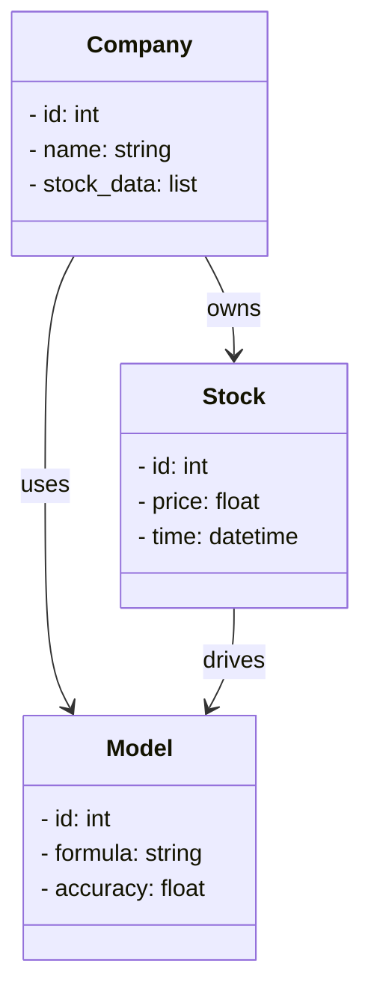
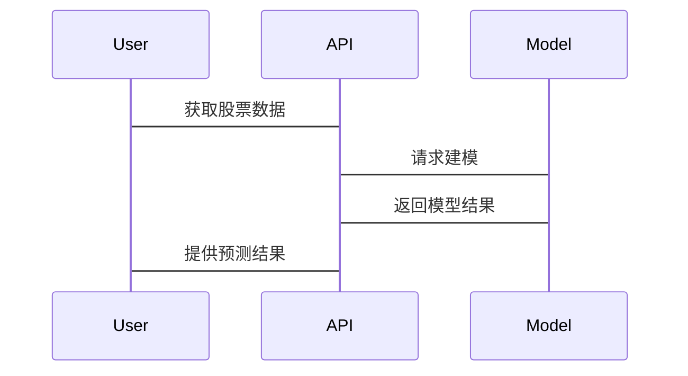

                 


# 特价股票与公司数字孪生技术应用水平的潜在关联研究

> 关键词：数字孪生，股票分析，人工智能，数据驱动，实时建模

> 摘要：本文探讨了数字孪生技术在特价股票分析中的应用，揭示了数字孪生技术与特价股票市场之间的潜在关联。通过分析数字孪生的实时建模能力，本文提出了一种基于时间序列分析和机器学习的股票价格预测方法，并展示了如何利用数字孪生技术优化股票分析流程。

---

# 目录大纲

## 第一部分: 特价股票与数字孪生技术的背景与关联

### 第1章: 特价股票与数字孪生技术概述

#### 1.1 特价股票的基本概念

##### 1.1.1 特价股票的定义与特点

- **定义**：特价股票通常指价格较低的股票，具有高增长潜力。
- **特点**：价格波动大，风险较高，适合长期投资者。

##### 1.1.2 特价股票的市场定位与投资价值

- 市场定位：低价股票市场，投资者通常寻找被低估的股票。
- 投资价值：可能的高增长潜力，但需谨慎评估。

##### 1.1.3 特价股票与公司数字孪生技术的初步关联

- 数字孪生技术在实时数据分析中的应用为股票分析提供了新思路。

#### 1.2 数字孪生技术的基本概念

##### 1.2.1 数字孪生技术的定义与特点

- **定义**：数字孪生是物理对象的虚拟模型，实时同步数据。
- **特点**：实时性、数据驱动、虚实融合。

##### 1.2.2 数字孪生技术的核心原理与实现方式

- 数据采集、建模、实时更新、虚实交互。

##### 1.2.3 数字孪生技术在企业中的应用现状

- 用于产品设计、生产优化等领域。

#### 1.3 特价股票与数字孪生技术的潜在关联

##### 1.3.1 特价股票市场与数字孪生技术的结合点

- 利用实时数据建模优化股票分析。

##### 1.3.2 数字孪生技术如何影响特价股票分析

- 提供实时数据模型，增强分析精度。

##### 1.3.3 特价股票与数字孪生技术的未来发展趋势

- 结合人工智能，提升预测准确性。

## 第二部分: 数字孪生技术的核心原理与属性特征

### 第2章: 数字孪生技术的核心原理与属性特征

#### 2.1 数字孪生技术的核心原理

##### 2.1.1 数字孪生的三元世界模型

- 虚拟世界、物理世界、人类世界的三重互动。

##### 2.1.2 数据驱动的实时建模机制

- 实时数据流驱动模型更新。

##### 2.1.3 虚实融合的双向交互特性

- 模型与现实的双向反馈。

#### 2.2 数字孪生技术的属性特征对比

##### 2.2.1 实时性对比分析

- 比较数字孪生与其他技术的实时性。

##### 2.2.2 数据准确性对比分析

- 数字孪生的数据准确性优势。

##### 2.2.3 系统复杂性对比分析

- 数字孪生系统的复杂性挑战。

#### 2.3 数字孪生技术的ER实体关系图

```mermaid
erDiagram
    company : 公司
    stock : 股票
    data_point : 数据点
    model : 模型
    interface : 接口

    company --> data_point : 提供数据
    data_point --> model : 驱动建模
    model --> interface : 生成可视化
    interface --> company : 提供反馈
```

## 第三部分: 特价股票分析的算法原理与数学模型

### 第3章: 特价股票分析的算法原理

#### 3.1 特价股票分析的核心算法

##### 3.1.1 基于机器学习的预测算法

- 使用LSTM网络进行时间序列预测。

##### 3.1.2 时间序列分析算法

- ARIMA模型的应用。

##### 3.1.3 聚类分析算法

- 识别相似股票模式。

#### 3.2 时间序列分析的数学模型

##### 3.2.1 ARIMA模型的数学公式

$$ ARIMA(p, d, q) = 0 $$

##### 3.2.2 LSTM网络的数学公式

$$ f(x) = \tanh(W_x x + W_h h + b) $$

#### 3.3 基于数字孪生的股票价格预测

##### 3.3.1 数据流驱动的建模流程

- 数据采集、建模、预测、反馈。

##### 3.3.2 数字孪生在时间序列预测中的优势

- 实时更新，模型准确性高。

### 第4章: 数学模型与算法实现

#### 4.1 时间序列分析模型

##### 4.1.1 ARIMA模型的实现

```python
from statsmodels.tsa.arima_model import ARIMA
model = ARIMA(data, order=(5,1,0))
model_fit = model.fit()
```

##### 4.1.2 LSTM网络的实现

```python
from keras.models import Sequential
from keras.layers import LSTM, Dense
model = Sequential()
model.add(LSTM(50, input_shape=(1, look_back)))
model.add(Dense(1))
model.compile(loss='mean_squared_error', optimizer='adam')
model.fit(train_x, train_y, epochs=100, verbose=2)
```

#### 4.2 数字孪生驱动的股票分析

##### 4.2.1 数据流驱动的实时建模

- 数据采集、处理、建模、预测。

##### 4.2.2 实时数据对模型的优化

- 模型根据最新数据自动调整。

## 第四部分: 系统分析与架构设计

### 第5章: 系统分析与架构设计

#### 5.1 系统功能设计

##### 5.1.1 领域模型设计



#### 5.2 系统架构设计

##### 5.2.1 分层架构设计


#### 5.3 系统接口设计

##### 5.3.1 API接口设计

- RESTful API：数据获取、模型训练、结果查询。

#### 5.4 系统交互设计

##### 5.4.1 交互流程图



## 第五部分: 项目实战与案例分析

### 第6章: 项目实战

#### 6.1 项目介绍

##### 6.1.1 项目背景

- 开发数字孪生驱动的特价股票分析系统。

#### 6.2 环境安装

##### 6.2.1 安装Python

```bash
python --version
pip install numpy pandas scikit-learn keras
```

#### 6.3 系统核心实现

##### 6.3.1 数据采集模块

```python
import pandas as pd
data = pd.read_csv('stock_data.csv')
```

##### 6.3.2 数据建模模块

```python
from statsmodels.tsa.arima_model import ARIMA
model = ARIMA(data, order=(5,1,0))
model_fit = model.fit()
```

##### 6.3.3 数据可视化模块

```python
import matplotlib.pyplot as plt
plt.plot(data)
plt.title('Stock Price Analysis')
plt.show()
```

#### 6.4 实际案例分析

##### 6.4.1 案例背景

- 分析某公司的特价股票，预测其价格走势。

##### 6.4.2 数据分析与解读

- 使用ARIMA模型预测未来价格。

##### 6.4.3 模型优化与结果分析

- 调整模型参数，提升预测精度。

## 第六部分: 最佳实践与总结

### 第7章: 最佳实践

#### 7.1 总结

- 数字孪生技术为股票分析提供了新的思路。

#### 7.2 注意事项

- 数据质量影响模型准确性，需谨慎处理数据。

#### 7.3 拓展阅读

- 推荐相关书籍和论文，深入理解数字孪生与股票分析。

---

作者：AI天才研究院/AI Genius Institute & 禅与计算机程序设计艺术 /Zen And The Art of Computer Programming

---

本文通过详细分析数字孪生技术在特价股票分析中的应用，展示了如何利用实时数据建模和机器学习算法优化股票预测。数字孪生技术的引入不仅提高了分析的准确性，还为投资者提供了更强大的决策支持工具。未来，随着技术的进一步发展，数字孪生在股票分析中的应用将更加广泛和深入。

