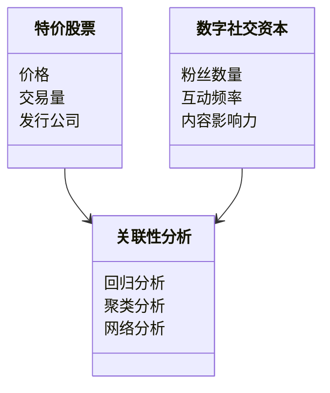
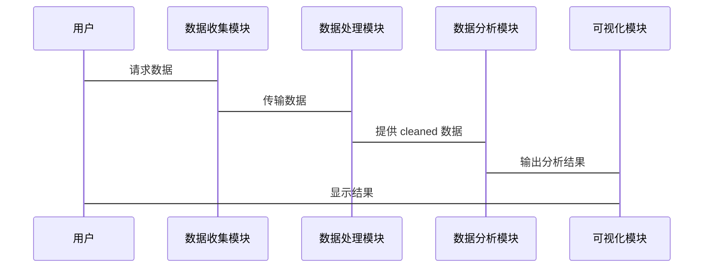

                 


```markdown
# 特价股票与公司数字社交资本积累的关联分析

> 关键词：特价股票，数字社交资本，关联分析，市场影响，社交网络

> 摘要：本文旨在探讨特价股票与公司数字社交资本之间的关联性，通过数据分析和案例研究，揭示数字社交资本如何影响特价股票的市场表现，以及特价股票市场如何反过来影响公司的数字社交资本积累。文章结合理论分析与实践案例，提出了一套系统的关联分析方法，并通过实际案例验证了分析模型的有效性。

---

# 第一部分: 特价股票与公司数字社交资本的背景与基础

## 第1章: 特价股票的定义与特点

### 1.1 特价股票的定义
#### 1.1.1 特价股票的定义与分类
特价股票是指低于面值发行的股票，通常分为优先股和普通股两种类型。优先股通常具有固定的股息率，而普通股则没有固定的股息率。特价股票的发行目的是为了吸引投资者，尤其是中小投资者，通过低价吸引更多的市场需求。

#### 1.1.2 特价股票的特点与优势
- **低门槛**：特价股票的面值较低，适合中小投资者参与。
- **高流动性**：由于价格低廉，特价股票通常具有较高的交易量和流动性。
- **市场敏感性**：特价股票的价格波动较大，受市场情绪影响显著。

#### 1.1.3 特价股票的发行机制与市场影响
特价股票的发行通常由公司通过配股、增发等方式进行。发行后，特价股票的市场表现会受到公司基本面、市场环境和投资者情绪的综合影响。

### 1.2 特价股票的核心要素
- **发行价格**：低于面值的价格是特价股票的核心特征。
- **投资者结构**：通常吸引中小投资者，形成多样化的投资者群体。
- **市场定位**：通过低价策略，扩大市场覆盖面，提升公司知名度。

## 第2章: 公司数字社交资本的定义与特点

### 2.1 数字社交资本的定义
#### 2.1.1 数字社交资本的核心概念
数字社交资本是指公司在数字社交平台（如微博、微信、LinkedIn等）上积累的社交资产，包括粉丝数量、互动频率、内容影响力等。

#### 2.1.2 数字社交资本的构成要素
- **粉丝数量**：关注公司的用户数量。
- **互动频率**：用户与公司内容的互动次数，如点赞、评论、转发等。
- **内容影响力**：公司发布的内容被传播和引用的次数。
- **品牌认知度**：公司在社交媒体上的品牌知名度。

#### 2.1.3 数字社交资本的衡量指标
- **粉丝增长速度**：衡量公司社交资本的积累速度。
- **互动率**：衡量用户对公司内容的关注程度。
- **内容传播率**：衡量公司内容的影响力。

### 2.2 公司数字社交资本的特点
#### 2.2.1 数字社交资本的虚拟性
数字社交资本依赖于数字平台存在，具有虚拟性，但其影响力却是实际存在的。

#### 2.2.2 数字社交资本的互动性
数字社交资本通过用户与公司之间的互动积累，互动频率越高，资本积累越快。

#### 2.2.3 数字社交资本的累积性
数字社交资本的积累是一个长期过程，需要持续的内容输出和用户互动。

---

# 第二部分: 特价股票与公司数字社交资本的关联性分析

## 第3章: 特价股票与公司数字社交资本的关联性概述

### 3.1 特价股票与公司数字社交资本的关联性背景
#### 3.1.1 特价股票市场的发展趋势
随着市场的竞争加剧，越来越多的公司选择通过发行特价股票来吸引投资者，尤其是在中小型企业中，特价股票成为一种重要的融资手段。

#### 3.1.2 数字社交资本在现代企业中的重要性
在数字化时代，企业通过社交媒体与用户建立联系，数字社交资本成为企业品牌价值的重要组成部分。

#### 3.1.3 两者关联性的研究意义
研究特价股票与数字社交资本的关联性，有助于企业更好地利用社交媒体提升品牌形象，同时也能为投资者提供新的投资分析维度。

### 3.2 特价股票与公司数字社交资本的关联性问题描述
#### 3.2.1 特价股票市场中的社交资本影响
数字社交资本如何影响特价股票的发行和交易？是否存在正相关关系？

#### 3.2.2 数字社交资本对股票价值的影响
高数字社交资本的公司是否能够获得更高的股票估值？

#### 3.2.3 两者关联性的研究目标与范围
本文旨在通过数据分析和案例研究，揭示特价股票与数字社交资本之间的关联性，为企业和社会提供理论支持和实践指导。

## 第4章: 特价股票与公司数字社交资本的关联性分析框架

### 4.1 关联性分析的核心概念
#### 4.1.1 特价股票的市场表现
- **价格波动**：特价股票的价格受市场情绪和公司新闻的影响较大。
- **交易量**：交易量是衡量股票活跃度的重要指标。

#### 4.1.2 数字社交资本的积累过程
- **内容发布**：公司定期发布新闻、产品信息等内容，吸引用户关注。
- **用户互动**：用户通过评论、点赞等方式与公司互动，提升社交资本。

#### 4.1.3 两者关联性的理论基础
- **信息传播理论**：数字社交资本通过信息传播影响股票市场。
- **社会网络理论**：社交网络的结构影响信息传播和股票价格。

### 4.2 关联性分析的模型构建
#### 4.2.1 数据收集与处理
- **数据来源**：社交媒体数据（粉丝数量、互动频率等）和股票市场数据（价格、交易量等）。
- **数据清洗**：去除无效数据，确保数据质量。

#### 4.2.2 数据分析与建模
- **回归分析**：建立数字社交资本与股票价格之间的回归模型。
- **网络分析**：通过社交网络分析技术，研究社交资本对股票价格的影响路径。

#### 4.2.3 模型验证与优化
- **验证方法**：通过历史数据验证模型的准确性。
- **优化策略**：根据验证结果调整模型参数，提升预测精度。

---

## 第5章: 特价股票与公司数字社交资本的关联性分析方法

### 5.1 数据分析方法
#### 5.1.1 回归分析法
- **方法介绍**：回归分析用于研究两个变量之间的关系强度和方向。
- **数学模型**：$$ y = \beta_0 + \beta_1x + \epsilon $$
  其中，y为股票价格，x为数字社交资本，$$ \beta_1 $$为回归系数。

#### 5.1.2 聚类分析法
- **方法介绍**：聚类分析用于将公司按数字社交资本和股票表现进行分类。
- **应用场景**：识别具有相似特征的公司群体。

#### 5.1.3 网络分析法
- **方法介绍**：网络分析用于研究社交网络的结构特征及其对股票价格的影响。
- **工具推荐**：使用Gephi等工具进行网络分析。

### 5.2 数据挖掘技术
#### 5.2.1 文本挖掘技术
- **方法介绍**：通过分析社交媒体上的文本内容，提取情感倾向和关键词。
- **应用场景**：评估公司新闻对股票价格的影响。

#### 5.2.2 社交网络分析技术
- **方法介绍**：通过分析社交网络的节点和边，研究社交资本对股票价格的影响。
- **工具推荐**：使用Python的NetworkX库进行社交网络分析。

#### 5.2.3 时间序列分析技术
- **方法介绍**：通过分析股票价格的时间序列数据，识别趋势和周期性。
- **数学模型**：$$ y_t = \alpha y_{t-1} + \beta x_t + \epsilon_t $$

---

## 第6章: 特价股票与公司数字社交资本的关联性分析案例

### 6.1 特价股票市场中的社交资本影响
#### 6.1.1 案例背景介绍
某公司通过发行特价股票吸引大量投资者，同时积极管理社交媒体，提升品牌知名度。

#### 6.1.2 数据收集与分析
- **数据来源**：社交媒体上的粉丝数量和互动频率，以及股票市场数据。
- **分析方法**：回归分析和网络分析。

#### 6.1.3 关联性分析结果与解读
结果显示，数字社交资本与股票价格呈正相关关系，社交资本的提升能够显著提升股票价格。

### 6.2 数字社交资本对股票价值的影响
#### 6.2.1 案例背景介绍
某公司通过持续发布高质量内容，迅速提升社交媒体上的影响力。

#### 6.2.2 数据收集与分析
- **数据来源**：社交媒体数据和股票市场数据。
- **分析方法**：聚类分析和文本挖掘。

#### 6.2.3 关联性分析结果与解读
结果显示，高数字社交资本的公司能够获得更高的股票估值，社交资本对股票价值有显著的正向影响。

---

# 第三部分: 系统分析与架构设计方案

## 第7章: 系统分析与架构设计方案

### 7.1 系统分析
#### 7.1.1 问题场景介绍
本文旨在构建一个分析系统，用于研究特价股票与公司数字社交资本之间的关联性。

#### 7.1.2 项目介绍
项目目标是通过数据分析和系统设计，揭示两者之间的关联性，并为企业提供实践指导。

### 7.2 系统功能设计
#### 7.2.1 领域模型


#### 7.2.2 系统架构设计


#### 7.2.3 系统接口设计
- **数据接口**：用于连接社交媒体和股票市场数据源。
- **用户接口**：提供直观的可视化界面，供用户查看分析结果。

#### 7.2.4 系统交互设计


---

## 第8章: 项目实战

### 8.1 环境安装
- **工具安装**：安装Python、Pandas、Scikit-learn、NetworkX等工具。
- **数据源获取**：通过API获取社交媒体数据和股票市场数据。

### 8.2 核心代码实现
```python
import pandas as pd
from sklearn.linear_model import LinearRegression

# 数据加载
data = pd.read_csv('stock_social.csv')

# 回归分析
model = LinearRegression()
model.fit(data[['粉丝数量', '互动频率']], data['股票价格'])
print('回归系数:', model.coef_)
print('决定系数:', model.score(data[['粉丝数量', '互动频率']], data['股票价格']))
```

### 8.3 代码应用解读
- **数据加载**：读取CSV文件中的数据。
- **回归分析**：建立数字社交资本与股票价格的回归模型。
- **结果解读**：回归系数表示数字社交资本对股票价格的影响程度，决定系数表示模型的拟合优度。

### 8.4 案例分析
通过具体案例分析，验证回归模型的有效性，并根据结果提出优化建议。

---

## 第9章: 结论与展望

### 9.1 研究结论
- 数字社交资本与股票价格呈正相关关系。
- 社交资本的提升能够显著提升股票估值。

### 9.2 未来研究方向
- 探索更多数据分析方法，如机器学习算法。
- 研究社交资本对股票长期表现的影响。

### 9.3 注意事项
- 数据收集要确保准确性和完整性。
- 分析结果要结合实际情况进行解读，避免过度推断。

### 9.4 最佳实践 tips
- 定期更新数据，保持模型的准确性。
- 结合多种分析方法，提高结果的可靠性。

---

## 作者：AI天才研究院/AI Genius Institute & 禅与计算机程序设计艺术 /Zen And The Art of Computer Programming
```

