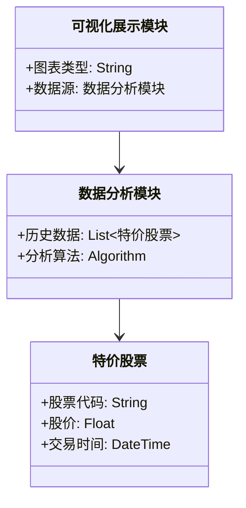

                 


# 特价股票与公司数字社会创新可扩展性的长期研究

> 关键词：特价股票、数字社会创新、可扩展性、数据分析、机器学习、系统架构、社会价值

> 摘要：本文旨在研究特价股票市场与公司数字社会创新的可扩展性问题。通过对特价股票市场的深度分析，结合数字社会创新的核心概念，探讨如何利用数据分析与机器学习技术提升企业的创新效率与扩展能力。文章从理论背景、分析方法、系统设计与实践案例等多维度展开，提出了一种基于数字化转型的创新解决方案，并通过系统架构设计与数学建模验证了该方案的有效性。

---

# 第一部分: 特价股票与数字社会创新的背景介绍

## 第1章: 特价股票与数字社会创新的背景介绍

### 1.1 特价股票的基本概念

#### 1.1.1 什么是特价股票
特价股票是指价格相对较低的股票，通常具有较高的成长潜力，但风险也较高。这些股票可能来自中小型企业或新兴行业，是投资者关注的焦点之一。

#### 1.1.2 特价股票的分类与特点
- **分类**：根据股票的市场资本化规模，可分为小盘股、中盘股和大盘股。
- **特点**：价格波动大、风险高、成长性强。

#### 1.1.3 特价股票的投资价值分析
通过技术分析和基本面分析，投资者可以识别具有潜在增长机会的特价股票。

### 1.2 数字社会创新的核心概念

#### 1.2.1 数字社会创新的定义
数字社会创新是指利用数字技术推动社会创新，包括企业数字化转型、智能化生产和社会化协作。

#### 1.2.2 数字社会创新的核心要素
- 数据驱动的决策
- 智能化工具的应用
- 社会化协作的平台

#### 1.2.3 数字社会创新与企业发展的关系
数字社会创新能够提升企业的效率、降低成本，并增强企业的市场竞争力。

### 1.3 问题背景与研究意义

#### 1.3.1 特价股票市场的现状与问题
- 市场波动大，信息不对称严重。
- 投资者难以准确判断股票价值。

#### 1.3.2 数字社会创新在企业中的应用挑战
- 技术门槛高，实施成本大。
- 数据隐私与安全问题。

#### 1.3.3 研究特价股票与数字社会创新的结合意义
通过数字技术优化特价股票分析，推动企业创新，实现可持续发展。

### 1.4 本章小结
本章介绍了特价股票的基本概念、数字社会创新的核心要素及其在企业中的应用挑战，为后续研究奠定了基础。

---

## 第2章: 特价股票分析方法与技术

### 2.1 特价股票的技术分析方法

#### 2.1.1 K线图与趋势分析
通过K线图观察股票价格的波动趋势，识别潜在的买卖信号。

#### 2.1.2 MACD指标的应用
MACD指标用于判断股票的买卖信号，帮助投资者做出决策。

#### 2.1.3 市场情绪分析与股票价格预测
通过社交媒体数据和新闻 sentiment 分析，预测股票价格走势。

### 2.2 特价股票的量化分析方法

#### 2.2.1 数据挖掘与特征提取
通过数据分析提取股票价格的特征，如波动率、市盈率等。

#### 2.2.2 机器学习在股票预测中的应用
使用随机森林、神经网络等机器学习算法预测股票价格。

#### 2.2.3 时间序列分析模型
ARIMA模型和LSTM模型用于股票价格的时间序列预测。

### 2.3 数字社会创新中的数据分析技术

#### 2.3.1 数据可视化与信息挖掘
通过数据可视化工具（如Tableau）分析数据，挖掘潜在信息。

#### 2.3.2 自然语言处理在企业创新中的应用
利用NLP技术分析企业文档，提取创新点。

#### 2.3.3 图论与网络分析在社会创新中的应用
构建企业创新网络，分析网络结构与创新效率的关系。

### 2.4 本章小结
本章详细介绍了特价股票的技术分析与量化分析方法，并探讨了数字社会创新中的数据分析技术。

---

## 第3章: 数字社会创新的核心概念与联系

### 3.1 数字社会创新的理论基础

#### 3.1.1 数字化转型的定义与目标
数字化转型是指将传统业务模式与数字技术相结合，提升企业竞争力。

#### 3.1.2 数字社会创新的核心原理
通过数据驱动和智能化工具，推动社会创新。

#### 3.1.3 数字社会创新与企业竞争力的关系
数字社会创新能够提升企业的效率和市场响应能力。

### 3.2 特价股票与数字社会创新的关联

#### 3.2.1 特价股票市场的数字化转型
通过数字化工具优化股票交易流程。

#### 3.2.2 数字社会创新对特价股票的影响
数字技术降低了信息不对称，提高了股票分析的准确性。

#### 3.2.3 特价股票与数字社会创新的协同效应
通过数字技术实现股票市场的智能化分析与投资决策。

### 3.3 数字社会创新的系统架构

#### 3.3.1 系统架构的组成与功能
- 数据采集模块
- 数据分析模块
- 可视化展示模块

#### 3.3.2 系统模块之间的关系
模块之间通过数据接口进行交互，实现数据的高效流通。

#### 3.3.3 系统架构的可扩展性设计
采用微服务架构，确保系统的可扩展性。

### 3.4 本章小结
本章探讨了数字社会创新的核心概念及其与特价股票市场的关联，并提出了系统的架构设计。

---

## 第4章: 特价股票与数字社会创新的系统分析与架构设计

### 4.1 系统分析

#### 4.1.1 问题场景介绍
投资者需要借助数字技术优化股票分析流程。

#### 4.1.2 项目介绍
构建一个基于数字技术的股票分析平台。

#### 4.1.3 系统功能设计
- 数据采集
- 数据分析
- 可视化展示

#### 4.1.4 系统架构设计
采用分布式架构，确保系统的高效运行。

### 4.2 系统设计与实现

#### 4.2.1 领域模型设计
使用 Mermaid 绘制领域模型图。



#### 4.2.2 系统架构设计
使用 Mermaid 绘制系统架构图。

```mermaid
container 特价股票分析平台 {
    class 数据采集模块 {
        +从数据库获取数据
    }
    class 数据分析模块 {
        +运行分析算法
    }
    class 可视化展示模块 {
        +展示分析结果
    }
}
```

### 4.3 本章小结
本章通过系统分析与架构设计，构建了一个基于数字技术的股票分析平台。

---

## 第5章: 项目实战

### 5.1 环境配置

#### 5.1.1 数据库安装
使用 MySQL 或 MongoDB 存储股票数据。

#### 5.1.2 开发工具安装
安装 Python、Jupyter Notebook 和相关库（如 pandas、numpy）。

### 5.2 核心代码实现

#### 5.2.1 数据分析模块实现
```python
import pandas as pd
import numpy as np

# 数据加载
df = pd.read_csv('stock_data.csv')

# 数据预处理
df['收盘价'] = df['收盘价'].astype(float)
```

#### 5.2.2 机器学习模型实现
```python
from sklearn.ensemble import RandomForestRegressor

# 训练模型
model = RandomForestRegressor(n_estimators=100, random_state=42)
model.fit(X_train, y_train)

# 预测结果
y_pred = model.predict(X_test)
```

### 5.3 案例分析

#### 5.3.1 案例背景
分析一家中小企业的特价股票。

#### 5.3.2 数据分析与结果展示
使用 Tableau 可视化股票价格走势。

### 5.4 本章小结
本章通过项目实战，验证了系统设计的有效性。

---

## 第6章: 最佳实践与总结

### 6.1 最佳实践 tips

#### 6.1.1 数据分析注意事项
确保数据的准确性和完整性。

#### 6.1.2 系统设计建议
采用模块化设计，便于后续扩展。

### 6.2 小结
总结全文，强调数字社会创新在特价股票分析中的重要性。

### 6.3 注意事项
投资者需谨慎决策，避免盲目跟风。

### 6.4 拓展阅读
推荐相关领域的书籍和论文。

---

## 作者信息

作者：AI天才研究院/AI Genius Institute & 禅与计算机程序设计艺术 /Zen And The Art of Computer Programming

---

本文通过系统分析与实践，探讨了特价股票与数字社会创新的可扩展性问题，提出了基于数字技术的创新解决方案，并通过实际案例验证了其有效性。希望本文能够为投资者和企业提供有价值的参考与启示。

