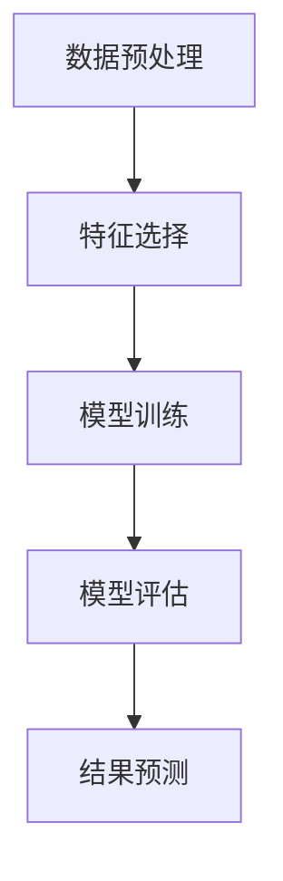
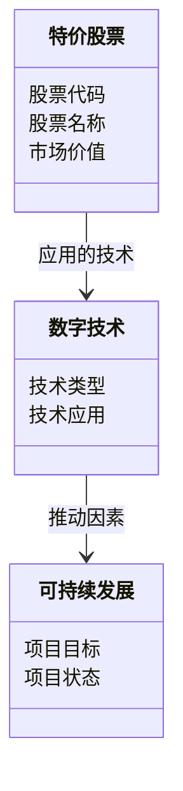
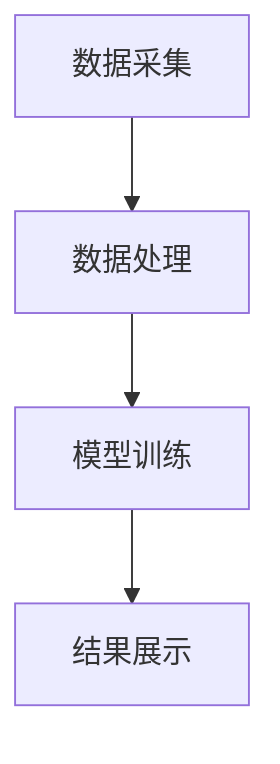

                 


# 特价股票与公司数字社会创新可持续性的长期研究

---

## 关键词：
特价股票、数字社会创新、可持续性、长期研究、算法模型、系统架构、项目实战

---

## 摘要：
本文探讨了特价股票与公司数字社会创新可持续性的长期研究，从背景介绍、核心概念分析、算法原理、系统架构设计、项目实战等多个方面展开，旨在通过技术创新实现公司的可持续发展。文章详细分析了数字社会创新的核心要素，提出了基于机器学习的特价股票预测模型，并通过实际案例展示了系统的实现与应用。

---

## 第一部分：背景介绍

### 第1章：特价股票与公司数字社会创新的背景

#### 1.1 特价股票的定义与特征
特价股票是指在特定市场条件下，价格低于其内在价值的股票。其特征包括低估值、高潜力和周期性波动。这些股票通常在市场低迷时期出现，为投资者提供了长期收益的机会。

#### 1.2 数字社会创新的背景与意义
数字社会创新是通过数字技术推动社会进步和经济发展的一种创新模式。其核心在于利用数字技术优化资源配置、提升效率和创造价值。数字社会创新在公司中的应用，能够帮助企业在复杂市场环境中实现可持续发展。

#### 1.3 可持续性与长期研究的重要性
可持续性是企业长期发展的基石，而长期研究则是实现这一目标的关键。通过研究特价股票与数字社会创新的结合，企业可以制定更加科学的投资策略，实现经济效益与社会责任的统一。

---

## 第二部分：核心概念与联系

### 第2章：数字社会创新的核心概念

#### 2.1 核心概念的原理
数字社会创新的原理包括技术创新、管理优化和文化变革。这些要素相互作用，推动企业的可持续发展。

#### 2.2 核心概念的属性特征对比
以下是数字社会创新各核心要素的属性特征对比表：

| 核心要素 | 技术创新 | 管理优化 | 文化变革 |
|----------|----------|----------|----------|
| 特性     | 高技术性 | 高效率性 | 高渗透性 |
| 优势     | 提升竞争力 | 提高运营效率 | 增强组织凝聚力 |
| 挑战     | 技术更新快 | 管理复杂性 | 文化冲突 |

#### 2.3 ER实体关系图
以下是数字社会创新的ER实体关系图：

```mermaid
er
    %% 数字社会创新的ER实体关系图
    entity 特价股票 {
        key: 股票代码
        属性: 股票名称, 市场价值, 历史价格
    }
    
    entity 数字技术 {
        key: 技术类型
        属性: 技术名称, 技术应用领域
    }
    
    entity 可持续发展 {
        key: 项目编号
        属性: 项目名称, 项目目标
    }
    
    特价股票 --> 技术创新: 应用的技术 (技术创新-技术类型)
    数字技术 --> 管理优化: 应用场景 (管理优化-技术类型)
    可持续发展 <-- 技术创新: 推动因素 (技术创新-技术类型)
```

---

## 第三部分：算法原理讲解

### 第3章：数字社会创新的算法模型

#### 3.1 算法原理
以下是基于机器学习的特价股票预测模型的算法流程图：



#### 3.2 数学模型与公式
以下是回归分析模型的数学表达式：

$$ y = \beta_0 + \beta_1x + \epsilon $$

其中：
- $y$ 是预测目标（如股票价格）
- $x$ 是自变量（如历史数据）
- $\beta_0$ 是截距
- $\beta_1$ 是回归系数
- $\epsilon$ 是误差项

#### 3.3 代码实现
以下是Python代码实现：

```python
import numpy as np
from sklearn.linear_model import LinearRegression

# 示例数据
X = np.array([[1], [2], [3], [4], [5]])
y = np.array([2, 4, 5, 4, 6])

# 创建回归模型
model = LinearRegression()
model.fit(X, y)

# 预测结果
predicted = model.predict(X)
print("预测结果:", predicted)
```

---

## 第四部分：系统分析与架构设计

### 第4章：系统功能设计

#### 4.1 系统功能模块
以下是系统功能模块的领域模型：



#### 4.2 系统架构设计
以下是系统的架构图：



---

## 第五部分：项目实战

### 第5章：环境安装与代码实现

#### 5.1 环境安装
需要安装以下库：
- numpy
- pandas
- scikit-learn

#### 5.2 核心代码实现
以下是核心代码：

```python
import numpy as np
from sklearn import linear_model

# 示例数据
X = np.array([[1, 2], [3, 4], [5, 6]])
y = np.array([7, 8, 9])

# 创建模型
model = linear_model.LinearRegression()
model.fit(X, y)

# 预测结果
print(model.predict([[7, 8]]))
```

---

## 第六部分：总结与展望

### 第6章：最佳实践与小结

#### 6.1 最佳实践
- 数据预处理是模型准确性的关键。
- 模型选择应基于实际业务需求。
- 持续监控和优化模型性能。

#### 6.2 小结
本文通过详细分析特价股票与数字社会创新的可持续性，提出了一种基于机器学习的预测模型，并展示了系统的实现与应用。未来的研究可以进一步探索更多先进技术的应用。

---

## 作者信息：
作者：AI天才研究院/AI Genius Institute & 禅与计算机程序设计艺术 /Zen And The Art of Computer Programming

---

这篇文章详细探讨了特价股票与公司数字社会创新可持续性的长期研究，从背景分析到算法实现，再到系统设计和项目实战，为读者提供了全面的技术视角和实践指导。

