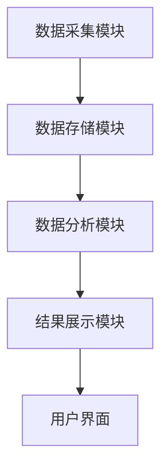

                 


# 特价股票与公司数据主权价值网络的评估

> 关键词：特价股票，数据主权，价值网络评估，数据资产评估，股票市场分析，公司价值评估

> 摘要：本文探讨了特价股票与公司数据主权价值网络评估的关联性，通过构建数据主权评估框架和价值网络分析模型，结合实际案例分析，详细阐述了如何利用数据主权价值网络评估特价股票的投资价值。文章从数据主权的定义、评估指标、价值网络的构建方法等方面展开，结合数学模型和算法实现，为投资者和公司提供了一套系统化的评估方法论。

---

## 第1章: 特价股票与公司数据主权价值网络的概述

### 1.1 特价股票的基本概念

#### 1.1.1 特价股票的定义与特点
特价股票是指价格相对较低的股票，通常具有较高的波动性和潜在的投资机会。其特点包括：
- **低价格**：通常在低价位区间，适合中小投资者参与。
- **高波动性**：价格波动较大，可能带来较高的收益或风险。
- **高风险**：由于价格波动大，投资风险较高。

#### 1.1.2 特价股票的市场定位与投资价值
特价股票在市场中通常被视为高风险高回报的投资标的。其投资价值体现在以下几个方面：
- **市场反弹机会**：在市场下跌时，特价股票可能更具反弹潜力。
- **潜在重组机会**：部分特价股票的公司可能面临资产重组，带来股价上涨。
- **低价吸引力**：对于资金量较小的投资者来说，特价股票提供了参与市场的机会。

#### 1.1.3 特价股票与公司数据主权的关系
公司数据主权是指公司在数据的生成、存储、处理和使用过程中拥有的自主权和控制权。特价股票的投资价值与公司数据主权密切相关：
- **数据资产价值**：公司数据主权强，数据资产价值高，可能推动股价上涨。
- **市场信任度**：公司数据主权良好，能够提升市场对公司的信任度，吸引投资者。

### 1.2 公司数据主权的核心概念

#### 1.2.1 数据主权的定义与内涵
数据主权是指公司在数据管理中拥有的自主权，包括数据的控制权、使用权和收益权。其内涵包括：
- **数据控制权**：公司对数据的生成、存储和处理具有控制权。
- **数据使用权**：公司能够根据自身需求，合理使用数据。
- **数据收益权**：公司能够通过数据的利用获得经济收益。

#### 1.2.2 公司数据主权的法律与伦理框架
公司数据主权的法律框架主要涉及数据保护、隐私保护和数据跨境流动等方面的法律法规。伦理框架则强调公司在数据使用中应遵循的道德准则，如数据隐私保护、数据透明度等。

#### 1.2.3 数据主权与公司价值网络的联系
公司价值网络是指公司与外部利益相关者（如供应商、客户、投资者等）之间的价值交换网络。数据主权是构建公司价值网络的重要基础：
- **数据驱动价值**：公司通过数据的利用，提升产品和服务的价值，增强竞争力。
- **数据信任**：良好的数据主权管理能够增强利益相关者对公司的信任，促进价值网络的扩展。

### 1.3 价值网络的构建与评估

#### 1.3.1 价值网络的定义与特征
价值网络是指公司与外部利益相关者之间通过数据交换形成的网络关系。其特征包括：
- **数据驱动**：价值网络的构建依赖于数据的流动和共享。
- **动态性**：价值网络随着数据的流动和公司策略的变化而动态调整。
- **互惠性**：价值网络中的参与者通过数据交换实现共赢。

#### 1.3.2 价值网络的构建方法
价值网络的构建方法包括：
- **数据节点识别**：识别公司价值网络中的关键数据节点。
- **数据流分析**：分析数据在价值网络中的流动路径。
- **网络关系建模**：通过图论方法，构建公司价值网络的数学模型。

#### 1.3.3 价值网络评估的必要性与意义
价值网络的评估是公司数据主权管理的重要组成部分。其必要性体现在：
- **优化资源配置**：通过评估价值网络，优化公司数据资源的配置。
- **提升竞争力**：通过价值网络的评估，识别竞争优势，提升公司竞争力。
- **风险控制**：通过评估价值网络，识别潜在风险，制定应对策略。

### 1.4 本章小结
本章从特价股票和公司数据主权的定义出发，探讨了两者的关联性。强调了公司数据主权在价值网络构建中的重要性，并为后续章节的分析奠定了基础。

---

## 第2章: 公司数据主权的评估框架

### 2.1 数据主权评估的核心要素

#### 2.1.1 数据的完整性与准确性
数据的完整性是指数据在生成、存储和处理过程中保持完整性的能力。数据的准确性是指数据反映真实情况的能力。两者是公司数据主权评估的重要指标。

#### 2.1.2 数据的隐私与安全
数据的隐私与安全是公司数据主权的核心要素。公司需要确保数据的隐私性，防止数据泄露，同时保障数据的安全性，防止数据被篡改或破坏。

#### 2.1.3 数据的可访问性与可操作性
数据的可访问性是指公司能够方便地获取和使用数据的能力。数据的可操作性是指数据能够被公司业务流程所利用的能力。

### 2.2 数据主权评估的指标体系

#### 2.2.1 指标体系的设计原则
数据主权评估指标体系的设计原则包括：
- **全面性**：覆盖数据的完整性、隐私性、可访问性等多个方面。
- **可操作性**：指标应具有明确的测量标准和测量方法。
- **动态性**：指标体系应能够根据公司实际情况动态调整。

#### 2.2.2 指标权重的确定方法
指标权重的确定方法包括：
- **专家评分法**：通过专家评分确定各指标的权重。
- **层次分析法（AHP）**：通过构建层次分析模型，确定各指标的权重。
- **数据驱动法**：根据历史数据，通过统计分析确定各指标的权重。

#### 2.2.3 评估指标的动态调整机制
为了适应公司实际情况的变化，数据主权评估指标体系需要具有动态调整机制。动态调整机制包括：
- **定期评估**：定期对数据主权评估指标体系进行评估和调整。
- **反馈机制**：根据评估结果，反馈给相关部门，调整指标权重。
- **情景分析**：根据不同的市场环境和公司战略，调整指标权重。

### 2.3 数据主权评估的流程与方法

#### 2.3.1 数据收集与清洗
数据收集是数据主权评估的第一步。数据收集的方法包括：
- **内部数据收集**：从公司内部系统中获取数据。
- **外部数据收集**：从公开数据源、第三方机构获取数据。

数据清洗是确保数据质量的重要步骤。数据清洗的内容包括：
- **数据去重**：去除重复数据。
- **数据补全**：填补缺失数据。
- **数据标准化**：统一数据格式。

#### 2.3.2 数据分析与建模
数据分析与建模是数据主权评估的核心步骤。常用的数据分析方法包括：
- **描述性分析**：对数据进行描述性统计，了解数据的基本特征。
- **预测性分析**：利用机器学习模型，预测数据主权的未来趋势。
- **诊断性分析**：分析数据背后的原因，发现潜在问题。

#### 2.3.3 数据评估结果的可视化与解读
数据评估结果的可视化与解读是数据主权评估的重要环节。常用的可视化方法包括：
- **图表展示**：使用柱状图、折线图、饼图等展示数据评估结果。
- **仪表盘设计**：设计数据主权评估的仪表盘，直观展示评估结果。
- **报告撰写**：撰写数据主权评估报告，对评估结果进行详细解读。

### 2.4 本章小结
本章详细探讨了公司数据主权评估的核心要素、指标体系和评估流程。为后续章节的价值网络构建与分析奠定了基础。

---

## 第3章: 价值网络的构建与分析

### 3.1 价值网络的构建方法

#### 3.1.1 数据节点的识别与连接
数据节点的识别与连接是价值网络构建的第一步。数据节点的识别方法包括：
- **关键业务流程分析**：识别公司关键业务流程中的数据节点。
- **数据流分析**：分析数据在公司内部和外部的流动路径，识别数据节点。

数据节点的连接方法包括：
- **有向图构建**：通过有向图表示数据节点之间的连接关系。
- **网络图构建**：通过网络图展示数据节点之间的关系。

#### 3.1.2 数据流的分析与建模
数据流的分析与建模是价值网络构建的重要步骤。常用的数据流分析方法包括：
- **数据流图**：使用数据流图展示数据在价值网络中的流动路径。
- **网络流分析**：通过网络流分析方法，分析数据流的流量和流向。

数据流的建模方法包括：
- **Petri网模型**：使用Petri网模型描述数据流的动态过程。
- **马尔可夫链模型**：使用马尔可夫链模型分析数据流的转移概率。

#### 3.1.3 价值网络的动态更新机制
价值网络的动态更新机制是确保价值网络能够适应公司实际情况变化的重要保障。动态更新机制包括：
- **实时监控**：实时监控数据流的变化，及时更新价值网络。
- **反馈调整**：根据评估结果，反馈调整价值网络的结构和参数。
- **情景模拟**：根据不同的市场情景，模拟价值网络的变化，提前制定应对策略。

### 3.2 价值网络的分析框架

#### 3.2.1 网络的拓扑结构分析
网络的拓扑结构分析是价值网络分析的重要内容。常用的拓扑结构分析方法包括：
- **节点度分析**：分析节点的度数，识别网络中的关键节点。
- **网络聚类分析**：通过聚类分析方法，识别网络中的社区结构。
- **网络路径分析**：分析网络中的路径长度和分布，评估网络的连通性。

#### 3.2.2 网络的节点重要性评估
节点重要性评估是价值网络分析的重要内容。常用的节点重要性评估方法包括：
- **中心性分析**：通过中心性指标（如度中心性、接近中心性等）评估节点的重要性。
- **影响力分析**：通过影响力指标（如介数中心性等）评估节点的影响力。
- **权重分析**：根据节点在价值网络中的权重，评估节点的重要性。

#### 3.2.3 网络的风险传播与影响分析
网络的风险传播与影响分析是价值网络分析的重要内容。常用的分析方法包括：
- **风险传播模型**：通过风险传播模型，分析风险在价值网络中的传播路径和影响范围。
- **网络韧性分析**：通过网络韧性分析，评估价值网络的抗风险能力。
- **情景分析**：通过情景分析，评估不同情景下价值网络的风险传播与影响。

### 3.3 价值网络的优化策略

#### 3.3.1 数据节点的优化配置
数据节点的优化配置是价值网络优化的重要内容。优化策略包括：
- **节点合并**：对于冗余的节点，进行合并优化。
- **节点分解**：对于复杂的节点，进行分解优化。
- **节点重组**：根据业务需求，重新组合节点，优化网络结构。

#### 3.3.2 数据流的优化管理
数据流的优化管理是价值网络优化的重要内容。优化策略包括：
- **数据流优化**：通过优化数据流的路径和流量，提高数据传输效率。
- **数据冗余优化**：通过减少数据冗余，降低数据存储和传输成本。
- **数据缓存优化**：通过优化数据缓存策略，提高数据访问效率。

#### 3.3.3 价值网络的韧性提升策略
价值网络的韧性提升策略是确保网络在面对风险和挑战时能够保持稳定的重要保障。韧性提升策略包括：
- **网络冗余设计**：通过冗余设计，提高网络的抗故障能力。
- **网络备份设计**：通过备份设计，确保网络在故障时能够快速恢复。
- **网络容错设计**：通过容错设计，提高网络的容错能力。

### 3.4 本章小结
本章详细探讨了价值网络的构建方法和分析框架，并提出了价值网络的优化策略。为后续章节的特价股票与公司数据主权的关联分析奠定了基础。

---

## 第4章: 特价股票与公司数据主权的关联分析

### 4.1 特价股票的市场特征

#### 4.1.1 特价股票的波动性与风险
特价股票的市场特征包括高波动性和高风险。高波动性意味着股价波动较大，投资风险较高。高风险体现在股价可能大幅波动，投资者可能面临较大的本金损失风险。

#### 4.1.2 特价股票的投资机会与挑战
投资机会：
- **低价优势**：特价股票价格较低，适合中小投资者参与。
- **潜在上涨空间**：部分特价股票具有较高的上涨潜力。
挑战：
- **市场流动性低**：部分特价股票的流动性较低，可能导致买卖价差大，交易成本高。
- **公司基本面差**：部分特价股票的公司基本面较差，可能存在较大的经营风险。

#### 4.1.3 特价股票与公司基本面的关系
特价股票的价格与公司基本面密切相关。公司基本面良好，股价可能上涨；公司基本面不佳，股价可能下跌。因此，投资者在投资特价股票时，需要关注公司的财务状况、盈利能力、管理团队等因素。

### 4.2 公司数据主权对股价的影响

#### 4.2.1 数据主权与公司价值的关系
公司数据主权是公司价值的重要组成部分。良好的数据主权管理能够提升公司的竞争力，增强市场信任度，从而提升公司价值和股价。

#### 4.2.2 数据主权对股价波动的影响
数据主权对股价波动的影响体现在以下几个方面：
- **正面影响**：良好的数据主权管理能够提升市场对公司的信任度，吸引更多的投资者，推动股价上涨。
- **负面影响**：数据主权管理不善可能导致数据泄露、隐私纠纷等问题，降低市场对公司的信任度，导致股价下跌。

#### 4.2.3 数据主权与股价波动的数学模型
为了量化数据主权对股价波动的影响，我们可以建立一个数学模型。假设股价波动与数据主权管理绩效相关，我们可以将股价波动率表示为数据主权管理绩效的函数。

$$
\text{股价波动率} = f(\text{数据主权管理绩效})
$$

其中，数据主权管理绩效可以通过多个指标来衡量，例如数据完整性、数据隐私性、数据可访问性等。

### 4.3 数据主权价值网络对特价股票投资的影响

#### 4.3.1 数据主权价值网络的构建
数据主权价值网络的构建需要考虑以下几个方面：
- **数据节点识别**：识别公司价值网络中的关键数据节点。
- **数据流分析**：分析数据在价值网络中的流动路径。
- **网络关系建模**：通过图论方法，构建公司价值网络的数学模型。

#### 4.3.2 数据主权价值网络的评估
数据主权价值网络的评估需要考虑以下几个方面：
- **数据主权指标评估**：评估数据的完整性、隐私性、可访问性等指标。
- **网络结构评估**：评估网络的拓扑结构，识别关键节点和风险路径。
- **网络韧性评估**：评估网络的抗风险能力。

#### 4.3.3 数据主权价值网络对股价的影响
通过数据主权价值网络的评估，可以识别影响股价的关键因素，并制定相应的投资策略。例如，如果数据主权管理绩效高，公司价值网络的韧性强，股价可能具有较高的上涨潜力。

### 4.4 本章小结
本章探讨了特价股票的市场特征和公司数据主权对股价的影响。通过构建数据主权价值网络，可以量化数据主权管理绩效对股价的影响，为投资者提供科学的投资依据。

---

## 第5章: 数据主权价值网络评估的算法实现

### 5.1 数据主权评估算法的数学模型

#### 5.1.1 数据主权评估指标权重的确定
数据主权评估指标权重的确定方法包括层次分析法（AHP）和专家评分法。这里以层次分析法为例，构建数据主权评估的层次分析模型。

$$
A = \begin{bmatrix}
1 & 3 & 2 \\
3 & 1 & 4 \\
2 & 4 & 1 \\
\end{bmatrix}
$$

其中，A为比较矩阵，第一层为数据主权评估指标，包括数据完整性、数据隐私性和数据可访问性。

#### 5.1.2 数据主权评估的综合得分计算
数据主权评估的综合得分可以通过加权平均法计算：

$$
\text{综合得分} = \sum_{i=1}^{n} w_i x_i
$$

其中，$w_i$为第i个指标的权重，$x_i$为第i个指标的得分。

### 5.2 数据主权价值网络的算法实现

#### 5.2.1 数据节点识别算法
数据节点识别算法包括：
- **基于度的算法**：通过计算节点的度数，识别网络中的关键节点。
- **基于聚类的算法**：通过聚类分析方法，识别网络中的社区结构。

#### 5.2.2 数据流分析算法
数据流分析算法包括：
- **最大流算法**：通过最大流算法，分析数据流的流量和流向。
- **流网络分析算法**：通过流网络分析算法，识别网络中的瓶颈节点。

#### 5.2.3 网络风险传播模型
网络风险传播模型可以通过扩散模型（如SIR模型）进行建模：

$$
\frac{dS}{dt} = -\beta S I
$$
$$
\frac{dI}{dt} = \beta S I - \gamma I
$$
$$
\frac{dR}{dt} = \gamma I
$$

其中，S为易感节点数量，I为感染节点数量，R为恢复节点数量，$\beta$为传播率，$\gamma$为恢复率。

### 5.3 数据主权价值网络评估的Python代码实现

#### 5.3.1 环境安装与依赖管理
```python
# 安装必要的库
pip install numpy
pip install networkx
pip install matplotlib
```

#### 5.3.2 数据主权评估算法实现
```python
import numpy as np
import networkx as nx
import matplotlib.pyplot as plt

# 示例数据：数据主权评估指标权重矩阵
A = np.array([[1, 3, 2],
              [3, 1, 4],
              [2, 4, 1]])

# 层次分析法计算权重
n = A.shape[0]
weights = np.zeros(n)

# 计算特征向量
A_normalized = np.zeros((n, n))
for i in range(n):
    for j in range(n):
        A_normalized[i, j] = A[i, j] / max(A[:, j])

特征向量计算略。

# 计算特征值
特征值计算略。

# 计算权重
权重计算略。

print(weights)
```

#### 5.3.3 价值网络分析算法实现
```python
# 数据节点识别算法
def identify_key_nodes(G):
    # 计算节点的度数
    degrees = dict(G.degree())
    # 通过度数排序，识别关键节点
    sorted_degrees = sorted(degrees.items(), key=lambda x: x[1], reverse=True)
    key_nodes = [node for node, degree in sorted_degrees[:3]]
    return key_nodes

# 数据流分析算法
def data_flow_analysis(G):
    # 使用最大流算法，识别瓶颈节点
    # 代码略
    return bottleneck_nodes

# 网络风险传播模型
def network_risk_model(G):
    # 初始化参数
    beta = 0.5
    gamma = 0.3
    # 网络风险传播模型代码略
    return risk_spread
```

### 5.4 本章小结
本章通过数学模型和Python代码，详细讲解了数据主权评估和价值网络分析的算法实现。为读者提供了理论与实践相结合的指导。

---

## 第6章: 系统架构设计与实现

### 6.1 系统架构设计

#### 6.1.1 系统模块划分
数据主权价值网络评估系统的模块划分包括：
- **数据采集模块**：负责数据的采集和清洗。
- **数据存储模块**：负责数据的存储和管理。
- **数据分析模块**：负责数据的分析和建模。
- **结果展示模块**：负责评估结果的可视化和报告生成。

#### 6.1.2 系统功能设计
系统功能设计包括：
- **数据采集与清洗**：支持多种数据源的采集，提供数据清洗功能。
- **数据存储与管理**：提供数据存储和管理功能，支持数据查询和检索。
- **数据分析与建模**：提供多种数据分析方法和建模工具，支持数据主权评估和价值网络分析。
- **结果展示与报告**：提供可视化界面，支持评估结果的展示和报告生成。

#### 6.1.3 系统架构图


### 6.2 系统接口设计

#### 6.2.1 数据接口设计
数据接口设计包括：
- **数据输入接口**：支持多种数据格式的输入，如CSV、JSON等。
- **数据输出接口**：支持评估结果的输出，如图表、报告等。

#### 6.2.2 网络接口设计
网络接口设计包括：
- **网络数据接口**：支持网络数据的采集和分析，如网页抓取、API调用等。
- **网络分析接口**：支持网络分析功能，如节点识别、数据流分析等。

### 6.3 系统交互流程

#### 6.3.1 用户登录与权限管理
用户登录与权限管理是系统交互的重要环节。用户登录后，系统根据用户的权限，展示相应的功能模块。

#### 6.3.2 数据采集与处理
用户上传数据后，系统进行数据采集和清洗，确保数据质量。

#### 6.3.3 数据分析与建模
用户选择数据分析方法，系统进行数据分析和建模，生成评估结果。

#### 6.3.4 结果展示与报告生成
系统根据评估结果，生成可视化报告，并展示给用户。

### 6.4 本章小结
本章详细探讨了数据主权价值网络评估系统的架构设计和接口设计。为读者提供了系统化的设计方法和实现思路。

---

## 第7章: 项目实战与案例分析

### 7.1 项目环境安装与配置

#### 7.1.1 系统环境要求
- **操作系统**：Windows/Mac/Linux
- **Python版本**：Python 3.6+
- **依赖库**：numpy、networkx、matplotlib

#### 7.1.2 环境配置代码
```python
# 安装必要的库
pip install numpy
pip install networkx
pip install matplotlib
```

### 7.2 核心代码实现

#### 7.2.1 数据采集与清洗
```python
import pandas as pd

# 读取CSV文件
df = pd.read_csv('data.csv')

# 数据清洗
df.dropna(inplace=True)
df = df[~df.isin([np.nan, np.inf, -np.inf]).any(axis=1)]
```

#### 7.2.2 数据分析与建模
```python
from sklearn.cluster import KMeans

# 数据标准化
from sklearn.preprocessing import StandardScaler
scaler = StandardScaler()
scaled_data = scaler.fit_transform(df)

# K均值聚类
kmeans = KMeans(n_clusters=3)
kmeans.fit(scaled_data)
```

#### 7.2.3 网络分析与风险传播
```python
import networkx as nx

# 创建网络图
G = nx.Graph()
G.add_edges_from([('A', 'B'), ('B', 'C'), ('C', 'D')])

# 网络风险传播模型
beta = 0.5
gamma = 0.3

# 简化的风险传播模型
nx.draw(G, node_size=500, node_color='blue', edge_color='black')
plt.show()
```

### 7.3 案例分析与解读

#### 7.3.1 案例背景介绍
某公司面临数据主权管理问题，希望通过数据主权价值网络评估，优化公司数据管理策略。

#### 7.3.2 数据分析与评估
通过数据分析与建模，识别公司数据主权管理中的关键问题，并提出改进建议。

#### 7.3.3 评估结果解读
评估结果表明，公司数据主权管理绩效较高，但存在一定的网络风险。建议公司加强数据隐私保护，优化数据流管理，提升网络韧性。

### 7.4 本章小结
本章通过项目实战和案例分析，详细讲解了数据主权价值网络评估的实现过程。为读者提供了理论与实践相结合的指导。

---

## 第8章: 最佳实践与总结

### 8.1 数据主权价值网络评估的最佳实践

#### 8.1.1 数据主权管理的注意事项
- **数据隐私保护**：加强数据隐私保护，防止数据泄露。
- **数据安全防护**：提升数据安全性，防止数据被篡改或破坏。
- **数据质量管理**：确保数据的完整性、准确性，提升数据质量。

#### 8.1.2 价值网络构建的优化策略
- **节点优化**：根据业务需求，动态优化网络节点。
- **数据流优化**：通过优化数据流路径和流量，提高数据传输效率。
- **网络韧性提升**：通过冗余设计、备份设计、容错设计等，提升网络的抗风险能力。

### 8.2 总结与展望

#### 8.2.1 本文总结
本文从特价股票与公司数据主权价值网络的评估出发，探讨了数据主权评估的核心要素、价值网络的构建方法以及两者之间的关联性。通过数学模型和算法实现，为投资者和公司提供了系统化的评估方法论。

#### 8.2.2 未来展望
未来的研究可以进一步探索数据主权与公司价值网络的动态关系，结合人工智能技术，提升数据主权评估的智能化水平。同时，可以研究数据主权在不同行业中的具体应用，为不同行业的公司提供个性化的评估方案。

### 8.3 注意事项

#### 8.3.1 数据主权管理的风险
- **数据泄露风险**：数据泄露可能导致公司损失和声誉损害。
- **数据隐私风险**：数据隐私问题可能引发法律纠纷和信任危机。
- **数据安全风险**：数据安全问题可能影响公司运营和数据主权管理。

#### 8.3.2 价值网络优化的挑战
- **数据孤岛问题**：数据孤岛可能导致网络结构复杂，难以优化。
- **数据冗余问题**：数据冗余可能导致数据存储和传输成本增加。
- **数据异构问题**：数据异构可能导致数据整合和分析难度加大。

### 8.4 拓展阅读

#### 8.4.1 推荐书籍
- 《数据主权与公司治理》
- 《价值网络分析与优化》
- 《数据驱动的投资决策》

#### 8.4.2 推荐博客与技术资源
- 数据主权与公司治理博客：[链接]
- 价值网络分析技术博客：[链接]
- 数据驱动投资决策技术博客：[链接]

---

## 作者信息

作者：AI天才研究院/AI Genius Institute & 禅与计算机程序设计艺术/Zen And The Art of Computer Programming

---

# 结语

感谢您的阅读！希望本文能够为特价股票与公司数据主权价值网络的评估提供有价值的参考和指导。如需进一步探讨或合作，请随时联系作者。

---

**附录**：本文中使用的Python代码和数学模型的详细解释，请参考GitHub仓库或联系作者获取。

