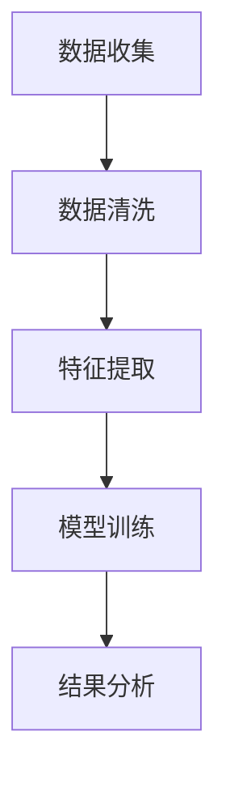
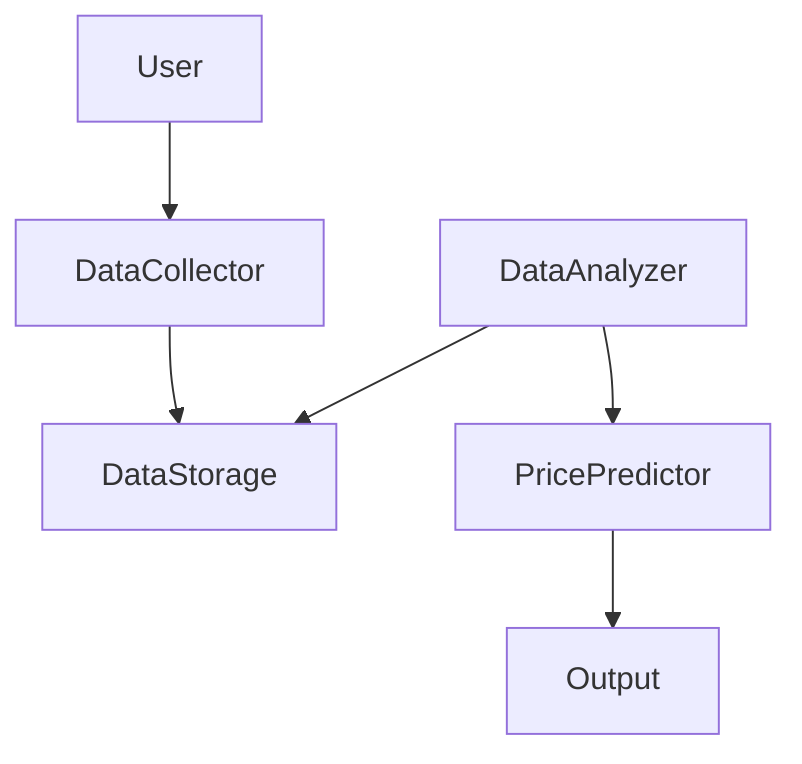
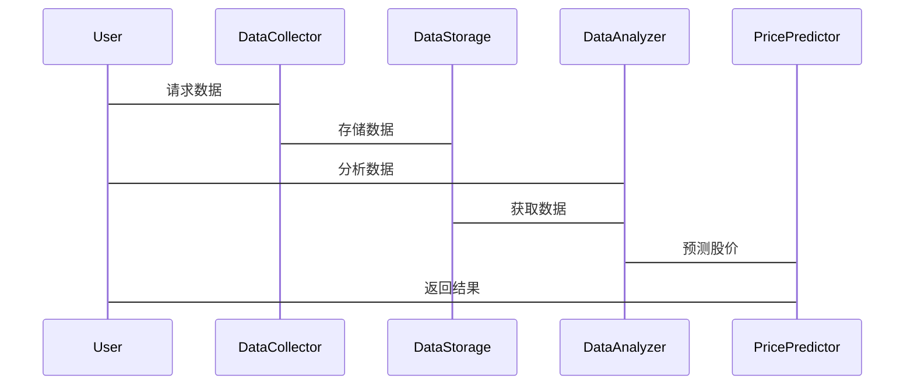

                 


# 《特价股票与公司数据变现能力的关系探讨》

## 关键词：特价股票，数据变现能力，公司数据资产，股票价格波动，数据驱动决策

## 摘要：  
本文探讨了特价股票与公司数据变现能力之间的关系，分析了数据变现能力如何影响公司股价。文章通过背景介绍、核心概念分析、数学模型构建、案例研究和系统设计，详细阐述了数据变现能力对特价股票的影响，提供了实证分析和最佳实践建议。

---

# 第1章: 特价股票与数据变现能力的背景介绍

## 1.1 特价股票的定义与特征
### 1.1.1 特价股票的定义  
特价股票是指公司股价低于其面值的股票，通常反映公司处于困境或重组阶段。  

### 1.1.2 特价股票的分类与特点  
- **类型一：重组股**：公司因财务问题或经营不善，股价大幅下跌。  
- **类型二：低价股**：公司市值较小，但具有潜在增长能力。  
- **特点**：流动性较低、风险较高、波动性较大。  

### 1.1.3 特价股票的市场表现与影响因素  
- 市场表现：股价波动剧烈，可能受公司基本面、行业环境和市场情绪影响。  
- 影响因素：公司财务状况、行业竞争、宏观经济环境等。  

## 1.2 数据变现能力的定义与核心要素  
### 1.2.1 数据变现的定义  
数据变现是指通过收集、分析和利用数据，为企业创造收入的过程。  

### 1.2.2 数据变现的核心要素与特征  
- **数据资产**：数据的质量、数量和多样性。  
- **数据处理能力**：数据分析技术、数据挖掘能力。  
- **数据应用场景**：广告、订阅服务、精准营销等。  

### 1.2.3 数据变现的模式与应用场景  
- **模式一：广告变现**：通过用户数据精准投放广告。  
- **模式二：订阅服务**：基于数据分析提供个性化服务。  
- **模式三：数据销售**：出售数据分析结果或用户画像。  

## 1.3 特价股票与数据变现能力的关系概述  
### 1.3.1 问题背景与研究意义  
- 特价股票公司往往面临困境，但数据变现能力可能成为其转机。  
- 研究其关系有助于投资者识别潜在机会。  

### 1.3.2 问题描述与研究目标  
- 问题：数据变现能力是否影响特价股票的股价？  
- 目标：构建模型，分析两者关系。  

### 1.3.3 问题解决的思路与方法  
- 数据分析：收集特价股票公司数据，评估其数据变现能力。  
- 数学建模：建立股价与数据变现能力的关系模型。  

## 1.4 本章小结  
本章介绍了特价股票和数据变现能力的基本概念，分析了它们的特征和影响因素，为后续研究奠定了基础。  

---

# 第2章: 特价股票与数据变现能力的核心概念与联系

## 2.1 特价股票的特征分析  
### 2.1.1 特价股票的市场定位  
- 市场定位：通常处于低估值区域，吸引风险偏好投资者。  

### 2.1.2 特价股票的价格波动与风险  
- 价格波动：受市场情绪和公司基本面影响。  
- 风险：高波动性和低流动性可能导致投资风险。  

### 2.1.3 特价股票的投资者行为分析  
- 投资者类型：机构投资者和散户投资者的行为差异。  
- 投资动机：投机、套利或长期价值投资。  

## 2.2 数据变现能力的评估指标  
### 2.2.1 数据资产的价值评估  
- 数据质量：准确性、完整性和时效性。  
- 数据数量：数据规模和多样性。  

### 2.2.2 数据处理能力的评估  
- 数据分析技术：机器学习、大数据处理能力。  
- 数据挖掘能力：预测模型和数据可视化能力。  

### 2.2.3 数据变现能力的量化指标  
- 营收增长率：数据变现带来的收入增长。  
- 利润率：数据变现对整体利润的贡献。  

## 2.3 特价股票与数据变现能力的关系模型  
### 2.3.1 关系模型的构建  
- 假设：数据变现能力提升会影响股价。  
- 变量：股价、数据资产、数据处理能力。  

### 2.3.2 关系模型的属性特征对比  
| 属性       | 特价股票       | 数据变现能力       |
|------------|----------------|--------------------|
| 股价       | 低于面值       | 高或低            |
| 数据资产   | 有限           | 丰富或有限         |
| 处理能力   | 弱             | 强或弱             |

### 2.3.3 关系模型的ER实体关系图  
```mermaid
erDiagram
    company {
        key id : integer
        stock_price : float
        data_assets : boolean
        data_processing : boolean
    }
    relationship {
        company_has_data_assets
        company_has_data_processing
    }
```

## 2.4 本章小结  
本章分析了特价股票和数据变现能力的核心概念，构建了关系模型，为后续分析奠定了基础。  

---

# 第3章: 特价股票与数据变现能力的数学模型与算法

## 3.1 数据变现能力对股价的影响机制  
### 3.1.1 数据变现能力的数学表达  
- 数据资产价值：$DV = f(数据质量, 数据数量)$  
- 数据处理能力：$DP = f(分析技术, 数据挖掘能力)$  

### 3.1.2 股价与数据能力的关系  
- 股价模型：$P = aDV + bDP + c$  
  其中，$a$ 和 $b$ 是系数，$c$ 是常数项。  

## 3.2 基于回归分析的模型构建  
### 3.2.1 数据收集与预处理  
- 数据来源：公开市场数据、公司财报。  
- 数据清洗：处理缺失值、异常值。  

### 3.2.2 回归分析方法  
- 线性回归：$$P = \beta_0 + \beta_1 DV + \beta_2 DP + \epsilon$$  
- 逻辑回归：$$P > 面值 \text{ 的概率 } = \frac{1}{1 + e^{-(\beta_0 + \beta_1 DV + \beta_2 DP)}}$$  

## 3.3 算法流程图  


## 3.4 案例分析：某公司数据变现能力对股价的影响  
### 3.4.1 案例背景  
- 公司：某科技公司，数据变现能力较强。  
- 数据：股价数据、数据资产、数据处理能力指标。  

### 3.4.2 模型训练与结果  
- 训练结果：数据资产和处理能力对股价有显著正向影响。  
- 结论：数据变现能力强的公司，股价可能回升。  

## 3.5 本章小结  
本章通过数学建模和回归分析，验证了数据变现能力对股价的正向影响，并通过案例分析提供了实证支持。  

---

# 第4章: 特价股票与数据变现能力的系统架构设计

## 4.1 系统功能设计  
### 4.1.1 数据采集模块  
- 功能：采集公司股价、数据资产、数据处理能力数据。  

### 4.1.2 数据分析模块  
- 功能：分析数据资产价值、数据处理能力。  

### 4.1.3 股价预测模块  
- 功能：基于模型预测股价变化。  

## 4.2 系统架构设计  


## 4.3 系统接口设计  
- 数据接口：API接口用于数据采集和分析。  
- 用户接口：可视化界面展示分析结果。  

## 4.4 系统交互序列图  


## 4.5 本章小结  
本章设计了系统的功能模块、架构和接口，为实际应用提供了参考。  

---

# 第5章: 特价股票与数据变现能力的项目实战

## 5.1 环境安装与数据收集  
### 5.1.1 环境安装  
- 工具：Python、Pandas、Scikit-learn、Plotly。  

### 5.1.2 数据收集  
- 数据源：股票市场数据、公司财报。  

## 5.2 系统核心实现源代码  
### 5.2.1 数据清洗与预处理  
```python
import pandas as pd

data = pd.read_csv('stock_data.csv')
data.dropna(inplace=True)
data = data[data['股价'] < data['面值']]
```

### 5.2.2 模型训练与分析  
```python
from sklearn.linear_model import LinearRegression
import numpy as np

X = data[['数据资产', '数据处理能力']]
y = data['股价']

model = LinearRegression()
model.fit(X, y)

print('系数:', model.coef_)
print('截距:', model.intercept_)
```

### 5.2.3 结果可视化  
```python
import plotly.express as px

fig = px.scatter(data, x='数据资产', y='股价', color='数据处理能力')
fig.show()
```

## 5.3 案例分析与结果解读  
### 5.3.1 案例背景  
- 公司A：数据资产丰富，处理能力较强。  
- 公司B：数据资产有限，处理能力较弱。  

### 5.3.2 模型预测与结果解读  
- 公司A预测股价上涨。  
- 公司B预测股价继续下跌。  

## 5.4 本章小结  
本章通过实际项目，展示了如何利用数据驱动的方法分析特价股票与数据变现能力的关系。  

---

# 第6章: 特价股票与数据变现能力的影响因素与机制

## 6.1 市场环境的影响  
### 6.1.1 经济周期的影响  
- 经济衰退：数据变现能力弱的公司更可能成为特价股票。  

### 6.1.2 行业竞争的影响  
- 竞争激烈：数据变现能力强的公司可能脱颖而出。  

## 6.2 公司治理的影响  
### 6.2.1 高管团队的影响  
- 高管能力：影响数据处理能力和公司战略。  

### 6.2.2 股权结构的影响  
- 控制权集中：可能影响数据资产的利用效率。  

## 6.3 技术创新的影响  
### 6.3.1 数据分析技术的创新  
- 技术进步：提升数据处理能力。  

### 6.3.2 数据安全的影响  
- 数据泄露：可能影响数据变现能力。  

## 6.4 本章小结  
本章分析了市场环境、公司治理和技术创新对特价股票与数据变现能力关系的影响。  

---

# 第7章: 特价股票与数据变现能力的结论与展望

## 7.1 研究结论  
- 数据变现能力强的公司，股价可能回升。  
- 特价股票公司通过提升数据变现能力，可能改善股价。  

## 7.2 研究展望  
- 进一步研究数据安全对股价的影响。  
- 探索更多数据变现模式对股价的影响。  

## 7.3 最佳实践 tips  
- 投资者应关注公司数据资产和处理能力。  
- 公司应提升数据变现能力，改善股价表现。  

## 7.4 本章小结  
本文总结了研究发现，并提出了未来的研究方向和实践建议。  

---

# 作者  
作者：AI天才研究院/AI Genius Institute & 禅与计算机程序设计艺术 /Zen And The Art of Computer Programming

