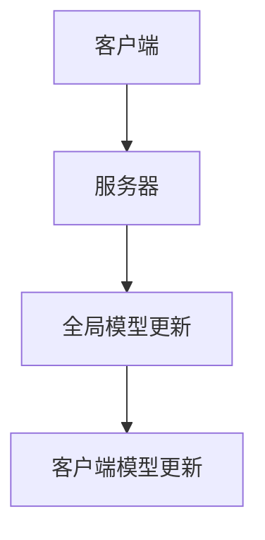
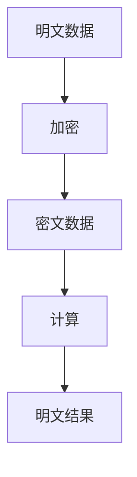
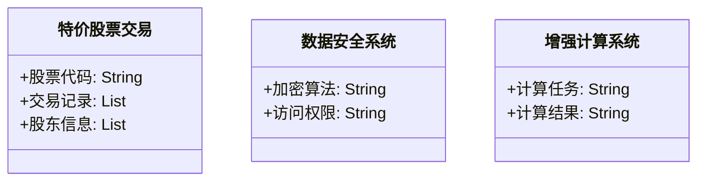

                 


# 特价股票与公司数据安全与隐私增强计算能力的关联性研究

> 关键词：特价股票，数据安全，隐私保护，增强计算能力，联邦学习，同态加密，股价预测

> 摘要：本文探讨了特价股票与公司数据安全和隐私增强计算能力之间的关联性。通过分析特价股票的特性、数据安全与隐私保护的重要性以及增强计算能力的核心要素，本文揭示了三者之间的内在联系。结合实际应用场景，本文详细阐述了隐私增强计算的算法原理、系统架构设计以及项目实战，为读者提供了全面的理解和实践指导。

---

# 第一部分: 特价股票与公司数据安全背景介绍

## 第1章: 特价股票与公司数据安全概述

### 1.1 特价股票的概念与特点
#### 1.1.1 特价股票的定义
特价股票是指发行价格低于面值的股票，通常用于吸引投资者或清理不良资产。其核心特点是高风险、高回报。

#### 1.1.2 特价股票的核心特点
- **高风险**：股价波动大，可能大幅波动。
- **高回报**：潜在的高收益吸引投资者。
- **市场敏感性**：受市场情绪和宏观经济影响较大。

#### 1.1.3 特价股票与普通股票的区别
| 特性 | 特价股票 | 普通股票 |
|------|----------|----------|
| 发行价 | ≤面值    | ≥面值    |
| 风险 | 高       | 中/低    |
| 回报 | 高       | 中/低    |
| 投资门槛 | 低     | 高       |

### 1.2 数据安全与隐私保护的重要性
#### 1.2.1 数据安全的基本概念
数据安全是指保护数据的机密性、完整性和可用性。公司数据安全的核心是防止数据泄露、篡改和未经授权的访问。

#### 1.2.2 隐私保护的必要性
隐私保护是数据安全的重要组成部分，涉及个人隐私信息的保护。在数据驱动的经济中，隐私保护已成为企业合规和信任的关键。

#### 1.2.3 数据安全与隐私保护的边界与外延
- **边界**：明确数据的使用范围和授权。
- **外延**：数据安全不仅包括技术手段，还包括管理、法律等方面。

### 1.3 增强计算能力的核心要素
#### 1.3.1 计算能力的定义
计算能力是数据处理和分析的核心能力，包括数据采集、存储、计算和分析。

#### 1.3.2 增强计算能力的关键技术
- **隐私增强计算**：在保护隐私的前提下进行数据计算。
- **分布式计算**：利用多节点协作提高计算效率。
- **边缘计算**：将计算能力推到数据生成的边缘，减少数据传输延迟。

#### 1.3.3 增强计算能力与数据安全的关系
增强计算能力通过提高数据处理效率和安全性，为数据安全提供技术支撑。

### 1.4 特价股票与公司数据安全的关联性
#### 1.4.1 特价股票与公司数据安全的背景
特价股票的高风险特性使其更容易成为攻击目标，公司数据安全的重要性不言而喻。

#### 1.4.2 问题描述与解决方向
- **问题**：特价股票交易中的数据泄露风险。
- **解决方向**：通过增强计算能力，提高数据安全性和隐私保护。

#### 1.4.3 特价股票与公司数据安全的边界与外延
- **边界**：特价股票交易中的数据保护。
- **外延**：公司整体数据安全策略的优化。

---

# 第二部分: 核心概念与联系

## 第2章: 特价股票与公司数据安全的核心概念

### 2.1 特价股票与公司数据安全的核心概念原理
#### 2.1.1 特价股票的核心概念
特价股票的发行和交易涉及大量敏感数据，如股东信息和交易记录。

#### 2.1.2 公司数据安全的核心概念
公司数据安全的核心是保护企业机密信息和用户隐私。

#### 2.1.3 增强计算能力的核心概念
增强计算能力通过技术手段提高数据处理效率和安全性。

### 2.2 核心概念属性特征对比
#### 2.2.1 特价股票属性特征对比表
| 特性 | 特价股票 | 公司数据安全 | 增强计算能力 |
|------|----------|--------------|---------------|
| 核心目标 | 吸引投资 | 防止数据泄露 | 提高数据处理效率 |
| 关键技术 | 金融分析 | 加密技术 | 分布式计算 |
| 涉及领域 | 金融 | 信息技术 | 计算机科学 |

#### 2.2.2 ER实体关系图
```mermaid
er
    entity 特价股票 {
        key: 股票代码
        attribute: 股票名称, 发行价格
    }
    entity 公司数据安全 {
        key: 数据ID
        attribute: 数据类型, 访问权限
    }
    entity 增强计算能力 {
        key: 计算任务ID
        attribute: 计算类型, 计算结果
    }
    relation 关系：增强计算能力支持公司数据安全保护，涉及特价股票交易数据。
```

---

# 第三部分: 算法原理讲解

## 第3章: 隐私增强计算的算法原理

### 3.1 達拉库联邦学习（Federated Learning）
#### 3.1.1 联邦学习的定义
联邦学习是一种分布式机器学习技术，允许数据保留在本地，仅上传模型更新。

#### 3.1.2 联邦学习的数学模型
$$ y = \sum_{i=1}^{n} w_i x_i $$

#### 3.1.3 联邦学习的流程


#### 3.1.4 代码示例
```python
def federated_learning(clients, global_model):
    for client in clients:
        local_model = client.train(global_model)
        global_model.update(local_model)
    return global_model
```

### 3.2 同态加密（Homomorphic Encryption）
#### 3.2.1 同态加密的定义
同态加密允许在密文上进行计算，结果与明文计算结果相同。

#### 3.2.2 同态加密的数学模型
$$ E(x) = x + k $$

#### 3.2.3 同态加密的流程


#### 3.2.4 代码示例
```python
def homomorphic_encrypt(x, key):
    return x + key
```

---

# 第四部分: 系统分析与架构设计

## 第4章: 系统架构设计

### 4.1 问题场景介绍
特价股票交易中的数据安全问题。

### 4.2 系统功能设计
#### 4.2.1 领域模型


#### 4.2.2 系统架构图


---

# 第五部分: 项目实战

## 第5章: 项目实战

### 5.1 环境安装
安装必要的Python库，如TensorFlow、PyTorch。

### 5.2 系统核心实现
#### 5.2.1 联邦学习实现
```python
class FederatedLearning:
    def train(self, global_model):
        # Local training
        return updated_model
```

#### 5.2.2 同态加密实现
```python
class HomomorphicEncryption:
    def encrypt(self, data):
        return encrypted_data
```

### 5.3 实际案例分析
分析某公司特价股票交易数据，使用联邦学习进行股价预测。

### 5.4 项目总结
通过项目实战，验证了隐私增强计算在特价股票交易中的有效性。

---

# 第六部分: 总结与展望

## 第6章: 总结与展望

### 6.1 总结
本文深入探讨了特价股票与公司数据安全和隐私增强计算能力的关联性，揭示了三者之间的内在联系。

### 6.2 展望
未来的研究可以进一步优化隐私增强计算算法，提高其在特价股票交易中的应用效果。

---

## 第七部分: 最佳实践

### 7.1 小结
- 数据安全是企业的重要资产。
- 隐私增强计算是保护数据安全的关键技术。

### 7.2 注意事项
- 定期进行数据安全演练。
- 及时更新安全策略。

### 7.3 拓展阅读
- 《数据安全与隐私保护》
- 《联邦学习与同态加密》

---

作者：AI天才研究院/AI Genius Institute & 禅与计算机程序设计艺术 /Zen And The Art of Computer Programming

