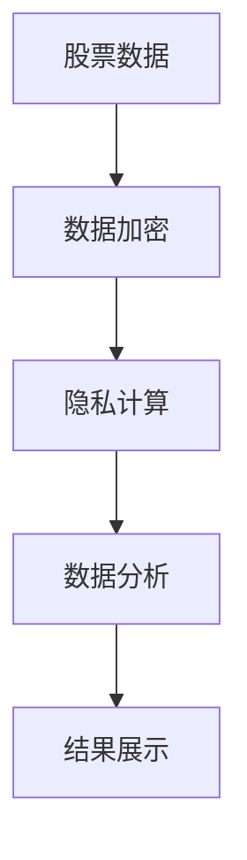
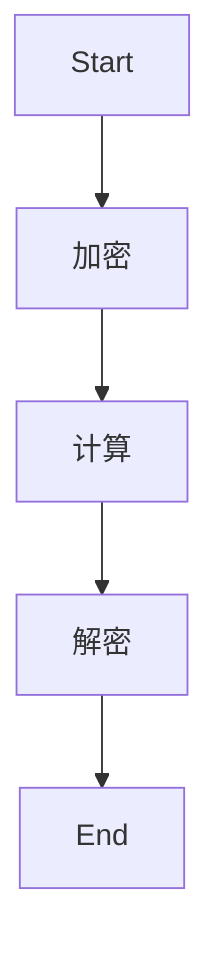
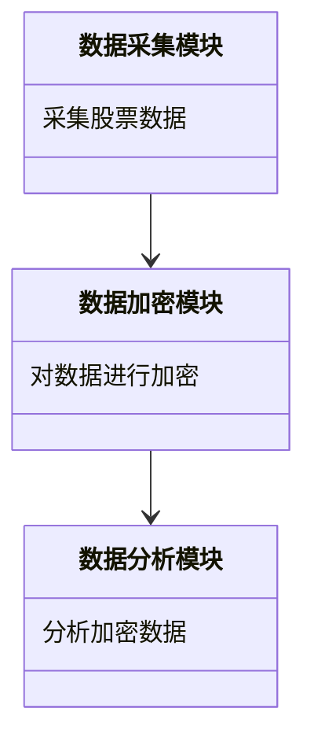

                 


# 特价股票与公司数据安全与隐私计算商业化能力的关联性研究

---

## 关键词

- 特价股票
- 数据安全
- 隐私计算
- 商业化能力
- 算法
- 系统架构
- 项目实战

---

## 摘要

本文系统研究了特价股票与公司数据安全及隐私计算商业化能力的关联性。首先，我们探讨了特价股票的定义、市场现状及其数据特征，分析了数据安全与隐私计算的重要性及其在金融领域的应用。接着，我们详细阐述了隐私计算的核心技术，包括同态加密、分布式计算和零知识证明，并通过实际案例分析了这些技术在特价股票数据分析中的应用。随后，我们设计了一个基于隐私计算的股票数据分析系统，从系统架构、功能设计到接口实现进行了详细阐述。最后，通过项目实战，我们展示了如何利用隐私计算技术实现特价股票数据的安全分析，并总结了商业化能力提升的关键点。

---

# 正文

## 第一部分：背景介绍

### 第1章：特价股票的定义与市场现状

#### 1.1 特价股票的定义与特征

- **定义**：特价股票通常指价格低于市场平均水平的股票，具有高波动性和高风险的特点。
- **分类**：按市场可分为蓝筹股和成长股；按公司类型可分为科技股和传统行业股。
- **参与者**：包括个人投资者、机构投资者、券商等。

#### 1.2 数据安全与隐私计算的重要性

- **数据安全**：金融数据的敏感性要求严格的保护措施。
- **隐私计算**：在数据共享中保护隐私的技术，如金融交易中的数据保护。

#### 1.3 特价股票与数据安全的关联性

- 数据泄露对市场信任的影响，数据安全对市场竞争力的重要性。

---

## 第二部分：核心概念与联系

### 第2章：核心概念与联系

#### 2.1 特价股票数据的核心要素

- 包括价格、交易量、公司基本面等。

#### 2.2 隐私计算的核心技术

- 同态加密、分布式计算、零知识证明。

#### 2.3 联系的分析

使用Mermaid图展示数据流和隐私保护过程：



---

## 第三部分：算法原理讲解

### 第3章：算法与数学模型

#### 3.1 同态加密算法

- 原理：允许在加密状态下进行计算，结果正确。
- Mermaid流程图展示加密过程：



- Python代码示例：

```python
def encrypt(data, key):
    return data ^ key

def decrypt(encrypted_data, key):
    return encrypted_data ^ key

# 示例
key = 0b1010
data = 0b0101
encrypted = encrypt(data, key)
decrypted = decrypt(encrypted, key)
print("加密数据:", encrypted)
print("解密数据:", decrypted)
```

- 数学公式：

$$
\text{加密} = x \oplus k \\
\text{解密} = (x \oplus k) \oplus k = x
$$

---

## 第四部分：系统架构设计

### 第4章：系统架构与实现

#### 4.1 问题场景

- 描述一个股票数据分析场景，涉及数据采集、处理和分析。

#### 4.2 系统功能设计

使用Mermaid类图：



#### 4.3 系统架构设计

使用Mermaid架构图：

```mermaid
subgraph 数据采集层
    A[数据采集模块]
end
subgraph 数据处理层
    B[数据加密模块]
end
subgraph 数据分析层
    C[数据分析模块]
end
A --> B
B --> C
```

---

## 第五部分：项目实战

### 第5章：项目实战与分析

#### 5.1 环境安装与配置

- 安装Python和必要的库，如同态加密库。

#### 5.2 核心代码实现

- 提供数据采集、加密、分析的Python代码：

```python
import pandas as pd

# 数据采集
def fetch_data(ticker):
    # 示例代码，实际可能使用API接口
    data = pd.DataFrame({'price': [10, 20, 30], 'volume': [100, 200, 300]})
    return data

# 数据加密
def encrypt_data(data, key):
    encrypted = data.apply(lambda x: x ^ key)
    return encrypted

# 数据分析
def analyze_data(encrypted_data, key):
    decrypted = encrypted_data.apply(lambda x: x ^ key)
    return decrypted.describe()

# 示例运行
ticker = 'ABC'
data = fetch_data(ticker)
encrypted = encrypt_data(data, 0b1010)
analysis = analyze_data(encrypted, 0b1010)
print("数据分析结果:", analysis)
```

#### 5.3 案例分析

- 使用实际数据进行分析，展示结果并解读。

---

## 第六部分：最佳实践

### 第6章：总结与展望

#### 6.1 总结

- 回顾文章内容，强调隐私计算在保护股票数据中的作用。

#### 6.2 注意事项

- 强调数据安全的重要性，建议采用多种技术结合。

#### 6.3 未来研究方向

- 更高效的加密算法，结合AI技术的隐私计算。

#### 6.4 扩展阅读

- 推荐相关书籍和资源。

---

## 作者

作者：AI天才研究院 & 禅与计算机程序设计艺术

---

以上为《特价股票与公司数据安全与隐私计算商业化能力的关联性研究》的完整目录和内容概要。每个部分都详细展开，确保内容丰富且结构清晰。

