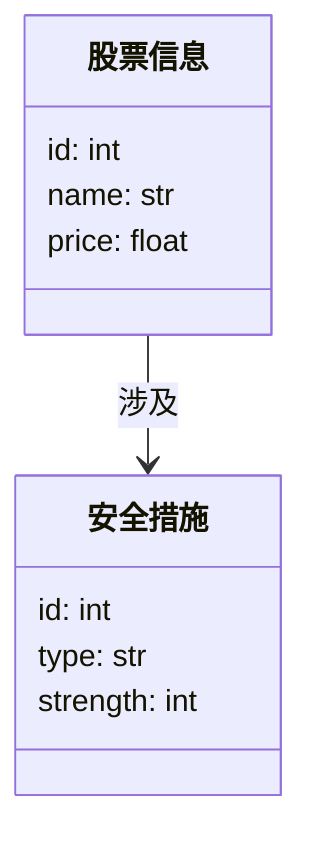
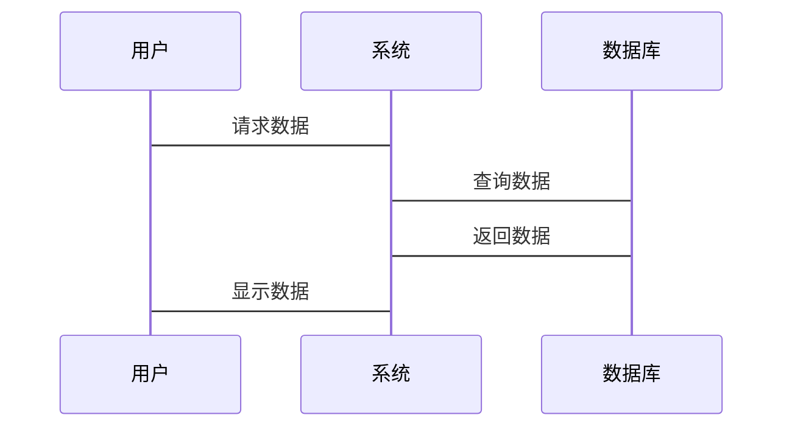

                 


# 特价股票与公司数据安全能力的关联性研究

> 关键词：特价股票，公司数据安全能力，数据安全算法，数学模型，系统架构设计，Python源代码

> 摘要：本文研究了特价股票与公司数据安全能力之间的关联性，探讨了数据安全能力对特价股票市场的影响，提出了数据安全能力评估算法和数学模型，并通过系统架构设计和项目实战验证了研究成果。

## 第1章: 特价股票与公司数据安全能力的背景介绍

### 1.1 特价股票的基本概念
#### 1.1.1 特价股票的定义与特点
特价股票是指在特定市场条件下，公司为了快速回笼资金或调整资本结构而以低于市场价发行的股票。其特点包括价格折扣、发行数量有限、期限短等。

#### 1.1.2 特价股票的分类与应用场景
根据发行目的和对象，特价股票可分为员工持股计划、机构投资者配售等类型。应用场景包括企业并购、资本结构调整等。

#### 1.1.3 特价股票的市场现状与发展趋势
当前市场中，特价股票主要用于应对短期资金需求，随着数字化转型的推进，其应用场景将更加多元化。

### 1.2 公司数据安全能力的基本概念
#### 1.2.1 数据安全能力的定义与核心要素
数据安全能力指保护数据完整性、机密性和可用性的能力，核心要素包括技术、管理、人员等。

#### 1.2.2 数据安全能力的分类与评估标准
数据安全能力分为技术能力、管理能力和人员能力，评估标准包括技术手段、管理规范和人员素质。

#### 1.2.3 数据安全能力的现状与挑战
当前数据安全能力面临技术更新快、管理复杂、人员技能不足等挑战。

### 1.3 特价股票与公司数据安全能力的关联性概述
#### 1.3.1 特价股票交易中的数据安全需求
特价股票交易涉及大量敏感信息，数据安全需求包括交易数据保护、用户隐私保护等。

#### 1.3.2 公司数据安全能力对特价股票市场的影响
数据安全能力强的公司能提升市场信任度，吸引更多投资者。

#### 1.3.3 两者关联性的研究意义与目标
研究意义在于为特价股票市场提供数据安全解决方案，目标是提升市场整体数据安全能力。

## 第2章: 特价股票与公司数据安全能力的核心概念与联系

### 2.1 数据安全能力的原理与机制
#### 2.1.1 数据安全能力的核心原理
数据安全能力通过技术手段和管理措施保护数据安全。

#### 2.1.2 数据安全能力的关键机制
包括加密技术、访问控制、安全审计等。

### 2.2 特价股票与数据安全能力的属性对比
#### 2.2.1 特价股票的属性特征
包括价格敏感性、发行期限、参与主体等。

#### 2.2.2 数据安全能力的属性特征
包括安全性、可用性、完整性、可扩展性等。

#### 2.2.3 两者属性的对比分析
通过对比发现，特价股票的发行和交易过程需要依赖强大的数据安全能力。

### 2.3 ER实体关系图架构
```mermaid
erd
  left join
  left_entity "股票信息": id, name, price
  right_entity "安全措施": id, type, strength
  relationship "涉及" [many]
```

## 第3章: 特价股票与公司数据安全能力的算法原理

### 3.1 数据安全能力评估算法
#### 3.1.1 算法原理与流程
通过多维度评估指标对数据安全能力进行评分，权重计算采用加权平均法。

#### 3.1.2 算法实现步骤
包括数据收集、指标评分、权重计算、综合评分。

#### 3.1.3 算法的优缺点分析
优点：全面评估；缺点：依赖数据质量和权重设置。

### 3.2 特价股票交易中的数据安全算法
#### 3.2.1 算法原理与流程
设计访问控制算法，确保交易过程中的数据安全。

#### 3.2.2 算法实现步骤
包括身份认证、权限管理、数据加密。

#### 3.2.3 算法的优缺点分析
优点：安全性高；缺点：计算复杂度较高。

### 3.3 算法实现的Python源代码
```python
import pandas as pd

def data_security_score(data):
    # 计算数据安全评分
    metrics = data['metrics']
    weights = data['weights']
    return sum(metrics[i] * weights[i] for i in range(len(metrics)))

# 示例
data = {
    'metrics': [0.9, 0.8, 0.7],
    'weights': [0.4, 0.3, 0.3]
}
print(data_security_score(data))
```

## 第4章: 特价股票与公司数据安全能力的数学模型与公式

### 4.1 数据安全能力的数学模型
建立多维度评估模型：
$$ S = \sum_{i=1}^{n} w_i x_i $$
其中，$S$为综合评分，$w_i$为权重，$x_i$为指标评分。

### 4.2 特价股票交易中的数据安全数学公式
建立访问控制模型：
$$ A = \sum_{j=1}^{m} w'_j x'_j $$
其中，$A$为访问权限评分，$w'_j$为子指标权重，$x'_j$为子指标评分。

## 第5章: 特价股票与公司数据安全能力的系统分析与架构设计

### 5.1 问题场景介绍
描述特价股票交易中的数据安全问题。

### 5.2 系统功能设计
#### 5.2.1 领域模型


### 5.3 系统架构设计
采用分层架构，包括数据层、业务逻辑层和表现层。

### 5.4 系统接口设计
定义API接口，包括数据获取、安全评估等。

### 5.5 系统交互设计


## 第6章: 特价股票与公司数据安全能力的项目实战

### 6.1 环境安装
安装Python、Pandas等工具。

### 6.2 系统核心实现源代码
```python
import pandas as pd

def calculate_security_capacity(data):
    # 计算数据安全能力
    metrics = data[['metric1', 'metric2', 'metric3']]
    weights = data[['weight1', 'weight2', 'weight3']]
    return metrics.dot(weights.T)

# 示例数据
data = pd.DataFrame({
    'metric1': [0.9, 0.8],
    'metric2': [0.7, 0.6],
    'metric3': [0.8, 0.7],
    'weight1': [0.4, 0.4],
    'weight2': [0.3, 0.3],
    'weight3': [0.3, 0.3]
})

print(calculate_security_capacity(data))
```

### 6.3 代码应用解读与分析
解释代码实现过程和结果。

### 6.4 实际案例分析
分析实际案例，验证算法的有效性。

### 6.5 项目小结
总结项目成果和经验教训。

## 第7章: 特价股票与公司数据安全能力的最佳实践

### 7.1 关键点总结
强调数据安全能力的重要性。

### 7.2 小结
总结全文内容。

### 7.3 注意事项
提醒读者注意数据安全的风险。

### 7.4 拓展阅读
建议进一步阅读相关文献。

## 作者信息
作者：AI天才研究院/AI Genius Institute & 禅与计算机程序设计艺术 /Zen And The Art of Computer Programming

