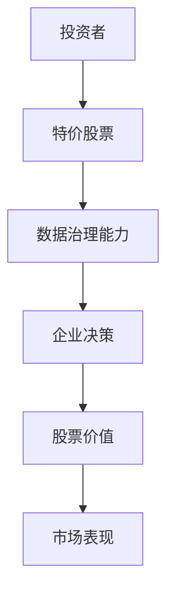
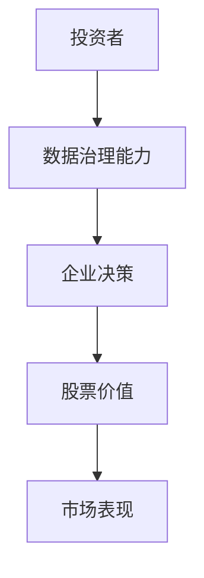
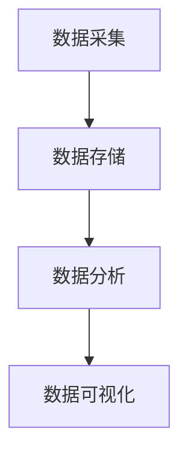

                 


```markdown
# 特价股票与公司数据治理能力的关系分析

## 关键词：特价股票、数据治理能力、数据分析、企业决策、投资策略

## 摘要：本文系统地分析了特价股票与公司数据治理能力之间的关系，从核心概念、算法原理、系统架构到项目实战，全面探讨了数据治理能力如何影响特价股票的市场表现和企业决策。通过对比分析和案例研究，本文提出了数据治理能力在特价股票投资中的重要性，并总结了优化企业数据治理能力的建议。

---

## 第一部分: 特价股票与公司数据治理能力的背景与概念

### 第1章: 特价股票的基本概念与市场现状

#### 1.1 特价股票的定义与分类
- **定义**: 特价股票是指价格低于行业平均水平或历史平均水平的股票，通常具有较高的波动性和风险。
- **分类**: 根据市场资本化规模，分为小盘股、中盘股和大盘股；根据行业特性，分为周期性股票和成长性股票。
- **特征**: 波动性高、估值低、风险较高、潜在收益大。

#### 1.2 数据治理能力的核心概念
- **定义**: 数据治理能力是指企业对数据的全生命周期进行管理、监控和优化的能力，包括数据的采集、存储、处理、分析和应用。
- **构成要素**: 数据质量管理、数据安全、数据访问控制、数据集成与共享、数据生命周期管理。
- **重要性**: 数据治理能力直接影响企业的决策效率、风险管理能力和市场竞争力。

### 第2章: 特价股票与公司数据治理能力的关系背景

#### 2.1 问题背景与问题描述
- **背景**: 特价股票市场具有高度不确定性，投资者需要依赖企业的数据治理能力来评估企业的长期价值。
- **问题描述**: 数据治理能力不足可能导致企业无法有效应对市场波动，影响股票价格和投资者信心。

#### 2.2 数据治理能力对股票价值的影响
- **企业决策**: 数据治理能力直接影响企业的战略制定和执行效率，进而影响企业业绩和股票价值。
- **风险管理**: 有效的数据治理能力可以降低企业运营风险，提升投资者对企业的信任度。
- **投资者信心**: 数据治理能力的提升有助于增强投资者对企业的信心，从而提升股票价格。

---

## 第二部分: 特价股票与公司数据治理能力的核心概念与联系

### 第3章: 特价股票与数据治理能力的核心概念原理

#### 3.1 特价股票的核心属性与特征
- **市场定位**: 特价股票通常位于市场中的低估值区域，具有较高的投资潜力。
- **波动性与风险**: 特价股票价格波动较大，投资风险较高，但潜在收益也更大。
- **投资者行为特征**: 投资者对特价股票的投资行为通常具有较高的风险偏好和短期投机性。

#### 3.2 数据治理能力的核心属性与特征
- **数据完整性**: 数据治理能力确保企业数据的准确性和一致性。
- **数据准确性**: 数据治理能力通过数据清洗和验证，确保数据的准确性。
- **数据及时性与安全性**: 数据治理能力确保数据的及时更新和安全存储，防止数据泄露和篡改。

### 第4章: 特价股票与数据治理能力的联系与对比

#### 4.1 特价股票与数据治理能力的联系分析
- **数据治理能力对特价股票市场的影响**: 数据治理能力的提升可以提高企业的透明度和信任度，吸引更多投资者，从而提升股票价格。
- **特价股票市场对数据治理能力的需求**: 特价股票市场的波动性和不确定性要求企业具备更强的数据治理能力，以应对市场变化和风险。
- **两者关系的动态变化**: 数据治理能力的提升可以降低特价股票市场的风险，而特价股票市场的波动性也对企业数据治理能力提出了更高的要求。

#### 4.2 特价股票与数据治理能力的对比分析
- **数据治理能力的强弱对特价股票的影响**: 数据治理能力强的企业更容易获得投资者的信任，从而提升股票价格。
- **特价股票市场的波动对数据治理能力的反馈效应**: 特价股票市场的波动性要求企业具备更强的数据治理能力，以应对市场变化和投资者需求。
- **两者关系的区域与行业差异**: 不同行业和地区的特价股票市场对数据治理能力的需求存在差异，需要结合具体情况进行分析。

### 第5章: 特价股票与数据治理能力的实体关系图

#### 5.1 实体关系图（ER图）


#### 5.2 数据治理能力与特价股票的关系流程图


---

## 第三部分: 特价股票与公司数据治理能力的算法原理与数学模型

### 第6章: 特价股票与数据治理能力的算法原理

#### 6.1 数据挖掘与机器学习算法
- **算法选择**: 使用决策树、随机森林等算法对数据治理能力进行分类和预测。
- **流程图**: 数据采集、数据预处理、特征提取、模型训练、模型评估。
- **代码示例**: 使用Python的scikit-learn库进行分类模型的训练和评估。

### 第7章: 特价股票与数据治理能力的数学模型

#### 7.1 数据治理能力的评估模型
$$ \text{数据治理能力评分} = \sum_{i=1}^{n} w_i \cdot x_i $$
其中，\( w_i \) 是权重，\( x_i \) 是各指标的得分。

#### 7.2 特价股票价格预测模型
$$ \text{股票价格} = a \cdot \text{数据治理能力} + b \cdot \text{市场波动} + c \cdot \text{企业业绩} $$

---

## 第四部分: 特价股票与公司数据治理能力的系统架构与项目实战

### 第8章: 特价股票与数据治理能力的系统架构设计

#### 8.1 系统功能设计
- **数据采集模块**: 采集企业数据治理相关指标。
- **数据分析模块**: 对数据进行清洗、特征提取和建模。
- **数据可视化模块**: 展示数据治理能力与股票价格的关系。

#### 8.2 系统架构图


### 第9章: 特价股票与数据治理能力的项目实战

#### 9.1 项目环境安装
- **工具安装**: Python、Jupyter Notebook、scikit-learn、Pandas、Matplotlib。

#### 9.2 系统核心实现源代码
```python
import pandas as pd
from sklearn.ensemble import RandomForestClassifier
from sklearn.metrics import accuracy_score

# 数据加载
data = pd.read_csv('stock_data.csv')

# 特征提取
X = data[['data_governance', 'market_trend', 'company_performance']]
y = data['stock_price']

# 模型训练
model = RandomForestClassifier()
model.fit(X, y)

# 模型预测
y_pred = model.predict(X)
print("Accuracy:", accuracy_score(y, y_pred))
```

---

## 第五部分: 特价股票与公司数据治理能力的总结与展望

### 第10章: 特价股票与数据治理能力的总结

#### 10.1 研究成果总结
- 数据治理能力对特价股票的市场表现和企业决策具有重要影响。
- 通过数据挖掘和机器学习算法，可以有效评估数据治理能力对股票价格的影响。

#### 10.2 项目小结
- 数据治理能力的提升可以显著提高企业的市场竞争力和投资者信任度。
- 数据驱动的投资策略可以帮助投资者更好地把握特价股票的投资机会。

### 第11章: 特价股票与数据治理能力的展望

#### 11.1 未来的研究方向
- 进一步研究数据治理能力对不同行业特价股票的影响。
- 探索更复杂的机器学习模型，如深度学习和强化学习，用于股票价格预测。

#### 11.2 最佳实践 tips
- 企业应加强数据治理能力的建设，提升数据的准确性和安全性。
- 投资者应关注企业的数据治理能力，作为投资决策的重要依据。

---

## 作者：AI天才研究院/AI Genius Institute & 禅与计算机程序设计艺术 /Zen And The Art of Computer Programming
```

