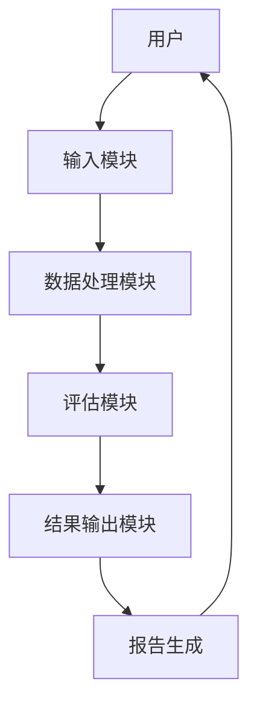
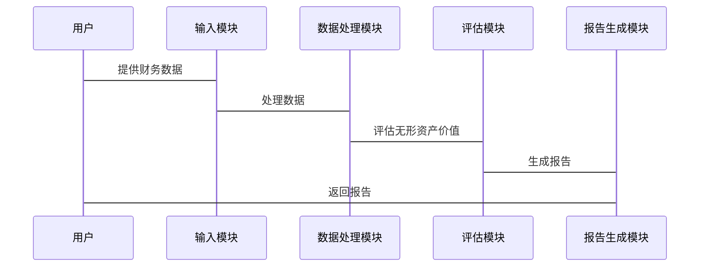

                 


# 特价股票与公司无形资产价值的关系探讨

## 关键词
特价股票、公司无形资产、资产评估、股票价值、公司融资

## 摘要
本文探讨了特价股票与公司无形资产之间的关系，分析了特价股票在公司融资中的作用，以及无形资产对公司价值的影响。通过对比分析和实例说明，本文揭示了两者在价值评估和公司战略中的相互作用，为投资者和企业管理者提供了有益的参考。

## 目录大纲

### 第一部分：特价股票与公司无形资产的背景介绍

#### 第1章：特价股票与公司无形资产的概述

##### 1.1 特价股票的定义与特点
- 1.1.1 特价股票的定义：特价股票是公司发行的特殊类型股票，通常具有较低的发行价格或附带特定权利，如可转债、认股权证等。
- 1.1.2 特价股票的类型：
  - 可转债：允许持有者在特定条件下将债券转换为公司股票。
  - 认股权证：赋予持有者在未来特定时间内以特定价格购买公司股票的权利。
- 1.1.3 特价股票的特点：
  - 价格优惠，吸引投资者。
  - 具有潜在的高回报，尤其是当公司估值上升时。
  - 常用于公司融资，特别是在资金短缺时。

##### 1.2 公司无形资产的定义与分类
- 1.2.1 无形资产的定义：公司持有的非实物资产，包括专利权、商标权、商誉、品牌价值等。
- 1.2.2 无形资产的分类：
  - 知识产权类：专利权、商标权、版权。
  - 商誉类：企业声誉、客户关系、品牌价值。
  - 技术类：专有技术、研发成果。
- 1.2.3 无形资产的重要性：
  - 是公司核心竞争力的体现。
  - 在企业估值中占据重要地位。
  - 无形资产的贬值或升值直接影响公司市值。

##### 1.3 特价股票与公司无形资产的关系
- 1.3.1 特价股票在公司融资中的作用：
  - 通过发行特价股票，公司可以在不立即稀释现有股东权益的情况下筹集资金。
  - 特价股票通常附带期权或其他权益，激励投资者长期持有。
- 1.3.2 无形资产对股价的影响：
  - 无形资产的增加通常提升市场对公司未来盈利能力的预期，推动股价上涨。
  - 强大的无形资产（如知名品牌）能有效降低融资成本，提升股价。
- 1.3.3 特价股票与无形资产的互动机制：
  - 通过发行特价股票，公司可以将部分无形资产转化为资金，用于进一步的研发或市场拓展。
  - 无形资产的增值可能间接提升特价股票的市场价值，吸引更多的投资者。

### 第二部分：核心概念与联系分析

#### 第2章：特价股票与无形资产的核心概念原理

##### 2.1 特价股票的发行机制
- 2.1.1 特价股票的发行目的：
  - 筹集资金用于新项目或扩张。
  - 改善资本结构，降低债务负担。
  - 激励员工或合作伙伴，绑定利益。
- 2.1.2 特价股票的发行方式：
  - 公开发行（IPO）：首次公开发行中的特价股票。
  - 配售发行：向现有股东配发特价股票。
  - 私募发行：向特定投资者发行，通常附带更多权益。
- 2.1.3 特价股票的市场影响：
  - 短期可能稀释每股收益，但长期来看，若公司发展良好，股价可能上升。
  - 提供更多流动性，增加市场参与度。

##### 2.2 无形资产的评估方法
- 2.2.1 无形资产评估的基本原则：
  - 考虑资产的使用价值和市场价值。
  - 评估需基于合理的假设和数据。
  - 考虑资产的可变现能力。
- 2.2.2 无形资产评估方法：
  - 收益法：通过预测未来现金流，计算现值。
  - 市场法：参考可比交易或资产的市场价值。
  - 成本法：基于重置成本或历史成本。
- 2.2.3 无形资产评估中的关键因素：
  - 资产的使用寿命和维护成本。
  - 市场需求和竞争状况。
  - 法律保护情况，如专利的有效期和可执行性。

#### 第3章：特价股票与无形资产的属性特征对比

##### 3.1 属性特征对比表格
| 特性                | 特价股票                     | 无形资产                     |
|---------------------|-----------------------------|-----------------------------|
| 定义                | 公司发行的特殊股票           | 公司拥有的非实物资产         |
| 价值评估            | 市场定价，受公司业绩影响     | 需专业评估，复杂性高         |
| 影响因素            | 市场供需、公司财务状况       | 公司创新能力、行业地位       |
| 法律属性            | 受证券法监管，需公开披露     | 受知识产权法保护，评估复杂   |
| 转换性              | 可转换为其他资产（如债券转股权）| 不可转换，除非通过市场交易   |

##### 3.2 ER实体关系图
```mermaid
er
  company [公司]
  stock [特价股票]
  intangible_asset [无形资产]
  company --> stock: 发行
  company --> intangible_asset: 拥有
  stock --> intangible_asset: 通过评估影响价值
```

### 第三部分：算法原理与系统架构设计

#### 第4章：特价股票价值评估的算法原理

##### 4.1 算法原理概述
- 特价股票的价值评估涉及多个因素，包括其转换价值、市场流动性、公司财务状况等。
- 使用贴现现金流模型（DCF）评估公司整体价值，再调整特价股票的内在价值。

##### 4.2 贴现现金流模型（DCF）
- 计算公司未来现金流的现值，考虑税率和资本成本。
- 公式：
  $$ \text{企业价值} = \sum_{t=1}^{n} \frac{\text{现金流}_t}{(1 + r)^t} + \frac{\text{残值}}{(1 + r)^n} $$
  其中，r是折现率，n是预计的持有期限。

##### 4.3 代码实现示例
```python
import numpy as np

def discounted_cash_flow(fcf, wacc, horizon):
    """计算公司价值的DCF模型"""
    terminal_value = fcf[-1] * (1 + 0.05) / (0.12 - 0.05)
    value = 0
    for i in range(len(fcf)):
        if i < len(fcf)-1:
            value += fcf[i] / (1 + wacc)**i
    value += terminal_value / (1 + wacc)**(horizon)
    return value

# 示例数据
fcf = [100, 120, 140]  # 自由现金流
wacc = 0.12  # 加权平均资本成本
horizon = 3  # 评估时间范围

company_value = discounted_cash_flow(fcf, wacc, horizon)
print(f"公司价值：{company_value}")
```

#### 第5章：系统分析与架构设计

##### 5.1 系统功能设计
- 输入：公司财务数据、市场数据、无形资产信息。
- 处理：评估无形资产价值，计算特价股票的内在价值。
- 输出：公司整体价值、特价股票的理论价格。

##### 5.2 系统架构图


##### 5.3 序列图


### 第四部分：项目实战与最佳实践

#### 第6章：项目实战

##### 6.1 环境安装
- 安装Python和必要的库（numpy, pandas, matplotlib）。
- 安装Jupyter Notebook用于数据分析和可视化。

##### 6.2 核心代码实现
```python
import numpy as np
import pandas as pd

def assess_intangible_assets(revenue, cost, growth_rate, period):
    """评估无形资产价值"""
    npv = 0
    for i in range(period):
        cash_flow = revenue * (1 + growth_rate)**i - cost * (1 + growth_rate)**i
        npv += cash_flow / (1 + 0.10)**i
    return npv

# 示例数据
revenue = 500000  # 年收入
cost = 200000     # 年成本
growth_rate = 0.1 # 年增长率
period = 5       # 评估期限

asset_value = assess_intangible_assets(revenue, cost, growth_rate, period)
print(f"无形资产价值：{asset_value}")
```

##### 6.3 案例分析
分析一家科技公司发行的认股权证，评估其对股价的影响。通过DCF模型计算公司整体价值，再结合认股权证的行权价，评估其潜在价值变化。

#### 第7章：最佳实践与小结

##### 7.1 最佳实践
- 在评估特价股票时，需综合考虑公司的财务状况、市场环境和无形资产价值。
- 无形资产的评估应基于可靠的数据和合理的假设。
- 定期更新评估模型，以反映市场变化和公司动态。

##### 7.2 小结
特价股票与无形资产在公司价值评估中具有重要地位。通过科学的评估方法和系统架构设计，可以更准确地评估公司价值，为投资者和管理层提供决策支持。

### 第五部分：结论与展望

#### 第8章：结论
- 特价股票和无形资产是公司价值的重要组成部分。
- 两者的相互作用影响公司融资和市场表现。
- 科学评估和管理无形资产，合理利用特价股票，是提升公司价值的关键。

#### 第9章：展望
- 进一步研究不同类型的特价股票对无形资产的影响。
- 开发更精准的评估模型，结合大数据和人工智能技术。
- 探讨无形资产在全球化市场中的价值转换机制。

## 作者
作者：AI天才研究院/AI Genius Institute  
联系邮箱：contact@ai-genius-institute.com  
个人简介：专注于人工智能、大数据分析和金融科技领域的研究与实践，致力于通过技术创新为企业创造价值。

