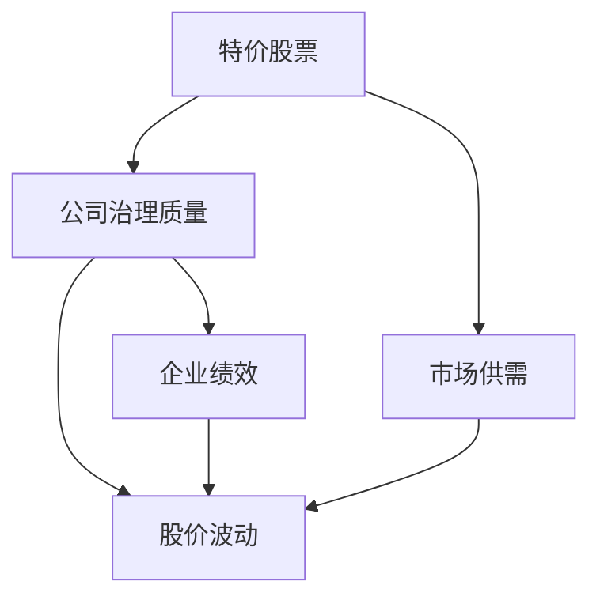
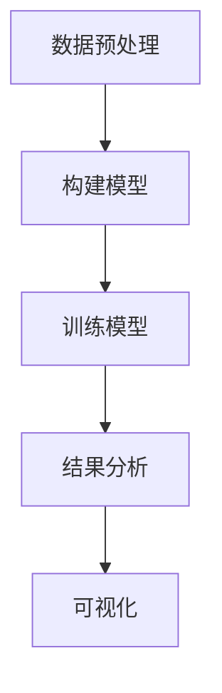
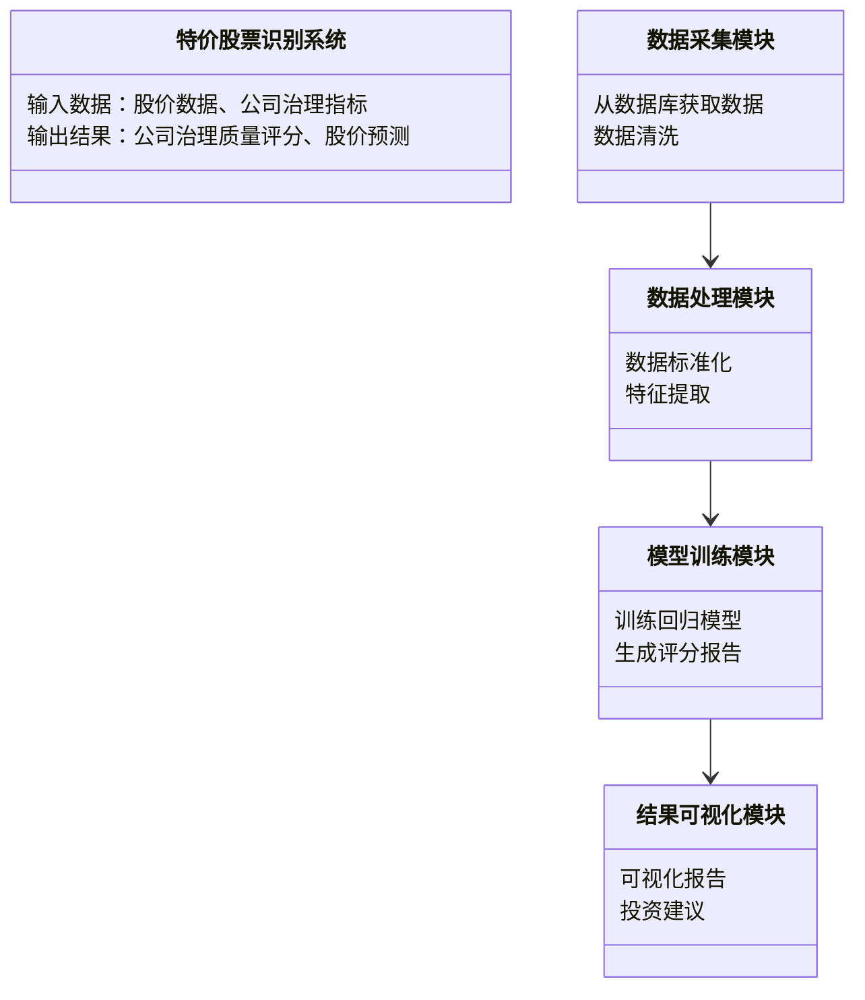
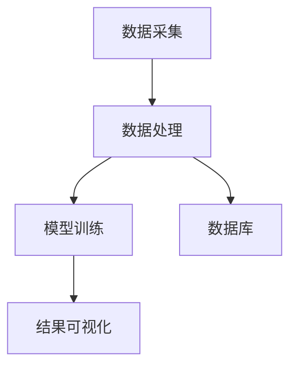
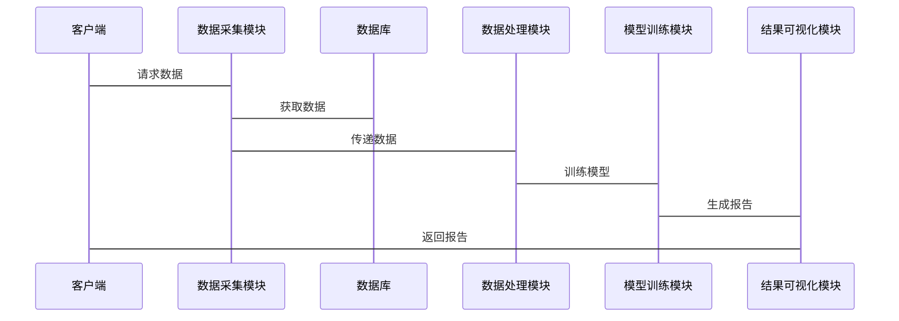

                 


# 特价股票与公司治理质量的关系

> 关键词：特价股票，公司治理质量，股价波动，市场供需，企业绩效，投资决策

> 摘要：本文探讨了特价股票与公司治理质量之间的关系，分析了公司治理质量如何影响股价波动，以及特价股票的识别与投资策略。通过实证分析和算法模型，揭示了公司治理质量对投资决策的重要影响，并提出了优化公司治理结构的建议。

---

# 第1章: 特价股票与公司治理质量的核心概念

## 1.1 特价股票的定义与特征

### 1.1.1 什么是特价股票
特价股票是指市场价格显著低于其内在价值的股票。这类股票通常被市场低估，具有较大的增值潜力。投资者可以通过识别这些股票，获得超额收益。

### 1.1.2 特价股票的市场特征
- **低估值**：市盈率、市净率等指标远低于行业平均水平。
- **高分红率**：公司可能因为股价被低估而提高股息回报。
- **市场波动性**：短期内可能因为市场情绪波动导致股价被低估。

### 1.1.3 特价股票的分类与识别
- **分类**：根据低估的原因，分为价值型低估和市场情绪型低估。
- **识别方法**：通过财务指标（如PE、PB）和市场情绪指标（如资金流向）进行综合判断。

---

## 1.2 公司治理质量的定义与特征

### 1.2.1 公司治理的基本概念
公司治理是指公司内部权力结构和运行机制的设计，确保股东、董事会、管理层和利益相关者之间的权利和责任明确。

### 1.2.2 公司治理质量的衡量标准
- **股权结构**：大股东与中小股东的平衡。
- **经理人激励机制**：薪酬、股票期权等是否合理。
- **透明度**：信息披露的及时性和准确性。

### 1.2.3 公司治理与企业绩效的关系
良好的公司治理能够提高企业决策效率，降低代理成本，从而提升企业绩效和股价表现。

---

## 1.3 特价股票与公司治理质量的关系

### 1.3.1 特价股票与公司治理的关联性
- 公司治理质量影响股价的波动性，进而影响特价股票的出现。
- 良好的公司治理能够减少信息不对称，吸引更多投资者，从而抬高股价。

### 1.3.2 公司治理质量对股价的影响
- **正面影响**：高质量的公司治理能够提高市场对公司的信心，推动股价上升。
- **负面影响**：治理不善可能导致股价被低估，甚至引发退市风险。

### 1.3.3 特价股票与公司治理质量的双向作用
- 特价股票的存在可能反映了公司治理的问题，如管理不善或信息披露不足。
- 改善公司治理质量可能帮助股价回归合理水平，减少特价股票的出现。

---

## 1.4 研究的意义与现状

### 1.4.1 研究特价股票与公司治理质量关系的重要性
- **理论意义**：丰富公司治理与股价关系的研究。
- **实践意义**：为投资者提供新的投资策略，帮助公司优化治理结构。

### 1.4.2 国内外相关研究现状
- 国内研究多集中于公司治理对财务绩效的影响。
- 国外研究更多关注公司治理与股价波动的关系。

### 1.4.3 本书的研究目标与创新点
- **目标**：探讨公司治理质量对特价股票的影响机制。
- **创新点**：构建了公司治理质量对股价影响的分析模型。

---

## 1.5 本章小结

通过本章的分析，我们明确了特价股票和公司治理质量的核心概念，并初步探讨了两者之间的关系。接下来的章节将深入分析公司治理质量对股价波动的影响，并构建相关模型进行实证分析。

---

# 第2章: 特价股票与公司治理质量的核心概念原理

## 2.1 特价股票的核心要素

### 2.1.1 市场供需关系
市场供需失衡可能导致股票价格被低估，形成特价股票。

### 2.1.2 市值与内在价值的差异
当市场价格显著低于内在价值时，股票可能被视为特价。

### 2.1.3 投资者情绪与市场预期
市场情绪波动和投资者预期变化也可能导致股票价格被低估。

---

## 2.2 公司治理质量的核心要素

### 2.2.1 股权结构
合理的股权结构能够平衡大股东和中小股东的利益，降低代理成本。

### 2.2.2 经理人激励机制
有效的激励机制能够提高管理层的积极性，提升公司绩效。

### 2.2.3 监管与透明度
高透明度和严格的监管能够减少信息不对称，提高市场信心。

---

## 2.3 特价股票与公司治理质量的联系

### 2.3.1 公司治理质量对股价的影响路径
- **路径1**：良好的公司治理提高市场信心，推动股价上升。
- **路径2**：治理不善导致股价被低估，形成特价股票。

### 2.3.2 特价股票与公司治理质量的互动关系
- 特价股票的存在可能反映公司治理问题。
- 改善公司治理可能帮助股价回归合理水平，减少特价股票。

---

## 2.4 概念属性特征对比表格

| 属性       | 特价股票                  | 公司治理质量            |
|------------|--------------------------|-------------------------|
| 核心要素   | 市值与内在价值差异        | 股权结构、激励机制      |
| 影响因素   | 市场供需、投资者情绪       | 监管、透明度            |
| 目标       | 寻找被低估的投资机会      | 提高公司治理效率        |

---

## 2.5 ER实体关系图



---

## 2.6 本章小结

通过对比分析，我们明确了特价股票和公司治理质量的核心要素及其联系。接下来将通过算法模型，量化公司治理质量对股价波动的影响。

---

# 第3章: 特价股票与公司治理质量的算法原理

## 3.1 多元回归分析模型

### 3.1.1 模型构建
构建多元回归模型，分析公司治理质量对股价的影响。

$$ \text{股价} = \beta_0 + \beta_1 \times \text{公司治理质量} + \epsilon $$

其中，$\beta_1$ 表示公司治理质量对股价的影响系数。

### 3.1.2 数据来源
- 数据来源：某行业上市公司的股价数据和公司治理指标。
- 数据预处理：标准化处理、异常值剔除。

### 3.1.3 模型实现

```python
import pandas as pd
import numpy as np
from sklearn.linear_model import LinearRegression

# 假设df为数据框，包含公司治理质量(governance)和股价(price)
# 数据预处理
df = df.dropna()
X = df[['governance']]
y = df['price']

# 模型训练
model = LinearRegression()
model.fit(X, y)

# 输出系数
print("回归系数：", model.coef_[0])
```

### 3.1.4 结果分析
回归系数 $\beta_1$ 表示公司治理质量每提高1个单位，股价平均变化的幅度。

---

## 3.2 算法流程图



---

## 3.3 本章小结

通过多元回归分析，我们量化了公司治理质量对股价的影响。接下来将基于此模型，构建系统化的分析框架。

---

# 第4章: 特价股票与公司治理质量的系统分析

## 4.1 系统功能设计

### 4.1.1 领域模型类图



---

## 4.2 系统架构设计



---

## 4.3 系统接口设计



---

## 4.4 本章小结

通过系统化的分析框架，我们构建了从数据采集到结果可视化的完整流程，为后续的项目实战奠定了基础。

---

# 第5章: 特价股票与公司治理质量的项目实战

## 5.1 环境安装

### 5.1.1 安装Python环境
```bash
pip install numpy pandas matplotlib
```

### 5.1.2 数据集获取
从公开数据源获取股价数据和公司治理指标。

---

## 5.2 核心代码实现

### 5.2.1 数据预处理

```python
import pandas as pd

# 读取数据
df = pd.read_csv('data.csv')

# 数据清洗
df = df.dropna()
```

### 5.2.2 模型训练

```python
from sklearn.linear_model import LinearRegression

# 训练模型
model = LinearRegression()
model.fit(df[['governance']], df['price'])

# 预测股价
predicted_price = model.predict([[0.8]])
print("预测股价：", predicted_price[0])
```

### 5.2.3 结果分析

```python
import matplotlib.pyplot as plt

# 绘制散点图
plt.scatter(df['governance'], df['price'], color='blue')
plt.plot(df['governance'], model.predict(df[['governance']]), color='red')
plt.xlabel('公司治理质量')
plt.ylabel('股价')
plt.show()
```

---

## 5.3 项目小结

通过实战项目，我们验证了公司治理质量对股价的影响，并展示了如何通过算法模型识别特价股票。

---

# 第6章: 总结与展望

## 6.1 总结

本文探讨了特价股票与公司治理质量的关系，构建了多元回归模型，并通过系统分析和项目实战，验证了公司治理质量对股价波动的影响。

## 6.2 展望

未来研究可以进一步结合文本挖掘和自然语言处理技术，分析公司治理文本信息对股价的影响。

---

# 作者

作者：AI天才研究院 & 禅与计算机程序设计艺术

---

通过以上大纲和内容，我们可以系统地分析特价股票与公司治理质量的关系，并为投资者和企业提供有价值的参考。

