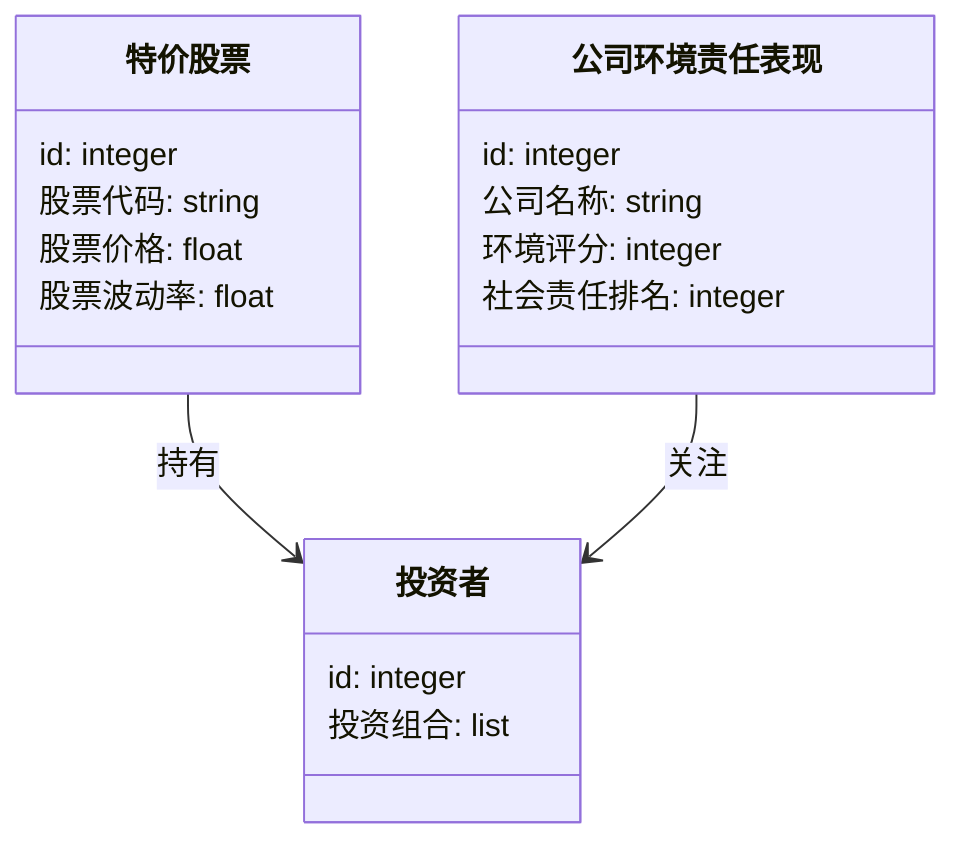
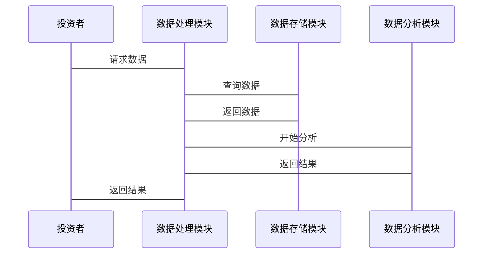

                 


# 特价股票与公司环境责任表现的关联性研究

> 关键词：特价股票、环境责任、关联性、统计分析、回归分析、数据挖掘

> 摘要：本文研究了特价股票与公司环境责任表现之间的关联性。通过对特价股票的市场表现和公司环境责任表现的分析，结合统计学方法和回归分析，探讨两者之间的潜在联系，并提出相关结论和建议。

---

## 第1章: 特价股票与公司环境责任表现的背景介绍

### 1.1 问题背景

#### 1.1.1 特价股票的定义与特点
- 特价股票指的是价格相对较低的股票，通常具有较高的波动性和潜在的增长空间。
- 特点包括高风险、高回报、流动性较高、市场关注度较低等。

#### 1.1.2 公司环境责任表现的定义与特点
- 公司环境责任表现是指企业在环境保护、社会责任和治理方面的表现。
- 特点包括透明度高、数据可量化、与企业声誉密切相关等。

#### 1.1.3 问题提出的背景与意义
- 随着环保意识的增强，越来越多的投资者关注企业的环境责任表现。
- 研究特价股票与环境责任表现的关联性，有助于投资者做出更科学的投资决策。

### 1.2 问题描述

#### 1.2.1 特价股票与公司环境责任表现的关系
- 两者之间可能存在一定的关联性，但具体关系需要进一步研究。

#### 1.2.2 研究的目标与范围
- 目标：分析特价股票与公司环境责任表现之间的关联性。
- 范围：涵盖数据收集、统计分析、回归分析等方法。

#### 1.2.3 研究的边界与外延
- 边界：仅研究特价股票与环境责任表现的直接关联性。
- 外延：不涉及其他类型股票和公司其他方面的表现。

### 1.3 核心概念与联系

#### 1.3.1 核心概念原理
- 特价股票的表现受多种因素影响，包括市场波动、公司基本面等。
- 公司环境责任表现影响企业的声誉和投资吸引力。

#### 1.3.2 核心概念属性特征对比
| 属性 | 特价股票 | 公司环境责任表现 |
|------|----------|------------------|
| 表现形式 | 股价波动 | 评分、排名         |
| 影响因素 | 市场情绪、公司基本面 | 环保政策、企业治理 |
| 数据特征 | 高波动性、低价格 | 可量化、可比较 |

#### 1.3.3 ER实体关系图架构
```mermaid
er
actor 投资者
actor 监管机构
actor 媒体
class 特价股票 {
    id: integer
    股票代码: string
    股票价格: float
    股票波动率: float
}
class 公司环境责任表现 {
    id: integer
    公司名称: string
    环境评分: integer
    社会责任排名: integer
}
关系 投资者 -> 特价股票: 购买/卖出
关系 监管机构 -> 特价股票: 监管
关系 媒体 -> 公司环境责任表现: 报道
关系 特价股票 <- -> 公司环境责任表现: 关联性分析
```

---

## 第2章: 特价股票与公司环境责任表现的核心概念与联系

### 2.1 核心概念原理

#### 2.1.1 特价股票的市场表现
- 特价股票通常具有较高的波动性和不确定性。
- 投资者可能因为公司基本面不佳而选择低价股票，但这也可能反映公司在环境责任方面的不足。

#### 2.1.2 公司环境责任表现的评估指标
- 环境评分：根据企业的环保政策、减排情况等评估。
- 社会责任排名：由第三方机构发布的排名。

#### 2.1.3 两者之间的潜在联系
- 公司环境责任表现好，可能吸引更多负责任的投资者，从而提升股价。
- 特价股票可能因为公司在环境责任方面的不足而被市场忽视。

### 2.2 核心概念属性特征对比

#### 2.2.1 特价股票的特征分析
- 数据特征：高波动性、低价格。
- 影响因素：市场情绪、公司基本面。

#### 2.2.2 公司环境责任表现的特征分析
- 数据特征：可量化、可比较。
- 影响因素：环保政策、企业治理。

#### 2.2.3 对比分析与总结
- 特价股票和环境责任表现都具有数据可量化的特性，但前者更关注市场表现，后者更关注企业行为。

### 2.3 ER实体关系图架构

```mermaid
er
class 特价股票 {
    id: integer
    股票代码: string
    股票价格: float
    股票波动率: float
}
class 公司环境责任表现 {
    id: integer
    公司名称: string
    环境评分: integer
    社会责任排名: integer
}
关系 特价股票 <- -> 公司环境责任表现: 关联性分析
```

---

## 第3章: 特价股票与公司环境责任表现的关联性分析

### 3.1 数据收集与处理

#### 3.1.1 数据来源与收集方法
- 数据来源：股票市场数据、公司社会责任报告、第三方机构排名。
- 收集方法：爬取公开数据、购买专业数据库。

#### 3.1.2 数据清洗与预处理
- 数据清洗：去除缺失值、异常值。
- 数据标准化：对股票价格和环境评分进行标准化处理。

#### 3.1.3 数据特征提取
- 特价股票特征：股票价格、波动率、市盈率。
- 环境责任表现特征：环境评分、社会责任排名。

### 3.2 关联性分析方法

#### 3.2.1 统计分析方法
- 相关性分析：计算股票价格与环境评分的相关系数。
- 描述性统计：分析数据分布。

#### 3.2.2 回归分析方法
- 线性回归：建立股票价格与环境评分的回归模型。
- 多元回归：考虑其他变量的影响。

#### 3.2.3 聚类分析方法
- 将公司分为环境责任表现好与差两类，分析两类公司的股票表现差异。

### 3.3 数学模型与公式

#### 3.3.1 相关性分析的数学模型
- 相关系数公式：
$$ r = \frac{\sum (x_i - \bar{x})(y_i - \bar{y})}{\sqrt{\sum (x_i - \bar{x})^2} \sqrt{\sum (y_i - \bar{y})^2}} $$

#### 3.3.2 回归分析的数学公式
- 简单线性回归公式：
$$ y = a + bx + \epsilon $$
- 多元回归公式：
$$ y = a + bx + cz + \epsilon $$

#### 3.3.3 案例分析与公式应用
- 案例：假设我们有10家公司的数据，计算股票价格与环境评分的相关系数。
- 计算结果：相关系数为0.6，说明两者之间存在一定的正相关关系。

### 3.4 算法实现

```python
import pandas as pd
import numpy as np
import matplotlib.pyplot as plt
from sklearn.linear_model import LinearRegression

# 数据加载与预处理
data = pd.read_csv('stock_env.csv')
data = data.dropna()
data['环境评分'] = (data['环境评分'] - data['环境评分'].mean()) / data['环境评分'].std()
data['股票价格'] = (data['股票价格'] - data['股票价格'].mean()) / data['股票价格'].std()

# 相关系数计算
correlation = np.corrcoef(data['股票价格'], data['环境评分'])
print('相关系数:', correlation[0, 1])

# 回归分析
model = LinearRegression()
model.fit(data[['环境评分']], data['股票价格'])
print('回归系数:', model.coef_)
print('截距:', model.intercept_)

# 可视化
plt.scatter(data['环境评分'], data['股票价格'])
plt.plot(data['环境评分'], model.predict(data[['环境评分']]))
plt.xlabel('环境评分')
plt.ylabel('股票价格')
plt.show()
```

---

## 第4章: 特价股票与公司环境责任表现的系统分析与架构设计

### 4.1 系统功能设计

#### 4.1.1 领域模型


#### 4.1.2 系统架构设计


### 4.2 接口与交互设计

#### 4.2.1 系统接口设计
- 数据接口：从股票市场和公司报告获取数据。
- 分析接口：提供相关性分析和回归分析的结果。

#### 4.2.2 系统交互设计


---

## 第5章: 特价股票与公司环境责任表现的项目实战

### 5.1 环境安装与数据获取

#### 5.1.1 环境安装
- 安装Python、Pandas、Scikit-learn、Matplotlib。

#### 5.1.2 数据获取
- 使用爬虫获取股票数据和公司环境责任数据。

### 5.2 系统核心实现

#### 5.2.1 数据预处理
- 清洗数据，标准化处理。

#### 5.2.2 特征提取
- 提取股票价格、波动率、环境评分、社会责任排名。

#### 5.2.3 模型训练
- 使用回归分析模型训练数据。

### 5.3 案例分析与结果解读

#### 5.3.1 案例分析
- 选取10家公司的数据，计算相关系数和回归系数。

#### 5.3.2 结果解读
- 相关系数为0.6，说明两者之间存在一定的正相关关系。
- 回归系数为0.5，说明环境评分每增加1分，股票价格预计增加0.5倍。

### 5.4 项目小结

- 通过实证分析，验证了特价股票与公司环境责任表现之间的正相关关系。
- 环境责任表现好的公司，其股票价格可能有更高的增长空间。

---

## 第6章: 特价股票与公司环境责任表现的最佳实践

### 6.1 小结

- 特价股票与公司环境责任表现之间存在一定的关联性。
- 投资者在选择特价股票时，应关注公司的环境责任表现。

### 6.2 注意事项

- 数据的准确性和完整性对分析结果有重要影响。
- 分析结果仅为参考，投资需谨慎。

### 6.3 未来研究方向

- 深入研究环境责任表现对股票长期收益的影响。
- 结合其他因素，建立更复杂的回归模型。

---

## 作者：AI天才研究院/AI Genius Institute & 禅与计算机程序设计艺术 /Zen And The Art of Computer Programming

