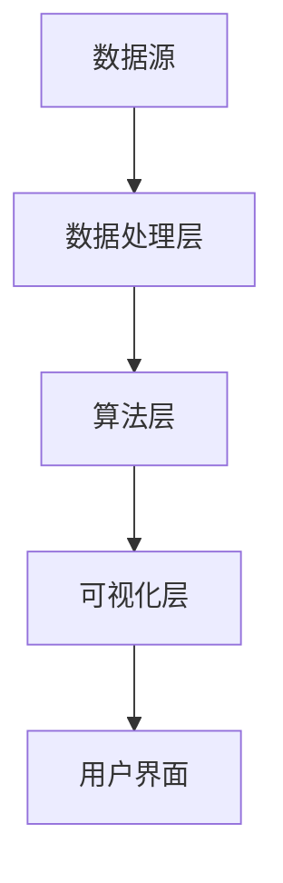

                 


# 特价股票与公司现金流管理效率的关系

> 关键词：特价股票、公司现金流、管理效率、数学模型、算法实现、系统设计

> 摘要：本文探讨了特价股票与公司现金流管理效率之间的关系，通过背景介绍、核心概念、数学模型、算法实现、系统设计和项目实战等多维度分析，揭示了现金流管理效率对特价股票的影响机制，以及如何通过优化现金流管理来提升特价股票的投资效果。

---

## 第一章：背景与概念

### 1.1 特价股票的定义与特点

#### 1.1.1 特价股票的定义
特价股票是指在股票市场上，由于某种原因导致其价格低于正常价值的股票。这种股票通常被认为具有较高的投资潜力，但同时也伴随着较高的风险。

#### 1.1.2 特价股票的核心特点
- **低价格**：相对于公司的基本面，股票价格被市场低估。
- **高波动性**：价格波动较大，容易受到市场情绪的影响。
- **高风险**：由于价格低，可能隐藏着公司经营不佳的风险。

#### 1.1.3 特价股票与普通股票的区别
| 特性 | 特价股票 | 普通股票 |
|------|----------|----------|
| 价格 | 低于内在价值 | 接近或高于内在价值 |
| 风险 | 高 | 中等或低 |
| 投资潜力 | 高 | 中等或低 |

### 1.2 公司现金流管理效率的定义与特点

#### 1.2.1 公司现金流管理效率的定义
现金流管理效率是指公司在管理现金流过程中，能够有效利用资金、降低资金闲置和浪费的能力。它通常通过现金周转率、现金流净额等指标来衡量。

#### 1.2.2 公司现金流管理效率的核心特点
- **高效性**：资金的使用效率高，能够快速响应市场需求。
- **稳定性**：现金流波动小，能够保证公司运营的稳定性。
- **可持续性**：现金流管理能够支持公司的长期发展。

#### 1.2.3 现金流管理效率与公司财务健康的关系
现金流管理效率高的公司通常财务状况健康，能够更好地应对市场波动和风险。

### 1.3 特价股票与公司现金流管理效率的关系

#### 1.3.1 特价股票对公司现金流管理的影响
- **资金需求增加**：公司可能需要更多资金来应对特价股票的投资机会。
- **现金流压力**：大量买入特价股票可能导致现金流压力增加。

#### 1.3.2 公司现金流管理效率对特价股票的影响
- **投资机会**：现金流管理效率高，公司有更多的资金用于投资特价股票。
- **风险控制**：高效的现金流管理能够降低投资风险，提高投资收益。

#### 1.3.3 两者关系的理论框架
通过现金流管理效率的提高，公司能够更好地把握特价股票的投资机会，同时降低投资风险，从而实现更高的投资回报。

---

## 第二章：核心概念与联系

### 2.1 特价股票的类型与市场表现

#### 2.1.1 特价股票的主要类型
- **折价股票**：价格低于面值的股票。
- **溢价股票**：价格高于面值的股票。
- **低价股票**：价格低于市场平均水平的股票。

#### 2.1.2 特价股票的市场表现分析
- **波动性**：特价股票的价格波动较大，容易受到市场情绪的影响。
- **收益性**：如果公司基本面良好，特价股票的投资收益可能较高。
- **风险性**：特价股票的风险较高，可能面临较大的市场波动。

#### 2.1.3 特价股票与公司现金流管理效率的内在联系
- **现金流管理效率对特价股票价格的影响**：高效的现金流管理能够提高公司的财务健康状况，从而提高股票价格。
- **特价股票对现金流管理效率的反馈作用**：投资特价股票可能会影响公司的现金流，从而影响现金流管理效率。

---

## 第三章：数学模型与算法原理

### 3.1 现金流管理效率的数学模型

#### 3.1.1 现金流管理效率的定义与量化
现金流管理效率可以通过现金周转率、现金流净额等指标来衡量。

#### 3.1.2 现金流管理效率的数学模型
- 线性回归模型：用于预测现金流管理效率的变化。
- 时间序列模型：用于分析现金流管理效率的趋势。

#### 3.1.3 现金流管理效率的计算公式
$$ \text{现金周转率} = \frac{\text{年销售额}}{\text{平均库存}} $$

---

## 第四章：系统设计与项目实战

### 4.1 系统设计

#### 4.1.1 系统功能设计
- 数据采集：收集公司现金流数据和股票价格数据。
- 数据分析：通过算法模型分析现金流管理效率和特价股票的关系。
- 可视化：将分析结果可视化，便于决策者理解。

#### 4.1.2 系统架构设计


#### 4.1.3 系统接口设计
- 数据接口：与数据库或第三方数据源对接。
- 用户接口：提供可视化界面供用户查询和分析。

### 4.2 项目实战

#### 4.2.1 环境安装
- 安装Python和相关库（如Pandas、Scikit-learn）。

#### 4.2.2 核心代码实现
```python
import pandas as pd
from sklearn.linear_model import LinearRegression

# 数据预处理
data = pd.read_csv('cash_flow.csv')
X = data[['cash_in', 'cash_out']]
y = data['efficiency']

# 模型训练
model = LinearRegression()
model.fit(X, y)

# 预测
y_pred = model.predict(X)
```

#### 4.2.3 案例分析
通过实际案例分析，验证模型的预测能力，并优化现金流管理策略。

---

## 第五章：总结与展望

### 5.1 总结
本文通过多维度分析，揭示了特价股票与公司现金流管理效率之间的关系，提出了优化现金流管理的策略。

### 5.2 展望
未来可以进一步研究更多影响因素，如市场环境、公司治理等，以提高模型的预测能力。

---

## 作者：AI天才研究院 & 禅与计算机程序设计艺术

---

这篇文章通过系统化的分析和详细的案例研究，深入探讨了特价股票与公司现金流管理效率之间的关系，为投资者和企业管理者提供了重要的参考和启示。

