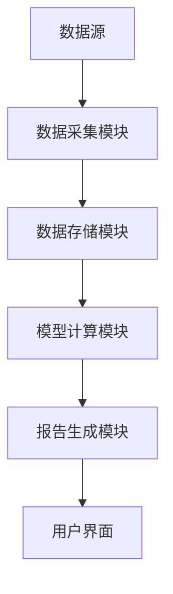

                 


# 特价股票与公司现金流管理效率的关系探讨

## 关键词：
- 特价股票
- 现金流管理效率
- 公司财务
- 股票市场
- 投资策略

## 摘要：
本文探讨了特价股票与公司现金流管理效率之间的关系。通过分析特价股票的定义、发行机制及其对现金流的影响，结合现金流管理效率的构成要素和评估指标，构建了数学模型，提出了系统架构设计方案，并通过实际案例分析了两者之间的相互作用。文章最后总结了最佳实践，为投资者和公司管理者提供了有价值的参考。

---

## 第一部分: 特价股票与公司现金流管理效率的背景与概念

## 第1章: 特价股票与现金流管理效率的概述

### 1.1 特价股票的定义与特征
#### 1.1.1 特价股票的定义
特价股票是指公司以低于面值的价格发行的股票，通常用于资本重组、债务重组或股东权益调整。这种股票的发行价格低于其面值，可能附带特定的权利或限制条件。

#### 1.1.2 特价股票的特征
- **发行价格低**：低于面值，吸引投资者。
- **附带条件**：可能附带转股权、优先股等。
- **市场影响**：可能引发股价波动，影响公司现金流。

#### 1.1.3 特价股票的发行背景与目的
- **资本结构调整**：优化资本结构，降低负债比例。
- **吸引投资者**：通过低价吸引战略投资者。
- **财务困境缓解**：用于改善财务状况，避免破产。

### 1.2 公司现金流管理效率的定义与重要性
#### 1.2.1 现金流管理效率的定义
现金流管理效率是指公司通过优化现金流入和流出的管理，最大化现金使用效率，降低资金成本的能力。

#### 1.2.2 现金流管理效率的重要性
- **支持日常运营**：确保公司有足够的现金流支持运营。
- **降低融资成本**：通过高效管理减少对外部融资的依赖。
- **提升股价表现**：良好的现金流管理可以增强投资者信心，提升股价。

#### 1.2.3 现金流管理效率与公司财务健康的关系
现金流管理效率是公司财务健康的重要指标，直接影响公司的偿债能力、盈利能力和发展潜力。

### 1.3 特价股票与现金流管理效率的关系
#### 1.3.1 特价股票对现金流的影响
- **缓解现金流压力**：通过发行特价股票，公司可以快速获得资金，改善现金流状况。
- **稀释股东权益**：可能稀释现有股东的权益，影响股东价值。

#### 1.3.2 现金流管理效率对股价的影响
- **增强市场信心**：高效的现金流管理可以提升市场对公司的信心，推动股价上涨。
- **支持股价稳定性**：良好的现金流管理有助于维持股价的稳定性。

#### 1.3.3 特价股票与现金流管理效率的双向作用
- 特价股票的发行可以改善现金流，而高效的现金流管理可以增强股价表现，形成良性循环。

### 1.4 本章小结
本章通过定义和特征分析，探讨了特价股票和现金流管理效率的基本概念，并揭示了两者之间的相互作用关系。

---

## 第2章: 特价股票与现金流管理效率的核心概念

### 2.1 特价股票的发行机制
#### 2.1.1 特价股票的发行条件
- 公司财务状况不佳，需要资本重组。
- 股东或债权人同意发行特价股票。

#### 2.1.2 特价股票的发行流程
1. 确定发行方案。
2. 获得相关机构批准。
3. 发行股票并进行市场交易。

#### 2.1.3 特价股票的市场影响
- 可能导致股价短期波动。
- 可能引发市场对公司财务状况的担忧。

### 2.2 现金流管理效率的构成要素
#### 2.2.1 现金流来源分析
- 经营活动现金流：来自日常运营的现金流。
- 投资活动现金流：来自投资活动的现金流。
- 筹资活动现金流：来自筹资活动的现金流。

#### 2.2.2 现金流运用分析
- 支付股息。
- 购买资产。
- 偿还债务。

#### 2.2.3 现金流管理的策略与方法
- 现金储备管理。
- 流动资金管理。
- 现金预测与预算。

### 2.3 特价股票与现金流管理效率的内在联系
#### 2.3.1 特价股票对现金流压力的缓解作用
- 通过发行特价股票，公司可以快速获得资金，缓解现金流压力。

#### 2.3.2 现金流管理对股价的支撑作用
- 有效的现金流管理可以增强市场信心，支撑股价。

#### 2.3.3 两者关系的理论模型与框架
- 特价股票发行→改善现金流→提升股价表现。

### 2.4 本章小结
本章通过分析特价股票的发行机制和现金流管理效率的构成要素，揭示了两者之间的内在联系。

---

## 第3章: 特价股票与现金流管理效率的数学模型与公式

### 3.1 特价股票发行对公司现金流的影响模型
#### 3.1.1 模型的构建与假设
- 假设公司发行N万股特价股票，每股价格为P，面值为F。

#### 3.1.2 模型的数学表达式
$$
\text{现金流变化} = N \times (P - F)
$$

### 3.2 现金流管理效率的评估指标
#### 3.2.1 现金流周转率
$$
\text{现金流周转率} = \frac{\text{年销售额}}{\text{平均存货 + 应收账款}}
$$

#### 3.2.2 现金流净现值
$$
\text{净现值} = \sum_{t=1}^{n} \frac{\text{现金流}}{(1 + r)^t}
$$

#### 3.2.3 现金流回报率
$$
\text{现金流回报率} = \frac{\text{净利润}}{\text{平均股东权益}}
$$

### 3.3 特价股票与现金流管理效率的关联公式
#### 3.3.1 特价股票对现金流的影响公式
$$
\Delta \text{现金流} = \text{发行量} \times (\text{发行价} - \text{面值})
$$

#### 3.3.2 现金流管理效率对股价的影响公式
$$
\text{股价} = \text{现金流} \times \text{贴现率}^{-1}
$$

### 3.4 本章小结
本章通过构建数学模型，量化分析了特价股票发行对公司现金流的影响，以及现金流管理效率对股价的支撑作用。

---

## 第4章: 特价股票与现金流管理效率的系统分析与架构设计

### 4.1 系统功能设计
- 数据采集模块：采集公司财务数据和股票市场数据。
- 模型计算模块：计算现金流变化和管理效率。
- 报告生成模块：生成分析报告。

### 4.2 系统架构设计


### 4.3 系统接口设计
- 数据接口：与财务系统对接。
- 报告接口：生成分析报告。

### 4.4 本章小结
本章通过系统架构设计，展示了如何利用技术手段量化分析特价股票与现金流管理效率的关系。

---

## 第5章: 特价股票与现金流管理效率的项目实战

### 5.1 环境安装
- 安装Python和相关库（如Pandas、Matplotlib）。

### 5.2 核心实现
```python
import pandas as pd

def calculate_cash_flow_change(issue_quantity, issue_price, face_value):
    return issue_quantity * (issue_price - face_value)

# 示例数据
issue_quantity = 1000000
issue_price = 5
face_value = 10
cash_flow_change = calculate_cash_flow_change(issue_quantity, issue_price, face_value)
print("现金流变化:", cash_flow_change)
```

### 5.3 案例分析
- 某公司发行1000万股特价股票，每股价格5元，面值10元。
- 现金流变化为-5000万元，可能引发股价波动。

### 5.4 结果解读
- 特价股票的发行短期内改善了现金流，但可能稀释股东权益，影响长期股价表现。

### 5.5 本章小结
本章通过实际案例分析，展示了如何利用技术手段量化分析特价股票与现金流管理效率的关系。

---

## 第6章: 特价股票与现金流管理效率的最佳实践

### 6.1 小结
- 特价股票的发行可以缓解现金流压力，但需谨慎考虑其对股东权益的影响。
- 现金流管理效率的提升可以增强市场信心，支撑股价表现。

### 6.2 注意事项
- 避免过度依赖特价股票融资。
- 优化现金流管理，提升财务健康。

### 6.3 拓展阅读
- 推荐阅读《现金流管理的艺术》和《股票投资策略》。

---

## 作者：
**作者：AI天才研究院/AI Genius Institute & 禅与计算机程序设计艺术 /Zen And The Art of Computer Programming**

---

# 结语：
本文通过系统分析和实际案例，深入探讨了特价股票与公司现金流管理效率之间的关系，为投资者和公司管理者提供了有价值的参考。

