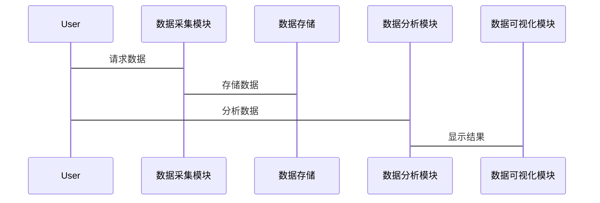

                 


# 特价股票与公司盈利能力的长期关系

> 关键词：特价股票，公司盈利能力，长期关系，财务指标，市场分析，投资策略，数学模型

> 摘要：本文探讨特价股票与公司盈利能力之间的长期关系，分析特价股票的属性、盈利能力的核心指标以及它们之间的数学模型。通过案例分析、系统架构设计和投资策略，帮助读者理解如何利用特价股票提升公司长期盈利能力。

---

## 第一部分: 特价股票与公司盈利能力的背景与基础

### 第1章: 特价股票与公司盈利能力概述

#### 1.1 特价股票的定义与特点
- **1.1.1 特价股票的定义**  
  特价股票是指价格显著低于市场平均水平的股票，通常反映公司短期困境或市场低估。  
- **1.1.2 特价股票的特点**  
  - 价格波动大，风险高。  
  - 市场流动性较低，交易量小。  
  - 具备潜在反弹空间，吸引价值投资者。  
- **1.1.3 特价股票的分类与应用场景**  
  根据公司规模、行业和财务状况分类，用于短期套利或长期价值投资。

#### 1.2 公司盈利能力的核心指标
- **1.2.1 净利润与盈利能力的定义**  
  净利润是公司利润的核心指标，反映公司整体盈利能力。  
- **1.2.2 资产回报率与股东权益回报率**  
  - 资产回报率（ROA）衡量资产使用效率。  
  - 股东权益回报率（ROE）反映股东投资回报。  
- **1.2.3 盈利能力分析的维度**  
  包括利润率、成本控制、市场竞争力等方面。

#### 1.3 特价股票与公司盈利能力的关系
- **1.3.1 特价股票对盈利能力的影响**  
  低价股票可能因公司困境而拖累盈利能力。  
- **1.3.2 盈利能力对股价波动的反向影响**  
  盈利能力提升通常伴随股价上涨。  
- **1.3.3 特价股票与盈利能力的长期关联性**  
  长期盈利能力提升可能带动股价回升，摆脱特价股票状态。

#### 1.4 本章小结
本章概述了特价股票和盈利能力的基本概念，分析了它们的属性和相互关系，为后续分析奠定基础。

---

## 第二部分: 特价股票与公司盈利能力的核心概念与联系

### 第2章: 特价股票与公司盈利能力的核心概念

#### 2.1 特价股票的属性特征
- **2.1.1 特价股票的价格波动性**  
  易受市场情绪影响，波动剧烈。  
- **2.1.2 特价股票的市场流动性**  
  交易量小，买卖价差大。  
- **2.1.3 特价股票的估值差异性**  
  可能因市场低估而价格低于实际价值。

#### 2.2 公司盈利能力的属性特征
- **2.2.1 盈利能力的周期性**  
  受经济周期影响，波动明显。  
- **2.2.2 盈利能力的行业差异性**  
  不同行业盈利能力标准不同。  
- **2.2.3 盈利能力的可持续性**  
  长期盈利能力依赖于成本控制和市场竞争力。

#### 2.3 特价股票与盈利能力的对比分析
- **2.3.1 特价股票与盈利能力的对比表格**  
  | 属性 | 特价股票 | 盈利能力 |
  |------|----------|----------|
  | 定义 | 低价股票 | 净利润等指标 |
  | 特点 | 波动大，流动性低 | 受经济周期影响 |
  | 关系 | 可能拖累盈利能力 | 影响股价波动 |
  
- **2.3.2 特价股票与盈利能力的ER实体关系图**

```mermaid
erDiagram
    company
    stock_price
    profitability
    company --|{拥有} stock_price
    company --|{影响} profitability
    profitability --|{反映} stock_price
```

### 第3章: 特价股票与公司盈利能力的数学模型与公式

#### 3.1 特价股票与盈利能力的回归模型
- **3.1.1 线性回归模型的构建**
  使用历史数据，建立股价与盈利能力的回归模型：
  $$ \text{股价} = \beta_0 + \beta_1 \times \text{净利润率} + \epsilon $$

- **3.1.2 回归系数的解释与验证**
  - $\beta_1$ 表示净利润率对股价的影响程度。
  - 使用R²值验证模型优度。

- **3.1.3 回归模型的优度检验**
  使用F检验和t检验，确保模型显著性。

#### 3.2 盈利能力预测的数学公式
- **3.2.1 净利润预测公式**
  $$ \text{净利润} = \text{收入} - \text{成本} - \text{税费} $$

- **3.2.2 资产回报率预测公式**
  $$ \text{ROA} = \frac{\text{净利润}}{\text{平均资产}} $$

- **3.2.3 股东权益回报率预测公式**
  $$ \text{ROE} = \frac{\text{净利润}}{\text{股东权益}} $$

#### 3.3 特价股票与盈利能力的关联性分析
- **3.3.1 协方差与相关系数的计算**
  - 协方差衡量两者变动方向。
  - 相关系数衡量相关性强度。

- **3.3.2 相关性分析的数学模型**
  $$ \text{相关系数} = \frac{\text{协方差}(X,Y)}{\sigma_X \sigma_Y} $$

- **3.3.3 相关性分析的可视化**
  使用散点图和热力图展示相关性。

---

## 第三部分: 特价股票与公司盈利能力的系统架构与实践

### 第4章: 特价股票与公司盈利能力的系统分析

#### 4.1 问题场景介绍
- 数据来源：历史股价、财务报表、行业报告。
- 项目目标：分析特价股票与盈利能力的长期关系。

#### 4.2 系统功能设计
- 数据采集模块：收集历史数据。
- 数据分析模块：构建回归模型。
- 可视化模块：展示分析结果。

#### 4.3 系统架构设计


#### 4.4 系统接口设计
- 数据接口：API获取实时数据。
- 分析接口：调用回归模型进行预测。

#### 4.5 系统交互设计


### 第5章: 投资策略与风险管理

#### 5.1 投资策略
- 价值投资：选择被低估的特价股票。
- 风险控制：分散投资，避免单一股票风险。

#### 5.2 风险管理
- 设置止损点：避免重大损失。
- 定期评估：跟踪公司盈利能力变化。

### 第6章: 特价股票与公司盈利能力的长期影响

#### 6.1 特价股票对长期盈利能力的影响
- 低股价可能反映公司困境，长期盈利能力可能受抑。

#### 6.2 公司盈利能力对股价的反向影响
- 盈利能力提升带动股价上涨，脱离特价股票状态。

#### 6.3 投资者视角：特价股票的长期机会
- 寻找被低估的公司，长期持有，伴随盈利能力提升而获益。

---

## 第四部分: 总结与展望

### 第7章: 总结与展望

#### 7.1 本章小结
- 特价股票与盈利能力密切相关，需结合公司基本面分析。

#### 7.2 未来展望
- 进一步研究宏观经济因素对两者的影响。
- 探索更多数学模型和机器学习算法的应用。

---

## 作者信息

作者：AI天才研究院/AI Genius Institute & 禅与计算机程序设计艺术/Zen And The Art of Computer Programming  
联系方式：[contact@ai-genius.com](mailto:contact@ai-genius.com)  

---

这篇文章系统地分析了特价股票与公司盈利能力的长期关系，结合理论、数学模型和实际案例，为投资者提供了有价值的见解和策略。

