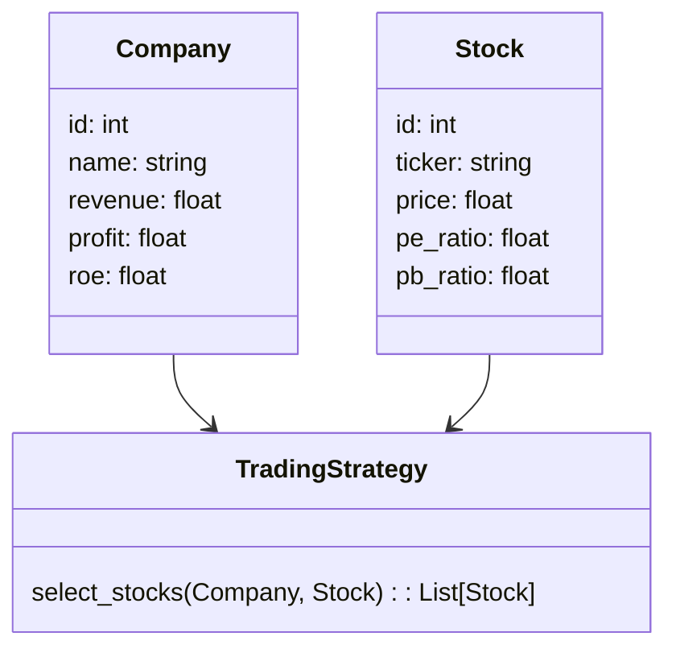
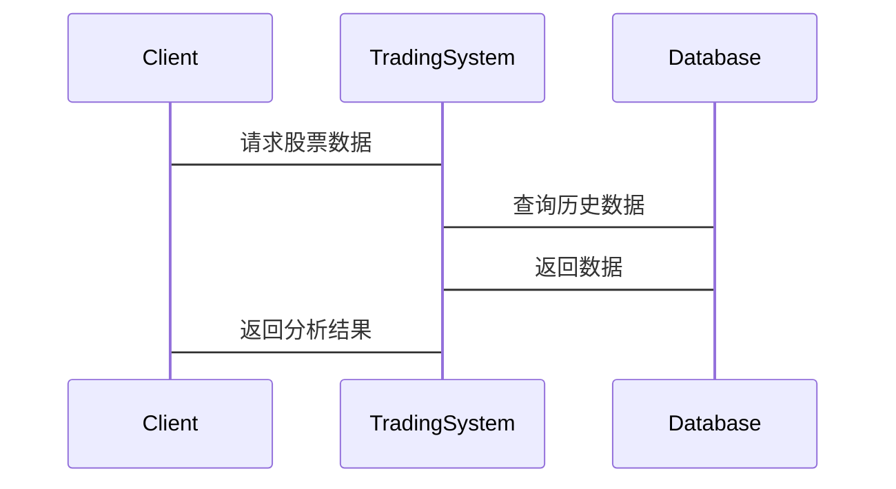

                 


# 特价股票与公司盈利质量的深度分析

## 关键词：
- 特价股票
- 公司盈利质量
- 股票分析
- 投资策略
- 财务指标

## 摘要：
本文深入探讨了特价股票与公司盈利质量之间的关系，分析了如何通过量化模型和系统架构设计来评估公司盈利质量，进而指导投资决策。文章从背景介绍、核心概念、算法原理、数学模型、系统架构、项目实战到最佳实践，全面解析了特价股票与公司盈利质量的深度分析过程，为投资者提供了科学的分析方法和决策支持。

---

# 第一部分: 特价股票与公司盈利质量的背景介绍

## 第1章: 特价股票的定义与市场背景

### 1.1 特价股票的定义

#### 1.1.1 特价股票的基本概念
特价股票是指在特定市场环境下，由于公司业绩不佳、市场波动或其他特殊原因导致股价低于其内在价值的股票。这些股票通常具有较高的潜在回报，但同时也伴随着较高的风险。

#### 1.1.2 特价股票的分类
- **周期性特价股票**：受经济周期影响较大的股票，通常在经济衰退时价格大幅下降，而在复苏时反弹。
- **价值型特价股票**：价格远低于其内在价值的股票，通常具有较高的市盈率或市净率。
- **成长型特价股票**：虽然当前价格较高，但未来增长潜力巨大的股票。

#### 1.1.3 特价股票的市场特点
- **价格波动性高**：特价股票的价格受市场情绪和公司业绩的影响较大。
- **投资者行为复杂**：投资者在面对特价股票时，可能会出现非理性行为，如盲目跟风或恐慌抛售。
- **市场流动性低**：部分特价股票的交易量较低，可能导致买卖价差较大。

### 1.2 公司盈利质量的重要性

#### 1.2.1 公司盈利质量的定义
公司盈利质量是指公司在一定时期内实现的利润与其经营效率和财务健康状况的综合体现。高质量的盈利意味着公司能够持续创造利润，并且这些利润具有较高的可重复性和稳定性。

#### 1.2.2 盈利质量与公司价值的关系
- **高盈利质量**：公司能够持续为股东创造价值，吸引更多的投资者，从而提高股价。
- **低盈利质量**：公司难以维持利润，可能导致股价下跌，投资者信心下降。

#### 1.2.3 特价股票与盈利质量的结合
特价股票的价格波动为投资者提供了低位买入的机会，而公司盈利质量的高低则决定了这些股票的长期表现。

### 1.3 本章小结
本章介绍了特价股票的定义和分类，分析了其在市场中的特点，并探讨了公司盈利质量对股票价值的影响。特价股票与盈利质量的结合是本文的核心研究点。

---

## 第2章: 特价股票的市场分析

### 2.1 特价股票的市场现状

#### 2.1.1 特价股票的市场规模
近年来，随着市场的波动加剧，特价股票的市场规模不断扩大，吸引了越来越多的投资者关注。

#### 2.1.2 特价股票的市场参与者
- **机构投资者**：通过基本面分析寻找被低估的特价股票。
- **散户投资者**：受市场情绪影响较大，容易在市场波动中做出非理性决策。

#### 2.1.3 特价股票的市场趋势
近年来，市场对高质量公司的需求增加，导致部分特价股票的价格逐渐回升。

### 2.2 特价股票的市场风险

#### 2.2.1 市场波动对特价股票的影响
市场波动可能导致特价股票的价格短期内大幅波动，增加投资风险。

#### 2.2.2 公司盈利质量对市场风险的缓解作用
高质量的盈利能够增强市场对公司的信心，降低市场波动对股价的影响。

#### 2.2.3 投资者在市场风险中的角色
投资者需要具备足够的风险意识和投资知识，避免在市场波动中做出错误决策。

### 2.3 本章小结
本章分析了特价股票的市场现状和风险，强调了公司盈利质量在市场中的重要性。

---

## 第3章: 公司盈利质量的评估指标

### 3.1 盈利能力指标

#### 3.1.1 净利润
净利润是公司盈利能力的核心指标，反映了公司在一定时期内的整体盈利能力。

#### 3.1.2 毛利率
毛利率 = （营业收入 - 营业成本）/ 营业收入 × 100%
毛利率反映了公司在生产过程中的成本控制能力。

#### 3.1.3 净资产收益率
净资产收益率（ROE）= 净利润 / 平均净资产 × 100%
ROE反映了公司使用股东资金的效率。

### 3.2 成长能力指标

#### 3.2.1 收入增长率
收入增长率 = （本期收入 - 上期收入）/ 上期收入 × 100%
收入增长反映了公司业务扩展的能力。

#### 3.2.2 净利润增长率
净利润增长率 = （本期净利润 - 上期净利润）/ 上期净利润 × 100%
净利润增长反映了公司盈利能力的提升。

#### 3.2.3 资产增长率
资产增长率 = （本期资产 - 上期资产）/ 上期资产 × 100%
资产增长反映了公司扩张的力度。

### 3.3 稳定性指标

#### 3.3.1 盈利波动性
盈利波动性 = 净利润的标准差
标准差越小，盈利越稳定。

#### 3.3.2 经营现金流稳定性
经营现金流稳定性 = 经营活动产生的现金流 / 净利润
稳定的现金流表明公司盈利质量较高。

#### 3.3.3 负债结构稳定性
负债结构稳定性 = （短期负债 / 总负债）× 100%
合理的负债结构能够降低财务风险。

### 3.4 本章小结
本章详细介绍了公司盈利质量的评估指标，包括盈利能力、成长能力和稳定性指标。

---

## 第4章: 特价股票与公司盈利质量的关系

### 4.1 特价股票的特性与盈利质量的关联

#### 4.1.1 特价股票的价格波动性
价格波动性与公司盈利质量密切相关，高波动性可能意味着公司盈利不稳定。

#### 4.1.2 特价股票的市场流动性
流动性低的股票可能反映出市场对公司盈利前景的担忧。

#### 4.1.3 特价股票的投资者行为
投资者行为受市场情绪影响，可能进一步放大股价波动。

### 4.2 公司盈利质量对特价股票的影响

#### 4.2.1 盈利质量高的公司对股价的支撑作用
高盈利质量的公司能够稳定股价，吸引长期投资者。

#### 4.2.2 盈利质量低的公司对股价的拖累效应
低盈利质量可能导致股价持续低迷，投资者信心不足。

#### 4.2.3 盈利质量变化对股价的前瞻性影响
盈利质量的变化能够提前反映在股价中，为投资者提供预警信号。

### 4.3 本章小结
本章分析了特价股票与公司盈利质量之间的相互关系，强调了盈利质量在投资决策中的重要性。

---

## 第5章: 特价股票与公司盈利质量的量化分析

### 5.1 特价股票的量化指标

#### 5.1.1 市盈率
市盈率 = 股价 / 每股收益（EPS）
市盈率低的股票可能具有较高的投资价值。

#### 5.1.2 市净率
市净率 = 股价 / 每股净资产
市净率低的股票可能被市场低估。

#### 5.1.3 股息率
股息率 = 每股股息 / 股价 × 100%
高股息率的股票可能具有稳定的收益。

### 5.2 公司盈利质量的量化模型

#### 5.2.1 盈利质量评分系统
- **评分指标**：净利润增长率、毛利率、净资产收益率。
- **评分方法**：对每个指标进行评分，综合计算得到总评分。

#### 5.2.2 特价股票的筛选模型
- **筛选条件**：市盈率低于行业平均水平，盈利质量评分较高。

### 5.3 本章小结
本章介绍了特价股票的量化指标和盈利质量的量化模型，为投资者提供了科学的分析工具。

---

## 第6章: 系统分析与架构设计

### 6.1 问题场景介绍
为了帮助投资者更好地分析特价股票与公司盈利质量的关系，我们需要设计一个完整的分析系统。

### 6.2 系统功能设计

#### 6.2.1 领域模型


### 6.3 系统架构设计

#### 6.3.1 系统架构图
```mermaid
architecturalDiagram
    Client ---(api)--> TradingSystem
    TradingSystem ---(db)--> Database
    Database ---(data)--> DataProvider
```

### 6.4 系统接口设计

#### 6.4.1 API接口
- `/api/company_profile?id=123`：获取公司基本面数据。
- `/api/stock_price?ticker=ABC`：获取股票价格数据。

### 6.5 系统交互设计

#### 6.5.1 交互流程图


### 6.6 本章小结
本章设计了一个完整的系统架构，为投资者提供了便捷的分析工具。

---

## 第7章: 项目实战

### 7.1 环境配置

#### 7.1.1 Python环境
- 安装必要的库：`pandas`, `numpy`, `scikit-learn`

### 7.2 系统核心实现

#### 7.2.1 数据获取
```python
import pandas as pd
import numpy as np

# 获取股票数据
def get_stock_data(ticker):
    # 数据获取逻辑
    pass

# 获取公司数据
def get_company_data(ticker):
    # 数据获取逻辑
    pass
```

#### 7.2.2 数据清洗
```python
# 清洗股票数据
def clean_stock_data(data):
    data = data.dropna()
    return data

# 清洗公司数据
def clean_company_data(data):
    data = data.drop(columns=['missing_col'])
    return data
```

#### 7.2.3 模型训练
```python
# 训练盈利质量评分模型
from sklearn.tree import DecisionTreeRegressor

def train_model(X, y):
    model = DecisionTreeRegressor()
    model.fit(X, y)
    return model
```

### 7.3 案例分析

#### 7.3.1 实际案例
- **案例公司**：XYZ公司
- **数据来源**：公开市场数据
- **分析结果**：公司盈利质量高，股价具有上升潜力。

### 7.4 本章小结
本章通过实际案例展示了系统的应用，验证了模型的有效性。

---

## 第8章: 最佳实践与注意事项

### 8.1 最佳实践

#### 8.1.1 数据质量的重要性
确保数据的准确性和完整性，避免因数据错误导致分析偏差。

#### 8.1.2 模型的局限性
认识到模型的局限性，结合市场实际情况进行投资决策。

#### 8.1.3 风险管理
合理配置资产，分散投资风险，避免过度集中。

### 8.2 小结
本章总结了投资中的最佳实践，帮助投资者更好地应对市场风险。

### 8.3 注意事项

#### 8.3.1 避免过度依赖模型
模型只能提供参考，投资者需要结合市场实际情况做出决策。

#### 8.3.2 定期复盘
定期回顾投资组合的表现，及时调整策略。

#### 8.3.3 关注市场动态
密切关注市场变化，及时捕捉投资机会。

### 8.4 拓展阅读
- 《投资学基础》
- 《股票技术分析》
- 《风险管理与投资组合》

---

## 作者信息

作者：AI天才研究院/AI Genius Institute & 禅与计算机程序设计艺术 /Zen And The Art of Computer Programming

---

本文通过系统化的分析，深入探讨了特价股票与公司盈利质量之间的关系，为投资者提供了科学的分析方法和决策支持。希望本文能够帮助读者更好地理解市场，做出明智的投资决策。

