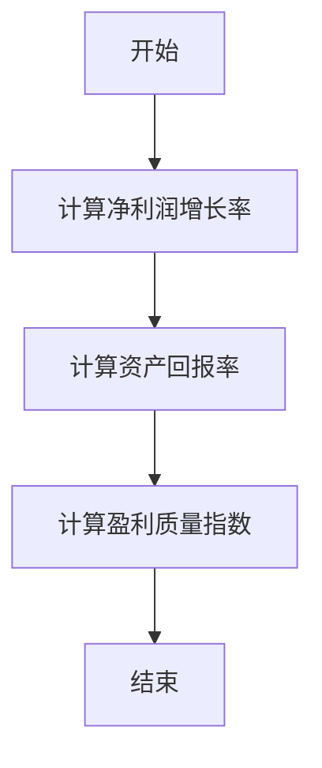
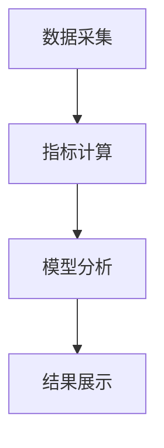

                 


# 特价股票与公司盈利质量的深度分析方法

## 关键词：特价股票、公司盈利质量、财务指标、数学模型、投资分析

## 摘要：本文详细探讨了特价股票与公司盈利质量之间的关系，分析了如何通过财务和非财务指标评估公司盈利质量，并结合数学模型和实际案例，展示了如何在特价股票市场中进行深度分析，以指导投资决策。

---

## 第1章: 特价股票与公司盈利质量的背景介绍

### 1.1 特价股票的定义与特点

#### 1.1.1 特价股票的定义
特价股票是指价格低于市场平均水平的股票，通常具有较高的投资吸引力。其特点包括低估值、高潜力和风险较低。

#### 1.1.2 特价股票的特点
- 低价格：相对于市场平均水平，股价处于低位。
- 高潜力：可能因市场变化或公司业绩提升而上涨。
- 风险较低：通常出现在市场低迷期或公司短期问题。

### 1.2 公司盈利质量的定义

#### 1.2.1 盈利质量的定义
盈利质量是指公司在一定时期内实现利润的能力，不仅关注利润的多少，还关注利润的来源和可持续性。

#### 1.2.2 盈利质量的核心要素
- 净利润：公司扣除所有费用后的利润。
- 毛利率：衡量产品或服务的盈利能力。
- 资产回报率：评估公司资产使用效率。

### 1.3 特价股票与公司盈利质量的结合

#### 1.3.1 结合的意义
通过分析公司盈利质量，投资者可以识别那些价格低廉但盈利能力强的股票，从而实现高回报。

#### 1.3.2 分析的重要性
帮助投资者避免因价格低廉但盈利能力差而带来的风险。

---

## 第2章: 特价股票与公司盈利质量的核心概念

### 2.1 特价股票的分析方法

#### 2.1.1 财务指标分析
- 净利润：反映公司整体盈利能力。
- 毛利率：衡量产品或服务的盈利能力。
- 现金流：评估公司财务健康状况。

#### 2.1.2 非财务指标分析
- 市场地位：公司在行业中的地位。
- 管理团队：公司领导层的能力和稳定性。

### 2.2 公司盈利质量的分析方法

#### 2.2.1 财务指标分析
- 净利润增长率：衡量利润增长速度。
- 资产回报率：评估资产使用效率。
- 资本回报率：衡量资本投入的回报。

#### 2.2.2 非财务指标分析
- 产品竞争力：产品的市场竞争力。
- 创新能力：公司的研发能力和新产品推出能力。

---

## 第3章: 特价股票与公司盈利质量的分析方法

### 3.1 综合分析模型

#### 3.1.1 模型构建
通过财务和非财务指标的综合评估，构建一个评分系统，量化公司的盈利质量。

#### 3.1.2 模型应用
将模型应用于实际股票分析，筛选出具有高盈利质量和低价位的股票。

### 3.2 案例分析

#### 3.2.1 案例选择
选择一家具有代表性的公司，分析其财务和非财务指标，评估其盈利质量。

#### 3.2.2 分析结果
展示分析结果，说明如何根据模型选择合适的特价股票。

---

## 第4章: 特价股票与公司盈利质量的数学模型与算法

### 4.1 盈利质量指数模型

#### 4.1.1 模型公式
$$
\text{盈利质量指数} = \frac{\text{净利润增长率} + \text{资产回报率}}{2}
$$

#### 4.1.2 模型解释
通过上述公式计算公司的盈利质量指数，指数越高，表示盈利质量越好。

### 4.2 算法实现

#### 4.2.1 算法流程图


#### 4.2.2 Python代码实现
```python
def calculate_profit_quality_index(net_profit_growth, asset_return):
    return (net_profit_growth + asset_return) / 2

# 示例数据
net_profit_growth = 15  # %
asset_return = 20  # %
quality_index = calculate_profit_quality_index(net_profit_growth, asset_return)
print(f"盈利质量指数: {quality_index}")
```

---

## 第5章: 特价股票与公司盈利质量的系统分析与架构设计

### 5.1 系统功能设计

#### 5.1.1 功能模块
- 数据采集模块：收集公司财务数据和市场数据。
- 指标计算模块：计算各项财务和非财务指标。
- 模型分析模块：应用盈利质量指数模型进行评估。
- 结果展示模块：以可视化形式呈现分析结果。

#### 5.1.2 功能流程图


### 5.2 系统架构设计

#### 5.2.1 系统架构图


---

## 第6章: 特价股票与公司盈利质量的项目实战

### 6.1 环境安装

#### 6.1.1 安装Python
```bash
python --version
pip install numpy pandas matplotlib
```

### 6.2 核心代码实现

#### 6.2.1 数据处理
```python
import pandas as pd

data = pd.read_csv('company_data.csv')
print(data.head())
```

#### 6.2.2 指标计算
```python
net_profit_growth = (data['净利润'] - data['净利润'].shift(1)) / data['净利润'].shift(1)
asset_return = data['净利润'] / data['总资产']
quality_index = (net_profit_growth + asset_return) / 2
```

### 6.3 实际案例分析

#### 6.3.1 数据解读
分析某公司过去三年的财务数据，计算其盈利质量指数。

#### 6.3.2 结果分析
展示分析结果，解释如何根据结果选择投资标的。

---

## 第7章: 特价股票与公司盈利质量的最佳实践

### 7.1 小结

#### 7.1.1 总结内容
通过本文的分析方法，投资者可以更科学地选择特价股票，实现稳健投资。

### 7.2 注意事项

#### 7.2.1 风险提示
- 市场波动风险
- 公司基本面变化风险
- 模型局限性

### 7.3 拓展阅读

#### 7.3.1 推荐书籍
- 《投资学基础》
- 《股票技术分析入门》

#### 7.3.2 在线资源
- 投资分析网站
- 数据分析工具

---

## 作者：AI天才研究院 & 禅与计算机程序设计艺术

---

以上内容详细介绍了特价股票与公司盈利质量的分析方法，结合理论和实践，为投资者提供了科学的决策依据。

