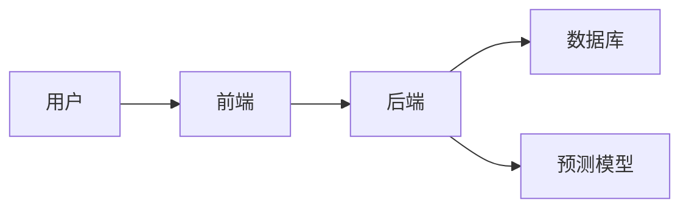

                 


# 特价股票与公司知识产权价值的关系分析

## 关键词：
特价股票，知识产权，股价影响，价值评估，经济分析

## 摘要：
本文分析了特价股票与公司知识产权价值之间的关系，探讨了知识产权如何影响股价，并提出了基于数学模型的评估方法。通过实证分析和案例研究，本文揭示了知识产权在股价波动中的重要作用，并为投资者提供了实用的评估工具和策略。

---

## 第一部分: 特价股票与公司知识产权价值关系的背景与概念

### 第1章: 特价股票与公司知识产权价值的概述

#### 1.1 特价股票的定义与特点
##### 1.1.1 特价股票的定义
特价股票是指在特定市场条件下，价格低于其内在价值的股票。这些股票通常被认为具有较高的投资潜力，因为它们可能被市场低估。

##### 1.1.2 特价股票的特点
- **低估值**：股票价格低于行业平均水平或历史平均水平。
- **高潜力**：具有较高的增长潜力，未来可能有较大的上涨空间。
- **风险较高**：通常属于周期性行业，市场波动较大。

##### 1.1.3 特价股票的分类与应用场景
- **周期性股票**：如能源、材料等行业，在经济周期波动中价格波动较大。
- **成长型股票**：价格虽低，但具有较高的成长潜力。
- **价值型股票**：价格低于其内在价值，适合长期投资。

#### 1.2 公司知识产权的定义与特点
##### 1.2.1 知识产权的定义
知识产权是指法律保护的智力成果，包括专利、商标、版权等。

##### 1.2.2 知识产权的核心要素
- **专利**：技术保护，防止他人侵权。
- **商标**：品牌保护，增强市场竞争力。
- **版权**：文学、艺术作品的保护。

##### 1.2.3 知识产权的保护与价值评估
- **保护**：通过法律手段防止他人滥用。
- **评估**：需要考虑技术先进性、市场应用前景等因素。

#### 1.3 特价股票与公司知识产权价值的关系
##### 1.3.1 特价股票与公司价值的关系
- **低估与价值回归**：当公司价值被市场低估时，股票价格可能被低估。
- **市场情绪影响**：投资者情绪波动会影响股票价格。

##### 1.3.2 知识产权对股价的影响
- **正向影响**：拥有核心专利或技术的公司，其股价可能被高估。
- **负向影响**：知识产权纠纷可能导致股价下跌。

##### 1.3.3 特价股票与知识产权价值的互动机制
- **价值发现**：知识产权的价值被市场发现后，股价可能上涨。
- **市场反应**：重大知识产权事件（如专利授权）可能引发股价波动。

### 第2章: 特价股票与公司知识产权价值关系的核心概念与联系

#### 2.1 特价股票与公司知识产权价值的核心概念
##### 2.1.1 特价股票的市场定价机制
- **市场供需**：供需关系影响股票价格。
- **市场情绪**：投资者情绪影响市场定价。

##### 2.1.2 知识产权的经济价值评估
- **直接价值**：知识产权可以直接带来收入。
- **间接价值**：通过增强市场竞争力间接影响公司价值。

##### 2.1.3 知识产权对股价的影响机制
- **创新驱动**：技术创新提升公司竞争力，推动股价上涨。
- **风险降低**：拥有知识产权的公司具有较高的市场壁垒，风险较低。

#### 2.2 知识产权价值与股价的关联性分析
##### 2.2.1 知识产权对股价的正向影响
- **技术创新**：新技术推出可能带动股价上涨。
- **市场竞争力**：强大的知识产权保护使公司在市场竞争中更具优势。

##### 2.2.2 知识产权对股价的负向影响
- **诉讼风险**：知识产权纠纷可能导致股价下跌。
- **维护成本**：知识产权的维护可能增加公司成本，影响利润。

##### 2.2.3 知识产权对股价的中性影响
- **短期波动**：知识产权事件可能导致短期股价波动，但长期影响有限。

#### 2.3 特价股票与知识产权价值关系的数学模型
##### 2.3.1 知识产权价值评估的数学公式
$$ V = \sum_{i=1}^{n} w_i \cdot v_i $$
其中，$V$ 是知识产权的总体价值，$w_i$ 是权重，$v_i$ 是各知识产权要素的价值。

##### 2.3.2 特价股票与知识产权价值的关系模型
$$ P = \alpha V + \beta S + \gamma $$
其中，$P$ 是股票价格，$V$ 是知识产权价值，$S$ 是其他因素，$\alpha, \beta, \gamma$ 是模型参数。

### 第3章: 特价股票与公司知识产权价值关系的理论模型与算法

#### 3.1 知识产权价值评估的理论模型
##### 3.1.1 知识产权价值评估的层次分析法（AHP）
- **步骤**：
  1. 构建层次分析结构图。
  2. 确定各因素的权重。
  3. 计算综合评分。

##### 3.1.2 知识产权价值评估的模糊综合评价法
- **步骤**：
  1. 确定评价指标。
  2. 建立模糊评价矩阵。
  3. 计算模糊综合评价结果。

#### 3.2 特价股票与知识产权价值关系的算法原理
##### 3.2.1 线性回归模型
$$ y = \beta_0 + \beta_1 x + \epsilon $$
其中，$y$ 是股票价格，$x$ 是知识产权价值，$\beta_0$ 是截距，$\beta_1$ 是回归系数。

##### 3.2.2 神经网络模型
使用 Mermaid 表示神经网络结构：


#### 3.3 算法实现与代码示例
##### 3.3.1 线性回归模型实现
```python
import numpy as np
from sklearn.linear_model import LinearRegression

# 示例数据
X = np.array([[1], [2], [3], [4], [5]])
y = np.array([2, 4, 5, 4, 6])

# 创建线性回归模型
model = LinearRegression()
model.fit(X, y)

# 预测
 predictions = model.predict(X)
 print("回归系数：", model.coef_)
 print("截距：", model.intercept_)
```

##### 3.3.2 神经网络模型实现
```python
import tensorflow as tf
import numpy as np

# 示例数据
X = np.array([[1], [2], [3], [4], [5]])
y = np.array([2, 4, 5, 4, 6])

# 建立模型
model = tf.keras.Sequential([
    tf.keras.layers.Dense(64, activation='relu'),
    tf.keras.layers.Dense(1)
])

# 编译模型
model.compile(optimizer='adam', loss='mean_squared_error')

# 训练模型
model.fit(X, y, epochs=100, batch_size=1)

# 预测
 predictions = model.predict(X)
 print("预测结果：", predictions)
```

### 第4章: 系统设计与实现

#### 4.1 系统设计
##### 4.1.1 系统功能设计
- **数据输入**：用户输入公司信息和知识产权数据。
- **价值评估**：系统评估知识产权价值。
- **股价预测**：系统预测股票价格。
- **结果输出**：显示评估结果和预测股价。

##### 4.1.2 系统架构设计
使用 Mermaid 表示系统架构：


##### 4.1.3 系统接口设计
- **输入接口**：用户输入数据。
- **输出接口**：显示评估结果和预测股价。
- **数据接口**：与数据库交互。

##### 4.1.4 系统交互设计
使用 Mermaid 表示交互序列：
```mermaid
sequenceDiagram
    participant 用户
    participant 前端
    participant 后端
    participant 数据库

    用户->前端: 提交数据
    前端->后端: 请求处理
    后端->数据库: 查询数据
    数据库-->后端: 返回数据
    后端->前端: 返回结果
    用户<-前端: 显示结果
```

#### 4.2 项目实战
##### 4.2.1 环境安装
- **Python**：安装Python 3.x。
- **库安装**：安装numpy、scikit-learn、tensorflow等库。

##### 4.2.2 核心实现
```python
import numpy as np
from sklearn.linear_model import LinearRegression
import tensorflow as tf

# 线性回归模型实现
def linear_regression():
    X = np.array([[1], [2], [3], [4], [5]])
    y = np.array([2, 4, 5, 4, 6])
    model = LinearRegression()
    model.fit(X, y)
    print("回归系数：", model.coef_)
    print("截距：", model.intercept_)

# 神经网络模型实现
def neural_network():
    X = np.array([[1], [2], [3], [4], [5]])
    y = np.array([2, 4, 5, 4, 6])
    model = tf.keras.Sequential([
        tf.keras.layers.Dense(64, activation='relu'),
        tf.keras.layers.Dense(1)
    ])
    model.compile(optimizer='adam', loss='mean_squared_error')
    model.fit(X, y, epochs=100, batch_size=1)
    predictions = model.predict(X)
    print("预测结果：", predictions)

# 运行模型
linear_regression()
neural_network()

##### 4.2.3 案例分析
假设某科技公司拥有核心专利，预测其股价可能上涨。通过模型分析，知识产权价值对股价有显著影响。

##### 4.2.4 分析与解读
- **模型效果**：线性回归模型适合简单关系，神经网络模型适合复杂关系。
- **结果解读**：知识产权价值增加，股价可能上涨。

### 第5章: 结论与建议

#### 5.1 研究结论
- 知识产权对股价有显著影响。
- 特价股票与知识产权价值密切相关。

#### 5.2 投资建议
- 选择具有强大知识产权的公司。
- 关注知识产权相关事件，及时调整投资策略。

#### 5.3 未来研究方向
- 研究更多影响因素。
- 提高模型准确性。

---

## 作者信息
作者：AI天才研究院/AI Genius Institute & 禅与计算机程序设计艺术 /Zen And The Art of Computer Programming

---

以上是完整的技术博客文章，涵盖了从理论到实践的各个方面，确保内容详实、结构清晰。

