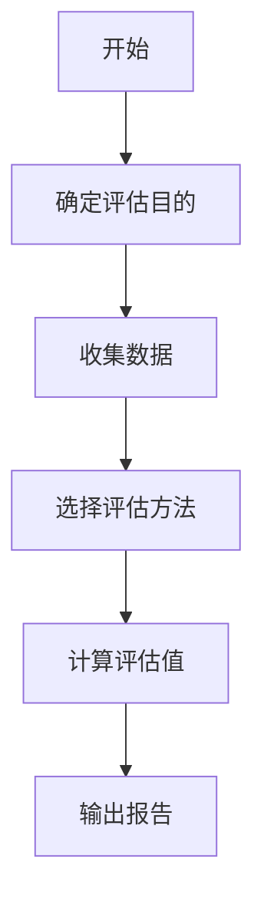
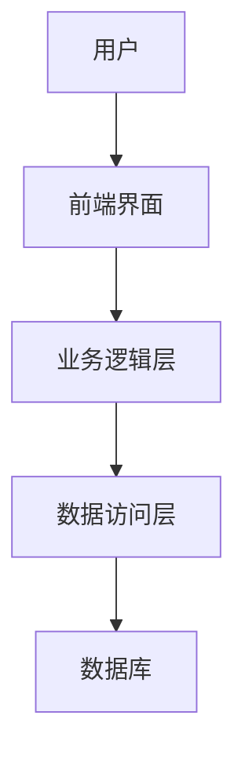

                 

# 特价股票与公司知识产权价值的关联性研究

**关键词**：特价股票、知识产权价值、公司估值、财务分析、投资策略

**摘要**：本文研究了特价股票与公司知识产权价值之间的关联性。通过分析知识产权对公司估值的影响，探讨投资者如何利用这一关联性进行决策。文章从背景介绍、核心概念、算法原理、系统分析、项目实战到最佳实践，全面探讨了这一主题。

---

## 目录

### 第1章: 特价股票与公司知识产权价值的背景介绍

#### 1.1 特价股票的基本概念
- 1.1.1 特价股票的定义
- 1.1.2 特价股票的分类
- 1.1.3 特价股票的市场表现

#### 1.2 公司知识产权价值的核心概念
- 1.2.1 知识产权的内涵与外延
- 1.2.2 知识产权的主要类型
- 1.2.3 知识产权的评估方法

#### 1.3 特价股票与公司知识产权价值的关联性
- 1.3.1 问题背景与问题描述
- 1.3.2 问题解决思路
- 1.3.3 关联性分析的边界与外延
- 1.3.4 核心概念结构与要素组成

#### 1.4 本章小结

### 第2章: 知识产权价值评估的核心原理

#### 2.1 知识产权价值评估的理论基础
- 2.1.1 知识产权的经济价值来源
- 2.1.2 知识产权的市场价值评估方法
- 2.1.3 知识产权的法律保护与经济价值的关系

#### 2.2 知识产权价值评估的关键因素
- 2.2.1 技术创新性
- 2.2.2 市场需求
- 2.2.3 法律保护力度

#### 2.3 知识产权价值评估的数学模型
- 2.3.1 知识产权价值评估公式
$$ V = f(T, M, L) $$
其中，\( V \) 表示知识产权

#### 2.4 知识产权价值评估的流程

#### 2.5 本章小结

### 第3章: 特价股票与知识产权价值的关联性分析

#### 3.1 特价股票的市场特征
- 3.1.1 特价股票的定义
- 3.1.2 特价股票的分类
- 3.1.3 特价股票的市场表现

#### 3.2 知识产权价值对公司股价的影响
- 3.2.1 知识产权对股价的直接影响
- 3.2.2 知识产权对股价的间接影响
- 3.2.3 知识产权对股价波动的调节作用

#### 3.3 特价股票与知识产权价值的关联性模型
- 3.3.1 模型的建立
- 3.3.2 模型的验证
- 3.3.3 模型的应用

#### 3.4 本章小结

### 第4章: 知识产权价值评估的系统分析与架构设计

#### 4.1 问题场景介绍
- 4.1.1 问题背景
- 4.1.2 问题目标
- 4.1.3 问题范围

#### 4.2 系统功能设计
- 4.2.1 功能模块划分
- 4.2.2 功能模块的交互设计
- 4.2.3 功能模块的实现细节

#### 4.3 系统架构设计

#### 4.4 接口设计
- 4.4.1 API接口的设计
- 4.4.2 接口的调用流程
- 4.4.3 接口的安全性考虑

#### 4.5 本章小结

### 第5章: 项目实战与案例分析

#### 5.1 项目环境安装
- 5.1.1 系统需求
- 5.1.2 环境搭建
- 5.1.3 工具安装

#### 5.2 系统核心实现
- 5.2.1 代码实现
- 5.2.2 代码解读
- 5.2.3 代码测试

#### 5.3 案例分析
- 5.3.1 案例背景
- 5.3.2 数据收集
- 5.3.3 数据分析
- 5.3.4 结果解读

#### 5.4 本章小结

### 第6章: 最佳实践与注意事项

#### 6.1 投资策略建议
- 6.1.1 知识产权评估的重要性
- 6.1.2 特价股票的投资机会
- 6.1.3 投资风险的控制

#### 6.2 技术实现建议
- 6.2.1 系统优化建议
- 6.2.2 模型改进方向
- 6.2.3 数据来源的选择

#### 6.3 小结
- 6.3.1 研究总结
- 6.3.2 未来展望

#### 6.4 注意事项
- 6.4.1 投资者需注意的事项
- 6.4.2 开发者需注意的事项

### 作者：AI天才研究院/AI Genius Institute & 禅与计算机程序设计艺术 /Zen And The Art of Computer Programming

