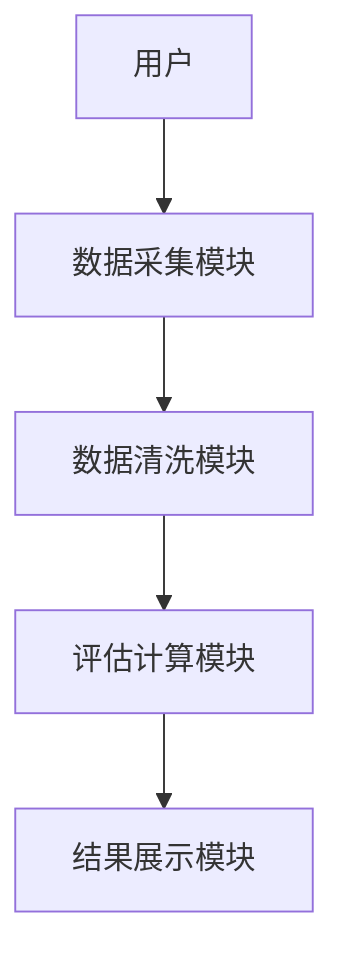
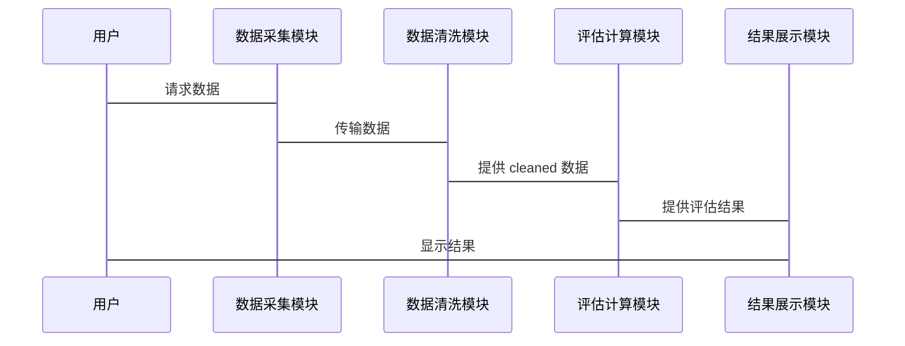

                 


# 特价股票与公司知识产权生态系统的价值评估

## 关键词：特价股票、知识产权、价值评估、公司生态系统、技术分析、投资策略

## 摘要：本文探讨了如何评估公司知识产权的价值，以及这些价值如何影响特价股票的投资决策。通过分析知识产权与股票价格的关系，提出了一种基于知识产权评估的股票价值预测模型，并通过实际案例展示了其应用和效果。

---

# 第1章: 特价股票与知识产权的基本概念

## 1.1 特价股票的基本概念

### 1.1.1 特价股票的定义

特价股票通常指价格相对较低的股票，具有较高的增长潜力。这类股票通常来自中小型企业或新兴行业，吸引了寻求高回报的投资者。

### 1.1.2 特价股票的特点

- 价格波动较大
- 成长潜力高
- 投资风险较高
- 适合长期投资

### 1.1.3 特价股票的分类

- 按行业分类：科技、医疗、能源等
- 按市值分类：小盘股、中盘股
- 按业绩分类：亏损股、扭亏股

## 1.2 公司知识产权的基本概念

### 1.2.1 知识产权的定义

知识产权是企业拥有的无形资产，包括专利、商标、版权、商业秘密等。

### 1.2.2 知识产权的类型

- 专利权
- 商标权
- 著作权
- 商业秘密
- 专有技术

### 1.2.3 知识产权的重要性

- 提升企业竞争力
- 保护创新成果
- 增加企业价值

## 1.3 特价股票与知识产权的关系

### 1.3.1 特价股票与知识产权的相互作用

- 知识产权影响公司的市场地位和盈利能力，进而影响股票价值。
- 特价股票的价格波动可能反映了公司知识产权的变化。

### 1.3.2 特价股票与知识产权的相互影响

- 知识产权的强度和数量可以作为评估公司价值的重要指标。
- 特价股票的投资者需要关注公司的知识产权状况，以评估其长期增长潜力。

### 1.3.3 特价股票与知识产权的协同效应

- 具有强大知识产权的公司可能在竞争中占据优势，从而推动股价上涨。
- 投资者通过分析知识产权的质量和数量，可以更准确地评估特价股票的潜在价值。

---

# 第2章: 知识产权价值评估的理论与方法

## 2.1 知识产权价值评估模型的定义

知识产权价值评估模型是用于量化知识产权对 company价值贡献的工具。

## 2.2 知识产权价值评估模型的分类

- 基于经济贡献的评估模型
- 基于市场比较的评估模型
- 基于技术复杂度的评估模型

## 2.3 知识产权价值评估模型的构建

### 2.3.1 确定评估指标

- 专利数量
- 专利质量
- 技术领域分布
- 商标数量
- 商业秘密的保护情况

### 2.3.2 数据收集与处理

- 收集公司知识产权数据
- 数据清洗与标准化

## 2.4 知识产权价值评估模型的数学公式

### 2.4.1 价值评估的数学模型

$$
\text{知识产权价值} = \sum_{i=1}^{n} w_i \cdot x_i
$$

其中，\(w_i\) 是第 \(i\) 个指标的权重，\(x_i\) 是第 \(i\) 个指标的得分。

### 2.4.2 价值评估的公式推导

以专利数量为例，假设专利数量对知识产权价值的贡献为：

$$
\text{专利价值贡献} = \log(\text{专利数量}) \times \text{专利质量得分}
$$

### 2.4.3 价值评估的案例分析

假设某公司有10项专利，其中8项为高质量专利。则：

$$
\text{知识产权价值} = \log(10) \times 8 = 2.3026 \times 8 = 18.4208
$$

---

# 第3章: 系统架构设计

## 3.1 系统模块划分

### 3.1.1 数据采集模块

- 从公开数据库获取公司知识产权数据
- 数据清洗与预处理

### 3.1.2 评估计算模块

- 计算各项知识产权的得分
- 综合计算知识产权价值

### 3.1.3 结果展示模块

- 可视化展示知识产权价值
- 生成股票投资建议

## 3.2 系统架构图



## 3.3 系统接口设计

- 数据接口：从数据库获取知识产权数据
- 计算接口：计算各项指标的得分
- 展示接口：生成可视化结果

## 3.4 系统交互流程



---

# 第4章: 项目实战

## 4.1 环境配置

- Python 3.8+
- Jupyter Notebook
- 数据库连接

## 4.2 核心代码实现

### 4.2.1 数据采集

```python
import sqlite3

def get_patent_data():
    conn = sqlite3.connect('patent.db')
    cursor = conn.cursor()
    cursor.execute('SELECT * FROM patents WHERE company_id = ?', (1,))
    data = cursor.fetchall()
    conn.close()
    return data
```

### 4.2.2 评估计算

```python
def calculate_value(patents):
    value = 0
    for patent in patents:
        quality = patent['quality']
        count = patent['count']
        value += (quality * count)
    return value
```

### 4.2.3 结果展示

```python
import matplotlib.pyplot as plt

def plot_value(value):
    plt.figure(figsize=(10, 6))
    plt.bar('Intellectual Property Value', value, color='blue')
    plt.title('知识产权价值')
    plt.show()
```

## 4.3 案例分析

假设某公司有以下专利数据：

| 专利ID | 专利名称 | 专利质量 |
|--------|----------|----------|
| 1      | 专利A    | 0.9      |
| 2      | 专利B    | 0.8      |
| 3      | 专利C    | 0.7      |

计算知识产权价值：

$$
\text{知识产权价值} = 0.9 + 0.8 + 0.7 = 2.4
$$

## 4.4 项目小结

通过本项目，我们展示了如何利用知识产权数据评估公司价值，并将其应用于特价股票的投资决策中。代码实现简单易懂，可以在实际中进行扩展和优化。

---

# 第5章: 总结与展望

## 5.1 总结

本文探讨了如何通过知识产权评估来影响特价股票的价值。通过构建数学模型和系统架构，我们展示了如何将知识产权转化为可量化的价值，并为投资者提供决策支持。

## 5.2 展望

未来的研究可以进一步优化评估模型，结合更多因素如市场趋势和行业动态，以提高预测的准确性。此外，可以开发更复杂的系统架构，以支持实时数据分析和动态评估。

---

# 作者：AI天才研究院/AI Genius Institute & 禅与计算机程序设计艺术 /Zen And The Art of Computer Programming

