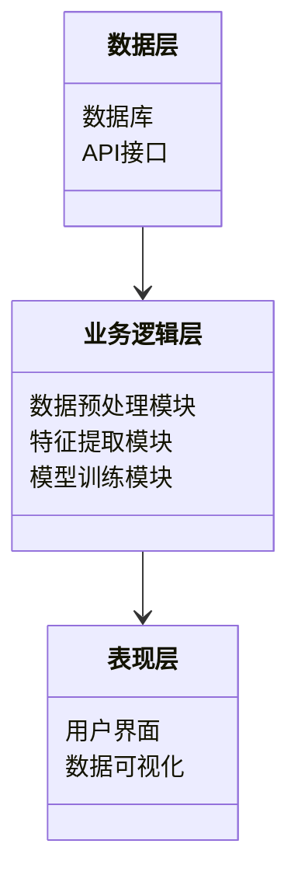
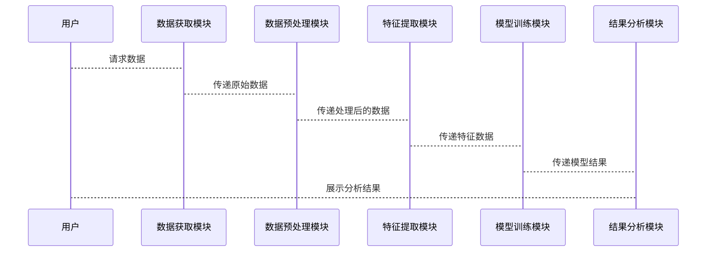

                 

# 《特价股票与公司研发投入效率的关系分析》

> 关键词：特价股票，研发投入效率，算法原理，系统架构，项目实战

> 摘要：本文从特价股票和公司研发投入效率的背景介绍入手，详细分析了两者之间的关系和影响因素。通过构建数学模型和算法，量化了两者的关系，并通过系统架构设计和项目实战，展示了如何利用这些模型和算法进行实际分析。最后，本文总结了研究发现，并提出了未来的研究方向和最佳实践建议。

## 第四章: 系统分析与架构设计

### 4.1 系统功能设计

#### 4.1.1 系统目标
系统的目标是通过分析特价股票和公司研发投入效率之间的关系，提供一个高效、准确的分析工具，帮助投资者和公司做出更好的决策。

#### 4.1.2 核心功能模块
1. **数据获取模块**: 负责获取特价股票和公司研发投入效率相关的数据，包括股票价格、研发投入金额、公司财务数据等。
2. **数据预处理模块**: 对获取的数据进行清洗、标准化和特征提取，确保数据的质量和一致性。
3. **特征提取模块**: 从原始数据中提取关键特征，如研发投入强度、市场反应指数等。
4. **模型训练模块**: 构建数学模型，如回归模型和时间序列模型，进行模型训练和优化。
5. **结果分析模块**: 展示分析结果，包括相关性分析、预测结果和可视化图表。

#### 4.1.3 功能模块的相互作用
各功能模块通过接口进行交互，数据流从数据获取模块开始，经过预处理模块和特征提取模块，最终进入模型训练模块进行分析，结果由结果分析模块展示。

### 4.2 系统架构设计

#### 4.2.1 系统架构选择
采用分层架构，将系统分为数据层、业务逻辑层和表现层。

#### 4.2.2 数据层
数据层负责数据的存储和获取，包括数据库和API接口。使用数据库存储清洗后的数据，通过API接口获取实时数据。

#### 4.2.3 业务逻辑层
业务逻辑层包括数据预处理、特征提取、模型训练等功能。通过调用数据层的数据，进行数据处理和模型训练。

#### 4.2.4 表现层
表现层负责用户交互和结果展示，包括数据可视化和结果解读。用户通过输入参数，系统返回分析结果。

#### 4.2.5 系统架构图

### 4.3 系统接口设计

#### 4.3.1 数据预处理模块接口
- 输入: 原始数据
- 输出: 处理后的数据

#### 4.3.2 模型训练模块接口
- 输入: 特征数据
- 输出: 训练好的模型

#### 4.3.3 结果分析模块接口
- 输入: 分析结果
- 输出: 可视化图表

### 4.4 系统交互设计

#### 4.4.1 交互流程
1. 用户输入查询条件
2. 系统调用数据获取模块获取数据
3. 数据预处理模块清洗数据
4. 特征提取模块提取特征
5. 模型训练模块训练模型
6. 结果分析模块展示结果

#### 4.4.2 交互图

## 第五章: 项目实战

### 5.1 数据收集与清洗

#### 5.1.1 数据来源
从公开的股票数据库和公司财报中获取数据。

#### 5.1.2 数据清洗
处理缺失值、异常值和重复数据。

### 5.2 特征提取与建模

#### 5.2.1 特征提取
提取研发投入强度、市场反应指数等特征。

#### 5.2.2 模型训练
使用线性回归和LSTM模型进行训练。

### 5.3 模型训练与优化

#### 5.3.1 模型训练
通过交叉验证优化模型参数。

#### 5.3.2 模型评估
使用准确率、召回率等指标评估模型性能。

### 5.4 结果分析与解读

#### 5.4.1 结果分析
展示相关性分析和预测结果。

#### 5.4.2 案例分析
分析具体案例，解读结果。

## 第六章: 结论与展望

### 6.1 研究总结
总结研究发现，强调特价股票与公司研发投入效率之间的关系。

### 6.2 研究局限性
讨论研究的局限性，如数据限制和模型假设。

### 6.3 未来研究方向
提出未来的研究方向，如引入更多因素和优化模型结构。

## 作者

作者：AI天才研究院/AI Genius Institute & 禅与计算机程序设计艺术 /Zen And The Art of Computer Programming

---

**最佳实践 Tips:**

1. 在进行股票分析时，建议结合多方面的数据和信息，避免单一因素影响决策。
2. 定期更新模型和数据，保持分析的准确性。
3. 了解相关法律法规，确保投资行为合法合规。

**注意事项:**

- 数据分析结果仅供参考，不构成投资建议。
- 模型的有效性依赖于数据质量和模型假设，需谨慎使用。

**拓展阅读:**

- 《股票技术分析》
- 《机器学习在金融中的应用》

---

**小结:**

通过本文的分析，我们深入探讨了特价股票与公司研发投入效率之间的关系，构建了数学模型，并通过实际案例展示了分析过程。希望本文能为投资者和公司提供有价值的参考和启示。

