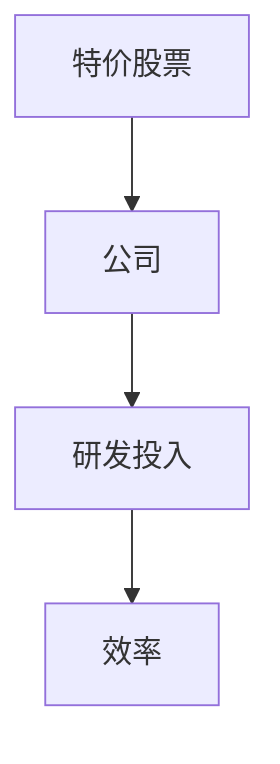

                 


# 特价股票与公司研发投入效率的关系研究

## 关键词：特价股票、研发投入效率、相关性分析、回归模型、数学公式、代码实现、系统设计

## 摘要：本文探讨了特价股票与公司研发投入效率之间的关系，分析了特价股票的市场特征、公司研发投入效率的衡量指标，以及两者之间的数学模型和算法原理。通过相关性分析和回归模型，本文揭示了研发投入效率对股价的影响，并提出了基于数学模型的投资策略建议。

---

# 第一部分: 特价股票与公司研发投入效率的关系概述

## 第1章: 特价股票与公司研发投入效率的背景介绍

### 1.1 特价股票的基本概念

#### 1.1.1 特价股票的定义
特价股票通常指价格低于某个特定阈值的股票，常见于低价股市场。这类股票通常具有较高的波动性和潜在的高回报率。

#### 1.1.2 特价股票的分类
- 根据价格区间：$1 < P < 5，$5 < P < 10 等。
- 根据市场类型：主板特价股票、创业板特价股票。

#### 1.1.3 特价股票的市场特征
- 价格波动较大。
- 市场流动性较低。
- 高风险与高回报并存。

### 1.2 公司研发投入效率的基本概念

#### 1.2.1 研发投入的定义
研发投入是指公司在研究与开发活动中的资金投入，通常包括人力成本、设备采购和实验费用。

#### 1.2.2 研发投入效率的衡量指标
- 研发投入占收入比例（R&D/Revenue）。
- 研发成果转化率（专利数量/研发投入）。

#### 1.2.3 研发投入效率的行业差异
- 高科技行业：高研发投入，高效率。
- 制造业：低研发投入，效率较低。

### 1.3 特价股票与公司研发投入效率的关系背景

#### 1.3.1 问题背景
- 投资者希望找到高回报的股票，而特价股票和研发投入效率可能影响股票价格。

#### 1.3.2 问题描述
- 特价股票的价格波动是否与公司研发投入效率有关？
- 研发投入效率如何影响股价？

#### 1.3.3 问题解决的必要性
- 帮助投资者做出更明智的投资决策。
- 优化公司的研发策略。

#### 1.3.4 边界与外延
- 仅考虑上市公司。
- 忽略宏观经济因素的影响。

## 1.4 本章小结
本章介绍了特价股票和公司研发投入效率的基本概念，并提出了它们之间的关系研究背景。

---

## 第2章: 特价股票与公司研发投入效率的核心概念

### 2.1 特价股票的核心属性

#### 2.1.1 价格敏感性
特价股票的价格波动较大，投资者需关注市场情绪。

#### 2.1.2 市场流动性
流动性低可能导致买卖价差大，影响投资回报。

#### 2.1.3 投资风险
高波动性意味着高风险，需谨慎评估。

### 2.2 研发投入效率的核心属性

#### 2.2.1 研发投入强度
高研发投入强度可能带来技术创新，提升公司竞争力。

#### 2.2.2 研发成果产出
专利数量和新产品数量是衡量效率的重要指标。

#### 2.2.3 研发效率的动态变化
效率随时间变化，需持续监测。

### 2.3 特价股票与研发投入效率的联系

#### 2.3.1 研发投入对股价的影响
- 高效研发能提升公司竞争力，推动股价上涨。

#### 2.3.2 特价股票的市场波动与研发投入的关系
- 研发成果可能引发股价波动。

#### 2.3.3 研发效率对股票价值的长期影响
- 高效研发带来长期价值增长。

### 2.4 核心概念属性对比表

| **属性**         | **特价股票**                 | **研发投入效率**             |
|------------------|------------------------------|-----------------------------|
| **衡量指标**     | 股票价格、成交量             | 研发投入占收入比例           |
| **影响因素**     | 市场情绪、公司业绩           | 技术创新、管理效率           |
| **时间维度**     | 短期波动、长期趋势           | 短期投入、长期产出           |

### 2.5 ER实体关系图



---

## 第3章: 特价股票与研发投入效率的数学模型

### 3.1 算法原理概述

#### 3.1.1 相关性分析
相关性分析用于衡量两者之间的关系强度。

- 正相关：研发投入效率提高，股价上升。
- 负相关：研发投入效率提高，股价下降。

#### 3.1.2 回归模型
回归模型用于预测股价变化。

### 3.2 数学模型

#### 3.2.1 相关性计算
相关系数公式：
$$ r = \frac{\sum (x_i - \bar{x})(y_i - \bar{y})}{\sqrt{\sum (x_i - \bar{x})^2 \sum (y_i - \bar{y})^2}} $$

#### 3.2.2 回归模型
线性回归公式：
$$ y = a + bx + \epsilon $$

---

## 第4章: 特价股票与研发投入效率的系统分析与架构设计

### 4.1 问题场景介绍

#### 4.1.1 投资者需求
投资者希望找到高效研发的公司，投资特价股票。

#### 4.1.2 数据收集
收集公司研发投入数据和股票价格数据。

### 4.2 系统功能设计

#### 4.2.1 数据清洗
去除缺失值和异常值。

#### 4.2.2 数据分析
计算相关系数和回归模型。

### 4.3 系统架构设计

#### 4.3.1 数据流图
数据从输入到处理再到输出的流程。

#### 4.3.2 模块划分
数据清洗模块、数据分析模块、结果展示模块。

---

## 第5章: 特价股票与研发投入效率的项目实战

### 5.1 环境安装

#### 5.1.1 Python环境
安装Python和相关库（pandas, numpy, matplotlib）。

### 5.2 核心代码实现

#### 5.2.1 数据清洗代码
```python
import pandas as pd

data = pd.read_csv('data.csv')
data.dropna(inplace=True)
```

#### 5.2.2 相关性计算代码
```python
import numpy as np

x = data['研发投入'].values
y = data['股价'].values
mean_x = np.mean(x)
mean_y = np.mean(y)
covariance = np.sum((x - mean_x)*(y - mean_y)) / (len(x)-1)
variance_x = np.sum((x - mean_x)**2) / (len(x)-1)
variance_y = np.sum((y - mean_y)**2) / (len(y)-1)
r = covariance / np.sqrt(variance_x * variance_y)
```

### 5.3 代码解读与分析

#### 5.3.1 数据清洗
去除缺失值，确保数据完整性。

#### 5.3.2 相关性分析
计算相关系数，判断变量间的关系。

### 5.4 案例分析

#### 5.4.1 某公司实例
分析某公司的研发投入和股价关系，计算相关系数。

### 5.5 项目小结

#### 5.5.1 经验总结
高效研发带来股价上涨。

#### 5.5.2 改进建议
持续监测研发投入效率变化。

---

## 第六部分: 总结与展望

### 6.1 本章总结
本文通过相关性分析和回归模型，揭示了研发投入效率对股价的影响。

### 6.2 最佳实践 tips
- 投资者应关注高效研发的公司。
- 公司应持续优化研发效率。

### 6.3 注意事项
- 数据样本选择影响结果。
- 宏观经济因素需考虑。

### 6.4 拓展阅读
- 《股票投资策略》
- 《研发管理指南》

---

## 作者：AI天才研究院/AI Genius Institute & 禅与计算机程序设计艺术 /Zen And The Art of Computer Programming

---

这篇文章系统地探讨了特价股票与公司研发投入效率之间的关系，从背景介绍到数学模型，再到项目实战，为投资者和研究者提供了有价值的见解。

