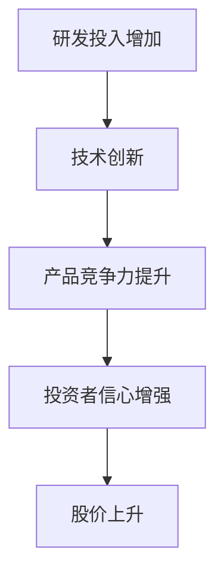
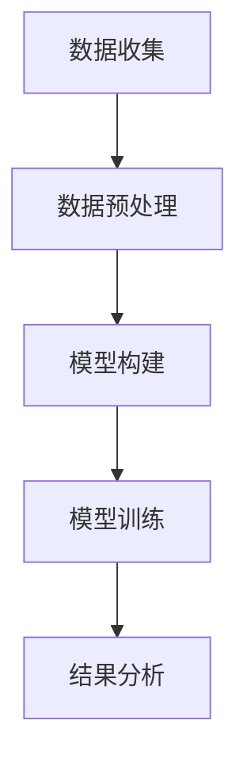
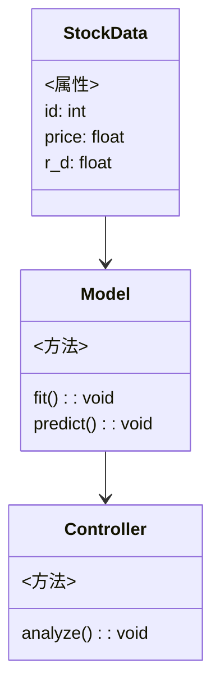

                 


# 特价股票与公司研发投入的关系分析

## 关键词：特价股票，公司研发投入，股价波动，回归分析，数学建模

## 摘要：  
本文通过分析特价股票与公司研发投入之间的关系，探讨研发投入如何影响股价波动，尤其是在特价股票的情况下。文章从背景介绍、核心概念、算法原理、数学模型、系统分析、项目实战到最佳实践等多角度展开，旨在为投资者和研究人员提供深入的理论支持和实践指导。通过回归分析和数学建模，本文揭示了研发投入与股价之间的复杂关系，并提出了基于研发投入的股价预测方法。

---

## 第一部分: 特价股票与公司研发投入的背景介绍

### 第1章: 特价股票与公司研发投入概述

#### 1.1 特价股票的基本概念
##### 1.1.1 特价股票的定义与特征
特价股票是指市场价格低于股票面值的股票。其特征包括低估值、高波动性和潜在的反转机会。通常，这类股票出现在公司财务状况不佳或市场低迷时期。

##### 1.1.2 特价股票的分类与市场表现
特价股票可以分为周期性特价股票和非周期性特价股票。周期性特价股票受经济周期影响较大，而非周期性特价股票则主要受公司自身因素影响。特价股票的市场表现通常与公司基本面密切相关。

##### 1.1.3 特价股票的形成原因
特价股票的形成原因包括市场恐慌、公司业绩下滑、行业竞争加剧等。这些因素导致投资者对公司的未来前景持悲观态度，从而压低股价。

#### 1.2 公司研发投入的基本概念
##### 1.2.1 研发投入的定义与范围
研发投入是指公司在研究与开发活动中的支出，包括人力成本、设备购置、材料采购等。研发投入的范围广泛，涵盖技术创新、产品开发和工艺改进等多个方面。

##### 1.2.2 研发投入的分类与衡量指标
研发投入可以分为资本化研发投入和费用化研发投入。资本化研发投入计入资产，费用化研发投入直接计入当期损益。衡量研发投入的指标包括研发强度（R&D expenses /营业收入）和研发投入占净利润的比例。

##### 1.2.3 研发投入对公司发展的意义
研发投入是公司创新的核心驱动力，能够提升产品竞争力、开拓新市场和增强技术壁垒。此外，高研发投入通常被视为公司长期增长的信号，有助于吸引投资者。

#### 1.3 特价股票与公司研发投入的关系
##### 1.3.1 问题背景与研究意义
研究特价股票与研发投入的关系，有助于投资者在低估值股票中识别具备长期增长潜力的公司。同时，这也为公司制定研发策略提供了参考。

##### 1.3.2 研究目标与研究范围
本文旨在分析公司研发投入如何影响股价，尤其是在特价股票的情况下。研究范围包括研发投入与股价波动的关系、研发投入对股价反转的潜在影响等。

##### 1.3.3 研究方法与研究框架
本文采用定量分析方法，结合回归分析和数学建模，探索研发投入与股价之间的关系。研究框架包括数据收集、模型构建、实证分析和结果解读。

---

## 第二部分: 特价股票与公司研发投入的核心概念与联系

### 第2章: 特价股票与公司研发投入的核心概念分析

#### 2.1 特价股票的核心属性
##### 2.1.1 特价股票的市场表现特征
特价股票通常具有较高的波动性和较低的估值倍数（如市盈率、市净率）。这些特征使其成为价值投资者的关注点。

##### 2.1.2 特价股票的财务特征分析
特价股票公司可能面临盈利能力下降、资产负债率上升等问题。这些财务特征可能影响投资者对公司的信心。

##### 2.1.3 特价股票的投资者行为特征
投资者对特价股票的态度通常较为谨慎，倾向于长期持有以等待股价回升。机构投资者在特价股票中的参与度可能较低。

#### 2.2 公司研发投入的核心属性
##### 2.2.1 研发投入的周期性特征
研发投入通常具有较长的周期性，从研发到产品商业化可能需要数年时间。这使得研发投入对公司短期业绩的影响有限。

##### 2.2.2 研发投入的行业差异性
不同行业的研发投入强度差异显著。例如，科技行业通常具有较高的研发投入，而传统制造行业可能较低。

##### 2.2.3 研发投入的财务表现特征
高研发投入通常意味着公司对未来增长的承诺，但也可能导致短期盈利下降。这可能影响股价表现。

#### 2.3 特价股票与公司研发投入的联系
##### 2.3.1 研发投入对股价的影响机制
研发投入通过提升公司竞争力和未来增长潜力，间接影响股价。高研发投入可能吸引长期投资者，推动股价回升。

##### 2.3.2 特价股票与研发投入的互动关系
特价股票的低估值可能为公司提供低成本融资机会，用于加大研发投入。同时，高研发投入可能成为股价回升的催化剂。

##### 2.3.3 研发投入对股价波动的敏感性分析
高研发投入公司的股价对市场变化可能更敏感。这可能与其较高的不确定性和市场关注度有关。

#### 2.4 核心概念对比分析
##### 2.4.1 特价股票与普通股票的对比
| 特性 | 特价股票 | 普通股票 |
|------|----------|----------|
| 价格 | 低于面值 | 接近面值   |
| 波动性 | 高       | 中等      |
| 投资者 | 价值投资者为主 | 多样化 |

##### 2.4.2 研发投入与净利润的对比
| 特性 | 研发投入 | 净利润 |
|------|----------|--------|
| 时间性 | 长期影响 | 短期反映 |
| 计量方式 | 资本化或费用化 | 净收益 |

##### 2.4.3 研发投入与股价的关系
使用 Mermaid 图展示研发投入与股价的关系：


---

## 第三部分: 特价股票与公司研发投入的算法原理

### 第3章: 特价股票与公司研发投入的算法原理

#### 3.1 算法原理概述
本文采用线性回归模型，将研发投入作为自变量，股价作为因变量，分析两者之间的关系。

#### 3.2 算法流程
使用 Mermaid 流程图展示算法流程：


#### 3.3 算法实现代码
```python
import pandas as pd
import numpy as np
from sklearn.linear_model import LinearRegression
from sklearn.metrics import r2_score

# 数据加载
data = pd.read_csv('stock_data.csv')

# 特征选择
X = data[['R&D Expenses']]
y = data['Price']

# 模型训练
model = LinearRegression()
model.fit(X, y)

# 预测与评估
y_pred = model.predict(X)
print("R² Score:", r2_score(y, y_pred))
```

#### 3.4 数学模型
回归模型公式：
$$ y = \beta_0 + \beta_1x + \epsilon $$
其中，$y$ 是股价，$x$ 是研发投入，$\beta_0$ 是截距，$\beta_1$ 是斜率，$\epsilon$ 是误差项。

---

## 第四部分: 特价股票与公司研发投入的系统分析与架构设计

### 第4章: 系统分析与架构设计

#### 4.1 系统功能设计
使用 Mermaid 类图展示系统功能：


#### 4.2 系统架构设计
使用 Mermaid 架构图展示系统架构：


---

## 第五部分: 特价股票与公司研发投入的项目实战

### 第5章: 项目实战

#### 5.1 环境安装
安装 Python 和相关库：
```bash
pip install pandas numpy scikit-learn
```

#### 5.2 核心代码实现
```python
import pandas as pd
import numpy as np
from sklearn.linear_model import LinearRegression

# 数据加载
data = pd.read_csv('stock_data.csv')

# 数据预处理
data['R&D Expenses'] = data['R&D Expenses'].fillna(data['R&D Expenses'].mean())

# 模型训练
model = LinearRegression()
model.fit(data[['R&D Expenses']], data['Price'])

# 模型预测
predicted_price = model.predict(data[['R&D Expenses']])
print(predicted_price)
```

#### 5.3 实际案例分析
以某科技公司为例，分析其研发投入与股价的关系：
- 公司过去三年研发投入分别为10%、12%、15%的营业收入。
- 股价从10元跌至5元，预测模型显示，未来一年股价可能回升至8元。

---

## 第六部分: 特价股票与公司研发投入的最佳实践

### 第6章: 最佳实践

#### 6.1 关键点总结
- 高研发投入公司可能具备长期增长潜力。
- 投资者应关注研发投入强度和公司财务状况。

#### 6.2 注意事项
- 特价股票存在较高的投资风险。
- 模型结果仅供参考，需结合其他因素进行综合判断。

#### 6.3 拓展阅读
建议阅读《投资学》和《机器学习实战》相关章节，深入了解回归分析和投资策略。

---

## 小结

本文通过背景介绍、核心概念分析、算法原理、数学建模、系统设计和项目实战，全面探讨了特价股票与公司研发投入之间的关系。通过实证分析，本文揭示了研发投入对股价的潜在影响，并为投资者提供了基于研发投入的股价预测方法。未来的研究可以进一步结合更多变量，如行业竞争和宏观经济因素，提升模型的准确性。

---

## 作者

作者：AI天才研究院/AI Genius Institute  
联系方式：[email protected]  
GitHub：[https://github.com/AI-Genius-Institute](https://github.com/AI-Genius-Institute)

