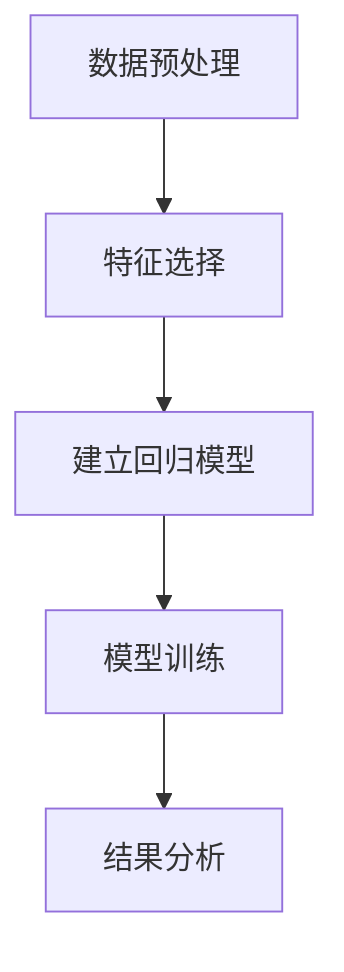

                 


# 特价股票与公司碳中和实践的关联性研究

## 关键词：特价股票、碳中和、关联性、股票价格波动、企业实践、投资分析、环境责任

## 摘要：  
本文旨在研究特价股票与公司碳中和实践之间的关联性。通过分析特价股票的定义、市场表现，以及碳中和的目标和实现路径，探讨两者在企业战略和市场行为中的互动关系。结合数学模型和实际案例，本文揭示了碳中和实践如何影响股价波动，为企业制定碳中和策略提供参考，为投资者提供新的视角。

---

## 第1章：特价股票与碳中和的背景介绍

### 1.1 特价股票的定义与特点  
特价股票是指价格低于面值的股票，通常反映了市场对公司的负面情绪或财务状况的担忧。其特点包括：  
- **低估值**：股价远低于面值，可能被视为投资机会。  
- **市场敏感性**：受市场情绪、公司业绩和外部环境的影响较大。  
- **高波动性**：价格波动频繁，投资者需谨慎评估风险。  

### 1.2 碳中和的定义与目标  
碳中和是指通过减少温室气体排放或抵消碳排放，使企业或组织的净碳排放为零。其实现路径包括：  
- **技术创新**：采用清洁能源和高效技术。  
- **政策支持**：政府法规和补贴推动碳中和进程。  
- **企业责任**：企业主动制定和实施碳中和目标。  

### 1.3 特价股票与碳中和的关联性背景  
随着全球对碳中和的关注增加，企业环保实践逐渐成为投资者的重要考量因素。特价股票的价格波动可能反映市场对碳中和进展的敏感性，而碳中和实践也可能影响公司的长期价值。研究这一关联性有助于企业优化战略，投资者做出更明智的决策。

---

## 第2章：核心概念与联系

### 2.1 特价股票的核心原理  
特价股票的形成机制涉及市场情绪、公司财务状况和宏观经济因素。其市场表现受投资者信心、行业趋势和政策影响。投资者行为分析显示，特价股票通常被视为高风险高回报的投资选择。

### 2.2 碳中和的核心原理  
碳中和的目标是实现零碳排放，涉及技术创新和政策支持。其经济影响包括成本上升和竞争优势变化。碳中和实践对股价的影响需结合公司具体策略和市场反应进行分析。

### 2.3 特价股票与碳中和的联系  
- **碳中和对股价的影响**：碳中和实践可能提升公司形象，推动股价上涨。  
- **特价股票与碳中和目标的关系**：部分特价股票公司可能通过碳中和转型提升价值。  
- **股价波动与碳中和进展**：碳中和进展可能引发股价波动，投资者需关注相关信号。

---

## 第3章：核心概念的对比分析

### 3.1 特价股票与碳中和的属性特征对比  

| **属性**       | **特价股票**                          | **碳中和**                              |
|-----------------|---------------------------------------|------------------------------------------|
| **定义**        | 价格低于面值的股票                    | 净零碳排放目标                          |
| **目标**        | 提高股价，吸引投资者                  | 减少碳排放，应对气候变化                |
| **影响因素**    | 市场情绪、公司业绩、宏观经济          | 技术创新、政策支持、企业责任            |
| **结果**        | 股价波动，投资机会                    | 环境改善，社会责任感提升                |

### 3.2 特价股票与碳中和的ER实体关系图  

```mermaid
erDiagram
    company {
        id
        name
        carbon_neutrality_target
    }
    stock_price {
        id
        price
        date
    }
    relationship {
        company_id
        stock_price_id
        impact
    }
    company --> relationship : 影响
    stock_price --> relationship : 受影响
```

---

## 第4章：关联性分析的算法原理

### 4.1 算法原理概述  
使用回归分析模型，将碳中和相关指标（如碳排放量、政策支持）与股价波动进行关联分析。模型通过统计方法识别变量之间的关系强度。

### 4.2 算法实现步骤  



### 4.3 Python代码实现  

```python
import pandas as pd
import numpy as np
from sklearn.linear_model import LinearRegression

# 数据加载与预处理
data = pd.read_csv('stock_carbon.csv')
data['carbon_emission'] = data['carbon_emission'].astype(float)
data['stock_price'] = data['stock_price'].astype(float)

# 特征选择与模型训练
X = data[['carbon_emission']]
y = data['stock_price']
model = LinearRegression()
model.fit(X, y)

# 模型结果分析
coefficients = pd.DataFrame({'特征': X.columns, '系数': model.coef_})
print(coefficients)
```

### 4.4 数学模型与公式  
回归模型：  
$$ y = \beta_0 + \beta_1x + \epsilon $$  
其中，$y$为股价波动，$x$为碳排放量，$\beta_0$和$\beta_1$为回归系数。

---

## 第5章：系统分析与架构设计

### 5.1 系统功能设计  
- 数据采集模块：收集碳排放和股价数据。  
- 数据分析模块：处理数据并建立模型。  
- 预测模块：输出股价波动预测结果。  

### 5.2 系统架构设计  


### 5.3 接口设计与交互流程  
系统通过API接口接收数据，处理后返回预测结果。交互流程包括数据输入、模型处理和结果输出。

---

## 第6章：项目实战

### 6.1 环境安装与配置  
安装Python和相关库（pandas、numpy、scikit-learn）。  

### 6.2 核心代码实现  

```python
import pandas as pd
from sklearn.linear_model import LinearRegression

# 加载数据
data = pd.read_csv('stock_carbon.csv')

# 建立模型
model = LinearRegression()
model.fit(data[['carbon_emission']], data['stock_price'])

# 预测结果
predictions = model.predict(data[['carbon_emission']])
print("预测股价波动:", predictions)
```

### 6.3 案例分析与结果解读  
通过实际案例分析，展示模型如何预测股价波动，并解读结果对企业战略的影响。

---

## 第7章：最佳实践与总结

### 7.1 研究总结  
碳中和实践与股价波动密切相关，企业需重视环保，投资者应关注碳中和进展。

### 7.2 投资建议  
投资者应将碳中和目标作为选股的重要指标，长期投资具有可持续性的公司。

### 7.3 未来研究方向  
进一步研究碳中和对企业财务表现的影响，探索更多关联性模型。

---

## 作者：AI天才研究院 & 禅与计算机程序设计艺术  
本文作者：AI天才研究院（AI Genius Institute）与“禅与计算机程序设计艺术”（Zen And The Art of Computer Programming）联合撰写。

