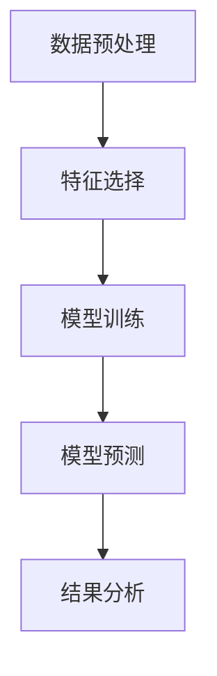
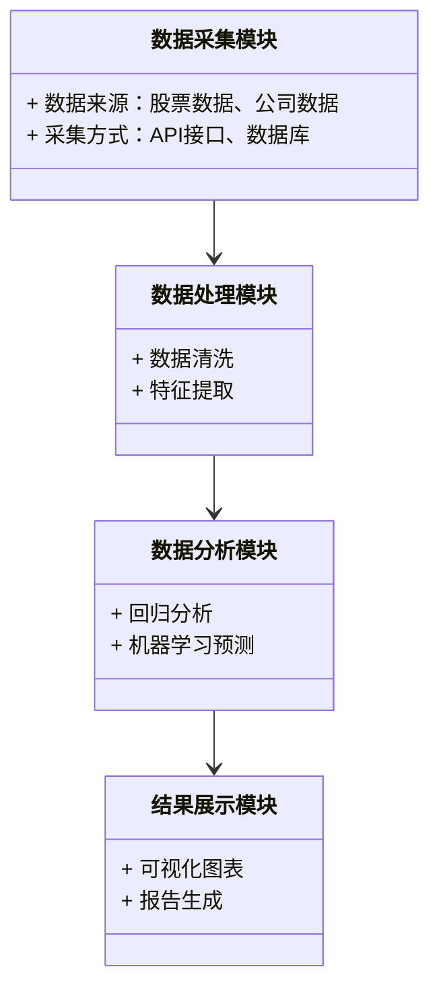

                 


```markdown
# 特价股票与公司社会创新能力的长期影响研究

## 关键词：特价股票，公司社会创新，长期影响，数据分析，投资策略

## 摘要：  
本文探讨了特价股票与公司社会创新能力之间的长期影响关系。通过分析特价股票的市场表现与公司社会创新能力的相互作用，结合数学模型和实际案例，深入研究了社会创新能力如何影响公司的股价波动，特别是在特价股票市场中的表现。文章从背景介绍、核心概念、算法原理、系统分析到项目实战，全面剖析了特价股票与公司社会创新能力的长期影响，并提出了相应的投资策略建议。

---

## 第一部分：特价股票与公司社会创新能力的背景介绍

### 第1章：特价股票的定义与特征  
#### 1.1 特价股票的定义  
- 特价股票是指价格低于市场平均水平的股票，通常被视为高风险高回报的投资选择。  
- 特价股票的分类：根据股票的市盈率、市净率等指标进行分类，可分为价值型股票和成长型股票。  

#### 1.2 特价股票的市场表现特征  
- 特价股票通常具有较高的波动性，价格受市场情绪影响较大。  
- 特价股票的投资者通常以短期交易者为主，但也吸引了长期投资者的关注。  

#### 1.3 特价股票与普通股票的区别  
- 普通股票的价格波动较为稳定，而特价股票的价格波动更为剧烈。  
- 特价股票的投资者风险承受能力较高，而普通股票的投资者更注重长期稳定收益。  

### 第2章：公司社会创新能力的定义与特征  
#### 2.1 公司社会创新能力的定义  
- 公司社会创新能力是指公司在履行社会责任、推动社会进步、提升社会福祉方面的能力。  
- 社会创新能力的核心要素包括创新能力、资源整合能力、社会影响力等。  

#### 2.2 公司社会创新能力的评估标准  
- 社会创新成果的数量与质量。  
- 社会创新对社会经济发展的影响程度。  
- 公司在社会创新中的投入与产出比。  

#### 2.3 公司社会创新能力与企业绩效的关系  
- 高社会创新能力的公司通常具有较高的市场竞争力和品牌影响力。  
- 社会创新能力与企业绩效呈正相关关系。  

### 第3章：特价股票与公司社会创新能力的长期影响研究背景  
#### 3.1 研究背景  
- 特价股票市场的快速发展与公司社会创新能力的提升密不可分。  
- 随着社会对可持续发展和企业社会责任的关注度提高，公司社会创新能力成为影响股价的重要因素。  

#### 3.2 研究问题与目标  
- 研究问题：特价股票与公司社会创新能力之间的长期影响关系。  
- 研究目标：分析社会创新能力如何影响公司股价，特别是在特价股票市场中的表现。  

#### 3.3 研究意义  
- 理论意义：丰富公司社会创新能力与股价关系的研究。  
- 实践意义：为投资者提供科学的投资决策依据。  

---

## 第二部分：特价股票与公司社会创新能力的核心概念与联系

### 第4章：特价股票与公司社会创新能力的关系分析  
#### 4.1 特价股票与公司社会创新能力的内在联系  
- 特价股票市场的波动性为公司展示社会创新能力提供了机会。  
- 公司的社会创新能力是影响投资者决策的重要因素。  

#### 4.2 特价股票与公司社会创新能力的对比分析  
- 特价股票市场的高波动性与公司社会创新能力的稳定性形成对比。  
- 高社会创新能力的公司通常在特价股票市场中表现更为稳健。  

#### 4.3 特价股票与公司社会创新能力的ER实体关系图  
```mermaid
er
    entity 投资者
    entity 特价股票
    entity 公司社会创新能力

    投资者 --> 特价股票: 购买
    特价股票 --> 公司社会创新能力: 影响
```

---

## 第三部分：特价股票与公司社会创新能力的算法原理

### 第5章：数学模型与算法原理  
#### 5.1 数据分析模型  
- 回归分析：用于分析社会创新能力对股价的影响。  
- $$ y = \beta_0 + \beta_1x_1 + \beta_2x_2 + \ldots + \beta_nx_n + \epsilon $$  
  其中，\( y \) 是股价，\( x_i \) 是社会创新能力指标，\( \beta_i \) 是回归系数。  

#### 5.2 机器学习模型  
- 随机森林：用于预测特价股票市场的波动性。  
- 使用Python实现随机森林算法：  
```python
from sklearn.ensemble import RandomForestRegressor
model = RandomForestRegressor(n_estimators=100, random_state=42)
model.fit(X_train, y_train)
```

#### 5.3 算法流程图  


---

## 第四部分：系统分析与架构设计

### 第6章：系统分析与架构设计  
#### 6.1 问题场景介绍  
- 系统目标：分析特价股票与公司社会创新能力的长期影响。  
- 项目介绍：构建一个数据分析系统，用于预测股价波动。  

#### 6.2 系统功能设计  


#### 6.3 系统架构设计  
```mermaid
architectural
    Client
    API Gateway
    Database
    Analysis Service
    Notification Service
```

---

## 第五部分：项目实战

### 第7章：项目实战  
#### 7.1 环境安装  
- Python 3.8及以上版本  
- 安装库：pandas、numpy、scikit-learn、matplotlib  

#### 7.2 核心代码实现  
```python
import pandas as pd
import numpy as np
from sklearn.model import LinearRegression
from sklearn.metrics import mean_squared_error

# 数据加载
data = pd.read_csv('stock_data.csv')

# 数据预处理
X = data[['social_innovation', 'market_fluctuation']]
y = data['price']

# 模型训练
model = LinearRegression()
model.fit(X, y)

# 模型预测
y_pred = model.predict(X)
print('均方误差:', mean_squared_error(y, y_pred))
```

#### 7.3 代码解读与分析  
- 数据加载：从CSV文件中读取股票数据。  
- 数据预处理：提取社会创新能力和市场波动性作为特征。  
- 模型训练：使用线性回归模型进行训练。  
- 模型预测：预测股价并评估模型性能。  

#### 7.4 案例分析  
- 选取某公司，分析其社会创新能力对股价的影响。  
- 使用回归模型预测未来股价走势。  

---

## 第六部分：总结与展望

### 第8章：总结与展望  
#### 8.1 研究总结  
- 特价股票与公司社会创新能力的长期影响关系复杂，但可以通过数据分析和建模来揭示。  
- 高社会创新能力的公司通常在特价股票市场中表现更为稳健。  

#### 8.2 研究展望  
- 进一步研究不同类型公司的社会创新能力对股价的影响。  
- 结合更多数据源，如社交媒体数据，提升模型的预测能力。  

### 8.3 最佳实践 Tips  
- 投资者应关注公司的社会创新能力，尤其是在特价股票市场中。  
- 企业应不断提升社会创新能力，以提升市场竞争力。  

---

## 作者：AI天才研究院/AI Genius Institute & 禅与计算机程序设计艺术/Zen And The Art of Computer Programming
```

