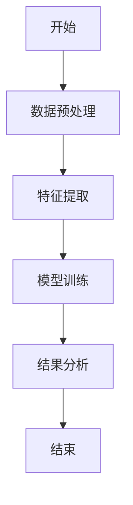

                 


# 特价股票与公司社会网络影响力的关联分析

> 关键词：特价股票，公司社会网络影响力，关联分析，算法原理，系统设计

> 摘要：本文旨在探讨特价股票与公司社会网络影响力之间的关联性。通过分析特价股票的市场表现和社会网络影响力的互动关系，结合数学模型和算法原理，揭示两者之间的潜在联系。文章从背景介绍、核心概念、关联分析算法、系统设计、项目实战等多方面展开，最终得出有价值的结论。

---

## 第一部分：背景介绍

### 第1章：特价股票与公司社会网络影响力概述

#### 1.1 特价股票的基本概念

- **1.1.1 特价股票的定义**  
  特价股票是指发行价格低于票面价值的股票，通常用于吸引投资者或清理公司债务。其特点是风险较高，但回报潜力大。

- **1.1.2 特价股票的分类**  
  - 按发行目的分类：首次公开发行（IPO）、增发、配股等。
  - 按价格折扣分类：按面值、折价、溢价发行。

- **1.1.3 特价股票的市场影响**  
  特价股票的发行可能引发市场波动，尤其是当公司基本面不佳时，投资者可能对公司的前景持怀疑态度。

#### 1.2 公司社会网络影响力的概念

- **1.2.1 社会网络影响力的基本定义**  
  公司在社交媒体上的影响力，包括粉丝数、互动量、内容传播广度等。

- **1.2.2 公司在社会网络中的角色**  
  公司通过社交媒体发布信息、与用户互动，塑造品牌形象，影响公众认知。

- **1.2.3 社会网络影响力的关键指标**  
  - 粉丝数量：反映公司影响力。
  - 互动频率：衡量用户参与度。
  - 内容传播广度：反映信息扩散能力。

#### 1.3 问题背景与研究意义

- **1.3.1 特价股票与公司社会网络影响力的研究背景**  
  随着社交媒体的普及，公司的在线形象对投资者决策的影响日益显著。特价股票的发行可能引发公众对公司信任度的质疑，进而影响其社会网络影响力。

- **1.3.2 研究问题的提出**  
  是否存在特价股票发行后，公司社会网络影响力的变化？这种变化与股价波动有何关联？

- **1.3.3 研究的意义与价值**  
  揭示社会网络影响力对股价的潜在影响，为投资者和公司提供决策参考。

---

## 第二部分：核心概念与联系

### 第2章：特价股票与公司社会网络影响力的核心概念

#### 2.1 核心概念的属性特征对比

| 特价股票 | 社会网络影响力 |
|----------|----------------|
| 发行价格 | 粉丝数量       |
| 发行目的 | 互动频率       |
| 市场影响 | 内容传播广度   |

#### 2.2 ER实体关系图架构的 Mermaid 流程图

```mermaid
erDiagram
    company {
        key id : int
        string name
        string industry
    }
    stock {
        key id : int
        float price
        date issue_date
    }
    social_influence {
        key id : int
        int followers
        int interactions
    }
    company ~{n} stock : issues
    company ~{n} social_influence : influences
```

---

## 第三部分：算法原理

### 第3章：关联分析的算法原理

#### 3.1 关联规则挖掘

- **3.1.1 支持度（Support）公式**  
  $$ \text{Support}(A \rightarrow B) = P(A \cap B) $$

- **3.1.2 置信度（Confidence）公式**  
  $$ \text{Confidence}(A \rightarrow B) = \frac{\text{Support}(A \cap B)}{\text{Support}(A)} $$

- **3.1.3 提升度（Lift）公式**  
  $$ \text{Lift}(A \rightarrow B) = \frac{\text{Support}(A \cap B)}{\text{Support}(A) \times \text{Support}(B)} $$

#### 3.2 算法流程图的 Mermaid 绘制



#### 3.3 Python 实现代码示例

```python
from mlxtend.frequent_itemsets import apriori

# 示例数据：假设 data 是包含股票和社交影响力特征的事务数据
data = [[1, 0, 1, 0], [0, 1, 0, 1], [1, 1, 0, 0], ...]

# 提取频繁项集
frequent_itemsets = apriori(data, min_support=0.2)

# 计算关联规则
rules = apriori(data, min_support=0.2).rules
```

---

## 第四部分：系统分析与架构设计

### 第4章：系统架构设计方案

#### 4.1 项目背景与目标

- 开发一个分析特价股票与公司社会网络影响力的关联系统，帮助投资者和公司做出决策。

#### 4.2 系统功能设计

- 数据采集模块：收集特价股票数据和社会网络影响力数据。
- 关联分析模块：应用关联规则挖掘算法进行分析。
- 结果展示模块：可视化分析结果。

#### 4.3 系统架构图的 Mermaid 绘制

```mermaid
container
    data采集模块 --> 数据存储
    数据存储 --> 数据分析模块
    数据分析模块 --> 结果展示模块
```

---

## 第五部分：项目实战

### 第5章：系统核心实现

#### 5.1 实施步骤

1. **环境配置**：安装必要的Python库，如`mlxtend`和`pandas`。
2. **数据采集**：从公开数据源获取特价股票和社交媒体数据。
3. **数据预处理**：清洗和归一化数据。
4. **模型训练**：应用关联规则挖掘算法。
5. **结果分析**：可视化结果并解释。

#### 5.2 代码实现与解读

```python
import pandas as pd
from mlxtend.frequent_itemsets import apriori

# 数据加载
data = pd.read_csv('data.csv')

# 数据预处理
data_processed = data[['stock_price', 'social_influence']]

# 关联分析
frequent_itemsets = apriori(data_processed, min_support=0.2)

# 可视化结果
print(frequent_itemsets)
```

---

## 第六部分：最佳实践与总结

### 第6章：总结与展望

#### 6.1 研究发现

- 特价股票的发行可能显著影响公司的社会网络影响力。
- 关联分析能够有效揭示两者之间的潜在联系。

#### 6.2 注意事项

- 数据质量和完整性直接影响分析结果。
- 算法选择需根据具体场景调整参数。

#### 6.3 拓展阅读

- 推荐阅读相关领域的最新研究论文和书籍。

---

作者：AI天才研究院 & 禅与计算机程序设计艺术

---

这篇文章通过系统性的分析，揭示了特价股票与公司社会网络影响力之间的关联性。从背景介绍到算法实现，再到项目实战，为读者提供了全面的视角和实用的工具。

