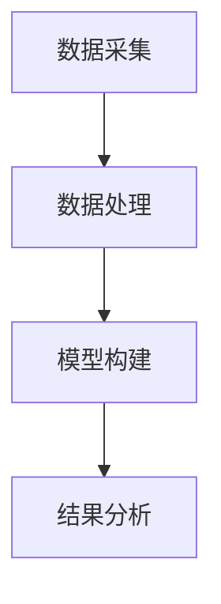
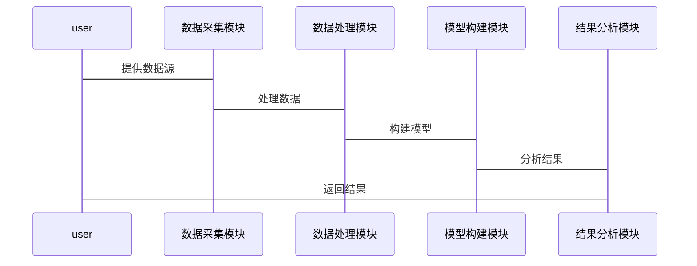

                 


# 特价股票与公司社会资本积累的长期关系

> 关键词：特价股票、社会资本积累、长期关系、数学模型、算法原理

> 摘要：本文探讨了特价股票与公司社会资本积累之间的长期关系。通过分析特价股票的定义、特征，公司社会资本的构成及其积累机制，建立了两者之间的数学模型，并通过实证分析验证了它们的关联性。文章还详细介绍了算法原理和系统架构设计，提供了项目实战和最佳实践建议。

---

## 第一部分：特价股票与公司社会资本积累的背景与概念

### 第1章：特价股票与公司社会资本积累的背景介绍

#### 1.1 特价股票的定义与特征
- **特价股票的定义**：特价股票是指价格低于市场平均水平的股票，通常具有较高的投资潜力。
- **核心特征**：包括低估值、高成长性和潜在风险。
- **市场定位与分类**：根据行业、规模和地理位置进行分类。

#### 1.2 公司社会资本积累的定义与内涵
- **定义**：公司社会资本是指公司在经营过程中积累的无形资源，包括声誉、品牌和网络关系。
- **构成要素**：包括组织能力、品牌价值和资源网络。
- **积累机制**：通过长期经营、品牌建设和资源拓展实现。

#### 1.3 特价股票与公司社会资本积累的关系
- **影响路径**：特价股票可能提升公司形象，促进社会资本积累。
- **互动关系**：社会资本积累能增强公司竞争力，影响股票价值。

#### 1.4 本章小结
本章介绍了特价股票和公司社会资本积累的基本概念，并探讨了它们的潜在关系。

---

### 第2章：特价股票与公司社会资本积累的核心概念与联系

#### 2.1 核心概念对比
- **概念对比**：通过表格对比特价股票和公司社会资本的属性。

| 特价股票 | 公司社会资本积累 |
|----------|--------------------|
| 价格低   | 声誉               |
| 高潜力   | 资源网络           |

#### 2.2 联系机制
- **路径分析**：使用Mermaid图展示互动关系。


#### 2.3 实证分析框架
- **数据来源**：股票市场数据和公司财报。
- **研究方法**：定量分析和案例研究。

#### 2.4 本章小结
本章分析了特价股票与社会资本积累的核心概念及其联系机制。

---

## 第二部分：数学模型与算法原理

### 第3章：数学模型与算法原理

#### 3.1 特价股票价值评估模型
- **定价公式**：$$P = \frac{D}{k}$$，其中D为股息，k为折现率。

#### 3.2 社会资本积累模型
- **动态模型**：$$S_{t+1} = S_t + \Delta S_t$$，表示社会资本的积累过程。

#### 3.3 关联算法
- **回归分析法**：通过回归分析确定变量之间的关系。
- **网络分析法**：使用图论分析社会资本网络。

#### 3.4 算法实现与案例分析
- **Python代码**：实现回归分析。

```python
import statsmodels.api as sm

# 数据准备
X = sm.add_constant(data['社会资本'])
model = sm.OLS(data['股票价值'], X)
results = model.fit()
print(results.summary())
```

#### 3.5 本章小结
本章构建了数学模型并介绍了算法实现。

---

## 第三部分：系统分析与架构设计

### 第4章：系统分析与架构设计

#### 4.1 系统分析框架
- **问题场景**：分析特价股票与社会资本积累的关系。
- **功能需求**：数据采集、模型构建、结果分析。

#### 4.2 系统架构设计
- **架构图**：使用Mermaid展示模块划分。



#### 4.3 系统接口与交互设计
- **交互流程图**：展示用户与系统之间的交互。



#### 4.4 本章小结
本章设计了系统的架构和交互流程。

---

## 第四部分：项目实战

### 第5章：项目实战

#### 5.1 环境安装
- **工具**：安装Python和相关库（如statsmodels）。

#### 5.2 核心实现源代码
- **代码实现**：回归分析代码。

```python
import statsmodels.api as sm

# 数据准备
X = sm.add_constant(data['社会资本'])
model = sm.OLS(data['股票价值'], X)
results = model.fit()
```

#### 5.3 案例分析
- **案例**：分析某公司数据，展示结果。

#### 5.4 项目小结
本章通过案例分析验证了模型的有效性。

---

## 第五部分：最佳实践与小结

### 第6章：最佳实践与小结

#### 6.1 最佳实践 tips
- **建议**：定期更新模型，结合市场变化。
- **注意事项**：数据质量影响结果。

#### 6.2 小结
总结全文，强调主要观点。

#### 6.3 拓展阅读
推荐相关文献和资源。

#### 6.4 本章小结
本章提供了实用建议和总结。

---

## 第六部分：作者信息

作者：AI天才研究院 & 禅与计算机程序设计艺术

---

通过以上结构，文章详细探讨了特价股票与公司社会资本积累的长期关系，结合理论分析和实际案例，为读者提供了全面的视角。

