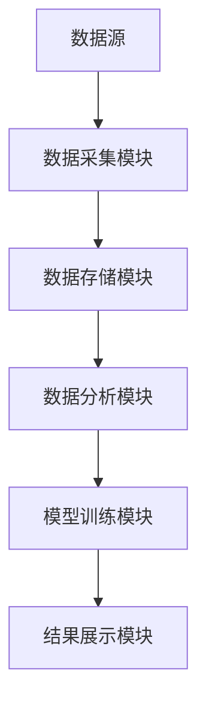

                 


# 特价股票与公司竞争优势的关系

## 关键词：特价股票, 公司竞争优势, 股票分析, 机器学习, 投资策略, 股票价格预测, 企业竞争力

## 摘要：  
本文探讨了特价股票与公司竞争优势之间的关系，分析了如何通过技术手段评估公司竞争优势，并结合特价股票的特性，提出了一套系统化的分析方法。文章从背景介绍、核心概念、算法原理、数学模型、系统架构、项目实战到最佳实践，全面阐述了如何利用技术手段优化股票投资策略。

---

## 第一部分：特价股票与公司竞争优势的背景介绍

### 第1章：特价股票的基本概念与分类

#### 1.1 特价股票的定义
- **1.1.1 特价股票的定义与特点**  
  特价股票指的是在特定时间段内价格低于市场平均水平的股票。这些股票通常具有较高的波动性，投资者可以利用价格波动进行套利或长期投资。特价股票的特点包括低市盈率（P/E ratio）、低市净率（P/B ratio）以及较高的股息收益率（Dividend Yield）。

- **1.1.2 特价股票的分类与应用场景**  
  特价股票可以分为以下几类：  
  - **周期性股票**：受经济周期影响较大的行业（如能源、材料）的股票。  
  - **成长型股票**：未来增长潜力较大的公司股票，通常市盈率较高。  
  - **价值型股票**：市场价格低于其内在价值的股票，适合长期投资者。  

- **1.1.3 特价股票的市场表现与风险**  
  特价股票在市场下跌时往往表现不佳，但在市场复苏时可能有较高的反弹空间。然而，这类股票的风险较高，因为它们通常属于高波动性行业或财务状况不佳的公司。

#### 1.2 公司竞争优势的核心要素
- **1.2.1 公司竞争优势的定义与构成**  
  公司竞争优势是指企业在市场中相对于竞争对手的核心竞争力，通常包括成本优势、品牌优势、技术优势、资源控制能力等。  

- **1.2.2 公司竞争优势的分类与评估标准**  
  公司竞争优势可以分为以下几类：  
  - **成本优势**：生产成本低于竞争对手。  
  - **技术优势**：拥有独特的技术或专利。  
  - **品牌优势**：知名品牌具有更强的市场影响力。  
  - **资源控制**：企业对关键资源（如原材料、市场渠道）的控制能力。  

- **1.2.3 公司竞争优势与股价的关系**  
  公司竞争优势是影响股价的重要因素。强大的竞争优势通常意味着更高的盈利能力、市场份额和长期增长潜力，从而推动股价上涨。

#### 1.3 特价股票与公司竞争优势的关系
- 特价股票通常出现在竞争优势较弱的公司中，这些公司可能因为市场波动或短期不利因素导致股价被低估。然而，投资者需要警惕这些公司是否具备长期竞争优势，否则低价可能只是陷阱。

---

## 第二部分：核心概念与联系

### 第2章：核心概念与联系分析

#### 2.1 特价股票与公司竞争优势的对比分析
| **属性**         | **特价股票**           | **公司竞争优势**       |
|-------------------|------------------------|------------------------|
| 定义             | 价格低于市场平均水平的股票 | 企业在市场中的核心竞争力 |
| 影响因素         | 市场波动、公司短期表现   | 技术、成本、品牌、资源等 |
| 投资策略         | 套利或长期持有          | 选择具备竞争优势的公司 |
| 风险             | 高波动性、流动性风险    | 竞争压力、市场变化风险 |

#### 2.2 特价股票与公司竞争优势的ER实体关系图
```mermaid
er
  %% 特价股票与公司竞争优势的关系
  rectangle 特价股票 {
    <股票代码>
    <股价>
    <市盈率>
    <市净率>
  }
  rectangle 公司竞争优势 {
    <公司ID>
    <竞争优势评分>
    <技术优势>
    <成本优势>
    <品牌优势>
  }
  特价股票 --> 公司竞争优势 : 影响关系
```

---

## 第三部分：算法原理与数学模型

### 第3章：算法原理与数学模型

#### 3.1 基于机器学习的股票分析算法
- **数据预处理**：收集历史股价、财务数据、行业指标等。  
- **特征提取**：提取市盈率、市净率、股息率、竞争优势评分等特征。  
- **模型训练**：使用随机森林或支持向量机（SVM）进行分类或回归分析。  

#### 3.2 竞争优势评分模型
$$ \text{竞争优势评分} = \sum (w_i \times f_i) $$
其中，$w_i$ 是第 $i$ 个因素的权重，$f_i$ 是第 $i$ 个因素的评分（1-10分）。

#### 3.3 代码实现
```python
import pandas as pd
from sklearn.ensemble import RandomForestClassifier

# 数据加载与预处理
data = pd.read_csv('stock_data.csv')
data['竞争优势评分'] = sum(w_i * f_i for i in range(n_factors))

# 模型训练
model = RandomForestClassifier()
model.fit(data[['市盈率', '市净率', '竞争优势评分']], data['股价走势'])
```

---

## 第四部分：系统架构与项目实战

### 第4章：系统架构设计

#### 4.1 系统功能设计
- **数据采集模块**：实时采集股票数据和公司财务数据。  
- **数据分析模块**：计算市盈率、市净率等指标。  
- **模型训练模块**：基于机器学习模型预测股价走势。  

#### 4.2 系统架构图


---

## 第五部分：最佳实践与小结

### 第5章：最佳实践与小结

#### 5.1 投资建议
- 选择具备长期竞争优势的公司，避免仅因低价买入特价股票。  
- 结合技术分析和基本面分析，制定科学的投资策略。  

#### 5.2 风险提示
- 特价股票具有高波动性，投资者需谨慎操作。  
- 公司竞争优势可能受市场变化影响，需定期评估。  

#### 5.3 未来趋势
- 随着人工智能技术的发展，股票分析将更加智能化和精准化。  

---

## 作者：AI天才研究院  
本文作者是AI天才研究院，专注于人工智能与金融领域的结合研究，致力于为投资者提供科学的技术分析工具和策略。

---

以上是文章的完整目录大纲和内容框架，涵盖了特价股票与公司竞争优势的各个方面，从理论到实践，从分析到系统设计，为投资者提供了全面的指导和参考。

