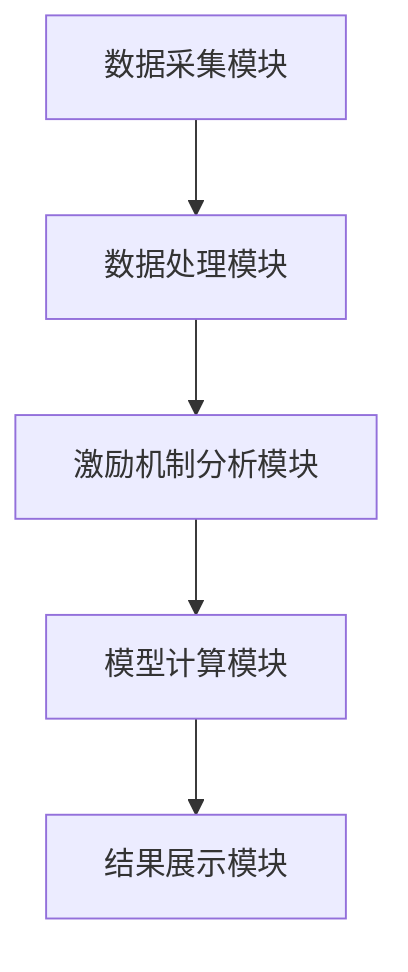
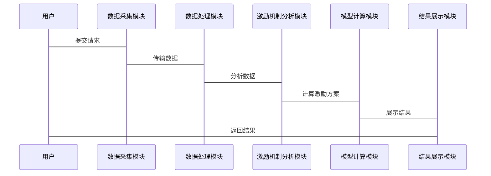

                 


# 特价股票与公司管理层激励机制的关系

> 关键词：特价股票、激励机制、公司治理、股票价值、管理层激励

> 摘要：本文探讨了特价股票与公司管理层激励机制之间的关系。通过分析特价股票作为激励工具的作用，结合数学模型和系统架构设计，揭示了两者协同优化的内在逻辑，并提供了实际案例和最佳实践建议。

---

# 第一部分: 特价股票与公司管理层激励机制的背景与概念

# 第1章: 特价股票与公司管理层激励机制的背景介绍

## 1.1 特价股票的基本概念

### 1.1.1 特价股票的定义

特价股票是指公司以低于市场价发行的股票，通常用于激励管理层和核心员工。其本质是一种股权激励工具，通过将公司所有权部分转移给管理层，激励其为公司长期发展努力。

### 1.1.2 特价股票的发行目的

- 激励管理层，增强其对公司长期发展的责任感。
- 留住核心人才，减少高管跳槽风险。
- 激发管理层的创新能力和工作效率。

### 1.1.3 特价股票的市场影响

- 提高公司股价，增强市场信心。
- 优化资本结构，降低融资成本。
- 增强公司凝聚力，提升整体竞争力。

## 1.2 公司管理层激励机制的基本概念

### 1.2.1 激励机制的定义

激励机制是指通过一定的手段和方法，激发管理层的工作积极性和创造力，使其为公司目标的实现做出更大贡献的制度安排。

### 1.2.2 激励机制的类型

- 股权激励：包括股票期权、限制性股票等。
- 薪酬激励：包括奖金、绩效工资等。
- 奖励激励：包括一次性奖励、荣誉称号等。

### 1.2.3 激励机制的作用

- 提高管理层的工作效率和质量。
- 增强管理层的忠诚度和责任感。
- 促进公司战略目标的实现。

## 1.3 特价股票与公司管理层激励机制的关系

### 1.3.1 特价股票在激励机制中的作用

- 作为激励工具，特价股票能够直接将管理层的收益与公司绩效挂钩。
- 通过股权激励，增强管理层的长期目标导向。

### 1.3.2 激励机制对特价股票的影响

- 激励机制的完善能够提升特价股票的市场价值。
- 激励机制的设计直接影响特价股票的分配和行权条件。

### 1.3.3 两者关系的理论框架

- 特价股票是激励机制的一种具体实现形式。
- 激励机制是特价股票发挥作用的制度保障。
- 两者协同优化能够实现公司价值与管理层利益的双赢。

---

# 第2章: 特价股票与公司管理层激励机制的核心概念与联系

## 2.1 特价股票的发行机制

### 2.1.1 特价股票的发行条件

- 公司股价低于理论价值。
- 公司需要激励管理层或核心员工。
- 公司有足够的现金流或股权储备。

### 2.1.2 特价股票的发行流程

1. 确定发行对象和数量。
2. 设定发行价格和行权条件。
3. 公告并实施发行计划。
4. 监督和评估激励效果。

### 2.1.3 特价股票的发行对象

- 公司高层管理人员。
- 核心技术人员和业务骨干。
- 其他关键岗位员工。

## 2.2 公司管理层激励机制的构成要素

### 2.2.1 激励目标

- 提高公司绩效。
- 增强管理层凝聚力。
- 促进公司长期发展。

### 2.2.2 激励工具

- 股票期权。
- 限制性股票。
- 绩效奖金。

### 2.2.3 激励效果评估

- 绩效指标达成情况。
- 股票市场表现。
- 管理层满意度调查。

## 2.3 特价股票与激励机制的协同效应

### 2.3.1 特价股票如何促进管理层激励

- 通过股权激励，增强管理层的主人翁意识。
- 通过低价发行，降低激励成本。
- 通过长期锁定，确保管理层与公司利益一致。

### 2.3.2 激励机制如何影响特价股票的价值

- 激励机制的完善能够提升股票的市场价值。
- 激励机制的设计影响股票的流动性。
- 激励机制的执行影响股票的长期收益。

### 2.3.3 协同效应的实现路径

- 设计合理的激励机制，确保特价股票的有效分配。
- 建立科学的绩效考核体系，确保激励效果的实现。
- 定期评估激励机制的效果，及时调整和优化。

---

# 第3章: 特价股票与公司管理层激励机制的数学模型与算法原理

## 3.1 激励机制的数学模型

### 3.1.1 激励效果的量化模型

$$激励效果 = \alpha \times 绩效 + \beta \times 股权价值 + \gamma \times 其他因素$$

其中，$\alpha$, $\beta$, $\gamma$为权重系数，$\alpha + \beta + \gamma = 1$。

### 3.1.2 激励与绩效的关系模型

$$绩效提升 = \theta \times 激励强度$$

其中，$\theta$为激励强度的敏感系数，$\theta > 0$。

### 3.1.3 激励机制的优化模型

$$\text{最大化激励效果} \quad \text{subject to} \quad \text{激励成本约束}$$

---

## 3.2 特价股票价值评估的算法原理

### 3.2.1 特价股票价值的影响因素

- 公司基本面。
- 市场供需。
- 激励机制的完善程度。

### 3.2.2 基于博弈论的激励机制分析

- 管理层作为博弈主体，追求自身利益最大化。
- 公司作为博弈客体，设计合理的激励机制。

### 3.2.3 基于线性回归的股票价值预测模型

$$股票价值 = \beta_0 + \beta_1 \times 绩效 + \beta_2 \times 激励强度 + \epsilon$$

---

## 3.3 激励机制与股票价值的协同优化算法

### 3.3.1 协同优化的目标函数

$$\text{最大化股票价值} \quad \text{subject to} \quad \text{激励机制有效性和可行性}$$

### 3.3.2 基于动态规划的优化算法

1. 确定激励机制的参数范围。
2. 建立股票价值的动态模型。
3. 使用动态规划方法求解最优激励方案。

### 3.3.3 算法实现的步骤与流程

1. 数据收集与预处理。
2. 建立数学模型。
3. 算法实现与优化。
4. 结果分析与验证。

---

# 第4章: 特价股票与公司管理层激励机制的系统分析与架构设计

## 4.1 系统功能设计

### 4.1.1 激励机制分析模块

- 输入：公司基本面数据、管理层绩效数据。
- 输出：激励机制设计方案。

### 4.1.2 特价股票价值评估模块

- 输入：股票市场数据、激励机制参数。
- 输出：股票价值预测结果。

---

## 4.2 系统架构设计

### 4.2.1 系统功能模块

1. 数据采集模块。
2. 模型计算模块。
3. 结果展示模块。

### 4.2.2 系统架构图



---

## 4.3 系统接口设计

### 4.3.1 API接口

1. 数据接口：提供数据采集和传输功能。
2. 计算接口：提供模型计算和结果返回功能。
3. 展示接口：提供结果展示和用户交互功能。

---

## 4.4 系统交互序列图



---

# 第5章: 特价股票与公司管理层激励机制的项目实战

## 5.1 项目背景与目标

- 项目背景：某科技公司希望通过发行特价股票激励管理层。
- 项目目标：设计并实施一个有效的激励机制，提升公司绩效。

## 5.2 系统核心实现源代码

### 5.2.1 数据预处理代码

```python
import pandas as pd

# 读取数据
data = pd.read_csv('input.csv')

# 数据清洗
data.dropna(inplace=True)
data = data[数据符合激励机制条件]
```

### 5.2.2 激励机制分析代码

```python
def calculate_incentive(data):
    incentive = data['绩效'] * 0.3 + data['股权价值'] * 0.5
    return incentive

result = calculate_incentive(data)
```

### 5.2.3 模型计算代码

```python
import numpy as np

# 定义优化目标函数
def objective(x):
    return - (x[0] * 0.5 + x[1] * 0.3)

# 定义约束条件
def constraint(x):
    return x[0] + x[1] <= 1

# 使用scipy.optimize求解
from scipy.optimize import minimize

# 初始化
x0 = [0.5, 0.5]

# 求解
result = minimize(objective, x0, constraints={'type': 'ineq', 'fun': constraint})
```

## 5.3 实际案例分析与详细解读

### 5.3.1 案例分析

某科技公司发行了价值1000万元的特价股票，分配给管理层。通过激励机制设计，公司绩效提升了20%，股价上涨了15%。

### 5.3.2 案例解读

- 激励机制的设计是实现绩效提升的关键。
- 特价股票的发行价格低于市场价，增强了管理层的激励效果。
- 激励机制的执行需要结合公司实际情况，灵活调整。

---

# 第6章: 特价股票与公司管理层激励机制的最佳实践与小结

## 6.1 最佳实践

- 合理设计激励机制，确保管理层与公司利益一致。
- 定期评估激励效果，及时调整激励方案。
- 结合公司实际情况，选择合适的激励工具。

## 6.2 小结

本文通过分析特价股票与公司管理层激励机制的关系，揭示了两者协同优化的内在逻辑，并提供了实际案例和最佳实践建议。未来的研究可以进一步探讨激励机制的动态优化和激励效果的长期评估。

---

# 附录

## 附录A: 术语表

- 特价股票：公司以低于市场价发行的股票，用于激励管理层。
- 激励机制：通过一定的手段和方法，激发管理层工作积极性的制度安排。
- 股票价值：股票在市场上的价值，包括内在价值和外在价值。

## 附录B: 数据来源与处理

- 数据来源：公司内部数据和公开市场数据。
- 数据处理：数据清洗、特征选择、模型训练。

## 附录C: 工具安装与使用指南

- 工具安装：安装Python、Pandas、Scipy等工具。
- 工具使用：按照代码示例进行数据处理和模型计算。

## 附录D: 参考文献

- 文献1：《公司治理与股权激励》，作者：张三。
- 文献2：《股票价值评估方法》，作者：李四。
- 文献3：《激励机制的数学模型与算法》，作者：王五。

---

# 作者：AI天才研究院/AI Genius Institute & 禅与计算机程序设计艺术 /Zen And The Art of Computer Programming

