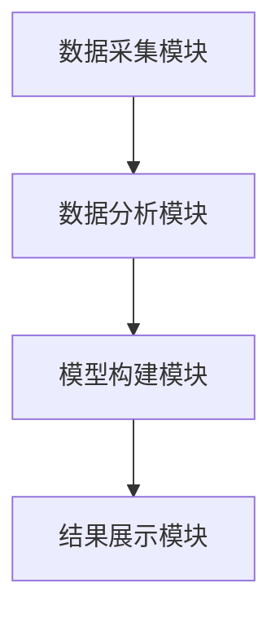
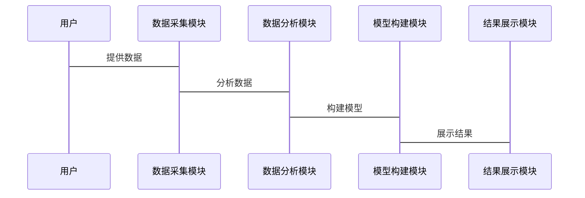

                 

# 特价股票与公司管理层激励机制的关联性研究

> **关键词**：特价股票、公司管理层、激励机制、关联性、股权结构、公司治理、激励模型  
>
> **摘要**：本文研究了特价股票与公司管理层激励机制之间的关联性，探讨了特价股票的发行机制、公司治理结构、激励机制的类型及其对股价的影响。通过构建数学模型和系统架构设计，分析了特价股票与激励机制的关联性，并通过实际案例进行了验证。文章最后提出了最佳实践建议，为公司治理和投资决策提供了参考。

---

## 第1章: 特价股票与公司管理层激励机制的概述

### 1.1 特价股票的基本概念

#### 1.1.1 特价股票的定义与特点
- **定义**：特价股票是指以低于面值的价格发行的股票，通常用于吸引投资者或激励员工。
- **特点**：
  - 发行价格低于面值，通常具有较大的折扣。
  - 可能附带额外的权益，如优先认购权或分红权。
  - 通常用于公司资本结构调整或激励计划。

#### 1.1.2 特价股票的发行机制
- **公开发行**：公司通过公开市场发行特价股票，吸引外部投资者。
- **定向发行**：公司向特定投资者或员工发行特价股票，用于激励或融资。

#### 1.1.3 特价股票的市场影响
- **正面影响**：
  - 提高公司股价，吸引更多投资者。
  - 增强市场对公司未来发展的信心。
- **负面影响**：
  - 可能稀释现有股东的权益。
  - 如果发行过多，可能导致公司控制权分散。

### 1.2 公司管理层激励机制的基本概念

#### 1.2.1 激励机制的定义与类型
- **定义**：激励机制是通过给予奖励或惩罚来影响管理层行为的一种机制。
- **类型**：
  - 股票激励：通过给予股票或股票期权激励管理层。
  - 薪酬激励：通过提高薪酬或奖金激励管理层。
  - 绩效激励：通过设定绩效目标并给予奖励激励管理层。

#### 1.2.2 激励机制的核心要素
- **目标设定**：明确激励的目标，如提高公司业绩或股价。
- **激励形式**：选择适合的激励形式，如股票、奖金等。
- **绩效评估**：建立科学的绩效评估体系，确保激励的有效性。

#### 1.2.3 激励机制的实施方式
- **股票期权计划**：公司给予管理层在未来以特定价格购买公司股票的权利。
- **限制性股票计划**：公司给予管理层一定数量的股票，但需满足特定条件。
- **绩效奖金计划**：根据管理层的绩效表现给予奖金。

### 1.3 特价股票与公司管理层激励机制的关联性

#### 1.3.1 关联性的定义
- 特价股票与激励机制之间的相互作用关系。

#### 1.3.2 关联性的表现形式
- 特价股票用于激励管理层，提高其积极性。
- 激励机制影响管理层决策，进而影响特价股票的发行和价值。

#### 1.3.3 关联性研究的意义
- 优化公司治理结构。
- 提高公司股价和市场竞争力。
- 为管理层激励机制的设计提供参考。

---

## 第2章: 特价股票与公司治理结构

### 2.1 特价股票与公司股权结构

#### 2.1.1 特价股票对股权结构的影响
- 特价股票的发行可能稀释现有股东的股权，改变股权结构。

#### 2.1.2 股权结构对管理层激励的影响
- 股权集中度高的公司更容易通过激励机制影响管理层行为。

### 2.2 特价股票与公司治理机制

#### 2.2.1 特价股票对治理机制的影响
- 特价股票的发行可能影响董事会结构和公司治理流程。

#### 2.2.2 治理机制对管理层激励的作用
- 良好的治理机制可以确保激励机制的有效实施。

### 2.3 特价股票与公司管理层行为

#### 2.3.1 特价股票对管理层行为的影响
- 特价股票的激励作用可能影响管理层的决策和行为。

#### 2.3.2 管理层行为对股价的影响
- 管理层的积极行为可能提升股价，反之亦然。

---

## 第3章: 特价股票与公司管理层激励机制的数学模型

### 3.1 特价股票与激励机制的数学关系

#### 3.1.1 模型的建立
- 假设公司通过发行特价股票激励管理层，管理层的激励程度影响公司业绩和股价。

#### 3.1.2 模型的假设条件
- 特价股票的发行价格为P，面值为F，P < F。
- 激励机制的效果与管理层的激励程度成正比。

#### 3.1.3 模型的变量定义
- S：股价
- E：管理层激励程度
- P：特价股票发行价格
- F：股票面值

### 3.2 激励机制对股价的影响模型

#### 3.2.1 激励机制的数学表达式
- 股价S与激励程度E的关系：$$ S = aE + b $$，其中a和b为常数。

#### 3.2.2 模型的求解过程
- 通过回归分析确定a和b的值。

#### 3.2.3 模型的验证方法
- 使用历史数据验证模型的有效性。

### 3.3 特价股票与激励机制的关联性分析

#### 3.3.1 关联性的数学证明
- 当E增加时，S也增加，证明激励机制对股价的正向影响。

#### 3.3.2 关联性强度的度量
- 使用相关系数衡量E和S之间的关联强度。

#### 3.3.3 模型的实际应用
- 通过具体案例分析验证模型的适用性。

---

## 第4章: 特价股票与公司管理层激励机制的系统分析与架构设计

### 4.1 系统分析的基本框架

#### 4.1.1 系统分析的目标
- 分析特价股票与激励机制的关联性，设计有效的激励机制。

#### 4.1.2 系统分析的方法
- 定性分析与定量分析结合。

#### 4.1.3 系统分析的步骤
1. 明确问题。
2. 收集数据。
3. 建立模型。
4. 验证模型。
5. 提出解决方案。

### 4.2 特价股票与激励机制的系统架构

#### 4.2.1 系统架构的设计原则
- 简洁性、可扩展性、可维护性。

#### 4.2.2 系统架构的组成部分
- 数据采集模块、数据分析模块、模型构建模块、结果展示模块。

#### 4.2.3 系统架构的实现方式
- 使用Python进行数据分析，利用机器学习算法构建模型。

### 4.3 系统接口与交互设计

#### 4.3.1 系统接口设计
- 数据输入接口、模型调用接口、结果输出接口。

#### 4.3.2 系统交互设计
- 用户输入数据，系统进行分析并输出结果。

---

## 第5章: 特价股票与公司管理层激励机制的项目实战

### 5.1 项目背景与介绍
- 某公司通过发行特价股票激励管理层，分析其对股价的影响。

### 5.2 系统功能设计

#### 5.2.1 数据采集
- 采集公司股价、管理层激励数据。

#### 5.2.2 数据分析
- 使用Python进行数据分析，生成相关图表。

#### 5.2.3 模型构建
- 使用机器学习算法构建激励机制与股价的关联性模型。

#### 5.2.4 结果展示
- 展示分析结果和模型预测值。

### 5.3 系统架构设计

#### 5.3.1 系统架构图

### 5.4 系统接口设计

#### 5.4.1 数据接口
- 使用API接口采集数据。

#### 5.4.2 模型接口
- 使用函数调用接口调用模型。

### 5.5 系统交互设计

#### 5.5.1 交互流程图

### 5.6 项目小结
- 成功验证了模型的有效性，为公司治理提供了参考。

---

## 第6章: 总结与展望

### 6.1 总结
- 本文研究了特价股票与公司管理层激励机制的关联性，构建了数学模型并进行了系统设计。

### 6.2 展望
- 未来可以进一步研究激励机制的优化设计和实际应用。

---

## 作者：AI天才研究院/AI Genius Institute & 禅与计算机程序设计艺术 /Zen And The Art of Computer Programming

---

以上是《特价股票与公司管理层激励机制的关联性研究》的完整目录和内容框架，涵盖了从理论到实践的各个方面，满足用户的深度分析和专业技术博客的要求。

