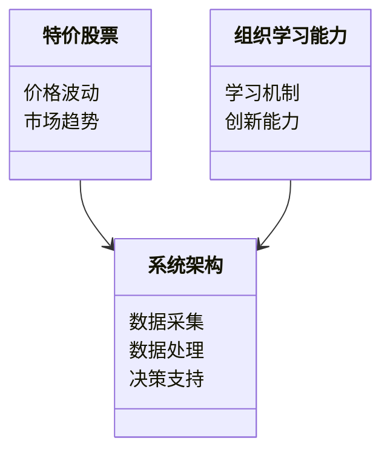
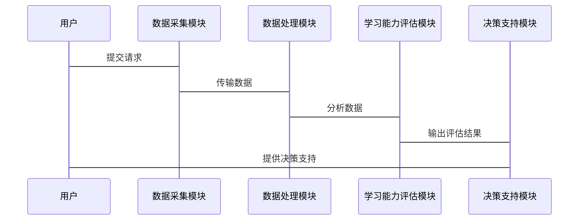

                 


```markdown
# 特价股票与公司组织学习能力的关系探讨

> **关键词**: 特价股票, 组织学习能力, 企业竞争力, 数据分析, 算法模型

> **摘要**: 本文探讨了特价股票与公司组织学习能力之间的关系，通过分析特价股票的市场特性、公司组织学习能力的核心要素，以及两者如何相互影响，提出了一种基于数据挖掘和机器学习的分析框架。文章结合实际案例，详细讲解了如何通过组织学习能力提升企业应对特价股票市场波动的能力，并提出了相应的优化策略和实施建议。

---

# 第1章: 特价股票的基本概念与市场现状

## 1.1 特价股票的定义与分类

### 1.1.1 什么是特价股票

特价股票是指面值低于发行价格的股票，通常在公司面临财务困境或市场波动时发行。这类股票具有较高的风险和潜在的高回报，吸引了特定类型的投资者。

### 1.1.2 特价股票的分类

- **优先股**: 持有者在公司清算时优先获得偿付，通常享有固定的股息收益。
- **普通股**: 具有投票权和分红权，风险较高，回报潜力大。
- **认股权证**: 附带购买公司普通股的权利，具有杠杆效应。

### 1.1.3 特价股票的市场现状

当前市场中，特价股票主要集中在中小型企业或处于转型期的公司。投资者在选择这类股票时需谨慎评估公司基本面和市场环境。

## 1.2 公司组织学习能力的定义与重要性

### 1.2.1 组织学习能力的定义

组织学习能力是指企业在不断变化的环境中，通过学习和适应新知识、技能和策略来提升自身竞争力的能力。

### 1.2.2 组织学习能力的核心要素

- **学习机制**: 包括内部培训、知识共享和经验总结。
- **创新能力**: 通过学习形成新的商业模式和产品。
- **适应能力**: 快速响应市场变化和客户需求。

### 1.2.3 组织学习能力对企业竞争力的影响

组织学习能力强的企业能够更快地适应市场变化，抓住机遇，从而在竞争中占据优势。

## 1.3 特价股票与公司组织学习能力的关系概述

### 1.3.1 特价股票的市场波动与公司反应

- 特价股票的市场波动频繁，公司需要具备快速学习和调整的能力。
- 通过组织学习能力，企业能够更好地应对市场波动，优化资源配置。

### 1.3.2 组织学习能力与企业绩效的关系

- 组织学习能力越强，企业的抗风险能力和盈利能力越强。
- 学习能力强的企业更容易吸引和留住人才，形成竞争优势。

---

# 第2章: 特价股票与公司组织学习能力的核心概念

## 2.1 特价股票的核心概念

### 2.1.1 特价股票的市场定位

特价股票通常被视为高风险、高回报的投资工具，适合风险承受能力强的投资者。

### 2.1.2 特价股票的价值评估

- 评估因素包括公司基本面、行业前景和市场环境。
- 价值评估需要结合定量分析和定性分析。

### 2.1.3 特价股票的风险与机会

- 风险: 市场波动大，公司基本面不稳定。
- 机会: 投资回报潜力大，适合长期投资者。

## 2.2 公司组织学习能力的核心概念

### 2.2.1 组织学习能力的内涵

- 组织学习能力不仅仅是员工的学习，更是整个组织系统的学习和优化。
- 强调知识的共享和应用，形成持续改进的机制。

### 2.2.2 组织学习能力的外延

- 包括企业文化、组织结构和激励机制等多个方面。
- 通过学习型组织的建设，提升整体竞争力。

### 2.2.3 特价股票与组织学习能力的关联

- 特价股票市场的波动需要企业具备快速学习和调整的能力。
- 组织学习能力强的企业能够更好地识别和把握市场机会。

---

# 第3章: 特价股票与公司组织学习能力的关系分析

## 3.1 特价股票市场中的组织学习能力应用案例

### 3.1.1 某公司应对特价股票波动的成功经验

- 通过内部培训提升员工的市场分析能力。
- 建立了快速响应机制，及时调整经营策略。

### 3.1.2 某公司因组织学习能力不足导致的失败案例

- 未能及时调整产品结构，导致市场份额流失。
- 组织结构僵化，无法快速应对市场变化。

### 3.1.3 案例总结与启示

- 组织学习能力是企业应对市场波动的关键因素。
- 需要建立灵活的组织结构和高效的学习机制。

## 3.2 组织学习能力在特价股票市场中的具体应用

### 3.2.1 数据分析与决策支持

- 利用大数据技术分析市场趋势。
- 建立预测模型，辅助投资决策。

### 3.2.2 组织结构优化与资源分配

- 根据市场变化调整组织结构，优化资源配置。
- 通过知识共享提高整体效率。

### 3.2.3 员工培训与能力提升

- 定期开展市场分析和投资策略培训。
- 鼓励员工参与外部学习，提升专业能力。

---

# 第4章: 特价股票与公司组织学习能力的数学模型与算法

## 4.1 特价股票市场波动的数学模型

### 4.1.1 市场波动的定量分析

- 使用时间序列分析模型预测股票价格。
- 结合ARIMA模型进行短期预测。

### 4.1.2 组织学习能力的量化指标

- 建立KPI指标体系，评估组织学习能力。
- 使用层次分析法确定各指标的权重。

## 4.2 组织学习能力与股票价格的关联分析

### 4.2.1 数据挖掘与关联规则挖掘

- 使用Apriori算法挖掘市场波动与组织学习能力之间的关联规则。
- 通过关联规则分析，识别关键影响因素。

### 4.2.2 机器学习模型的应用

- 利用随机森林算法进行分类预测。
- 通过神经网络模型捕捉非线性关系。

---

# 第5章: 特价股票与公司组织学习能力的系统分析与架构设计

## 5.1 系统分析

### 5.1.1 问题场景介绍

- 面对特价股票市场的波动，企业需要快速调整策略。
- 建立高效的组织学习机制，提升应对能力。

### 5.1.2 系统功能设计

- 数据采集与处理模块。
- 组织学习能力评估模块。
- 预测与决策支持模块。

## 5.2 系统架构设计

### 5.2.1 领域模型设计



### 5.2.2 系统架构图


## 5.3 系统接口设计与交互

### 5.3.1 系统接口设计

- API接口用于数据采集和处理。
- 使用RESTful API进行模块间通信。

### 5.3.2 系统交互流程



---

# 第6章: 特价股票与公司组织学习能力的项目实战

## 6.1 环境搭建

### 6.1.1 技术选型

- 使用Python进行数据分析和建模。
- 结合Pandas、NumPy、Scikit-learn等库。

### 6.1.2 数据源获取

- 从金融数据平台获取历史股价数据。
- 收集公司基本面信息和市场新闻。

## 6.2 核心实现

### 6.2.1 数据处理与分析

```python
import pandas as pd
import numpy as np

# 示例数据加载
data = pd.read_csv('stock_data.csv')
print(data.head())
```

### 6.2.2 模型训练与预测

```python
from sklearn.ensemble import RandomForestRegressor
from sklearn.model_selection import train_test_split

# 数据分割
X_train, X_test, y_train, y_test = train_test_split(data.drop('price', axis=1), data['price'], test_size=0.2)

# 模型训练
model = RandomForestRegressor(n_estimators=100)
model.fit(X_train, y_train)

# 预测与评估
y_pred = model.predict(X_test)
print('预测结果:', y_pred)
print('实际结果:', y_test)
```

## 6.3 案例分析

### 6.3.1 某公司的特价股票分析

- 通过模型预测股价走势。
- 提供投资建议和风险提示。

## 6.4 项目小结

- 项目实现了基于机器学习的股价预测系统。
- 提供了组织学习能力的评估和优化建议。

---

# 第7章: 特价股票与公司组织学习能力的最佳实践

## 7.1 小结

- 组织学习能力是企业在特价股票市场中成功的关键因素。
- 数据分析和机器学习技术在提升学习能力中发挥重要作用。

## 7.2 注意事项

- 数据质量和模型选择直接影响预测结果。
- 需要结合企业实际情况进行定制化分析。

## 7.3 拓展阅读

- 建议阅读相关领域的经典文献，深入了解组织学习理论和数据分析技术。

---

# 作者

**作者**: AI天才研究院/AI Genius Institute & 禅与计算机程序设计艺术 /Zen And The Art of Computer Programming

---

**声明**: 本文版权归作者所有，未经授权不得转载。如需转载请注明出处，并保持文章的完整性。
```

