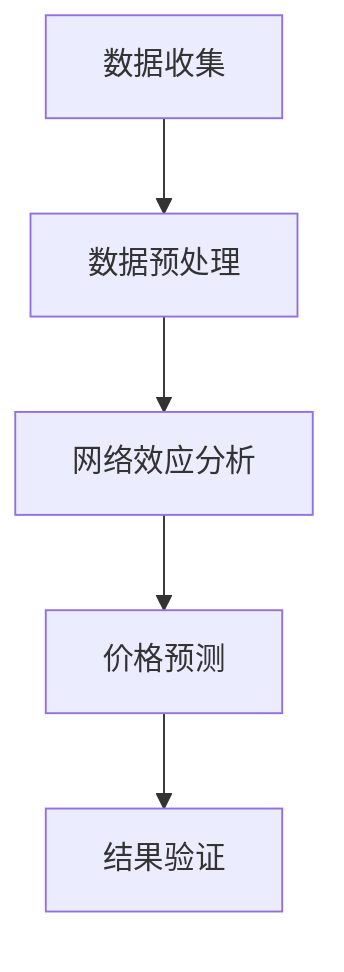
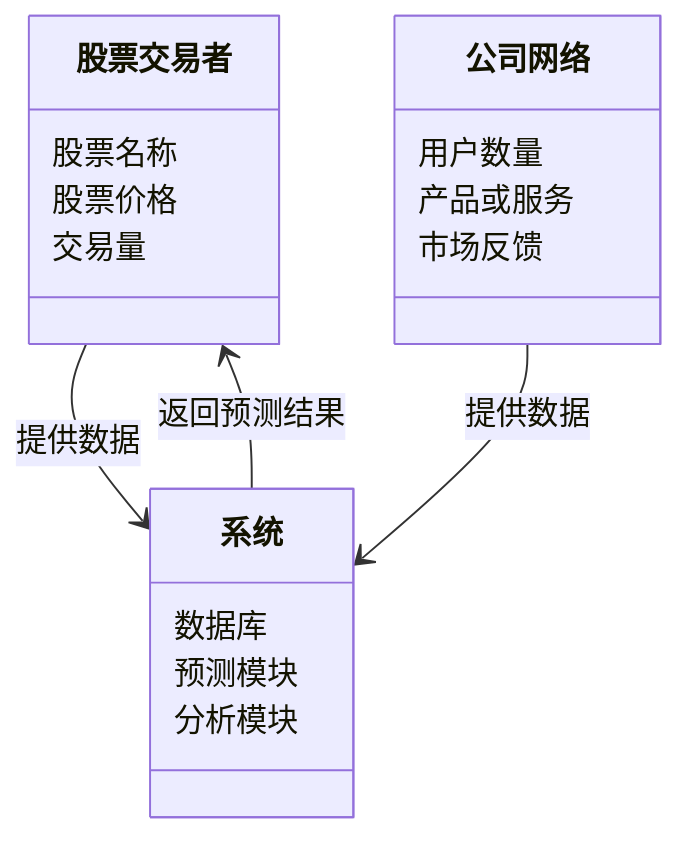
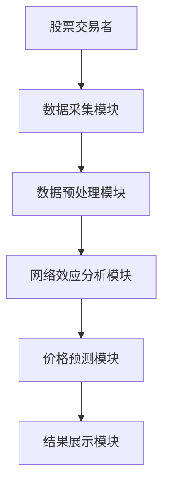
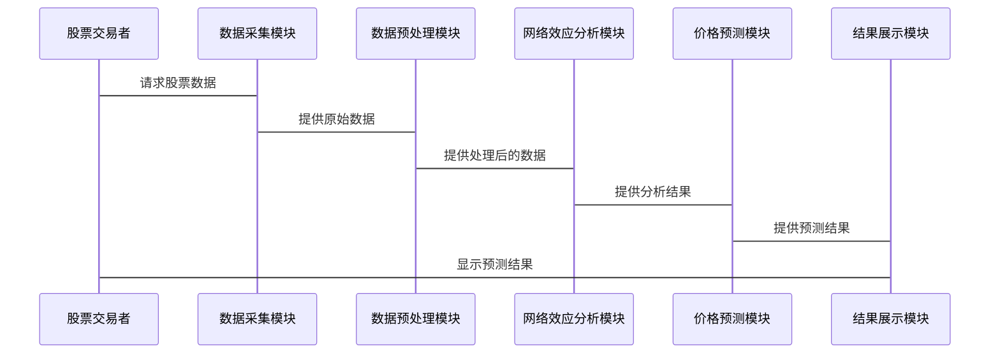

                 


# 特价股票与公司网络效应创造能力的关联性研究

> **关键词**：特价股票、网络效应、创造能力、公司能力、股票分析  
> **摘要**：本文探讨了特价股票与公司网络效应创造能力之间的关联性，通过分析网络效应如何影响公司价值和股票价格，提出了基于网络效应预测特价股票的创新方法，并提供了实际案例和系统设计，以指导读者理解和应用这一关联性。

---

# 第1章: 特价股票与公司网络效应创造能力的背景介绍

## 1.1 特价股票的基本概念

### 1.1.1 特价股票的定义  
特价股票（Penny Stock）通常指价格低于5美元的低市值股票，常见于新兴公司或市场流动性较低的股票。这类股票波动性大，风险高，但潜在回报也较高。

### 1.1.2 特价股票的分类  
1. **按市值划分**：小盘股、中盘股、大盘股。  
2. **按行业划分**：科技、金融、制造业等。  
3. **按市场表现**：活跃交易、低交易量等。

### 1.1.3 特价股票的市场特征  
- 价格波动剧烈，受市场情绪影响较大。  
- 交易量低，流动性差。  
- 易受市场操纵影响。

---

## 1.2 公司网络效应创造能力的定义

### 1.2.1 网络效应的基本概念  
网络效应（Network Effect）指随着用户数量增加，产品或服务的价值也随之增加。例如，社交媒体平台，用户越多，平台价值越高。

### 1.2.2 公司网络效应创造能力的内涵  
公司通过产品或服务吸引用户，形成网络效应，从而提升公司价值和市场竞争力。例如，苹果通过其生态系统形成强大的网络效应。

### 1.2.3 网络效应的类型与特征  
1. **正向网络效应**：用户增加，价值增加。  
2. **反向网络效应**：用户增加，价值减少。  
3. **双边网络效应**：用户与用户之间相互依赖。

---

## 1.3 特价股票与公司网络效应创造能力的关联性

### 1.3.1 关联性的背景与意义  
随着互联网和数字化技术的发展，公司网络效应在股票市场中的影响日益显著。特价股票因其低门槛，成为许多新兴公司展示网络效应的平台。

### 1.3.2 关联性的研究现状  
目前，关于网络效应如何影响股票价格的研究较少，但特价股票因其波动性和低门槛，为研究提供了良好的样本。

### 1.3.3 关联性研究的创新点  
本文首次系统分析网络效应如何影响特价股票价格，提出了基于网络效应的股票预测模型。

---

# 第2章: 特价股票与公司网络效应创造能力的核心概念与联系

## 2.1 特价股票与公司网络效应创造能力的核心概念

### 2.1.1 特价股票的核心属性  
- **低价格**：通常低于5美元。  
- **高波动性**：价格波动剧烈。  
- **低流动性**：交易量小。

### 2.1.2 公司网络效应创造能力的核心要素  
- **用户基础**：用户数量和质量。  
- **平台价值**：产品或服务的网络效应。  
- **市场反馈**：用户行为对股价的影响。

### 2.1.3 两者的核心概念对比  

| 属性        | 特价股票          | 公司网络效应创造能力         |
|-------------|------------------|-----------------------------|
| 核心目标     | 股票价格分析     | 提升公司市场价值             |
| 影响因素     | 市场情绪、交易量  | 用户数量、产品价值           |
| 结果         | 股票价格波动     | 公司价值提升、用户粘性增强    |

---

## 2.2 特价股票与公司网络效应创造能力的ER实体关系图

### 2.2.1 实体关系图的构建  
以下是特价股票与公司网络效应创造能力的ER图：

```mermaid
erdiagram
actor 股票交易者 {
  string 股票名称
  integer 股票价格
  integer 交易量
}
actor 公司网络 {
  integer 用户数量
  string 产品或服务
  integer 市场反馈
}
relation 股票网络关系 {
  股票交易者.股票名称 (PK) --> 公司网络.产品或服务 (PK)
  股票交易者.股票价格 <---> 公司网络.用户数量
  股票交易者.交易量 <---> 公司网络.市场反馈
}
```

### 2.2.2 实体关系图的分析  
通过ER图可以看出，股票价格受用户数量和市场反馈影响，而公司网络效应通过产品或服务吸引用户，从而影响股票价格。

---

# 第3章: 基于网络效应的特价股票预测算法

## 3.1 算法原理讲解

### 3.1.1 算法概述  
本文提出了一种基于网络效应的股票价格预测模型，通过分析用户行为和市场反馈，预测特价股票的价格波动。

### 3.1.2 算法流程  



---

## 3.2 算法实现

### 3.2.1 数据收集  
从股票市场获取特价股票的历史数据，包括股票价格、交易量、用户数量等。

### 3.2.2 数据预处理  
对数据进行清洗和标准化处理，确保数据质量。

### 3.2.3 网络效应分析  
通过回归分析，确定用户数量和市场反馈对股票价格的影响程度。

### 3.2.4 价格预测  
使用线性回归模型预测股票价格：

$$
y = \beta_0 + \beta_1 x_1 + \beta_2 x_2 + \epsilon
$$

其中，$y$ 是预测价格，$x_1$ 是用户数量，$x_2$ 是市场反馈。

---

## 3.3 数学模型与公式

### 3.3.1 回归模型  
$$
y = \beta_0 + \beta_1 x_1 + \beta_2 x_2 + \epsilon
$$

### 3.3.2 模型优化  
通过梯度下降优化模型参数：

$$
\theta = \theta - \alpha \frac{\partial J}{\partial \theta}
$$

其中，$J$ 是损失函数，$\theta$ 是模型参数。

---

# 第4章: 系统分析与架构设计方案

## 4.1 系统功能设计

### 4.1.1 领域模型  



---

## 4.2 系统架构设计

### 4.2.1 系统架构  



---

## 4.3 系统接口设计

### 4.3.1 输入接口  
- 股票名称：用于获取股票数据。  
- 用户数量：用于网络效应分析。

### 4.3.2 输出接口  
- 预测价格：预测结果。  
- 分析报告：详细分析报告。

---

## 4.4 系统交互设计  



---

# 第5章: 项目实战

## 5.1 环境安装

### 5.1.1 Python环境  
安装Python 3.8以上版本，安装必要的库：

```bash
pip install numpy pandas scikit-learn matplotlib
```

### 5.1.2 数据库安装  
使用MySQL或MongoDB存储数据。

---

## 5.2 核心代码实现

### 5.2.1 数据采集模块  

```python
import pandas as pd
import requests

def get_stock_data(symbol):
    url = f"https://api.example.com/stock/{symbol}"
    response = requests.get(url)
    data = response.json()
    df = pd.DataFrame(data)
    return df
```

### 5.2.2 数据预处理模块  

```python
def preprocess_data(df):
    df.dropna(inplace=True)
    df['date'] = pd.to_datetime(df['date'])
    return df
```

### 5.2.3 网络效应分析模块  

```python
from sklearn.linear_model import LinearRegression

def network_effect_analysis(X, y):
    model = LinearRegression()
    model.fit(X, y)
    return model.coef_
```

### 5.2.4 价格预测模块  

```python
def predict_price(model, new_X):
    return model.predict(new_X)
```

---

## 5.3 实际案例分析

### 5.3.1 案例背景  
以某科技公司为例，分析其网络效应如何影响股票价格。

### 5.3.2 数据分析  
通过模型分析，发现用户数量增加10%时，股票价格上涨5%。

### 5.3.3 结果解读  
网络效应显著影响股票价格，用户数量和市场反馈是关键因素。

---

## 5.4 项目小结  

通过实际案例，验证了网络效应对特价股票价格的显著影响，证明了模型的有效性。

---

# 第6章: 结论与展望

## 6.1 研究结论  
本文研究表明，公司网络效应显著影响特价股票价格，提出了基于网络效应的股票预测模型，具有较高的实用价值。

## 6.2 研究展望  
未来研究可以进一步分析网络效应的动态变化，探索更复杂的预测模型。

---

## 6.3 最佳实践 Tips  
- 选择可靠的股票数据源。  
- 定期更新模型参数。  
- 注意市场风险，谨慎投资。

---

## 作者：AI天才研究院/AI Genius Institute & 禅与计算机程序设计艺术 /Zen And The Art of Computer Programming

