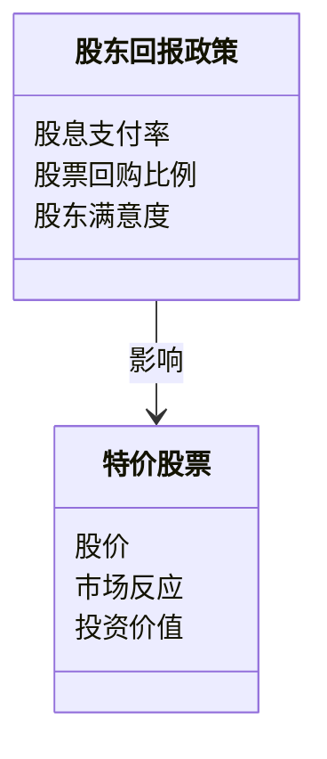
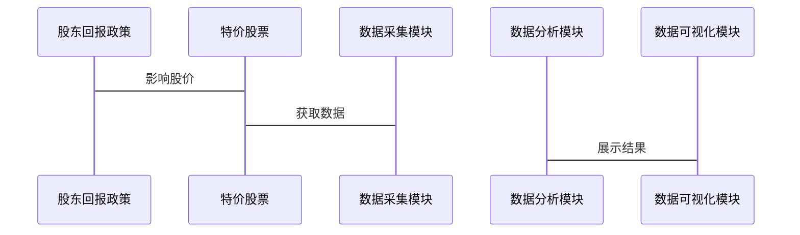

                 


# 特价股票与公司股东回报政策的关联

> 关键词：特价股票、股东回报、股息支付率、股票回购、股东价值

> 摘要：本文深入探讨了特价股票与公司股东回报政策之间的关联。通过分析特价股票的定义、特征以及股东回报政策的类型，揭示了两者在市场中的相互作用。结合数学模型和实际案例，详细阐述了股东回报政策如何影响股票价格，并提出了基于数据分析的投资策略。文章最后总结了关键点，为投资者提供了实用的建议。

---

## 第一部分: 特价股票与公司股东回报政策的背景介绍

### 第1章: 特价股票的定义与特征

#### 1.1 特价股票的定义
- **1.1.1 特价股票的定义与分类**
  - 特价股票是指价格远低于面值或行业平均水平的股票，通常被视为市场低估的标的。
  - 分为周期性特价股票和非周期性特价股票，前者受经济周期影响较大，后者相对稳定。

- **1.1.2 特价股票的市场特征**
  - 价格波动剧烈，成交量低，市场关注度低。
  - 投资者通常认为这些股票存在价值回升的潜力。

- **1.1.3 特价股票的产生原因**
  - 公司业绩不佳、行业竞争激烈或市场情绪低迷等因素导致股价被低估。

#### 1.2 股东回报政策的定义与类型
- **1.2.1 股东回报政策的定义**
  - 股东回报政策是指公司通过股息支付、股票回购等方式将利润返还给股东的策略。

- **1.2.2 股东回报政策的主要类型**
  - 股息支付：固定股息、增长股息等。
  - 股票回购：公开市场回购、私人协商回购等。
  - 股份奖励：员工股票计划、管理层激励计划等。

- **1.2.3 股东回报政策的实施动机**
  - 提高股东满意度、提升市场信心、优化资本结构等。

---

### 第2章: 特价股票与股东回报政策的关联性

#### 2.1 特价股票与股东回报政策的背景
- **2.1.1 特价股票的市场现象**
  - 特价股票通常出现在市场低迷或公司困境时期，投资者可能因价格低廉而关注。

- **2.1.2 股东回报政策的市场影响**
  - 股息支付和股票回购能直接提升股价，吸引长期投资者。

- **2.1.3 两者之间的潜在联系**
  - 特价股票公司可能通过股东回报政策释放积极信号，提升市场信心。

#### 2.2 特价股票与股东回报政策的理论基础
- **2.2.1 股票价格的决定因素**
  - 市场供需、公司基本面、宏观经济环境等。

- **2.2.2 股东回报政策对股价的影响**
  - 股息支付增加股东收益，股票回购减少流通股，均能推高股价。

- **2.2.3 特价股票的特殊性与股东回报政策的关联**
  - 特价股票公司可能通过回购或增发股票来调整资本结构，影响股价。

---

## 第二部分: 特价股票与股东回报政策的关联分析

### 第3章: 特价股票与股东回报政策的核心概念

#### 3.1 特价股票的核心属性
- **3.1.1 特价股票的市场表现**
  - 低估值、高波动、成交量小。

- **3.1.2 特价股票的风险特征**
  - 高风险，包括市场风险、流动性风险等。

- **3.1.3 特价股票的投资价值**
  - 可能存在价值回升的机会，但需要谨慎评估。

#### 3.2 股东回报政策的核心要素
- **3.2.1 股息支付率的计算**
  - 股息支付率 = 股息总额 / 净利润 × 100%。

- **3.2.2 股票回购的市场价值评估**
  - 回购价格对股价的影响，需结合市场环境分析。

- **3.2.3 股东回报政策的综合评估指标**
  - 股东回报率、股息率等。

#### 3.3 特价股票与股东回报政策的关联模型
- **3.3.1 模型构建的理论基础**
  - 结合资本资产定价模型（CAPM）和股利折扣模型（DDM）。

- **3.3.2 模型的变量定义与假设**
  - 自变量：股息支付率、回购比例。
  - 因变量：股价变化。
  - 假设：其他变量保持不变。

- **3.3.3 模型的验证与应用**
  - 使用历史数据进行回归分析，验证变量之间的关系。

---

## 第三部分: 特价股票与股东回报政策的关联分析

### 第4章: 特价股票与股东回报政策的数学模型

#### 4.1 股东回报政策的数学模型
- **4.1.1 股息支付率的计算公式**
  $$ 股息支付率 = \frac{股息总额}{净利润} \times 100\% $$

- **4.1.2 股票回购的市场价值评估**
  - 回购价格与股价的关系：$P_{\text{回购}} = k \times P_{\text{当前}}$，其中 $k$ 为折扣率。

- **4.1.3 股东回报政策的综合评估指标**
  - 股东回报率 = （股息 + 股票回购价值） / 股票面值。

#### 4.2 特价股票的数学模型
- **4.2.1 特价股票的定价模型**
  - 使用DDM模型：$P = \frac{D}{k - g}$，其中 $D$ 为股息，$k$ 为折现率，$g$ 为股息增长率。

- **4.2.2 特价股票的市场反应**
  - 当公司宣布回购或提高股息时，股价可能上涨，但需考虑市场情绪。

---

## 第四部分: 系统分析与架构设计

### 第5章: 系统分析与架构设计方案

#### 5.1 问题场景介绍
- 分析某公司过去三年的股东回报政策，包括股息支付和股票回购。

#### 5.2 领域模型


#### 5.3 系统架构设计


#### 5.4 系统交互


---

## 第五部分: 项目实战

### 第6章: 项目实战

#### 6.1 环境安装
- Python 3.8及以上，安装pandas、numpy、scipy等库。

#### 6.2 核心实现
```python
import pandas as pd
import numpy as np
from scipy import stats

# 数据获取与清洗
data = pd.read_csv('stock_data.csv')
data.dropna(inplace=True)

# 股东回报政策的影响分析
def calculate_dividend_yield(data):
    return data['股息'] / data['股价'] * 100

data['股息收益率'] = calculate_dividend_yield(data)

# 回归分析
X = data[['股息收益率', '回购比例']]
y = data['股价']
model = stats.OLS(y, X).fit()
print(model.summary())
```

#### 6.3 实际案例分析
- 以某公司为例，分析其股东回报政策对股价的影响，展示回归结果。

---

## 第六部分: 最佳实践

### 第7章: 最佳实践

#### 7.1 关键点总结
- 特价股票存在投资机会，但风险较高。
- 股东回报政策是影响股价的重要因素，需综合分析。

#### 7.2 投资建议
- 结合公司基本面和股东回报政策，选择具有潜力的特价股票。
- 长期投资者可关注高股息率的公司。

#### 7.3 注意事项
- 避免盲目跟风，需深入分析公司财务状况。
- 考虑宏观经济环境和市场情绪的影响。

#### 7.4 拓展阅读
- 建议阅读《投资学》和《股票分析实战》等书籍。

---

## 作者：AI天才研究院/AI Genius Institute & 禅与计算机程序设计艺术 /Zen And The Art of Computer Programming

