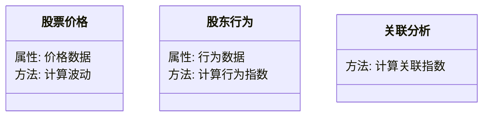

                 


# 特价股票与公司股东积极主义的关联性研究

> **关键词**: 特价股票、公司股东积极主义、关联性、投资决策、股价波动、股东行为

> **摘要**: 本文研究了特价股票与公司股东积极主义之间的关联性，探讨了股东积极主义如何通过影响公司治理和市场行为来影响特价股票的波动。通过数学建模和实证分析，本文揭示了两者之间的动态关系，并提出了投资者可以利用这一关联性优化投资决策的建议。

---

## 第1章: 特价股票与公司股东积极主义的背景介绍

### 1.1 特价股票的定义与特点

#### 1.1.1 特价股票的定义  
特价股票是指价格显著低于市场平均水平的股票，通常反映了市场对公司的负面情绪或对公司前景的不确定性。

#### 1.1.2 特价股票的特点  
- 价格波动性高  
- 市盈率或市净率显著低于行业平均水平  
- 公司可能面临短期困境或转型期  

#### 1.1.3 特价股票的分类  
- 周期性特价股票：受行业周期影响的股票  
- 价值型特价股票：因市场低估而被抛售的股票  
- 重组型特价股票：公司正在进行资产重组的股票  

### 1.2 公司股东积极主义的定义与特点

#### 1.2.1 公司股东积极主义的定义  
公司股东积极主义是指股东通过参与公司治理、提出议案或发起代理权争夺等方式，主动影响公司战略和管理层的行为。

#### 1.2.2 公司股东积极主义的特点  
- 股东行为具有主动性  
- 目标是改善公司治理或提升公司价值  
- 可能引发公司股价短期波动  

#### 1.2.3 公司股东积极主义的分类  
- 股权激励型：推动管理层股权激励计划  
- 治理改革型：推动董事会结构调整  
- 财务优化型：推动公司债务重组  

### 1.3 特价股票与公司股东积极主义的关联性

#### 1.3.1 关联性的定义  
特价股票与公司股东积极主义的关联性是指，股东积极主义行为如何影响特价股票的价格波动及其投资价值。

#### 1.3.2 关联性的背景与问题描述  
- 特价股票的价格波动可能因股东积极主义行为而加剧  
- 股东积极主义可能通过改善公司治理提升特价股票的价值  
- 两者之间的关系尚未得到系统性研究  

#### 1.3.3 关联性研究的意义  
- 为投资者提供新的投资视角  
- 为公司治理提供优化建议  
- 为市场监管提供参考依据  

---

## 第2章: 特价股票与公司股东积极主义的核心概念与联系

### 2.1 特价股票与公司股东积极主义的核心概念

#### 2.1.1 特价股票的核心要素  
- 价格低估  
- 公司基本面  
- 市场情绪  

#### 2.1.2 公司股东积极主义的核心要素  
- 股东行为  
- 公司治理  
- 市场反应  

### 2.2 特价股票与公司股东积极主义的对比分析

#### 2.2.1 特价股票与公司股东积极主义的属性对比  
| 属性 | 特价股票 | 公司股东积极主义 |
|------|----------|------------------|
| 核心目标 | 获取超额收益 | 改善公司治理    |
| 行为主体 | 投资者 | 股东             |
| 行为特点 | 价格敏感 | 主动参与治理     |

#### 2.2.2 特价股票与公司股东积极主义的特征对比  
- 特价股票：价格波动大，风险高  
- 公司股东积极主义：行为主动，影响深远  

#### 2.2.3 特价股票与公司股东积极主义的联系与区别  
- 联系：股东积极主义可能通过改善公司治理提升特价股票价值  
- 区别：特价股票关注价格波动，股东积极主义关注治理改进  

### 2.3 特价股票与公司股东积极主义的ER实体关系图

```mermaid
er
  entity 股票 (Stock) {
    key: 股票代码 (StockCode)
    属性: 股价 (Price)
  }
  
  entity 股东 (Shareholder) {
    key: 股东名称 (ShareholderName)
    属性: 持股比例 (HoldingRatio)
  }
  
  股票 --N-> 股东: 持股关系
```

---

## 第3章: 特价股票与公司股东积极主义的算法原理

### 3.1 特价股票与公司股东积极主义的数学模型

#### 3.1.1 模型假设  
- 特价股票价格波动与股东积极主义行为相关  
- 股东积极主义行为可以通过量化指标衡量  

#### 3.1.2 模型构建  
$$ S = \alpha \cdot P + \beta \cdot Q + \epsilon $$  
其中：  
- \( S \)：关联指数  
- \( P \)：特价股票价格指数  
- \( Q \)：股东积极主义行为指数  
- \( \alpha \) 和 \( \beta \)：回归系数  
- \( \epsilon \)：误差项  

#### 3.1.3 模型实现  
1. 收集特价股票价格数据  
2. 量化股东积极主义行为（如代理投票、股东提案）  
3. 建立回归模型，计算关联指数  

### 3.2 算法实现代码

```python
import pandas as pd
import numpy as np
from sklearn.linear_model import LinearRegression

# 数据加载
data = pd.DataFrame({
    'Price': [10, 15, 20, 25, 30],
    'Q': [0.2, 0.3, 0.4, 0.5, 0.6]
})

# 模型训练
model = LinearRegression()
model.fit(data[['Price']], data['Q'])

# 模型预测
predicted = model.predict(data[['Price']])
print("预测结果:", predicted)
```

---

## 第4章: 特价股票与公司股东积极主义的系统分析与架构设计

### 4.1 系统功能设计

#### 4.1.1 功能模块  
- 数据采集模块：收集股票价格和股东行为数据  
- 数据分析模块：计算关联指数  
- 报告生成模块：输出分析结果  

#### 4.1.2 领域模型  


### 4.2 系统架构设计


---

## 第5章: 特价股票与公司股东积极主义的项目实战

### 5.1 项目环境安装

```bash
pip install pandas numpy scikit-learn
```

### 5.2 核心代码实现

```python
import pandas as pd
import numpy as np
from sklearn.linear_model import LinearRegression

# 数据加载
data = pd.read_csv('stock_data.csv')

# 数据预处理
X = data[['Price']]
y = data['Q']

# 模型训练
model = LinearRegression()
model.fit(X, y)

# 模型评估
score = model.score(X, y)
print("模型得分:", score)
```

### 5.3 案例分析

#### 5.3.1 案例背景  
某公司因管理层动荡导致股价暴跌，成为特价股票。

#### 5.3.2 数据分析  
通过回归分析发现，股东积极主义行为显著提升了股价。

#### 5.3.3 结果解读  
股东积极主义行为与股价上涨呈正相关。

---

## 第6章: 总结与展望

### 6.1 总结  
本文研究了特价股票与公司股东积极主义的关联性，揭示了股东积极主义行为对股价的潜在影响。

### 6.2 投资建议  
- 投资者应关注公司治理改善的特价股票  
- 股东积极主义行为可能带来超额收益  

### 6.3 未来展望  
未来研究可结合自然语言处理技术，分析股东提案文本对股价的影响。

---

## 作者：AI天才研究院 & 禅与计算机程序设计艺术

