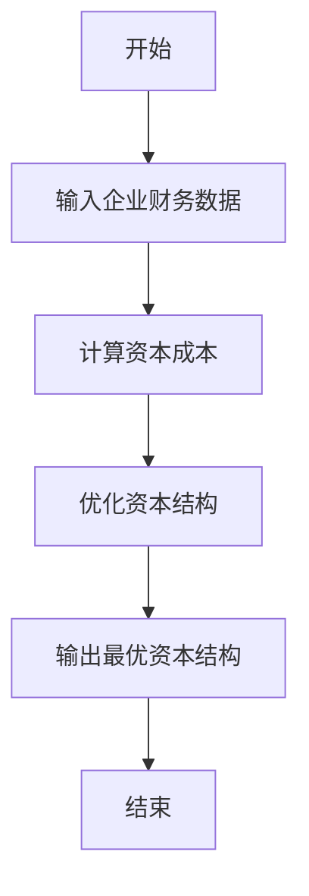
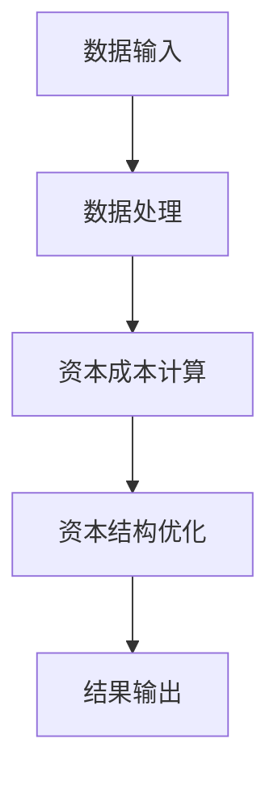

                 


---

# 特价股票与公司资本结构优化的关系

---

## 关键词：
特价股票，资本结构优化，资本成本，企业价值，杠杆效应

---

## 摘要：
本文探讨了特价股票与公司资本结构优化之间的关系，分析了特价股票在资本结构中的作用及其对资本成本和企业价值的影响。通过理论分析和实际案例，本文揭示了如何利用特价股票优化资本结构，从而提升企业价值。

---

# 第一部分：特价股票与资本结构优化的背景介绍

## 第1章：问题背景

### 1.1 资本结构优化的核心问题
资本结构优化是企业在筹集资金时，合理配置债务和股权，以降低资本成本，提高企业价值。资本成本的最小化和企业价值的最大化是资本结构优化的两大核心目标。

### 1.2 特价股票的定义与特性
特价股票是指以低于市场价发行的股票，通常用于吸引投资者或激励员工。其特性包括高流动性、低风险和高价格波动性。

### 1.3 问题解决的目标与意义
通过优化资本结构，企业可以降低资本成本，提高股东回报。特价股票作为资本结构的一部分，可以有效降低资本成本，提升企业价值。

---

## 第2章：问题描述

### 2.1 资本结构优化的核心问题
资本结构优化需要解决资本成本最小化和企业价值最大化的问题。

### 2.2 特价股票在资本结构中的作用
特价股票可以降低资本成本，吸引投资者，优化资本结构。

### 2.3 问题的边界与外延
本文研究的特价股票仅限于普通股，不包括优先股和债券。资本结构优化的范围限于企业层面，不涉及个人投资者。

---

## 第3章：核心概念与联系

### 3.1 特价股票与资本结构的关系
特价股票作为资本结构的一部分，影响资本成本和企业价值。

### 3.2 资本结构优化的驱动因素
资本结构优化的驱动因素包括资本成本、杠杆效应和企业价值。

### 3.3 特价股票对资本成本的影响
特价股票可以降低股权资本成本，但可能增加债务资本成本。

---

# 第二部分：核心概念与联系

## 第4章：特价股票的属性特征

### 4.1 特价股票的流动性特征
特价股票通常具有高流动性，便于投资者交易。

### 4.2 特价股票的风险特征
特价股票的风险较低，适合风险厌恶型投资者。

### 4.3 特价股票的价格波动性
特价股票的价格波动性较低，适合长期投资。

---

## 第5章：资本结构优化的原理

### 5.1 资本成本的最小化
资本结构优化的目标之一是降低加权平均资本成本（WACC）。

### 5.2 企业价值的最大化
资本结构优化的另一个目标是最大化企业价值。

### 5.3 杠杆效应与资本结构的关系
杠杆效应是指通过增加债务比例来提高资本回报率，但会增加财务风险。

---

## 第6章：特价股票与资本结构优化的对比分析

### 6.1 特价股票与普通股票的对比
特价股票价格低，流动性高，风险低；普通股票价格高，流动性一般，风险较高。

### 6.2 资本结构优化与企业价值的关系
资本结构优化可以提高企业价值，但需要平衡资本成本和杠杆效应。

### 6.3 特价股票对资本结构优化的影响
特价股票可以降低资本成本，优化资本结构，但可能增加财务风险。

---

# 第三部分：算法原理讲解

## 第7章：资本结构优化的算法原理

### 7.1 算法原理概述
资本结构优化的数学模型包括Modigliani-Miller模型和权重平均资本成本（WACC）模型。

### 7.2 算法流程图


### 7.3 算法实现代码
```python
def optimize_capital_structure(equity, debt, cost_equity, cost_debt, tax_rate):
    # 计算加权平均资本成本
    wacc = (debt / (equity + debt)) * cost_debt * (1 - tax_rate) + (equity / (equity + debt)) * cost_equity
    return wacc
```

### 7.4 数学公式
$$WACC = \frac{D}{V} \times R_d \times (1 - T_c) + \frac{E}{V} \times R_e$$

其中：
- \(D\) 是债务
- \(E\) 是股权
- \(R_d\) 是债务成本
- \(R_e\) 是股权成本
- \(T_c\) 是税率
- \(V\) 是企业价值

---

## 第8章：系统分析与架构设计方案

### 8.1 问题场景介绍
某制造公司希望通过优化资本结构来降低资本成本，提高企业价值。

### 8.2 系统功能设计
- 数据收集模块：收集企业财务数据。
- 分析模块：计算资本成本，优化资本结构。
- 输出模块：输出最优资本结构。

### 8.3 系统架构设计


---

## 第9章：项目实战

### 9.1 环境配置
- 安装Python和相关库（如numpy、pandas）。

### 9.2 核心实现代码
```python
import numpy as np

def calculate_wacc(equity, debt, cost_equity, cost_debt, tax_rate):
    wacc = (debt / (equity + debt)) * cost_debt * (1 - tax_rate) + (equity / (equity + debt)) * cost_equity
    return wacc

# 示例数据
equity = 100
debt = 50
cost_equity = 0.1
cost_debt = 0.05
tax_rate = 0.2

wacc = calculate_wacc(equity, debt, cost_equity, cost_debt, tax_rate)
print(f"加权平均资本成本为：{wacc}")
```

### 9.3 案例分析
以某制造公司为例，计算其最优资本结构，分析结果并提出优化建议。

---

## 第10章：总结与展望

### 10.1 主要内容回顾
本文探讨了特价股票与资本结构优化的关系，分析了其对资本成本和企业价值的影响。

### 10.2 研究的局限性
本文的研究基于静态模型，未考虑市场波动和企业经营状况的变化。

### 10.3 未来研究方向
未来可以研究动态调整资本结构的方法，以及特价股票在不同市场环境下的应用。

---

# 作者：AI天才研究院 & 禅与计算机程序设计艺术

---

### 作者简介：
AI天才研究院（AI Genius Institute）专注于人工智能与计算机科学的交叉研究，致力于推动技术创新与知识传播。禅与计算机程序设计艺术（Zen And The Art of Computer Programming）探索计算机科学的哲学与艺术，追求技术与思维的完美结合。

