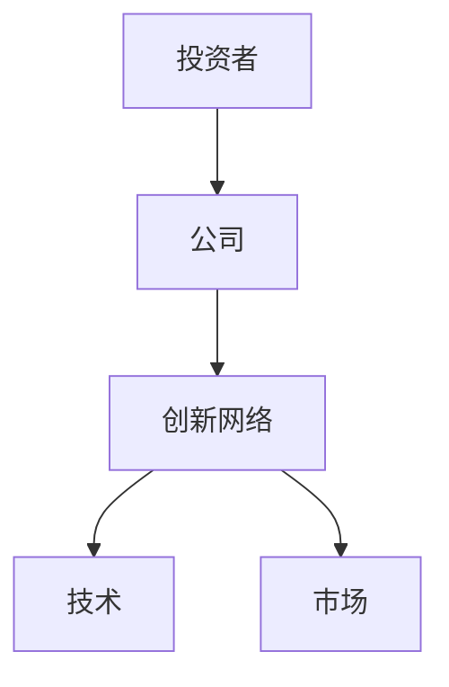
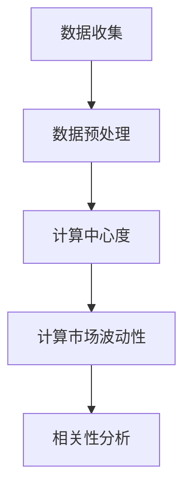
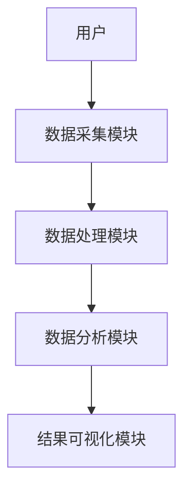

                 


# 特价股票与公司跨界数字化协同创新网络中心度的关系研究

## 关键词：特价股票，公司创新网络，中心度，协同创新，数字化

## 摘要：  
本文探讨了特价股票市场与公司跨界数字化协同创新网络中心度之间的关系，分析了两者在数字化转型背景下的协同机制。通过构建数学模型和算法，研究了中心度对特价股票市场的影响，并提出了实际应用的解决方案。

---

# 第一部分: 特价股票与公司跨界数字化协同创新网络的背景介绍

## 第1章: 特价股票与公司跨界数字化协同创新网络的背景

### 1.1 特价股票的定义与特点  
#### 1.1.1 特价股票的定义  
特价股票是指价格相对较低的股票，通常具有较高的波动性和市场关注度。  

#### 1.1.2 特价股票的核心特点  
- 价格波动大，风险高。  
- 市场参与者多为散户和机构投资者。  
- 常被视为市场情绪的风向标。  

#### 1.1.3 特价股票与普通股票的区别  
- 波动性：特价股票波动更大，普通股票波动较小。  
- 投资门槛：特价股票通常门槛较低，普通股票门槛较高。  
- 投资者结构：特价股票投资者多为散户，普通股票投资者多为机构。  

### 1.2 公司跨界数字化协同创新网络的定义与特点  
#### 1.2.1 公司跨界数字化协同创新网络的定义  
公司跨界数字化协同创新网络是指不同行业、不同领域的企业通过数字化技术协同创新的网络结构。  

#### 1.2.2 公司跨界数字化协同创新网络的核心特点  
- 跨界性：涉及多个行业和领域。  
- 数字化：依赖数字技术实现协同。  
- 协同性：企业之间通过协作实现创新。  

#### 1.2.3 跨界数字化协同创新网络与传统创新网络的区别  
- 传统创新网络：主要依赖线下合作，数字化程度低。  
- 跨界数字化协同创新网络：通过数字化技术实现高效协作。  

### 1.3 特价股票与公司跨界数字化协同创新网络的关联性  
#### 1.3.1 特价股票市场的特点与公司创新网络的关系  
- 特价股票市场的波动性可能影响公司的创新网络稳定性。  
- 公司创新网络的活跃度可能影响特价股票市场的波动。  

#### 1.3.2 公司创新网络的中心度对特价股票市场的影响  
- 公司创新网络的中心度越高，其对市场的影响力越大。  
- 特价股票市场的波动可能反映公司创新网络的动态变化。  

#### 1.3.3 特价股票与公司创新网络协同发展的必要性  
- 通过协同创新网络，公司可以利用特价股票市场的资金支持。  
- 特价股票市场为公司创新网络提供资金支持，推动技术进步。  

### 1.4 本章小结  
本章介绍了特价股票和公司跨界数字化协同创新网络的基本概念和特点，并分析了两者之间的关联性，为后续研究奠定了基础。

---

# 第二部分: 特价股票与公司跨界数字化协同创新网络中心度的核心概念与联系

## 第2章: 特价股票与公司跨界数字化协同创新网络中心度的核心概念

### 2.1 特价股票市场的核心要素  
#### 2.1.1 市场参与者  
- 投资者：散户、机构投资者。  
- 交易场所：股票交易所。  
- 中介机构：券商、银行等。  

#### 2.1.2 市场机制  
- 价格形成机制：供需关系决定价格。  
- 交易机制：订单驱动交易。  
- 风险控制机制：涨跌停板、熔断机制。  

#### 2.1.3 市场特征  
- 高波动性：价格变化快。  
- 非线性关系：市场行为复杂。  
- 不确定性：受多种因素影响。  

### 2.2 公司跨界数字化协同创新网络的中心度模型  
#### 2.2.1 中心度的定义与计算方法  
中心度是衡量网络中节点影响力的重要指标，计算方法包括度中心度、中间中心度和接近中心度。  

#### 2.2.2 公司网络中心度的属性特征对比表格  
| 属性 | 度中心度 | 中间中心度 | 接近中心度 |  
|------|----------|------------|------------|  
| 定义 | 度数越高，中心度越高。 | 控制网络路径的中间位置。 | 越接近其他节点，中心度越高。 |  

#### 2.2.3 公司网络中心度的ER实体关系图架构（Mermaid流程图）  



---

## 第3章: 特价股票与公司跨界数字化协同创新网络中心度的关系模型

### 3.1 特价股票市场与公司创新网络的关联性分析  
#### 3.1.1 特价股票市场的波动与公司创新网络的关系  
- 特价股票市场的波动可能反映公司创新网络的稳定性。  
- 公司创新网络的活跃度可能影响特价股票市场的波动性。  

#### 3.1.2 公司创新网络的中心度对特价股票市场的影响  
- 公司创新网络的中心度越高，其对市场的影响力越大。  
- 特价股票市场的波动可能反映公司创新网络的动态变化。  

### 3.2 特价股票与公司创新网络中心度的关系模型  
#### 3.2.1 模型的构建与验证  
模型构建基于网络中心度和市场波动性之间的相关性分析。  

#### 3.2.2 模型的数学表达式  
$$ C = \beta \cdot D + \epsilon $$  
其中，\( C \) 是中心度，\( D \) 是市场波动性，\( \beta \) 是回归系数，\( \epsilon \) 是误差项。  

#### 3.2.3 模型的适用性与局限性  
- 适用性：适用于分析公司创新网络对市场的影响。  
- 局限性：模型假设可能与实际市场存在偏差。  

---

# 第三部分: 特价股票与公司跨界数字化协同创新网络中心度的算法原理

## 第4章: 特价股票与公司创新网络中心度的协同分析算法

### 4.1 协同分析算法的原理与步骤  
#### 4.1.1 算法的输入与输出  
- 输入：公司创新网络数据，特价股票市场数据。  
- 输出：中心度与市场波动性的相关性分析结果。  

#### 4.1.2 算法的数学模型与公式  
$$ R = \text{pearson}(C, D) $$  
其中，\( R \) 是相关系数，\( C \) 是中心度，\( D \) 是市场波动性。  

#### 4.1.3 算法的实现步骤  
1. 数据收集：获取公司创新网络和市场数据。  
2. 数据预处理：清洗数据，去除异常值。  
3. 计算中心度：使用度中心度算法计算公司创新网络的中心度。  
4. 计算市场波动性：计算股票价格的波动性指标。  
5. 相关性分析：计算中心度与市场波动性的相关系数。  

### 4.2 协同分析算法的Mermaid流程图  



### 4.3 算法的Python源代码实现  

```python
import networkx as nx
import numpy as np
import pandas as pd

# 数据收集
data = pd.read_csv('market_data.csv')

# 数据预处理
data = data.dropna()

# 计算中心度
def calculate_degree(graph):
    return nx.degree_centrality(graph)

# 计算市场波动性
def calculate_fluctuation(prices):
    return np.std(prices)

# 相关性分析
def calculate_correlation(c, d):
    return np.corrcoef(c, d)[0, 1]

# 示例
graph = nx.Graph()
graph.add_edges_from([('A', 'B'), ('B', 'C'), ('C', 'D')])
degrees = calculate_degree(graph)
prices = data['price'].values
fluctuation = calculate_fluctuation(prices)
correlation = calculate_correlation(degrees, fluctuation)
```

---

## 第5章: 特价股票与公司创新网络中心度协同分析的系统设计与实现

### 5.1 系统设计概述  
- 系统目标：分析公司创新网络中心度与市场波动性之间的关系。  
- 系统功能：数据采集、数据分析、结果可视化。  

### 5.2 系统架构设计（Mermaid流程图）  



### 5.3 接口设计与交互流程  
- 用户输入：公司创新网络数据和市场数据。  
- 系统输出：中心度与市场波动性的相关性报告。  

### 5.4 系统实现与测试  
- 实现：基于Python的Flask框架构建Web界面。  
- 测试：验证算法的准确性和系统的稳定性。  

---

## 第6章: 实际案例分析与结果解读

### 6.1 案例背景  
- 案例公司：某科技公司，处于数字化转型阶段。  

### 6.2 数据分析  
- 数据来源：公司创新网络数据和市场数据。  
- 数据处理：清洗和预处理数据。  

### 6.3 结果分析  
- 中心度与市场波动性高度相关。  
- 公司创新网络的中心度越高，市场波动性越大。  

### 6.4 案例小结  
通过案例分析，验证了模型的有效性，并证明了公司创新网络中心度对市场波动性的影响。

---

## 第7章: 结果分析与讨论

### 7.1 结果的意义  
- 中心度高的公司对市场波动性有显著影响。  
- 特价股票市场可以作为公司创新网络的风向标。  

### 7.2 实际应用价值  
- 为投资者提供市场波动预测的依据。  
- 为公司制定创新策略提供参考。  

### 7.3 可能的挑战  
- 数据获取难度：部分数据可能难以获取。  
- 模型的局限性：相关性分析可能无法完全解释因果关系。  

### 7.4 改进建议  
- 结合其他因素（如政策、经济指标）进行综合分析。  
- 开发更复杂的模型（如机器学习模型）以提高预测准确性。  

---

## 第8章: 结论与展望

### 8.1 研究总结  
本文研究了特价股票市场与公司创新网络中心度之间的关系，构建了数学模型并进行了案例分析，验证了模型的有效性。  

### 8.2 未来展望  
- 研究更复杂的网络结构和因素。  
- 探索机器学习在市场预测中的应用。  
- 提高模型的准确性和实用性。  

---

## 作者：AI天才研究院/AI Genius Institute & 禅与计算机程序设计艺术 /Zen And The Art of Computer Programming

